

## Learning objective

### Objectives

Your objectives for this laboratory session are to:

- Set up a Python development environment using VS Code and `uv`
- Set up WaveForms and the Analog Discovery Studio for data creation and collection
- Learn how to read data files using `numpy` and `pandas`
- Create and format publication-quality scatter plots and histograms
- Learn about plotting with the `matplotlib` library, including:
  - Setting proper text in x and y labels and setting font size
  - Setting the size of the figure to be used in reports
  - Saving figure files in .pdf and .png format at 600 dpi
  - Learning about different plot types and formatting options in Python
- Compute basic descriptive statistics: mean, median, standard deviation, and variance
- Generate synthetic normally-distributed data and visualize probability density functions (PDFs)
- Perform linear regression and compute 95% confidence intervals on the fit
  - Compute and interpret the standard error of fit and the standard error of the linear fit slope.

### Check your understanding

By the end of this lab, you should be able to answer all of these questions.

#### Programming

- How do I create and activate a `uv` virtual environment, and how do I select it in `VS Code`?

- How can I find the size (dimensions) of a data file?

- How can I find the value of the 50th data point in a numpy array?

- What is the difference between a `pandas` DataFrame and a `numpy` array? When would you use each?

- How can I view the values of individual data points in a dataset? For example, points 4 through 8 in a series of 100 data points?

- How do I load a CSV file using `pandas`? How about `numpy`?

- What is the standard file format for saving figure files in this class?

- How can I set the size (width and height) of a figure for reports and submissions?

- What command is used to set the DPI (dots per inch) of a figure?

#### Data Visualization

- How can you use [Matplotlib](https://matplotlib.org/stable/) to create professional, easy-to-read visualizations of your results? Know how to:
  - Change and size fonts
  - Create and locate legends
  - Color and style lines, scatters, and histograms

#### Data Analysis

- What NumPy function performs polynomial fitting? What does it return?
- What functions do I use to calculate the average and standard deviation of a dataset?
- What SciPy function computes the Student's t-value for confidence intervals?
- Why do we pass `0.975` (not `0.95`) to `stats.t.ppf()` when computing a two-sided 95% confidence interval?
- What does `np.random.randn(N)` return, and how do you scale it to a desired mean and standard deviation?



## Pre-Lab Setup

You should come to lab having completed all tasks in this section

### Datasets & Code Resources

In this laboratory session, you will use Python for data analysis and for creating visually appealing and communicative plots. Before the lab, please review/explore these Python online learning resources on [general Python](https://docs.python.org/3/library/index.html), [NumPy](https://numpy.org/), [pandas](https://pandas.pydata.org/docs/user_guide/index.html), and [Matplotlib](https://matplotlib.org/)).

Throughout this course, you will conduct engineering measurement experiments primarily using *Python* for programming and *Digilent's WaveForms* for interfacing with our data acquisition system, the *Analog Discovery Studio* or **ADS**. For most labs, you will collect your own datasets. We will often provide starter code and example scripts on Canvas to help guide you through each lab.

While it might be tempting to copy and paste from the example files, you are strongly encouraged to **hand-type the code**, especially in the first few labs, as a way to build familiarity with Python syntax and tools. Once you understand how provided code examples work, you'll find it easier to modify and expand on them to suit your specific goals each lab throughout the semester and beyond.

### Prepare your local folder structure

Being a good scientist requires you to be organized. To keep your lab files organized, create a new ME3300 course folder on your PC or OneDrive. This will be a place for you to organize your Python code, data from experiments, and the products you create including visualizations and more.

- Note: if you are using a lab PC, your files won't be saved unless OneDrive finishes uploading them. Always check that your files are available online (e.g., on your phone or in another browser).

Create this folder structure on your PC or OneDrive:

``` text
ME3300/
├── Lab_01/
│   ├── Code/
│   │   ├── Lab01_Prelab_Walkthrough.ipynb
│   │   └── FirstName_LastName_Lab01.ipynb
│   ├── Data/
│   │   ├── walkthrough_temperature_data.csv
│   │   └── time_voltage_data.csv
│   └── Figures/
├── Lab_02/
│   ├── Code/
│   ├── Data/
│   └── Figures/
├── Lab_03/ <- Keep adding these as we continue the semester!
```

The walkthrough notebook and temperature data are downloaded from Canvas for the pre-lab assignment (see @sec-prelab-walkthrough). The other **.ipynb** notebook file and **.csv** data will be created later on in the lab.

### Install Visual Studio Code and UV

**VS Code** (Visual Studio Code) is a free code editor made by Microsoft. It lets users write, edit, and debug code in multiple programming languages. Its flexibility has made it a widely used code editor in academic and professional settings.

When you write Python code, you'll rely on other people's pre-written tools (called packages) instead of writing everything from scratch. Think of a package like a specialized bit for a drill. They are standardized tooling you would "buy" rather than "machine" every time you need to drive a different kind of screw. They are also interchangeable, so you can use the same drill to drive different screws by changing bits — but that only works if the bit you need is actually compatible with your drill. In code, the problem is that different projects will often need different, sometimes incompatible, versions of the same package (e.g., different bits), and installing everything into one shared pile on your computer means a version needed for Project B can break Project A.

The fix is to give each project its own separate, self-contained set of packages, like giving each station its own dedicated toolbox instead of one communal pile of tools that everyone digs through and leaves in a different state. That way, nothing you install for one project can interfere with another.

[uv](https://docs.astral.sh/uv/) (short for UltraViolet but also UniVersal python manager) is the tool we'll use to manage this. It installs Python itself, builds these separate per-project toolboxes (called virtual environments), and installs the right packages into each one, all with a single, fast command.

#### Install Instructions

1.  Install VS Code using the following link: [VS Code](https://code.visualstudio.com/)

2.  In VS Code, go to the Extensions tab and search for and install the **Python,** **Pylance**, and **Jupyter** extensions (The correct versions should each be certified by Microsoft).

    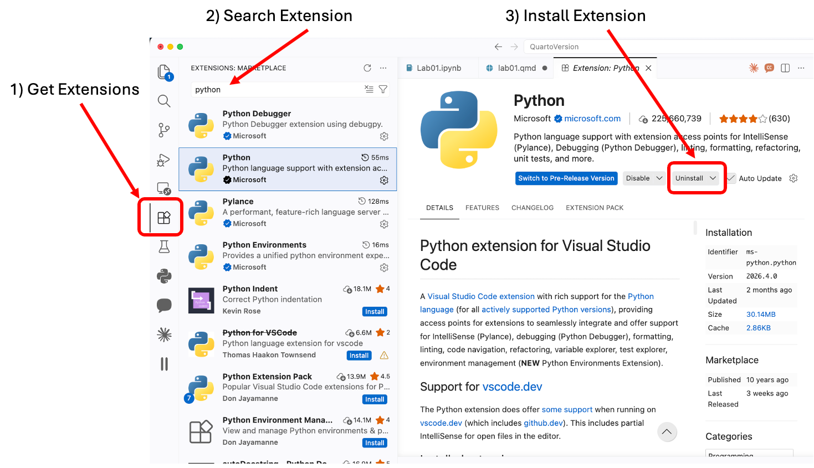{#fig-vscode-extension width="100%"}

3.  Install **uv**:

    - **Windows**: open PowerShell and run:

      ``` powershell
      powershell -ExecutionPolicy ByPass -c "irm https://astral.sh/uv/install.ps1 | iex"
      ```

    - **Mac/Linux**: open the Terminal and run:

      ``` bash
      curl -LsSf https://astral.sh/uv/install.sh | sh
      ```

    - Close and reopen your terminal after installing so the `uv` command is recognized.

> Note: more options and details for installing uv are documented here: [uv Documentation](https://docs.astral.sh/uv/getting-started/installation/#__tabbed_1_1)

### Create your ME 3300 Python Environment

Now we will create a virtual environment in your ME3300 folder.

1.  First, you will need to identify the path for your ME3300 folder. On windows/mac you can do this with explorer/finder:

    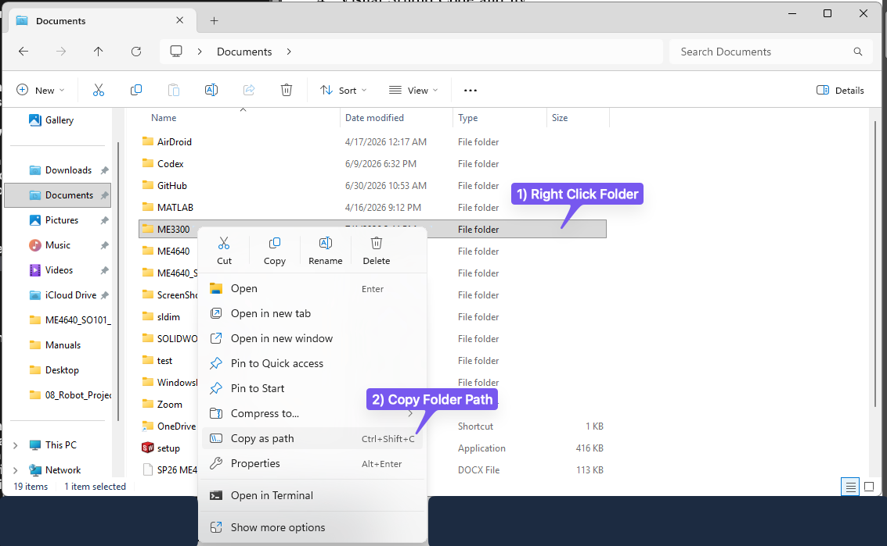{#fig-windows-find-folder-path width="100%"}

    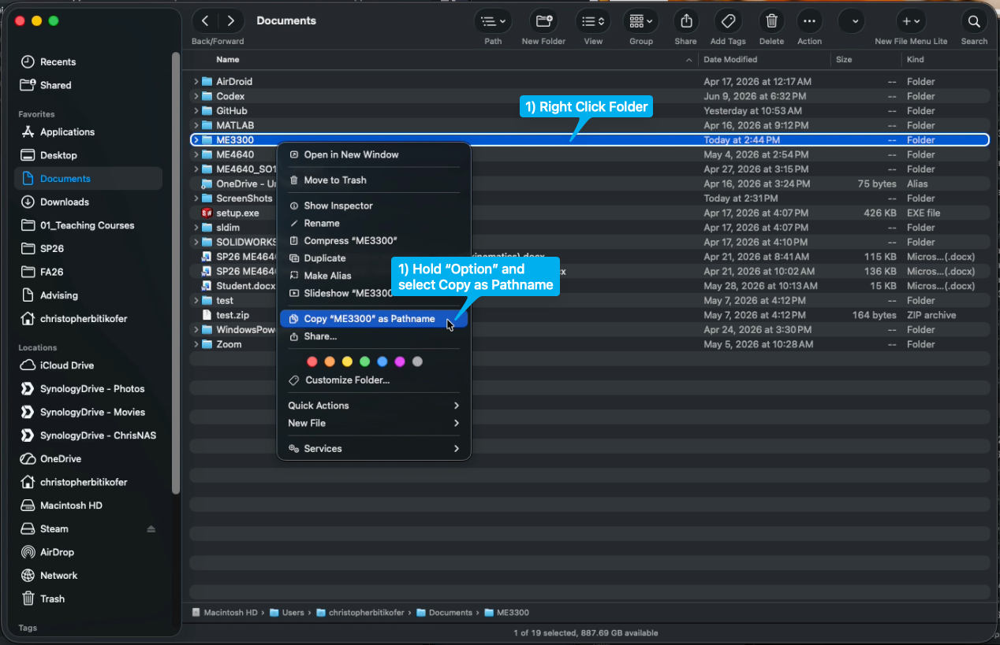{#fig-mac-find-folder-path width="100%"}

2.  Open a terminal and run the following commands:

    ``` bash
    cd ME3300  # Replace with the path to your ME3300 folder!
    uv init --python 3.11
    uv add numpy scipy matplotlib pandas ipykernel
    ```

    This creates a `.venv` virtual environment and a `pyproject.toml` file in your `ME3300` folder, and installs all of the packages you'll need for this lab into it.

3.  Open up the `pyproject.toml` file uv created to see what is inside. Your file should look similar to this:

    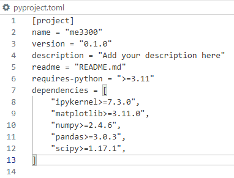{#fig-uv-toml-inspection width="50%"}

    It essentially contains a list of all the packages and version numbers your project uses. Whenever you need to add another package later in the semester you will run `uv add <package-name>` from inside your `ME3300` folder.

4.  Close `pyproject.toml`

### Configure VS Code

1.  Open VS Code and open your `ME3300` folder (**File → Open Folder**).

2.  Press `Ctrl+Shift+P` (or `Cmd+Shift+P` on Mac) and type **Python: Select Interpreter**.

3.  Choose the interpreter located at `.venv` (it will be listed as a recommended environment for the folder).

    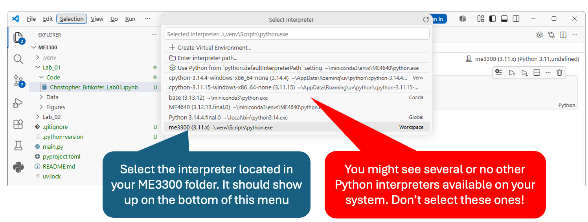{#fig-vscode-interpreter-select width="100%"}

4.  Confirm your setup is working by opening a new terminal in VS Code (`` Ctrl+` ``) and running:

    ``` bash
    uv run python -c "import numpy, scipy, matplotlib, pandas; print('All good!')"
    ```

    You should see `All good!` printed. If you see an error, ask your TA for help in lab!

### Create a Jupyter Notebook

1.  Create a new file and select **Jupyter Notebook** as the format.

2.  Save it in the `Code` folder you created earlier, using the naming convention `FirstName_LastName_Lab01.ipynb` (replace with your first and last name).

    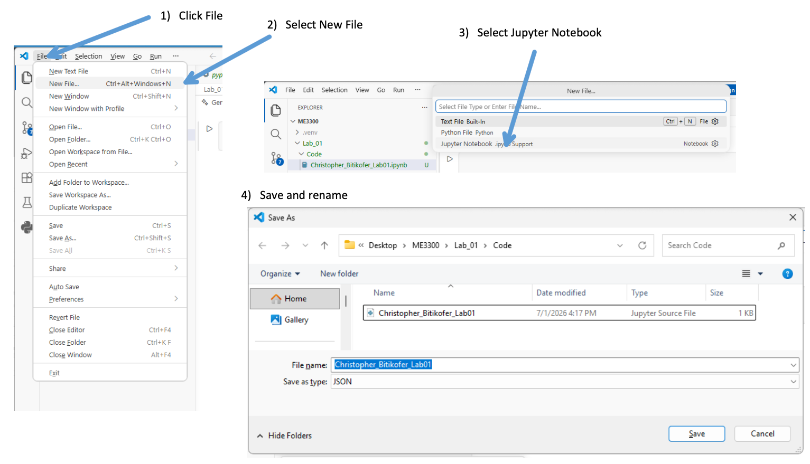{#fig-make-a-notebook width="100%"}

::: callout-note
When you're ready to run your notebook, click **Select Kernel** in the top right and choose the `.venv (Python 3.11)` environment from your `ME3300` folder.
:::

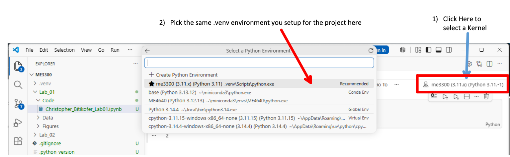{#fig-set-notebook-kernel width="100%"}

### Setup WaveForms

WaveForms is the virtual instrument suite for Digilent Analog Discovery Studio data acquisition device. Follow the instructions on Digilent's site: [WaveForms download page](https://digilent.com/reference/software/waveforms/waveforms-3/getting-started-guide) to install this program on your computer. You'll use this program and Digilent's Analog Discovery Studio for the remainder of the semester. In this lab you will create a quick dataset to complete the plots in @sec-part-1.

When you get to lab, you will start WaveForms by following these instructions.

1.  Open the WaveForms application.
2.  Ensure the Analog Discovery Studio is plugged into a wall outlet and powered on.
3.  Connect the Studio to your computer using the USB port.
4.  In the Device Manager, select Analog Discovery Studio from the list of connected devices.
5.  Click Select to initialize the connection and launch the software workspace.

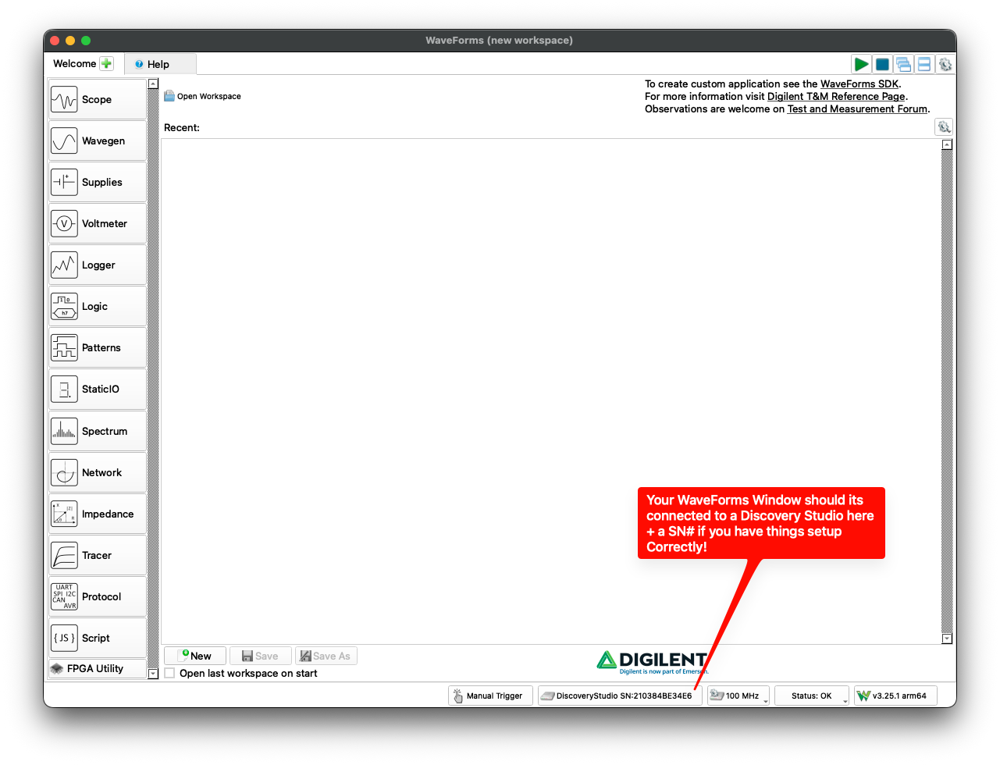{#fig-waveforms-init width="100%"}

### Complete the Prelab Walkthrough Notebook {#sec-prelab-walkthrough}

Your main pre-lab assignment is to work through the **Prelab 01 Walkthrough** notebook. It teaches, one small step at a time, every Python skill this lab requires — loading data with `pandas` and `numpy` (and how the two differ), indexing arrays, computing statistics, formatting and saving figures, curve fitting with confidence intervals, and generating synthetic data — using a *different* dataset than the one you will collect in lab.

1.  Download `Lab01_Prelab_Walkthrough.ipynb` and `walkthrough_temperature_data.csv` from Canvas. Save the notebook in your `ME3300/Lab_01/Code/` folder and the data file in `ME3300/Lab_01/Data/`.
2.  Open the notebook in VS Code, select your `.venv` kernel, and run it cell by cell, reading as you go.
3.  The notebook contains **checkpoint** boxes asking for specific computed values. Report these in the **Prelab 01 quiz on Canvas** (due before your lab session). If your values match, your environment is set up correctly and you are ready for lab.

::: callout-note
Never used a Jupyter notebook before? Don't panic — we will spend time in class before the lab explaining and demonstrating how to run notebooks in VS Code. Attempt the walkthrough on your own first and bring your questions to class.
:::

A well-commented **starter notebook** for the lab itself is also provided on Canvas. You may copy it into your `Code` folder and complete it during the lab. A full example solution will be posted on Canvas *after* the lab for you to check your approach against.

### VS Code Quick Reference

You may find the following hot keys and features in VS Code helpful

| Action | Windows/Linux Shortcut | Mac Shortcut |
|--------------------|--------------------------|--------------------------|
| Run current file | `F5` or click the ▷ button | `F5` or click the ▷ button |
| Run selected lines | `Shift+Enter` | `Shift+Enter` |
| Open terminal | `` Ctrl+` `` | `` Ctrl+` `` |
| Command palette | `Ctrl+Shift+P` | `Cmd+Shift+P` |
| Comment/uncomment line | `Ctrl+/` | `Cmd+/` |
| Auto-format file | `Shift+Alt+F` | `Shift+Option+F` |
| Go to definition | `F12` | `F12` |
| Hover for docs | hover over any function name | hover over any function name |

### Python Quick References

The following tables summarize many python commands you will want to use this lab.

| Task | Python command |
|------------------------------------|------------------------------------|
| Create figure + axes | `fig, ax = plt.subplots(figsize=(6.5, 3.5))` |
| Make two-panel figure | `fig, (ax1, ax2) = plt.subplots(2, 1, figsize=(6.5, 7.0), sharex=True)` |
| Set a white background | `fig.patch.set_facecolor('white')` |
| Set axis label | `ax.set_xlabel('Label (units)')` |
| Set axis label font size | `ax.set_xlabel('Label (units)', fontsize=10)` |
| Set title | `ax.set_title('Title', fontsize=10)` |
| Set grid on | `ax.grid(True, which='both', linestyle='--', linewidth=0.5)` |
| Remove top/right border | `ax.spines['top'].set_visible(False)` |
| Set axis limits | `ax.set_xlim(0, 10)` / `ax.set_ylim(0, 5)` |
| Make legend | `ax.legend(loc='upper right', fontsize=10)` |
| Annotate with text box | `ax.text(0.05, 0.95, 'text', transform=ax.transAxes, verticalalignment='top', bbox=dict(boxstyle='round', facecolor='white', alpha=0.8))` |
| Make horizontal reference line | `ax.axhline(y_value, color='black', linewidth=1.5)` |
| Save PDF at 600 DPI | `fig.savefig('name.pdf', dpi=600, bbox_inches='tight')` |
| Save PNG at 600 DPI | `fig.savefig('name.png', dpi=600, bbox_inches='tight')` |

: Matplotlib Quick Reference: Plot Formatting

| Function | What it does |
|------------------------------------|------------------------------------|
| `pd.read_csv('path/file.csv')` | Load a CSV into a pandas DataFrame |
| `df['column'].values` | Extract a column from a DataFrame as a numpy array |
| `np.loadtxt('path', delimiter=',', skiprows=1)` | Load a CSV directly into a numpy array |
| `np.mean(x)` | Arithmetic mean |
| `np.std(x, ddof=1)` | Sample standard deviation |
| `np.var(x, ddof=1)` | Sample variance |
| `np.polyfit(x, y, 1)` | Linear (degree-1) polynomial fit; returns `[slope, intercept]` |
| `np.polyval(coeffs, x)` | Evaluate polynomial at values x |
| `stats.t.ppf(0.975, df=nu)` | Student's $t$-value for a two-sided 95% CI, $\nu$ degrees of freedom (from `scipy.stats`; note $1-0.05/2 = 0.975$) |
| `np.random.randn(N)` | N samples from standard normal distribution ($\mu=0$, $\sigma=1$) |
| `np.linspace(start, stop, N)` | N evenly spaced values from start to stop |
| `ax.scatter(x, y, s=25, color='blue', alpha=0.8)` | Scatter plot |
| `ax.hist(x, bins=20, density=True)` | Histogram (normalized if `density=True`) |
| `ax.plot(x, y, color='blue', linewidth=2)` | Line plot |

: Python Quick Reference: Key Functions This Lab



## Laboratory Introduction

This lab is divided into 3 parts, each covering key tasks you need to master as an engineer to understand and communicate about data.

- In [part-1](#sec-part-1), you'll learn how to capture experimental data (in this case random noise). Then you will learn how to load data from a complete experiment using python and use it to create three types of plots: **lines**, **scatters**, and **histograms**. These are basic but powerful visualizations engineers and scientists use to understand their data better and spot useful patterns.
- In [part-2](#sec-part-2) you'll import tabular data and use **NumPy's** curve-fitting tools to find a trend between two related variables. You'll also apply statistical formulas (covered in class) to estimate **uncertainty**, or **confidence intervals**, for the fit and the slope. Learning how to fit curves and evaluate confidence helps engineers build models that can make predictions and understand how **reliable** those predictions are.
- For [part-3](#sec-part-3), you'll work with an example dataset that follows a normal (bell curve) distribution. You'll start by generating artificial data and creating histograms to see how it's spread out. Then you'll calculate a few key statistics: the mean, median, and standard deviation. After that, you'll use the equation for the normal distribution to recreate a smooth curve that represents your data. Engineers often use this kind of analysis to turn sets of measurements into continuous models that helps with design decisions — for example, answering questions like: what percentage of parts will fit together based on the variation of a key dimension?

## Part-1: Scatterplot and Histogram from Voltage data {#sec-part-1}

In this part of the lab, you will capture voltage data (in this case random noise) using the ADS , save it to file, visualize it using a scatter plot and histogram, and calculate basic statistics (mean and standard deviation) on that data.

During most experiments, we read measurements and record them. You can do this with pen and paper, but using a programming tool such as Python along with a WaveForms-based instrument, we can automate this process to efficiently collect measurements and store them in a digital file.

Data can be stored in many different file formats (e.g. `.csv`, `.mat`, `.dat`, etc). Most of these store data as plain ASCII text, and each uses a **filename** and an *extension* to indicate its type for your computer (e.g. **my_data***.csv*). Different formats offer various advantages depending on the application, and you'll likely encounter many of them throughout your career. In this course, we will use *.csv* (comma-separated values) format. CSV files organize data into columns and can include headers to clearly label variables. They are human-readable and can be opened in any plain text editor, including VS Code. They also work well with programs like Excel, MATLAB, and Python, making them an excellent format for both inspection and analysis.

To make it easier to get started, we have provided a well-commented **starter notebook** on the Canvas page for lab 01. It guides you through each step with hints on which Python commands to use; you may copy it into your `Code` folder and complete it during this lab. The syntax for every step was covered in the **prelab walkthrough notebook**, so keep it open as a reference. A full example solution will be posted after the lab.



### Detailed Instruction

1.  Open your Jupyter notebook file

    - This is the file you created earlier at **ME3300/Lab_01/Code/**, named **FirstName_LastName_Lab01.ipynb**. Always give your notebook files names that make their purpose clear at a glance.

2.  Create sample data: `time_voltage_data.csv`.

    - Connect the waveform generator (Wavegen): To output a signal, connect your circuit to W1 (Channel 1); see @fig-waveform1.

    - Connect the data logger (Logger): To input a signal, connect a jumper to Oscilloscope Channel 1; see @fig-waveform1.

      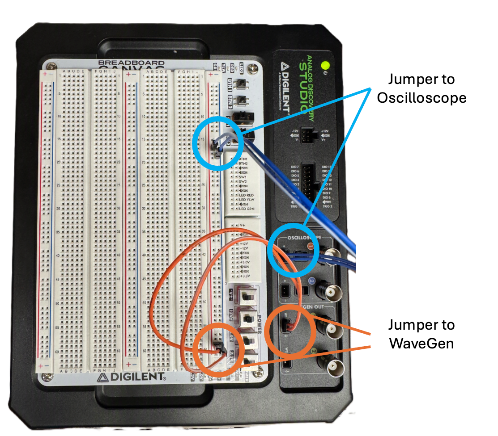{#fig-waveform1 width="70%"}

3.  WaveForms setup:

    - Open the WaveForms app on your computer;

    - Click "Wavegen" and "Logger". Two new tabs should open.

4.  WaveGen setup

    - Click the "Wavegen" tab to set up the noise generator; see @fig-waveformsp1setup:

    - Ensure "Channel 1 (W1)" is selected.

    - Change "Simple" to "Basic" to access the needed controls.

    - Select "Noise" and match the following settings:

      - Frequency: 10 Hz
      - Amplitude: 1 V
      - Offset: 2 V

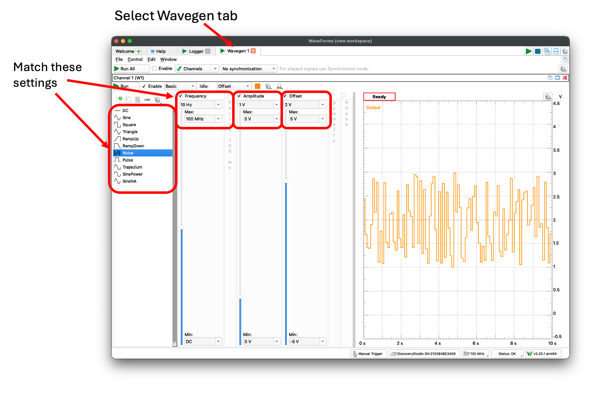{#fig-waveformsp1setup width="100%"}

5.  Logger setup and run
    - Now, click the "Logger" tab to collect the noise data; see @fig-loggerp1:
    - Ensure only "C1" is collecting data, by either removing "C2" or adding "C1".
    - Click "More" to set up the Logger and match these settings:
      - Update: 5 ms
      - Set Ch1 Range to 1 V
    - Press "Single" and wait for 10 seconds of data, or "Run" and then "Stop" after 10 seconds has passed

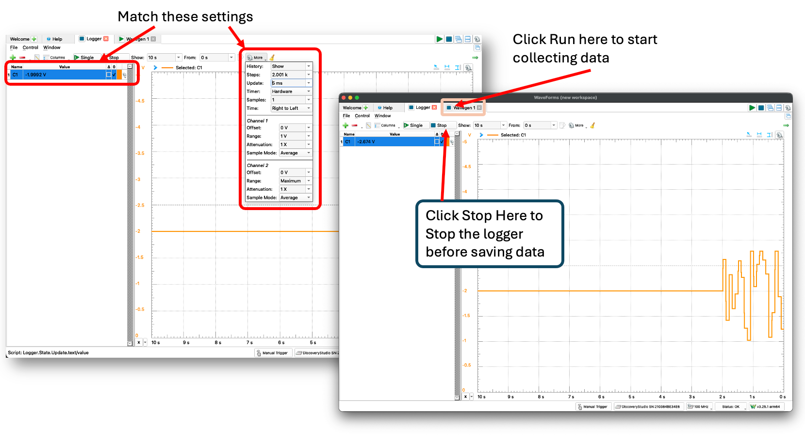{#fig-loggerp1 width="100%"}

6.  Export Data

    - Click "File," then "Export"; see @fig-p1exportcsv.

    - Save the file as `time_voltage_data.csv` in your `ME3300/Lab_01/Data/` folder

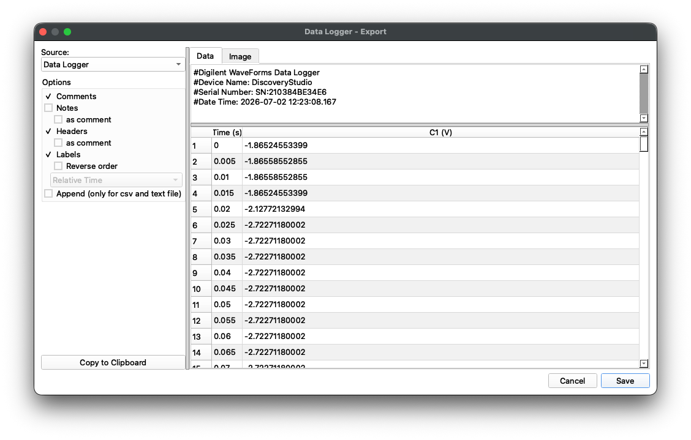{#fig-p1exportcsv width="70%"}

7.  Inspect the Data File by opening it in VS Code

    ::: {.callout-important title="Logbook Questions"}
    *Watch for boxes like this throughout the lab manuals. They contain questions you are required to answer in your lab notebook! **These will be checked by TAs.***

    **Q1.** How many columns of data do you see in the document?

    **Q2.** Does the data include headers? If so, do the values below the headers make sense (e.g., time counts up, and the scale is reasonable for the measurement units)?
    :::

8.  Load data into your Jupyter Notebook

    - Method 1: Use *pandas* (`pd.read_csv`)
    - Method 2: Use *numpy* (`np.loadtxt`)
    - Note: in each method, you need to use a relative path to access the data, e.g. `df = pd.read_csv('../Data/time_voltage_data.csv')`
    - You practiced both methods in the prelab walkthrough; the syntax is also in the quick-reference tables above.

    ::: {.callout-important title="Logbook Questions"}
    **Q3:** What is the key difference between a pandas DataFrame and a numpy array? When would you prefer to use each?
    :::

9.  Compute Statistics on the data

    - Compute the mean, median, standard deviation, and variance of the voltage. Record these values in your notebook.

    - Use NumPy's statistics functions (`np.mean`, `np.median`, `np.std`, `np.var`) for these calculations — remember `ddof=1` for sample statistics. You may also test your work by implementing the formulas yourself.

    ::: {.callout-important title="Logbook Questions"}
    **Q4:** What does `ddof=1` do? What would change if you used `ddof=0` instead?
    :::

10. Visualize the Data

    - Create two separate figures: one scatter plot and one histogram.
    - Your completed plots should look similar to @fig-part-a1 and @fig-part-a2.
    - See the [Matplotlib markers documentation](https://matplotlib.org/stable/api/markers_api.html) for more information on formatting markers and lines in your plots.
    - Include the measured sample mean and standard deviation on the scatter plot as annotations.

11. Save Your Plots

    - Use `fig.savefig(...)` to save a 600 DPI **.pdf** render of your figure to file. Repeat to save a **.png** render as well. You will regularly save figures in both formats: **.pdf** files are better for submitting on Canvas, while **.png** retains transparency and is more appropriate for inserting in reports and presentations.

    ::: {.callout-important title="Logbook Questions"}
    **Q5:** What is the importance of figure DPI? When might you need to use a higher DPI? How about a lower DPI?
    :::



### Plot Format Instructions

Your completed figures need to match the example formatting. Use the following list to make sure your figures are properly formatted. Note that in future labs you will be expected to continue using similar settings (and more) to generate high-quality figures.

- Both Plots
  - Figure size: 6.5" wide x 3.5" tall
  - Figure background color: white
  - All fonts: "Times"
  - Min/Max font sizes: 10 pt / 12 pt
  - Turn on major and minor grids
  - Top and right border (spine) removed
  - Include appropriate axis labels (always include units when needed)
  - Add a short, accurate title, including your name and today's date
- Scatter Plot
  - Match example horizontal line colors (red for standard deviation lines, black for the mean)
  - Horizontal line widths: 1.5 pt
  - Scatter marker size: 25
  - Scatter marker face and edge color: blue
  - Marker face alpha: 0.8
- Histogram Plot:
  - Choose an appropriate number of bins: between 10 and 40
  - Set the face color to blue



### Example Results

You will be submitting .pdf figure files for your post-lab. Your submitted files should look similar to @fig-part-a1 and @fig-part-a2.

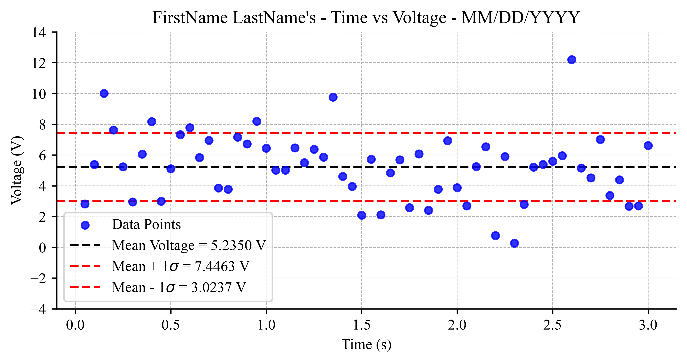{#fig-part-a1 width="6.5in"}

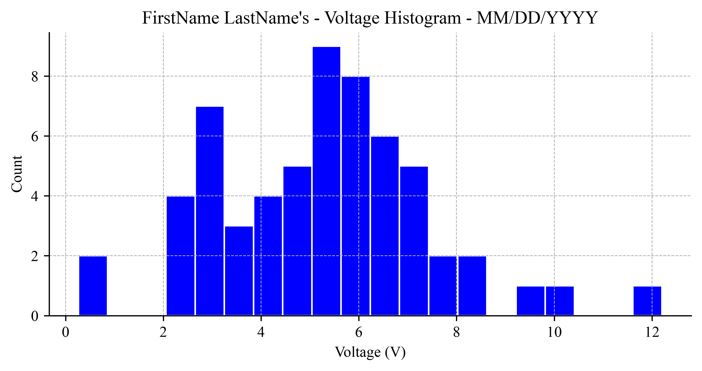{#fig-part-a2 width="6.5in"}



## Part-2: Linear Curve Fit on Scatter Data {#sec-part-2}

For part 2 of this lab, you will use tabular data to generate a scatter plot and then perform a curve fit on the data. You will compute and add confidence-level lines to the plot. You will also learn how to annotate your plot by adding the linear fit equation and the standard deviation of the slope to the plot as text.

To calculate the confidence level of the curve fit, we will use the following equations:

$$y_{cl} = y_{fit} \pm t_{\nu,P}\,s_{yx} \quad (P\%)$$ {#eq-confidence-level}

$$s_{yx} = \sqrt{\frac{\sum_{i=1}^{N}(y_i-y_{c_i})^2}{\nu}}$$ {#eq-standard-error-fit}

where $t_{\nu,P}$ is the Student's t-value, $\nu$ is the degrees of freedom, $P$ is the confidence level (use 95%), $s_{yx}$ is the standard error of fit, $y$ is a vector of sample data, $y_c$ is a vector of curve-fit data, and $N$ is the total number of data points. Because a linear fit estimates *two* parameters (slope and intercept) from the data, the degrees of freedom are $\nu = N-2$.

To compute the standard deviation of the slope, you will implement the following formula:

$$S_{a1} = s_{yx} \sqrt{\frac{1}{\sum_{i=1}^{N} (x_i -\overline{x})^2}}$$ {#eq-slope-std-error}

where $s_{yx}$ is given by @eq-standard-error-fit and $\overline{x}$ is the mean value of the x data points. Note that $S_{a_1}$ carries the units of the *slope*, while $s_{yx}$ carries the units of $y$. You practiced these calculations in the prelab walkthrough. We will cover these equations in further detail in class.

### Detailed Instruction

Use the data provided in @tbl-experimental-data and @eq-confidence-level and @eq-standard-error-fit to create a figure similar to @fig-part-b.

1.  Transfer the data into your notebook manually, or use another program like Excel to make a **.csv** to import.
2.  Plot the raw data on a figure using red filled circle markers with a marker size of 75, using `scatter`.
3.  Curve-fit the data using the Python curve-fitting functions *polyfit* and *polyval*.
4.  Plot the resulting linear curve fit as a solid blue line with *linewidth* = 2.
5.  Compute the confidence interval using @eq-confidence-level and @eq-standard-error-fit. Compute the t-value using *`stats.t.ppf(0.975, df=nu)`* from `scipy.stats`. **Careful:** `ppf()` takes a *cumulative* (one-tailed) probability, but a 95% confidence interval is two-sided — so you must pass $1 - 0.05/2 = 0.975$, not 0.95. Check yourself against your t-table: for $\nu = 5$, $t_{5,95\%} = 2.571$. (This trip-up is explained in detail in the prelab walkthrough.) Plot the CI lines as black dashed lines with line widths of 1.
6.  Compute the slope fit error using @eq-slope-std-error.
7.  Annotate the plot with the fit line equation and slope error using *ax.text*.
8.  Include a legend, title, and labels, and update formatting to closely match example @fig-part-b.
9.  Save a **.pdf** and **.png** of the figure for your post-lab submission.

::: {.callout-important title="Logbook Questions"}
- What does $s_{yx}$ tell you about the quality of a fit? What would a larger value mean physically?
- How would you formally report the slope with its uncertainty? Write it out in your notebook using appropriate units and significant figures.
:::

| Velocity (m/s) | Volts (V) |
|----------------|-----------|
| 0.00           | 0.7036    |
| 1.00           | 1.0096    |
| 2.00           | 1.3907    |
| 3.00           | 1.8867    |
| 4.00           | 2.2557    |
| 5.00           | 2.6313    |
| 6.00           | 2.9504    |

: Experimental Data.



### Plot Format Instructions

Use the following list to make sure this figure is properly formatted.

- Figure size: 6.5" wide x 3.5" tall
- Figure background color: white
- Text: font "Times"; Min/Max font sizes: 10 pt / 12 pt
- Turn on major and minor grids
- Top and right border (spine) removed
- Include appropriate axis labels (always include units when needed)
- Add a short, accurate title, including your name and today's date
- Fit line: solid blue, 2 pt width
- CI line: dashed black, 1 pt width
- Scatter markers: red face and edge, size 75

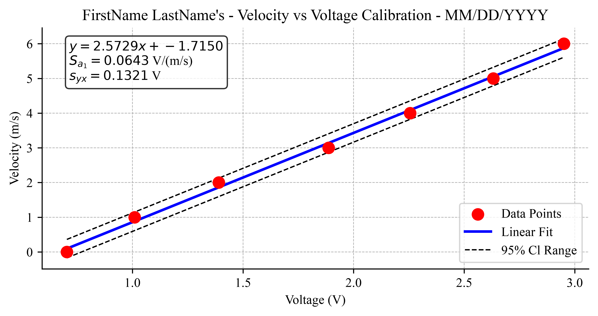{#fig-part-b width="6.5in"}



## Part-3: Generated Histogram and PDF Lines {#sec-part-3}

For the final part of this lab, you will generate your own synthetic data, then use it to create visualizations of probability density functions (PDFs) using both normalized histograms and the standard normal PDF equation.

The probability density function for a normal distribution is

$$p(x) = \frac{1}{\sigma \sqrt{2\pi}}\exp\left[ -0.5 \times \left(\frac{x-x'}{\sigma}\right)^2 \right]$$ {#eq-normal-pdf}

where $\sigma$ is the standard deviation of the population and $x'$ is the mean value of the population.

For your plot, create data with the following true mean and standard deviation values:

1.  $x' = -2$ and $\sigma = 0.80$
2.  $x' = 0$ and $\sigma = 0.50$
3.  $x' = 0$ and $\sigma = 2.00$
4.  $x' = 3$ and $\sigma = 2.00$

### Detailed Instruction

1.  Generate synthetic datasets, using N = 1000 points for each set. You can use numpy's *randn* function to help with this step.
    - Hint: scale and shift the standard normal samples, `data = mu + sigma * np.random.randn(N)`, as practiced in the prelab walkthrough.
2.  Implement your PDF function using @eq-normal-pdf to generate a curve of samples for each dataset.
    - Use the range -10 to 10 for the input x. One way to generate a vector of sample points for x is to use *np.linspace*.
3.  Set up a 2-row, 1-column figure using the *plt.subplots* command, or the *plt.subplot* command.
4.  Use a *histogram* with `density=True` to generate normalized (PDF) histograms on the top chart.
    - Set the histogram colors to black, red, green, and blue, in order.
    - Set the number of bins, **nbins** = 20, for each histogram.
5.  Use your PDF function to generate continuous lines and plot them on the bottom chart.
    - Set the line colors to black, red, green, and blue, in order.
6.  Include a legend, title, and labels, and update formatting to closely match example @fig-part-c.
7.  Save a **.pdf** and **.png** of the figure for your post-lab submission.

### Plot Format Instructions

Use the following list to make sure your figure is properly formatted.

- Figure size: 6.5" wide x 7" tall
- Figure background color: white
- Text: font "Times"; Min/Max font sizes: 10 pt / 12 pt
- Turn on major grids
- Top and right border (spine) removed
- Include appropriate axis labels (always include units when needed)
- Add a short, accurate title, including your name and today's date
- Line widths: 2 pt
- Match x and y axis limits across subplots so that plots are directly comparable
  - This is very important for understanding when making multi-axis figures!

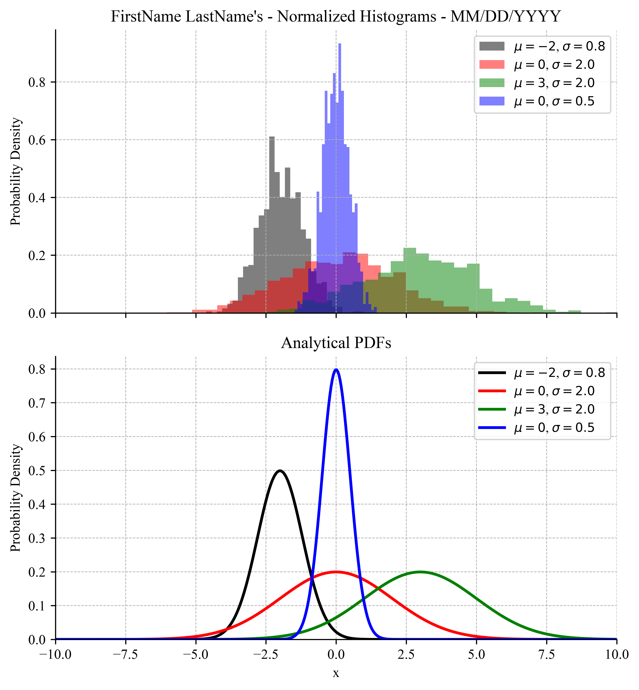{#fig-part-c width="6.5in"}



## Post-Lab Assignment

Following each lab, you will upload your submissions to Canvas. A full example solution notebook will be posted on Canvas after all lab sections have met — use it to check your approach, but the work you submit must be your own.

### General Instruction

- Name your files FirstName_LastName_LabXX_PartXX. You will follow this file-naming format for all future experiments.
- Make sure your submitted figures have updated titles with your name and the date. Include the apostrophe!
- As you can see, Matplotlib provides a great deal of power for formatting high-quality scientific figures. Here are a few best practices to remember throughout the semester.
  - Sampled data points should be plotted using markers, without lines connecting the points.
  - Continuous lines/curves from theory (or curve-fit lines) should be plotted as solid colored lines.
  - Remember to set the x- and y-axis limits. When preparing multi-axis plots, limits should usually match to make data easy to compare.
  - Make sure the major grid lines are visible. When needed, set axis ticks to be dense enough to make the figure easy to read.
  - In this class, all plot text should be in Times font. You will need to specify this for the title, labels, and legends. Axis labels and tick numbers should typically be in 10-point font.
  - Titles are not always needed if labels are clear enough, but should be set at 10-point font when used.
  - Make sure to add a legend when there are multiple elements on the plot. Keep in mind that the legend should not obscure the plotted data.
  - Always refer to the example figures in the lab manual to make sure your figures match the expected formatting.
  - If in doubt, ask the lab TAs for help. They can confirm whether your plot matches expectations.

### Submission Items

- Your final **.ipynb** notebook file
- Part-1
  - Your Time vs. Voltage scatter plot in **.pdf** file format.
  - Your Voltage histogram in **.pdf** file format.
- Part-2
  - Your Voltage vs. Velocity scatter and curve-fit plot in **.pdf** file format.
- Part-3
  - Your multi-axis PDF plot in **.pdf** format.

### Post-Lab Questions

Be prepared to answer the following post-lab questions (make sure you can answer these questions before leaving the lab!) [**Post-labs are due Mondays at 10:00 pm.**]{.underline}

1.  What happens to the shape of a normal distribution (PDF) when the standard deviation is decreased?
2.  What happens to a normal distribution (PDF) when the mean value is increased?
3.  What is the observed standard deviation of the slope in part-2?

## Before you leave

- Return all equipment you used to its designated location.
- Remove all the wires from the breadboard and return them to the wire bin. Keep colors sorted nicely, and discard any broken / severely damaged wires.
- Make sure the station is clean.
- Pick up all your belongings.
- Make sure the data is accessible to all the team members.