

## Learning Objective

### Objectives

Your objectives for this laboratory session are to:

- Become familiar with the WaveForms instrument modules: **Supplies**, **Scope**, and **Logger**
- Build a sensor circuit on a breadboard and verify it with a digital multimeter (DMM)
- **Calibrate a sensor**: convert an angular potentiometer's raw voltage output into a physical measurement (angle) by collecting calibration data and fitting a linear calibration equation
- Quantify the quality of your calibration using the norm of residuals, the standard error of fit $s_{yx}$, the standard error of the slope $S_{a_1}$, and a 95% confidence interval
- Record a dynamic measurement: the free-swing motion of a pendulum
- **Match a simulation of a dynamic model to measured data**: simulate a simple pendulum model using `scipy.integrate.solve_ivp` and tune its parameters until it approximately reproduces your experiment
- Learn new Python skills: `for` loops, `enumerate`, f-strings, DataFrame indexing with `.iloc`, defining functions with `def`, and numerical ODE integration

### Check Your Understanding

By the end of this lab, you should be able to answer all of these questions.

#### Hardware & WaveForms

- What is a voltage divider, and why does a potentiometer's output voltage change with shaft angle?
- The ADS analog inputs are *differential*. What does that mean, and where do the 1+ and 1− wires connect in this lab?
- How do you set the update rate and duration in the WaveForms Logger, and how do you export the recording as a CSV?
- On the Scope, how do you use cursors to measure the period of an oscillating signal?

#### Programming

- How does a `for` loop repeat an operation over a list of values? What does `enumerate` add?
- What is an f-string, and how do you insert a variable's value into a filename or a plot annotation?
- What is the difference between `df.iloc[:, 1]` and `df['column_name']`? When is `.iloc` the safer choice?
- How do `np.diff` and `np.argmax` work together to find the moment the pendulum is released?
- What is `scipy.integrate.solve_ivp`, and what inputs does it require? (Hint: it is closely related to MATLAB's `ode45`.)

#### Data Analysis

- What is a calibration equation, and why do most sensors need one?
- What do the norm of residuals and the standard error of fit $s_{yx}$ tell you about the quality of a fit? How are they related?
- Why do we pass `0.975` (not `0.95`) to `stats.t.ppf()` for a two-sided 95% confidence interval?
- How do you determine the damped period $T_d$ and damped frequency $\omega_d$ from a measured oscillation?
- Why does the simple pendulum model deviate from measured data even after tuning?



## Pre-Lab Setup

You should come to lab having completed all tasks in this section.

### Extend Your Folder Structure

Add a Lab_02 folder set to the `ME3300` folder you created in Lab 01:

``` text
ME3300/
├── Lab_01/
├── Lab_02/
│   ├── Code/
│   │   ├── Lab02_Prelab_Walkthrough.ipynb
│   │   └── FirstName_LastName_Lab02.ipynb
│   ├── Data/
│   └── Figures/
```

Because your `.venv` environment lives at the top of the `ME3300` folder, it already serves every lab subfolder so no new environment setup is needed. This lab uses the same packages you installed in Lab 01 (`numpy`, `scipy`, `matplotlib`, `pandas`, `ipykernel`).

### Read the Background Section

Read the [Background](#sec-background) section of this manual before lab. It derives the pendulum equation of motion you will simulate in @sec-part-6. We will also discuss this model in class, but arriving with the derivation fresh in your mind will make the simulation step much faster.

### Complete the Prelab Walkthrough Notebook {#sec-prelab-walkthrough}

Download `Lab02_Prelab_Walkthrough.ipynb` from Canvas and save it in `ME3300/Lab_02/Code/`. Work through it cell by cell before lab. It introduces, with small practice exercises, the *new* Python skills this lab requires:

- `for` loops and `enumerate` for repeating an analysis over many data files
- f-strings for building filenames and annotation text from variables
- selecting DataFrame rows and columns by position with `.iloc`
- finding events in a signal with `np.diff` and `np.argmax`
- defining your own functions with `def`
- simulating an ODE with `scipy.integrate.solve_ivp`

Skills already covered in Lab 01 (loading CSVs, `polyfit`/`polyval`, plot formatting, saving figures) are *not* retaught, so keep your Lab 01 notebook and the Lab 01 quick-reference tables handy.

The walkthrough contains **checkpoint** boxes; report the requested values in the **Prelab 02 quiz on Canvas** (due before your lab session).

### Python Quick Reference: New This Lab

| Task | Python command |
|------------------------------------|------------------------------------|
| Loop over a list | `for angle in angles_deg:` |
| Loop with a counter | `for i, angle in enumerate(angles_deg):` |
| Build a string from variables | `f'Ang_{sign}{abs(angle)}Deg.csv'` |
| Conditional expression | `sign = 'n' if angle < 0 else 'p'` |
| Select DataFrame column by position | `df.iloc[:, 1]` (all rows, second column) |
| DataFrame column → numpy array | `df.iloc[:, 1].values` |
| Preview first rows of a DataFrame | `df.head()` |
| Differences between adjacent samples | `np.diff(x)` (length is `len(x) - 1`) |
| Index of first/largest `True` | `np.argmax(condition)` |
| Degrees ↔ radians | `np.radians(deg)` / `np.degrees(rad)` |
| Define a function | `def pendulum_ode(t, y): ... return [...]` |
| Integrate an ODE | `solve_ivp(fun, t_span, y0, t_eval=t_eval)` (from `scipy.integrate`) |
| Save an array to CSV | `np.savetxt('file.csv', arr, delimiter=',')` |

: New Python syntax and functions introduced in Lab 02

| Instrument | What you'll use it for this lab |
|------------------------------------|------------------------------------|
| **Supplies** | Power the potentiometer with the fixed 3.3 V output |
| **Scope** | Watch the live sensor voltage; measure oscillation period with cursors |
| **Logger** | Record voltage vs. time at a set rate and duration; export CSV files |

: WaveForms instruments used in Lab 02



## Laboratory Introduction

In Lab 01 you learned to analyze and present "data" that you collected without any real sensor (just noise from the waveform generator). This lab adds the rest of the measurement chain: a real **sensor**, a **circuit**, and a **data-acquisition device**, followed by a physics-based **model** of the process you measured. This workflow, *build, verify, calibrate, measure, model*, is one you will repeat, with different sensors and systems, for the rest of the semester (and career!).

This lab has four major goals:

- **Get fluent with the hardware.** You will use the WaveForms Supplies, Scope, and Logger instruments with the Analog Discovery Studio (ADS).
- **Calibrate a sensor.** A potentiometer outputs a voltage, not an angle. You will collect data at known angles, fit a linear calibration equation, and quantify your confidence in it.
- **Record a dynamic measurement.** You will capture the free-swing motion of a pendulum with your calibrated sensor. This is your first measurement of a system that changes in time, i.e. a **dynamic** system.
- **Match a model to measurements.** You will simulate a simple pendulum model in Python and iteratively tune its parameters until the simulation approximates your data. Comparing models to measurements, and understanding why they disagree, is one of the most important skills in experimental engineering.

Note that in this lab you will do **no new Python programming until the calibration analysis** (@sec-part-4). The first half deliberately uses the WaveForms GUI to power, observe, and record your sensor so that you understand exactly what the instruments do. In later labs, you will begin automating pieces of this workflow from Python, but for now working with the GUI will help us understand the instruments.



## Background {#sec-background}

### The Pendulum Apparatus and the Potentiometer

Your lab pendulum is a rigid arm with a mass at its swinging end, pinned to the shaft of an **angular potentiometer** (a 10 kΩ rotary potentiometer).

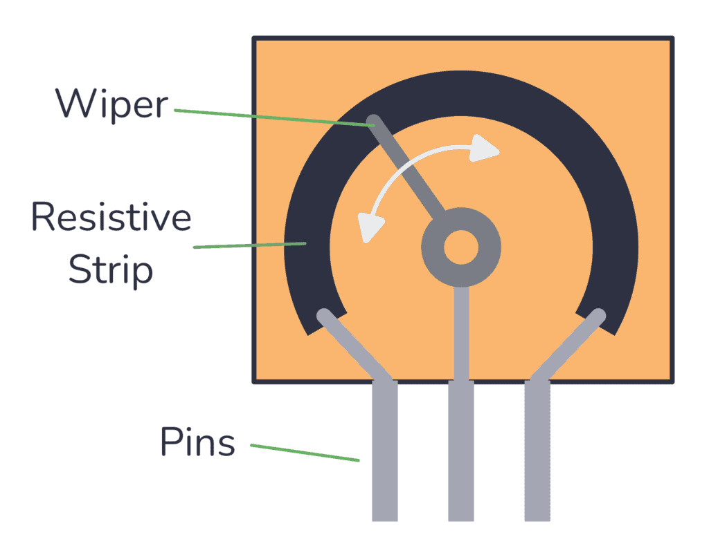{#fig-inside-potentiometer width="50%"}

A potentiometer is a resistor with a third, movable contact called the *wiper*. With the two end terminals connected across a supply voltage, the wiper divides the resistor into two parts, $R_1$ and $R_2$, forming a **voltage divider** (see @fig-circuit-diagram). As the shaft rotates, the wiper slides, $R_1$ and $R_2$ change, and the wiper voltage changes in proportion to the shaft angle:

$$V_{out} = \frac{R_2}{R_1+R_2} V_{supply} \approx \frac{\theta}{\theta_{max}} \, V_{supply}$$ {#eq-voltage-divider}

In practice the angle–voltage relationship is very nearly linear over the pendulum's operating range, so a linear **calibration equation** of the form

$$\theta = a_1 V + a_0$$ {#eq-calibration}

is appropriate. Your aim in @sec-part-4 is to determine coefficients $a_1$ and $a_0$ *experimentally* and to quantify how much you should trust them.

### Simple Pendulum Model {#sec-pendulum-model}

An ideal planar pendulum is a body suspended from a light rod of length $L$, pinned at a frictionless pivot, swinging under gravity. The model becomes the classic "simple pendulum" if we assume:

1.  The mass $m$ is concentrated at the swinging end.
2.  The rod is rigid and massless.

These assumptions limit the model's accuracy, but by how much? This is what your measurements will reveal.

Referring to the coordinate system in @fig-pendulum-diagram, the torque about the pivot P includes gravity acting on the mass and a viscous damping torque $\tau_f = -b\dot\theta$ from friction at the pivot. Summing torques gives:

$$\left( \tau_P \right)_z = -mgL\sin\theta - b\dot{\theta}$$ {#eq-torque}

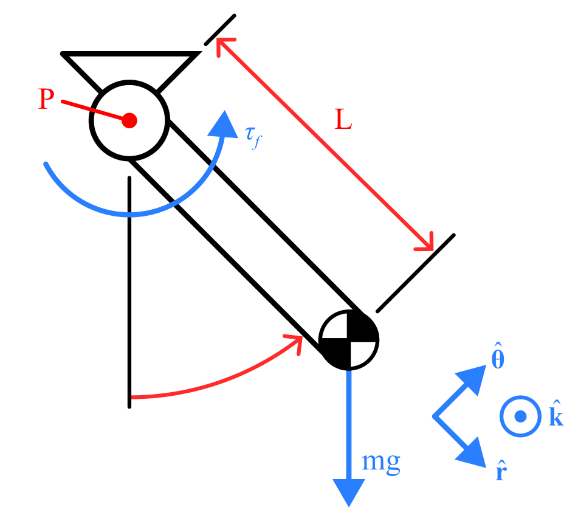{#fig-pendulum-diagram width="30%"}

The moment of inertia of a point mass about the pivot is $I_P = mL^2$, so Newton's second law for rotation, $\left(\tau_P\right)_z = I_P \ddot{\theta}$, gives

$$-mgL\sin\theta - b\dot{\theta} = mL^2 \ddot{\theta}.$$ {#eq-eom-raw}

We can rearrange this into **standard form** yielding a second-order nonlinear ODE:

$$\ddot{\theta} + 2\zeta\omega_n \dot{\theta} + \omega_n^2 \sin(\theta) = 0, \qquad \zeta = \frac{b}{2mL^2\omega_n}, \qquad \omega_n = \sqrt{\frac{g}{L}}$$ {#eq-eom}

where $\omega_n$ is the natural frequency and $\zeta$ is the damping ratio. You can measure $L$ directly with a ruler, but $\zeta$ depends on $m$ and $b$, which you will *not* measure today. Instead, you will tune $\zeta$ until the simulation matches your data.

### From Model to Simulation {#sec-model-to-sim}

Numerical ODE solvers (MATLAB's `ode45` and Python's `solve_ivp`) integrate systems of *first-order* equations. To simulate @eq-eom, we rewrite the single second-order equation as two first-order equations by introducing the angular velocity $\omega = \dot\theta$ as a second state variable:

$$\frac{d\theta}{dt} = \omega, \qquad \frac{d\omega}{dt} = -2\zeta\omega_n\omega - \omega_n^2\sin(\theta)$$ {#eq-state-space}

The solver marches these equations forward in time from an initial condition $\left[\theta(0),\, \omega(0)\right]$ — for your experiment, the release angle and zero velocity. You will implement this in @sec-part-6.



## Part-1: Set Up the ADS and WaveForms {#sec-part-1}

### Connect the ADS

1.  Ensure the Analog Discovery Studio is plugged into a wall outlet, powered on, and connected to your computer via USB.
2.  Open the **WaveForms** application. In the Device Manager, select **Analog Discovery Studio** and click **Select** (the same steps as Lab 01).
3.  The WaveForms **Welcome** screen lists all available instruments; see @fig-waveforms-welcome. Identify the three you will use today:
    - **Supplies** — controls the ADS power outputs
    - **Scope** (oscilloscope) — displays analog voltage vs. time, live
    - **Logger** — records voltage over time and exports it to file

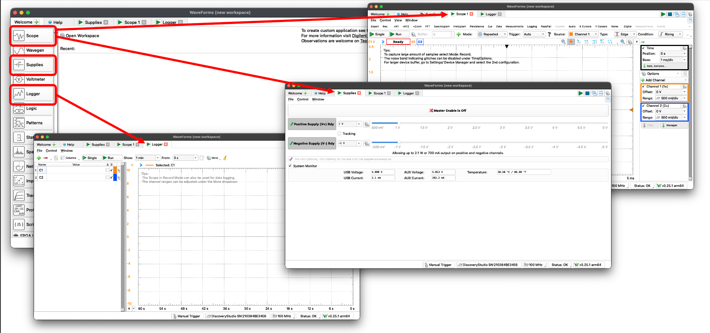{#fig-waveforms-welcome width="100%"}

::: {.callout-important title="Logbook Questions"}
**Q1.** In your logbook, match each WaveForms instrument you'll use today (Supplies, Scope, Logger) to a piece of traditional benchtop lab equipment it replaces.
:::

### Enable the Power Supply

The ADS provides several ways to supply power. The potentiometer needs a stable reference voltage, so for this lab you will use the programmable supply set to **3.3 V**.

1.  Open **Supplies** in WaveForms.
2.  Enable the **3.3 V** fixed supply and click **Master Enable**; see @fig-supplies-setup. Leave the ±12 V supplies off.
3.  Verify the output with your handheld DMM: measure between the **V+** pin and a **GND** pin on the ADS breadboard.

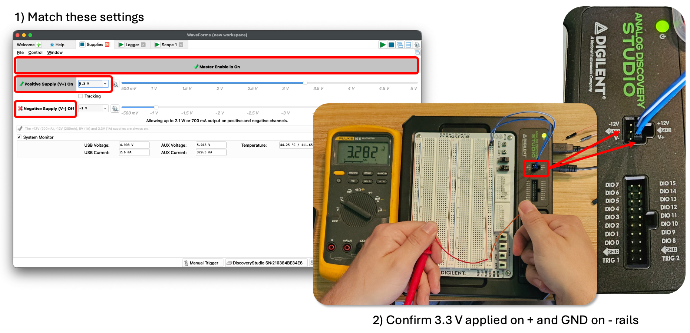{#fig-supplies-setup width="100%"}

::: {.callout-important title="Logbook Questions"}
**Q2.** What voltage does your DMM read? Is it *exactly* 3.3 V? Record the value. Why would it matter for your calibration if this supply drifts during the lab?
:::



## Part-2: Build the Potentiometer Circuit {#sec-part-2}

Your main guide for this part is the annotated photo and circuit diagram in @fig-circuit-build and @fig-circuit-diagram. Study these figures first; the text and table below explain how to build your circuit and what each connection does.

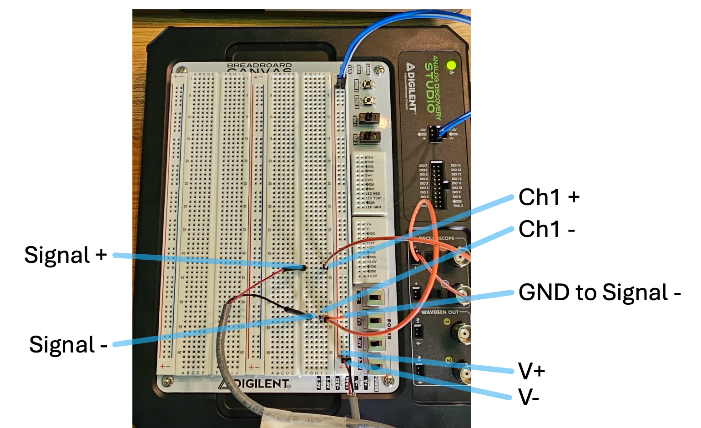{#fig-circuit-build width="100%"}

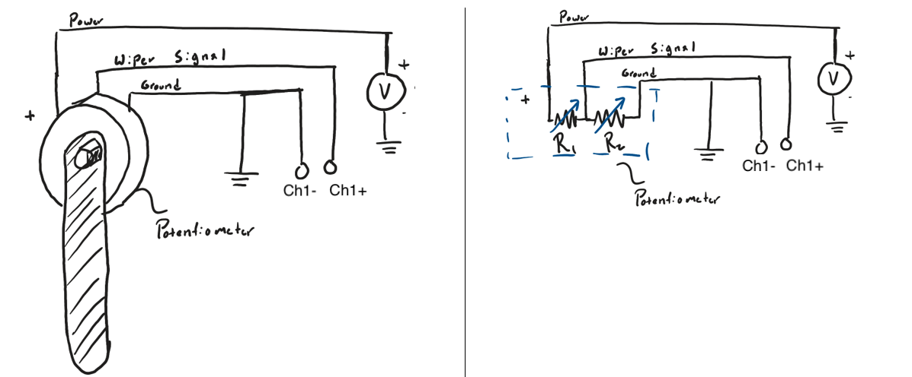{#fig-circuit-diagram width="100%"}

The potentiometer has three critical leads (most in the lab actually have four with an extra GND pin), and the ADS analog inputs are **differential**. Channel 1 measures the voltage *difference* between its 1+ and 1− pins. That gives four connections in total:

| Potentiometer lead | Connects to | Purpose |
|------------------------|------------------------|------------------------|
| End terminal (V+) | 3.3 V (V+) on ADS | Supplies the top of the divider |
| End terminal (V-) & Signal – | GND on ADS | Grounds the bottom of the divider |
| Signal + (Wiper center) | **1+** (Scope Ch. 1 positive) | The signal: divider output voltage |
| — (jumper) | GND rail → **1−** (Ch. 1 negative) | Gives the differential input its reference |

1.  Match your wiring to @fig-circuit-build, routing each connection through the breadboard rails as shown.
2.  Before applying power, gently confirm each jumper is seated, and check with your DMM (continuity mode) that V+ and GND are **not** shorted together.
3.  Enable the supply, then slowly rotate the pendulum by hand while measuring the wiper voltage with your DMM (you can use spare jumpers to access this signal). The voltage should vary smoothly across the swing range.

::: {.callout-note title="If the voltage jumps or drops suddenly"}
The potentiometer body may be misaligned so that its dead zone (the small angle where the wiper leaves the resistive track) falls inside the swing range. Ask your TA for help. They will loosen the grub screw, rotate the potentiometer body until the jump occurs far outside the operating range (near ±180°), and re-tighten it. Then re-test.
:::

::: {.callout-important title="Logbook Questions"}
**Q3.** Sketch the schematic of your circuit in your logbook. Label the supply, ground, wiper signal, and the ADS input pins.

**Q4.** Record the wiper voltages at the two extremes of the pendulum's travel (about −90° and +90°). Roughly what fraction of the 0–3.3 V range does your sensor use?
:::



## Part-3: Observe the Signal with the Scope {#sec-part-3}

Before recording data, get to know your signal. It is good practice to *always* look at a live signal before trusting a logged file; it's the fastest way to catch a loose wire, a misaligned sensor, or a bad setting. We will use the WaveForms Scope (a built-in digital oscilloscope) for this purpose.

### Configure the Scope

1.  Open **Scope** in WaveForms.
2.  Ensure **Channel 1** is enabled.
3.  Match the settings in @fig-scope-setup:
    - **Range:** 500 mV/div (This controls y axis scaling)
    - **Offset:** −1.65 V (this centers the mid-travel voltage on screen)
    - **Time base:** 100 ms/div (This controls x axis scaling)
    - **Mode:** Shift (This makes the window slide as new data is collected resulting in a smooth history of the signal)
4.  Press **Run**. You should see the live voltage trace.

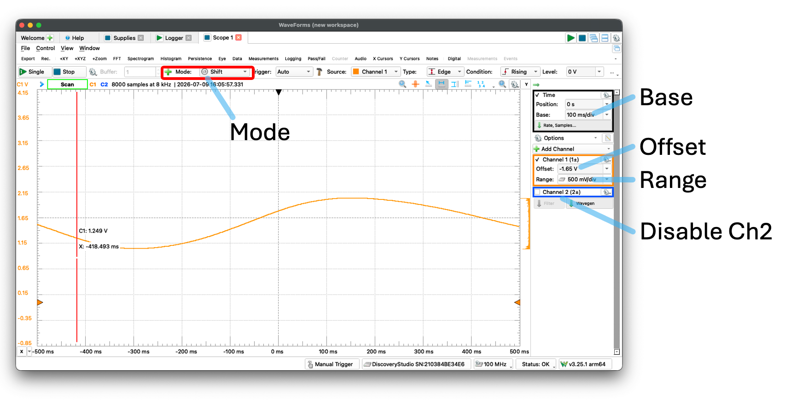{#fig-scope-setup width="100%"}

### Explore the Signal

5.  Slowly rotate the pendulum through its full range (about −90° to +90°) and watch the trace respond.
6.  Lift the pendulum, release it, and let it swing freely. Watch the oscillation. Press **Stop** to freeze the display.
7.  With the display frozen, open the **Cursors** panel and place two X (time) cursors one full oscillation apart; see @fig-scope-cursors. The readout shows the time difference you can use as a first estimate of the oscillation period. (Note: you may need to adjust your time base to properly see a complete oscillation.)

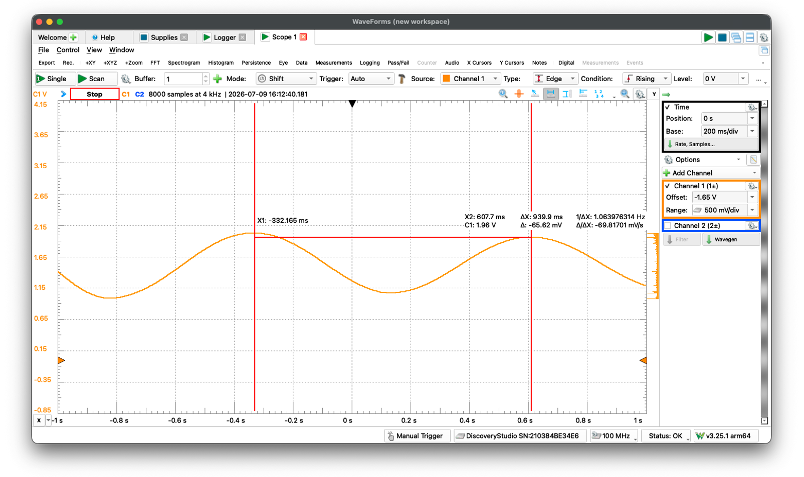{#fig-scope-cursors width="100%"}

::: {.callout-important title="Logbook Questions"}
**Q5.** Sketch the frozen waveform in your logbook. Is it a sine wave? Is the amplitude constant, or does it decay? Label your sketch with the approximate period from the cursors.

**Q6.** Hold the pendulum still at 0° (straight down) and read the mean voltage (Scope **Measurements** panel, see @fig-mean-measurement, or just the trace level). How does it compare to what the voltage divider predicts for mid-travel?
:::

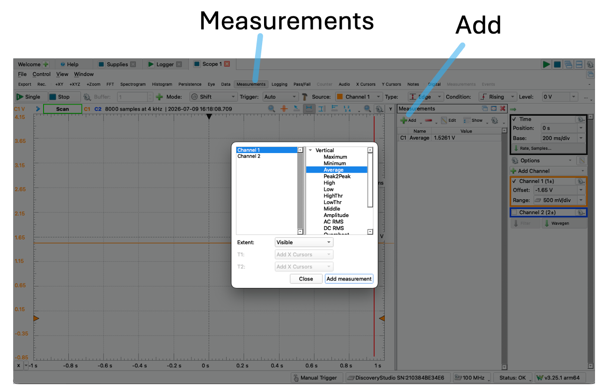{#fig-mean-measurement fig-alt="A window in the WaveForms Application illustrating the process of adding a mean measurement calculation." width="100%"}



## Part-4: Calibrate the Sensor {#sec-part-4}

Now it's time to build a calibration for your sensor. A calibration converts sensor output (volts) into the physical quantity you actually want (degrees). You will hold the pendulum at a series of known angles, record a short voltage dataset at each one, then fit @eq-calibration to the results in Python.

### Set Up the Logger

1.  Open **Logger** in WaveForms.
2.  Configure Channel 1 to record the Scope Channel 1 voltage, and match the settings in @fig-logger-setup:
    - **Update:** 50 ms (i.e., 20 samples per second)
    - **Duration:** 10 seconds
3.  You will export each recording as a CSV via **File → Export**, using the same export settings as Lab 01.

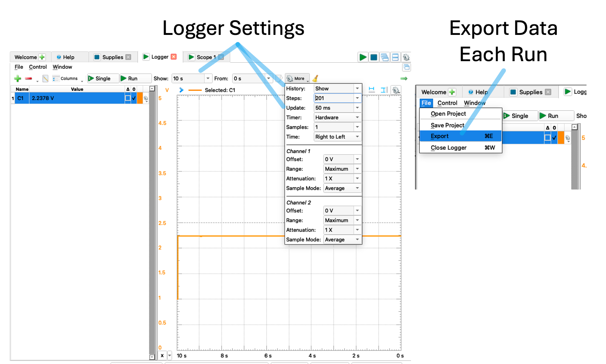{#fig-logger-setup width="100%"}

### Collect Calibration Data

Choose a reliable way to set the pendulum angle: the supplied protractor, or a smartphone level app (e.g., *Bubble Level*). Angles follow the **right-hand rule** about the potentiometer shaft, with **0° defined as the pendulum hanging straight down**; see @fig-zero-position.

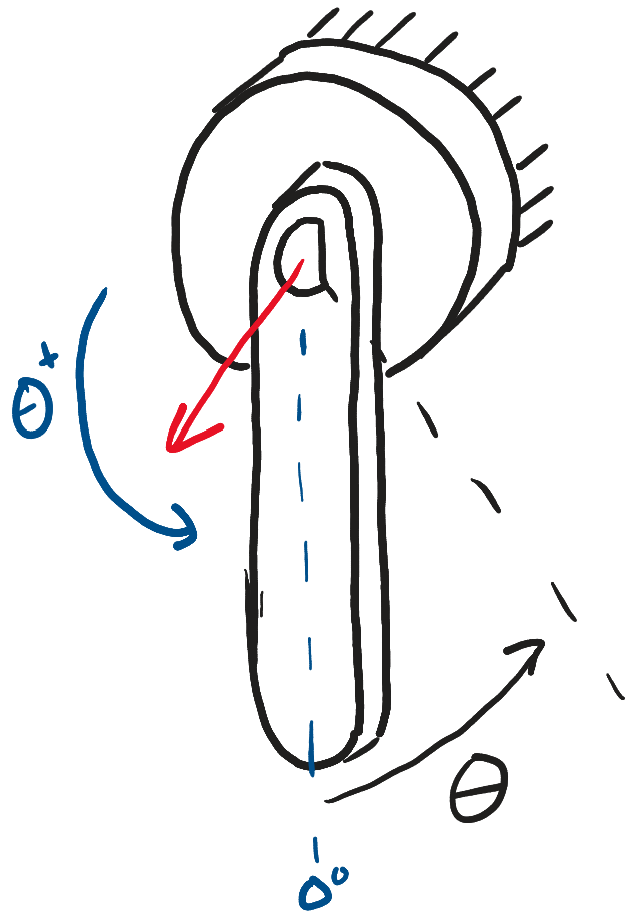{#fig-zero-position width="25%"}

Record data at the following **11 angles** spanning the full range:

−90°, −70°, −50°, −30°, −10°, 0°, 10°, 30°, 50°, 70°, 90°

For each angle:

1.  Hold the pendulum steady at the target angle (one partner holds, one runs the computer).
2.  Run the Logger for the 10-second duration, then export the CSV to `ME3300/Lab_02/Data/` using the naming convention `Ang_p45Deg.csv` (positive angles) or `Ang_n45Deg.csv` (negative) — replace 45 with the actual angle, and always update the name *before* exporting so you don't overwrite a previous run.
3.  Log the angle in a table in your logbook like @tbl-calibration. You will fill the voltage column from Python in the next step.

| Pendulum Angle (Degrees) | Average Output Voltage (V) |
|:------------------------:|:--------------------------:|
|           −90°           |            0.67            |
|           −70°           |            0.88            |
|           −50°           |                            |
|           −30°           |                            |
|           −10°           |                            |
|            0°            |                            |
|           10°            |                            |
|           30°            |                            |
|           50°            |                            |
|           70°            |                            |
|           90°            |                            |

: Example calibration logbook table (your voltages will differ — these are representative values for a 3.3 V supply). {#tbl-calibration}

::: {.callout-important title="Logbook Questions"}
**Q7.** Before fitting: visually scan your table. Does voltage change by roughly the same amount for each 20° step? What does that suggest about the linearity of your sensor?
:::

### Analyze the Calibration in Python

Open your notebook `FirstName_LastName_Lab02.ipynb` in VS Code (kernel: your `.venv`). As in Lab 01, a well-commented **starter notebook** is available on Canvas, and the prelab walkthrough covered every new syntax element used below.

::: {.callout-tip title="Good notebook habits"}
Structure your notebook with a markdown heading cell for each part of the lab (`## Part 4: Calibration`, etc.) and a sentence or two describing what each code cell does and what you observed. Your notebook is a lab record, not just code. Before submitting, always run **Restart Kernel and Run All Cells** — if it doesn't run top-to-bottom cleanly, it isn't done.
:::

**Step 1 — Load every calibration file and average it.**

In Lab 01 you loaded one CSV. Here you have 11 files that all need the same treatment, which is exactly what a **`for` loop** is for:

``` python
import numpy as np
import matplotlib.pyplot as plt
import pandas as pd
from scipy import stats

plt.rcParams['font.family'] = 'serif'
plt.rcParams['font.serif'] = ['Times New Roman']
plt.rcParams['font.size'] = 10

# The known angles you calibrated at — edit to match your actual angles
angles_deg = np.array([-90, -70, -50, -30, -10, 0, 10, 30, 50, 70, 90])

data_dir = '../Data/'
mean_voltages = np.zeros(len(angles_deg))   # empty array to fill in the loop

for i, angle in enumerate(angles_deg):
    sign = 'n' if angle < 0 else 'p'
    filename = f'{data_dir}Ang_{sign}{abs(angle)}Deg.csv'
    df = pd.read_csv(filename, skiprows=6)   # skip WaveForms metadata lines
    mean_voltages[i] = df.iloc[:, 1].mean()  # voltage is the 2nd column

print(mean_voltages)   # sanity check: should match your logbook table
```

A reminder of concepts here you practiced in pre-lab:

- **`for i, angle in enumerate(angles_deg):`** — the loop body runs once per angle. `enumerate` hands you *two* things each pass: the counter `i` (0, 1, 2, …), used to store each result in the right slot of `mean_voltages`, and the value `angle` itself, used to build the filename.
- **`sign = 'n' if angle < 0 else 'p'`** — a one-line conditional: `sign` becomes `'n'` for negative angles and `'p'` otherwise, matching your file-naming convention.
- **`f'{data_dir}Ang_{sign}{abs(angle)}Deg.csv'`** — an **f-string**. Anything inside `{ }` is replaced with the variable's value, so for `angle = -70` this produces `'../Data/Ang_n70Deg.csv'`. F-strings are how you build filenames, labels, and annotations from variables.
- **`df.iloc[:, 1]`** — position-based DataFrame indexing: *all rows* (`:`), *second column* (`1` — Python counts from 0). We use `.iloc` here because WaveForms may name columns differently depending on export settings, but the *positions* (time first, voltage second) are consistent.

::: {.callout-warning title="Check `skiprows` against your actual file!"}
WaveForms export files begin with several `#` metadata lines before the column headers and data. **Open one of your CSVs in VS Code and count the lines to skip** — do not assume the value in the example is right for your export settings. If `pd.read_csv` gives strange results, this is the first thing to check. A quick `df.head()` after loading shows you exactly what pandas thinks the first rows are.
:::

**Step 2 — Fit the calibration equation and quantify its quality.**

You are fitting @eq-calibration, $\theta = a_1 V + a_0$, with `np.polyfit` exactly as in Lab 01 — voltage is the input $x$, angle is the output $y$. What's new is finishing the job: reporting *how good* the fit is. As in Lab 01, the 95% confidence interval on the fit is

$$\theta_{cl} = \theta_{fit} \pm t_{\nu,95\%} \; s_{yx}$$ {#eq-confidence-level}

where the **standard error of fit** is computed from the residuals $r_i = \theta_i - \theta_{c_i}$ (data minus fit):

$$s_{yx} = \sqrt{\frac{\sum_{i=1}^{N} r_i^2}{\nu}} = \frac{\lVert r \rVert}{\sqrt{\nu}}, \qquad \nu = N - 2$$ {#eq-standard-error-fit}

Note the second form: the **norm of the residuals**, $\lVert r \rVert = \sqrt{\sum r_i^2}$, is just the numerator of $s_{yx}$ before dividing by the degrees of freedom. It is a single number summarizing the total misfit, and $s_{yx}$ is that misfit converted to a per-point standard error. The **standard error of the slope** is

$$S_{a_1} = s_{yx} \sqrt{\frac{1}{\sum_{i=1}^{N}\left(x_i - \bar{x}\right)^2}}$$ {#eq-slope-std-error}

where $x$ here is voltage and $\bar{x}$ its mean. $S_{a_1}$ carries the units of the slope (°/V) and tells you the uncertainty of your calibration gain. The code implements these equations term by term:

``` python
# --- Fit: angle = a1 * voltage + a0  (Eq. 2) ---
coeffs     = np.polyfit(mean_voltages, angles_deg, 1)   # [a1, a0]
angles_fit = np.polyval(coeffs, mean_voltages)

# --- Fit quality (Eqs. 7-9) ---
N      = len(angles_deg)
nu     = N - 2                                  # dof: 2 fit parameters
resid  = angles_deg - angles_fit                # residuals r_i
norm_r = np.sqrt(np.sum(resid**2))              # norm of residuals ||r||
s_yx   = norm_r / np.sqrt(nu)                   # standard error of fit
t_val  = stats.t.ppf(0.975, df=nu)              # two-sided 95% => 0.975!
CI     = t_val * s_yx                           # 95% CI half-width
S_a1   = s_yx / np.sqrt(np.sum((mean_voltages - np.mean(mean_voltages))**2))

print(f"Calibration: theta = {coeffs[0]:.4f} V + {coeffs[1]:.4f}")
print(f"norm = {norm_r:.4f} deg, s_yx = {s_yx:.4f} deg, S_a1 = {S_a1:.4f} deg/V")

# Save the coefficients — you will reuse this calibration in later labs
np.savetxt('../Data/calibration_coeffs.csv', coeffs,
           header='a1 (deg/V), a0 (deg)', delimiter=',')
```

Recall from Lab 01: `stats.t.ppf()` takes a *one-tailed* cumulative probability, so a two-sided 95% interval requires $1 - 0.05/2 = 0.975$. Check yourself against your t-table: for $\nu = 9$, $t_{9,95\%} = 2.262$.

**Step 3 — Make the calibration plot.**

Nothing here is new — this is Lab 01 plotting with your new results. Build the figure to match @fig-example-calibration, using the format requirements in the Post-Lab section. Annotate it (using `ax.text` and an f-string) with the calibration equation, the norm of residuals, $s_{yx}$, and $S_{a_1}$, each with 4 decimal places and units. Save **.pdf** and **.png** copies at 600 DPI to your `Figures` folder.

::: {.callout-important title="Logbook Questions"}
**Q8.** Write your calibration equation in your logbook with units on both coefficients.

**Q9.** In one or two sentences: what do the norm of residuals and $s_{yx}$ tell you about the quality of your fit? What would a much larger $s_{yx}$ mean physically for angle measurements made with this sensor?
:::

### Example Result

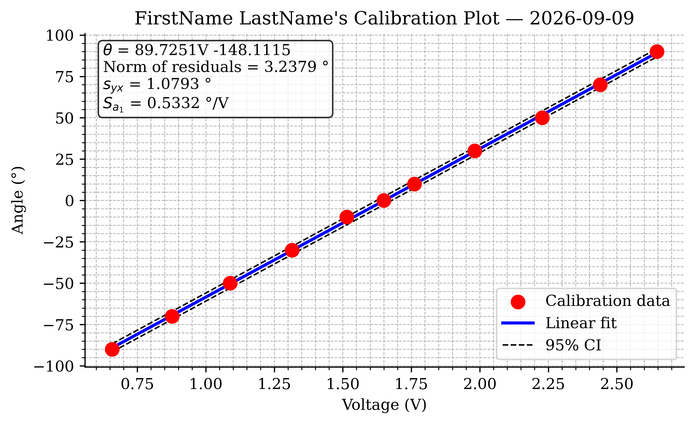{#fig-example-calibration width="6.5in"}



## Part-5: Record and Analyze a Free Swing {#sec-part-5}

With a trusted calibration in hand, you can now make a real dynamic measurement.

### Record the Swing

1.  In the **Logger**, change the settings for a faster, longer recording:
    - **Update:** 10 ms (100 samples per second — fast enough to resolve a \~1 s oscillation smoothly)
    - **Duration:** 20 seconds
2.  One partner holds the pendulum at approximately **+90°** (horizontal); the other starts the recording.
3.  A second or two after the recording starts, **release the pendulum smoothly** — let go, don't push.
4.  Let it swing until the recording ends, then export the CSV as `FirstName_LastName_Lab02_Swing.csv` to `ME3300/Lab_02/Data/`.
5.  Open the file in VS Code and confirm it contains what you expect before moving on.

### Load, Calibrate, and Trim the Data

Back in your python notebook, load the swing recording, convert voltage to angle with your calibration, and trim the recording so $t = 0$ is the moment of release:

``` python
# Load swing data (check skiprows against your file, as before)
swing    = pd.read_csv('../Data/FirstName_LastName_Lab02_Swing.csv', skiprows=6)
time_raw = swing.iloc[:, 0].values     # 1st column: time (s)
volt_raw = swing.iloc[:, 1].values     # 2nd column: voltage (V)

# Apply your calibration equation (Eq. 2): volts -> degrees
angle_raw = np.polyval(coeffs, volt_raw)

# Trim so t = 0 is the release: find the first significant change in voltage
dv    = np.abs(np.diff(volt_raw))      # change between adjacent samples
idx0  = np.argmax(dv > 0.01)           # index of FIRST sample where dv > 0.01 V
time  = time_raw[idx0:] - time_raw[idx0]
angle = angle_raw[idx0:]
```

Two new tools here:

- **`np.diff(volt_raw)`** returns the difference between each pair of adjacent samples — effectively how fast the signal is changing, sample to sample. While the pendulum is held still, these differences are tiny (just noise); at release they jump.
- **`np.argmax(dv > 0.01)`** — the comparison `dv > 0.01` produces an array of `True`/`False` values, and `argmax` returns the index of the first `True` (since `True` counts as 1). Together they locate the first sample where the signal changed by more than 10 mV: the release. The `[idx0:]` slice then discards everything before that moment, and subtracting `time_raw[idx0]` restarts the clock at zero.

::: {.callout-tip title="Debug it yourself"}
If your trim grabs the wrong moment, don't guess — *look*. Plot `volt_raw` against `time_raw` (a quick throwaway plot is helpful here!) and see where the release actually happens; then plot `dv` and see whether 0.01 V is a sensible threshold for *your* noise level. Making quick diagnostic plots is the single most useful debugging habit in experimental work. Most "code bugs" in this course are actually data surprises you'd spot instantly on a plot.
:::

::: callout-note
If you have collected this data and confirmed with a TA that it looks correct, this is an acceptable stopping point for your in-lab work. You can complete the rest of this lab later if needed!
:::

### Plot the Swing and Measure the Period

Plot `angle` vs. `time` as a solid red line (2 pt) with Lab 01 formatting — this figure will become your final swing plot once you overlay the model in @sec-part-6, so build it carefully. From the plot, determine:

- the **damped period** $T_d$: the time of one full oscillation. For better accuracy, measure the time across several periods (e.g., 5) and divide.
- the **damped frequency** $\omega_d = 2\pi / T_d$ in rad/s.

::: {.callout-important title="Logbook Questions"}
**Q10.** Record $T_d$ and $\omega_d$ in your logbook. How does $T_d$ compare to the cursor estimate you made on the Scope in Part 3?

**Q11.** Does the oscillation period visibly change as the amplitude decays? Look closely at early vs. late cycles. (Keep @eq-eom in mind: is this system exactly linear?)
:::



## Part-6: Simulate the Model and Match It to Your Data {#sec-part-6}

Now for the payoff: does the simple pendulum model of @sec-pendulum-model actually describe your pendulum? You will simulate @eq-eom with `scipy.integrate.solve_ivp` (Python's counterpart to MATLAB's `ode45`) and tune the model until it overlays your measurement.

### Implement the Simulation

As explained in @sec-model-to-sim, the solver needs the second-order model rewritten as the two first-order equations of @eq-state-space. In code, that pair of equations becomes a small **function** that the solver calls over and over:

``` python
from scipy.integrate import solve_ivp

# --- Model parameters ---
L   = 0.30                  # pendulum length (m) — MEASURE yours with a ruler
g   = 9.81                  # gravitational acceleration (m/s^2)
omega_n = np.sqrt(g / L)    # natural frequency (rad/s), Eq. 5

zeta = 0.05                 # damping ratio — initial guess, you will tune this

# --- Initial conditions ---
theta0 = np.radians(90.0)   # release angle (rad) — match your actual release
omega0 = 0.0                # released from rest

def pendulum_ode(t, y):
    """State derivative for the damped simple pendulum (Eq. 6)."""
    theta, omega = y                       # unpack the state vector
    dtheta_dt = omega
    domega_dt = -2*zeta*omega_n*omega - omega_n**2 * np.sin(theta)
    return [dtheta_dt, domega_dt]

# --- Solve over the same time range as the experiment ---
t_eval = np.linspace(time[0], time[-1], 2000)
sol = solve_ivp(pendulum_ode, (time[0], time[-1]), [theta0, omega0],
                t_eval=t_eval, max_step=0.005)

theta_model_deg = np.degrees(sol.y[0])
```

Here is a walk through of what each piece does:

- **`def pendulum_ode(t, y):`** defines your own function — the first time you've written one in this course. The solver hands it the current time `t` and current state `y` $= [\theta, \omega]$, and the function must `return` the state's derivatives $[\dot\theta, \dot\omega]$. Compare the two `d..._dt` lines to @eq-state-space — they are a direct transcription.
- **`theta, omega = y`** unpacks the two-element state vector into named variables so the physics reads clearly.
- **`solve_ivp(fun, t_span, y0, ...)`** takes the derivative function, the time interval `(start, stop)`, and the initial state `[theta0, omega0]`, and numerically integrates forward — just like `ode45(@fun, tspan, y0)` in MATLAB. By default it uses the same Runge–Kutta 4(5) algorithm.
- **`t_eval`** tells the solver where to report the solution (a dense grid gives a smooth plotted curve), and **`max_step=0.005`** caps the internal step size so the solver can't step over the fast oscillations.
- The solution comes back in `sol`: `sol.t` holds the times, and `sol.y[0]` holds the first state variable ($\theta$, in radians) — hence `np.degrees(...)` for plotting alongside your data.

### Overlay and Tune

Add the model to your swing plot as a dashed blue line (2 pt), re-render, and compare. Then iterate — change one parameter at a time and re-run:

1.  **Period wrong?** Adjust `L`. The model period is set by $\omega_n = \sqrt{g/L}$, so if the model oscillates too fast, your effective length is longer than you measured (remember: the model wants the distance to the *center of mass*, not to the tip).
2.  **Decay rate wrong?** Adjust `zeta`. Larger $\zeta$ makes the model amplitude die out faster.
3.  **First swing misaligned?** Adjust `theta0` — your actual release angle may not have been exactly 90°.

Aim for close agreement over the first several oscillations; do not expect perfection. It is normal — and physically informative — for the model and data to drift apart late in the record.

::: {.callout-important title="Logbook Questions"}
**Q12.** Record your final tuned values of `L`, `zeta`, and `theta0`. How close is the tuned `L` to your ruler measurement?

**Q13.** Even after tuning, where does the model disagree with your data most? List at least two assumptions of the simple pendulum model (see @sec-pendulum-model) that could cause these errors.
:::

### Example Result

Your finished swing plot should look similar to @fig-example-swing.

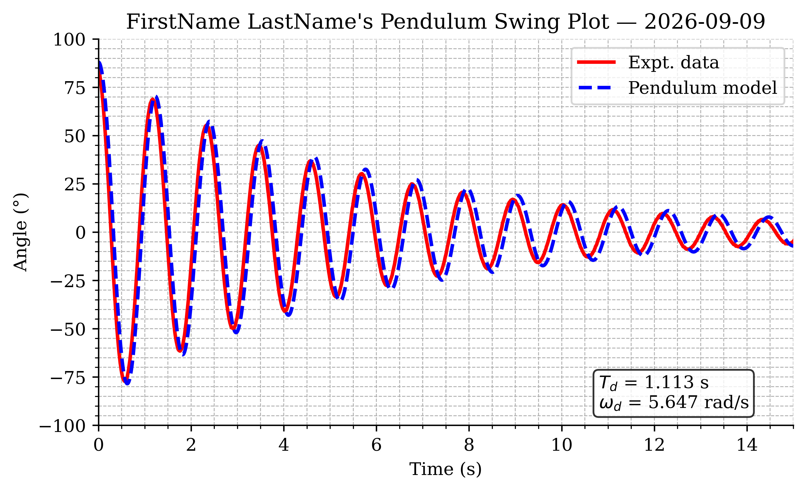{#fig-example-swing width="6.5in"}



## Post-Lab Assignment

Following the lab, upload your submissions to Canvas. [**Post-labs are due Mondays at 10:00 pm.**]{.underline} A full example solution notebook will be posted after all lab sections have met — use it to check your approach, but the work you submit must be your own.

### Submission Items

- Your final **.ipynb** notebook file (`FirstName_LastName_Lab02.ipynb`), restarted and run top-to-bottom
- Your calibration plot in **.pdf** format
- Your pendulum swing plot with model overlay in **.pdf** format
- Answers to the post-lab questions on Canvas

### Calibration Plot Requirements

- Figure size: 6.5" wide × 4.0" tall; white background
- All text in Times font; 10–12 pt
- Major and minor grids on; top and right spines removed
- Calibration data: red circle markers, size 75
- Linear fit: solid blue line, 2 pt
- 95% CI lines: dashed black, 1 pt
- Legend placed so it does not cover data
- Axis labels with units; title "FirstName LastName's Calibration Plot" with the date
- Text annotation (via `ax.text`, 4 decimal places, with units): calibration equation, norm of residuals, $s_{yx}$, and $S_{a_1}$

### Swing Plot Requirements

- Figure size: 6.5" wide × 4.0" tall; white background
- All text in Times font; 10–12 pt
- Major and minor grids on; top and right spines removed
- Experimental data: solid red line, 2 pt
- Tuned model: dashed blue line, 2 pt
- Time axis starts at the release ($t = 0$); set y-limits to about ±100°
- Legend, axis labels with units; title "FirstName LastName's Pendulum Swing Plot" with the date
- Text annotation (via `ax.text`): measured $T_d$ (s) and $\omega_d$ (rad/s)

### Post-Lab Questions

Be prepared to answer the following (make sure you can answer these before leaving lab!):

1.  Report your calibration equation, with units on both coefficients.
2.  What are your norm of residuals and $s_{yx}$? What do they tell you about your calibration quality?
3.  What values of `L`, `zeta`, and `theta0` gave the best model agreement? How does the tuned `L` compare to your measured length?
4.  Give two physical reasons why the simple pendulum model deviates from your measured data.

## Before You Leave

- Remove all jumper wires from the breadboard and return them to the wire bin, sorted by color; discard any damaged wires.
- Disconnect the pendulum leads and set the apparatus back at its station.
- Return the DMM, protractor, and tools to their designated locations.
- Confirm your data files have finished syncing to OneDrive — check on your phone or a second device.
- Make sure **both** partners have access to all data files and the notebook.
- Make sure the station is clean, collect your belongings, and log off the computer.