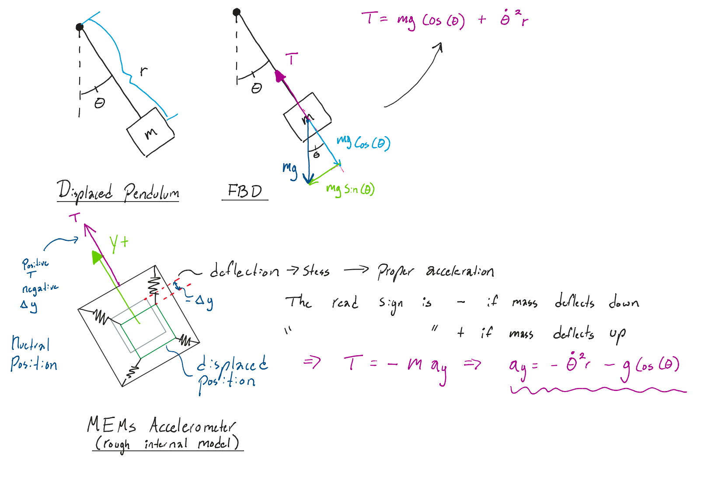
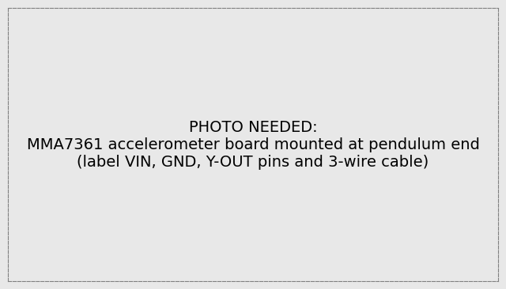
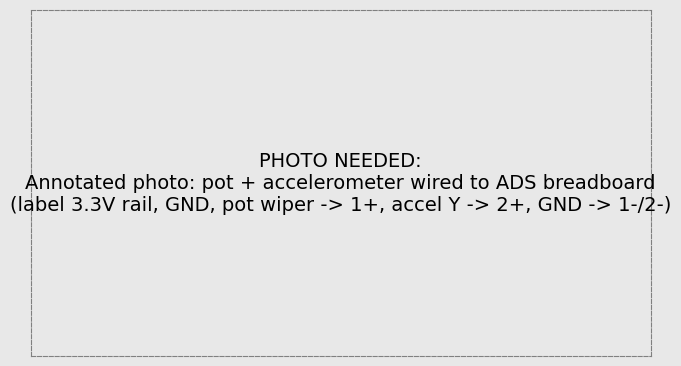
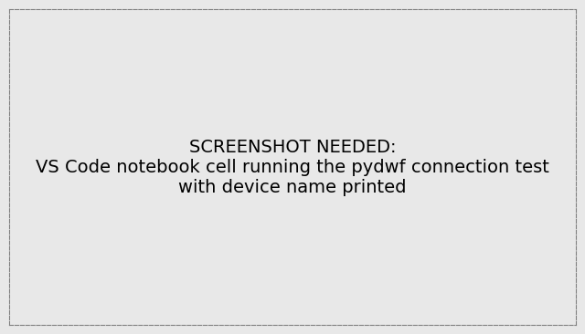
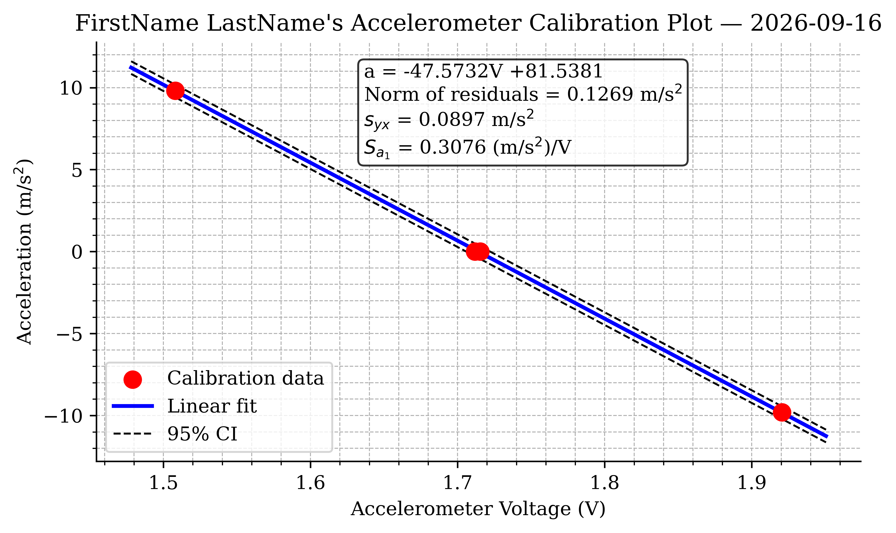
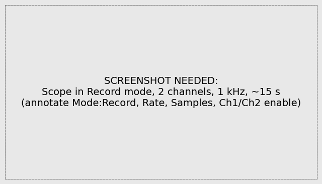
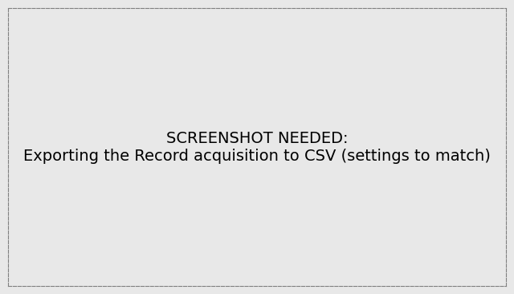



## Learning Objective

### Objectives

Your objectives for this laboratory session are to:

- Measure using **two sensors at once**: the Lab 02 potentiometer plus a MEMS accelerometer, acquired on two differential channels
- Write your **first Python automation** of the ADS using `pydwf`, to replace a repetitive GUI task (a multi-point calibration) with a script
- **Calibrate a MEMS accelerometer** using gravity as the reference, via a four point calibration
- **Reuse a saved calibration**: load your Lab 02 potentiometer coefficients from file instead of re-calibrating
- Use the WaveForms Scope **Record mode** to capture a long, fast (1 kHz), two-channel recording
- Compute angular velocity by **numerical differentiation** (`np.gradient`) and understand why differentiation amplifies noise
- **Cross-check a measurement two independent ways**: compare normal acceleration measured by the accelerometer against $-\dot{\theta}^2 r$ calculated from the differentiated angle signal

### Check Your Understanding

By the end of this lab, you should be able to answer all of these questions.

#### Hardware & Instruments

- What does a MEMS accelerometer actually measure? Why does a *stationary* accelerometer read ±9.81 m/s² instead of zero?
- How / why can gravity serve as a calibration reference for an accelerometer?
- Why do both ADS channels need their (−) input referenced (to GND) in this circuit?
- What is the difference between the Scope's normal acquisition and **Record mode**? When do you need Record?
- Why must WaveForms be closed before a `pydwf` script can run?

#### Programming

- What does a `while` loop do, and how does `break` exit one? Why does DAQ code poll a status flag in a loop?
- What does `input()` do, and why is it useful in an acquisition script?
- How does `zip` let you loop over two lists in parallel? What does `.append` do?
- What is the difference between `np.diff` (Lab 02) and `np.gradient`? Why does `np.gradient` return the same number of points as its input?
- How do you load a saved calibration file whose header line starts with `#`?
- Which `pydwf` object corresponds to the WaveForms Scope? To the Supplies?

#### Data Analysis

- Why is the accelerometer's raw signal a *combination* of normal acceleration and gravity? How do you separate them?
- Why is acceleration calculated from the differentiated angle much noisier than the directly measured acceleration?
- Why do we record the swing at 1000 Hz here, when 100 Hz was fine in Lab 02?
- When two independent measurements of the same quantity disagree, what kinds of error should you suspect?



## Pre-Lab Setup

You should come to lab having completed all tasks in this section.

### Extend Your Folder Structure

Add a Lab_03 folder set to your `ME3300` folder:

``` text
ME3300/
├── Lab_01/
├── Lab_02/
├── Lab_03/
│   ├── Code/
│   │   ├── Lab03_Prelab_Walkthrough.ipynb
│   │   └── FirstName_LastName_Lab03.ipynb
│   ├── Data/
│   └── Figures/
```

### Add the pydwf Package

This lab introduces `pydwf` (**PY**thon **D**iligent **W**ave**F**orms), the Python interface to the WaveForms SDK. Add it to your course environment: open a terminal in your `ME3300` folder and run

``` bash
uv add pydwf
```

You can verify the install with `uv run python -c "import pydwf; print(pydwf.__version__)"`. Note that `pydwf` talks to the same WaveForms *runtime* the GUI uses, so having WaveForms installed (Lab 01) is required.

::: callout-note
## What is an SDK?

An SDK (Software Development Kit) is a software toolbox that provides the necessary tools, code, and documentation to write code for a program (in this case WaveForms)
:::

### Read the Background Section

Read the [Background](#sec-background) section before lab. It explains what the accelerometer measures, derives the gravity-correction equation you will implement, and introduces our new pydwf package.

### Complete the Prelab Walkthrough Notebook {#sec-prelab-walkthrough}

Download `Lab03_Prelab_Walkthrough.ipynb` from Canvas into `ME3300/Lab_03/Code/` and work through it before lab. It introduces this lab's *new* Python skills using simulated signals:

- `while` loops, `break`, and the status-polling pattern DAQ code uses
- pausing a script for the user with `input()`
- building lists with `.append` and looping over pairs with `zip`
- numerical differentiation with `np.gradient` (and how it differs from `np.diff`)
- combining arrays into columns with `np.column_stack`
- loading files with `#` header lines using `np.loadtxt(..., comments='#')`

As always, working through the prelab will allow you to answer the **checkpoint** questions in the **Prelab quiz on Canvas** before your lab session.

### Python Quick Reference: New This Lab

| Task | Python command |
|------------------------------------|------------------------------------|
| Loop until a condition | `while True:` ... `if done: break` |
| Pause for the user | `input('Press Enter to continue...')` |
| Grow a list | `values = []` then `values.append(x)` |
| Loop over pairs | `for pos, accel in zip(positions, known_accel):` |
| Derivative (same length as input) | `np.gradient(theta, dt)` |
| Stack arrays as columns | `np.column_stack([t, x, y])` |
| Load CSV, skipping `#` lines | `np.loadtxt('file.csv', delimiter=',', comments='#')` |
| Open the ADS from Python | `with openDwfDevice(dwf) as device:` |

: New Python syntax and functions introduced in Lab 03

| WaveForms GUI instrument       | pydwf object       |
|--------------------------------|--------------------|
| Scope / Logger (analog inputs) | `device.analogIn`  |
| Wavegen (signal generator)     | `device.analogOut` |
| Supplies (power)               | `device.analogIO`  |
| Static I/O (digital pins)      | `device.digitalIO` |

: The pydwf device model: every GUI instrument is an object in code



## Laboratory Introduction

In Lab 02 you completed the full measurement chain for one sensor: *build, verify, calibrate, measure, model*. This lab scales that chain up in three directions.

- **Two sensors, two channels.** You will measure the pendulum's angle (potentiometer, Channel 1) and the acceleration at its tip (MEMS accelerometer, Channel 2) *simultaneously*. Multichannel measurement is the norm in real experiments as one signal alone rarely tells the whole story.
- **Your first DAQ automation.** The accelerometer calibration requires holding the pendulum in four orientations and recording each one. In Lab 02 you did this kind of repetitive record–export–rename loop by hand, eleven times. This week, you will use a short `pydwf` script to handle that repetition for you: it prompts you for each position, records, and averages, all in one run. This is the course's automation philosophy from here forward: **use the GUI where it makes sense** (one-off captures, live exploration) **and Python where tasks repeat**. By Lab 10, you will be able to script complete experiments, which is a skill that carries directly into capstone and industry work.
- **Independent cross-checks.** You will determine the pendulum tip's normal acceleration in two independent ways — measured directly by the accelerometer, and calculated from the differentiated potentiometer angle — and compare them. Agreement between independent methods is one of the strongest forms of experimental evidence and a means of validating measurement systems. *Disagreement* informs you about noise, and correctness of modeling assumptions.

## Background {#sec-background}

### Normal Acceleration of a Rotating Point

For rotation about a fixed axis, a point at radius $r$ from the pivot has a **normal acceleration** directed from the point toward the pivot:

$$a_n = -\dot{\theta}^2 r$$ {#eq-normal-accel}

where $\dot\theta$ is the angular velocity in rad/s. The minus sign reflects the accelerometer's sign convention which may seem counter intuitive, but is a results of the accelerometer's **+y axis direction pointing from the sensor toward the pivot** and the way in which accelerometer's "feel" **proper acceleration** (The next section will illustrate that we mean here).\
You will measure $\dot\theta$ by numerically differentiating the potentiometer angle, and estimating $r$ with a tape measure (pivot to accelerometer center).

### What the Accelerometer Measures

The MEM's accelerometer (You will have either a model [MMA7361LC](https://www.pololu.com/product/1251/resources), or a [NEED to find the new model!!!](www.notasite.com)), mounted at the pendulum tip; see @fig-accel-board) contains a microscopic proof mass on silicon springs. It measures [**proper acceleration**](https://en.wikipedia.org/wiki/Proper_acceleration) which represents the actual mechanical forces acting on the sensor's internal proof mass.

The important distinction in this context is that gravity itself does not cause "proper acceleration"; rather, it is the physical stiffness of the MEM's suspension springs that push/pull to hold the internal proof mass in the internal housing.

A few key cases:

- A stationary accelerometer with its +y axis pointing straight up reads $+9.81$ $m/s^2$, not zero, as the springs must hold the proof mass up against gravity.
- In free fall, the accelerometer measures $0$ $m/s^2$ because there are no mechanical forces acting on the sensor, even though it is accelerating downward from an observer's perspective (coordinate acceleration)
- In our swinging pendulum, the gravity force acts in both x and y directions depending on the position of the pendulum, but normal acceleration is always negative in the accelerometer frame of reference, since the proof mass deflects down.

For our swinging pendulum, the y-axis sensed acceleration is thus:

$$a_y = \underbrace{-\dot{\theta}^2 r}_{\text{normal accel.}} \; \underbrace{-\, g\cos\theta}_{\text{gravity component}}$$ {#eq-accel-reading}

where $\theta$ is the pendulum angle measured from straight down. The gravity term follows from the free-body diagram in @fig-gravity-fbd: the component of $g$ along the +y direction (tip toward pivot) is $g\cos\theta$ — largest in magnitude when hanging straight down ($\theta = 0$), zero when horizontal. In Part 5, you will *subtract* this term from the measured signal to isolate the normal acceleration @eq-normal-accel.

{#fig-gravity-fbd width="100%"}

### Gravity as a Calibration Reference

Equation @eq-accel-reading also hands us a nice calibration standard. When the pendulum is held *still*, $\dot\theta = 0$ and the sensor should feel only the gravity component — which we know exactly at four easy-to-set orientations:

{#fig-orientations width="100%"}

The sensor output voltage is linear in acceleration, so as in Lab 02 a linear calibration

$$a = -a_1 V + a_0$$ {#eq-accel-cal}

is appropriate, now mapping volts to $m/s^2$ instead of degrees. These four points spanning ±1 g are enough to pin down the fit line, and the fit-quality statistics are computed exactly as in Lab 02 (norm of residuals, $s_{yx}$, 95% CI, $S_{a_1}$), just with different units.

### From GUI to Code: the pydwf Device Model

`pydwf` exposes every WaveForms instrument as a Python object (see the quick-reference table above). Setting a sample rate in code, `ai.frequencySet(1000)`, does *exactly* what typing 1000 Hz into the GUI does — same instrument, same hardware, different interface. You drove these instruments via the WaveForms GUI by hand in Lab 02, so none of this is magic; it is the same knobs, turned programmatically. One consequence: **only one program can talk to the ADS device at a time**, so WaveForms must be closed before a pydwf script runs (and vice versa).



## Part-1: Build the Two-Sensor Circuit {#sec-part-1}

Your guides are the annotated photos in @fig-accel-board and @fig-circuit-build. The potentiometer circuit is identical to Lab 02; the accelerometer adds three wires.

{#fig-accel-board width="70%"}

{#fig-circuit-build width="100%"}

| Connection             | ADS pin    | Purpose                         |
|------------------------|------------|---------------------------------|
| Pot V+ end terminal    | 3.3 V (V+) | Divider supply (Lab 02)         |
| Pot GND end / Signal − | GND        | Divider ground                  |
| Pot wiper              | **1+**     | Angle signal                    |
| GND rail               | **1−**     | Ch. 1 reference                 |
| Accel VIN (red)        | 3.3 V rail | Sensor supply (shared with pot) |
| Accel GND (black)      | GND rail   | Sensor ground                   |
| Accel Y-OUT (signal)   | **2+**     | Acceleration signal             |
| GND rail               | **2−**     | Ch. 2 reference                 |

1.  Re-wire the potentiometer exactly as in Lab 02 and confirm with your DMM that the wiper voltage varies smoothly over the swing range. (Sudden jumps? Same grub-screw fix as Lab 02 — ask your TA.)
2.  Add the accelerometer connections per the table. The accelerometer board has X, Y, and Z outputs; **only the Y axis is used** — it is the axis aligned with the pendulum arm, pointing toward the pivot.
3.  Enable the 3.3 V supply (Supplies instrument, as in Lab 02) and verify with your DMM: supply at the accelerometer VIN pin, and a Y-OUT voltage that *changes* as you slowly rotate the pendulum.

::: {.callout-important title="Logbook Questions"}
**Q1.** Measure and record: the Y-OUT voltage with the pendulum hanging straight down, and pointing straight up. Are they symmetric about the mid-supply voltage? What acceleration does each correspond to?

**Q2.** Measure the distance $r$ from the pivot axis to the center of the accelerometer package with the tape measure. Record it in meters — you will need it in Part 5.

**Q3.** The pendulum swings through ±90°. The accelerometer y-axis senses the *normal* direction. Using @fig-gravity-fbd, explain in a sentence why the y-axis (not x or z) is the right output to compare with @eq-normal-accel.
:::



## Part-2: First Contact with pydwf {#sec-part-2}

Open your notebook `FirstName_LastName_Lab03.ipynb` (kernel: your `.venv`). A starter notebook is on Canvas as usual.

::: {.callout-warning title="Close WaveForms first!"}
The ADS accepts only one controlling program at a time. If WaveForms is open, every pydwf call will fail with a device-busy error. Close WaveForms (fully — check the system tray) before running pydwf cells, and close your notebook's device connection before reopening WaveForms.
:::

### Connection Test

``` python
from pydwf import DwfLibrary, DwfState
from pydwf.utilities import openDwfDevice
import numpy as np
import time

dwf = DwfLibrary()

with openDwfDevice(dwf) as device:
    print("Connected to:", device.name)
```

The `with ... as device:` block should look familiar — it is the same *context manager* pattern `pandas` uses internally for files: the device is opened at the top of the block and **automatically closed** when the block exits, even if your code errors partway through. That auto-close matters here: a crashed script that leaves the device claimed would lock you out until you unplug it.

Run the cell. If it prints a device name, you are connected (see @fig-pydwf-test). If it errors, check that WaveForms is closed and the USB cable is seated, then ask your TA.

{#fig-pydwf-test width="100%"}

### A Single-Channel Read

Now read real voltage. With your circuit powered, this cell records 2 seconds of the potentiometer channel and prints statistics:

``` python
fs       = 1000                 # sample rate (Hz)
duration = 2.0                  # seconds
n        = int(fs * duration)   # number of samples

with openDwfDevice(dwf) as device:
    ai = device.analogIn            # the Scope/Logger instrument

    ai.channelEnableSet(0, True)    # enable channel 1 (pydwf counts from 0)
    ai.channelRangeSet(0, 5.0)      # +/-5 V input range
    ai.frequencySet(fs)             # sample rate
    ai.bufferSizeSet(n)             # how many samples to capture

    ai.configure(False, True)       # arm and start the acquisition

    while True:                     # poll until the buffer is full
        status = ai.status(True)
        if status == DwfState.Done:
            break
        time.sleep(0.01)

    volts = np.array(ai.statusData(0, n))
    print(f"mean = {volts.mean():.4f} V, std = {volts.std(ddof=1):.4f} V")
```

Two things here are new Python (both practiced in the prelab):

- **The `while True:` polling loop.** Data acquisition takes time — 2 seconds, here — and the script must *wait* for the hardware to finish. The loop asks the device for its status over and over; when the status becomes `Done`, **`break`** exits the loop and the code continues to collect the data. The `time.sleep(0.01)` keeps the loop from hammering the USB connection thousands of times per second. This wait-until-ready pattern appears in virtually all instrument-control code you will ever write.
- **Channel numbering.** pydwf counts channels from 0, so GUI "Channel 1" is `0` in code and "Channel 2" is `1`. This off-by-one is the single most common pydwf wiring bug — label your notebook cells clearly.

::: {.callout-important title="Logbook Questions"}
**Q4.** Rotate the pendulum to a few angles and re-run the cell. Does the mean track your Lab 02 calibration's predictions? What is the std of the reading at a fixed angle, and what does it tell you about the ADS noise floor?
:::



## Part-3: Automated Accelerometer Calibration {#sec-part-3}

Here is the payoff of scripting. The calibration needs four held-orientation recordings (@fig-orientations). Instead of four manual record–export–load cycles, one script prompts you through all four and computes the means directly.

### Acquire the Four Calibration Points

``` python
positions   = ['right', 'up', 'left', 'down']
known_accel = [0.0, 9.81, 0.0, -9.81]     # m/s^2, from Fig. 4
mean_voltages = []                         # empty list, filled in the loop

fs, duration = 20, 10.0                    # 20 Hz for 10 s per hold
n = int(fs * duration)

with openDwfDevice(dwf) as device:
    ai = device.analogIn
    ai.channelEnableSet(1, True)           # accelerometer on channel 2 -> index 1
    ai.channelRangeSet(1, 5.0)
    ai.frequencySet(fs)
    ai.bufferSizeSet(n)

    for pos, accel in zip(positions, known_accel):
        input(f"Hold pendulum '{pos}' ({accel:+.2f} m/s^2), then press Enter...")

        ai.configure(False, True)
        while ai.status(True) != DwfState.Done:
            time.sleep(0.05)

        volts = np.array(ai.statusData(1, n))
        mean_voltages.append(volts.mean())
        print(f"  {pos}: {mean_voltages[-1]:.4f} V")

mean_voltages = np.array(mean_voltages)

# Save the raw calibration table for your records
np.savetxt('../Data/accel_calibration_data.csv',
           np.column_stack([known_accel, mean_voltages]),
           header='accel_m_per_s2,voltage_V', delimiter=',')
```

New syntax, in the order it appears:

- **`mean_voltages = []` and `.append(...)`** — a *list* you grow one element at a time. In Lab 02 you pre-allocated a NumPy array with `np.zeros` and filled slots by index; a list plus `append` is the more natural choice when results simply arrive one after another. The `np.array(...)` at the end converts it for math.
- **`zip(positions, known_accel)`** — loops over two lists *in parallel*, handing you one matched pair (`pos`, `accel`) per pass. Compare with `enumerate`, which pairs each element with its *index*; `zip` pairs elements with *each other*.
- **`input(...)`** — prints a prompt and **pauses the script** until you press Enter. That pause is what turns this from a program into a *procedure*: the script does the recording and bookkeeping; you do the physical positioning. (In VS Code notebooks the prompt appears in a box at the top of the window.)
- **`np.column_stack([...])`** — glues equal-length arrays side-by-side into columns, ready for `np.savetxt`. This is how you will save multi-column results all semester.

::: {.callout-important title="Logbook Questions"}
**Q5.** Copy the four mean voltages into a table in your logbook alongside the known accelerations. Are 'right' and 'left' nearly equal? Should they be?

**Q6.** In one sentence: what did the script automate, and what did it leave to you? Why is this a sensible division of labor?
:::

### Fit and Plot the Calibration

Nothing new here — this is Lab 02's calibration analysis with different units. Fit @eq-accel-cal with `np.polyfit` (voltage in, acceleration out), compute the norm of residuals, $s_{yx}$, the 95% CI (with $\nu = N - 2 = 2$ — note how few degrees of freedom four points leave!), and $S_{a_1}$, then build the calibration plot to match @fig-example-cal. Annotate the equation and fit statistics with units, save **.pdf** and **.png** at 600 DPI, and save the coefficients:

``` python
np.savetxt('../Data/accel_calibration_coeffs.csv', coeffs_acc,
           header='a1 ((m/s^2)/V), a0 (m/s^2)', delimiter=',')
```

::: {.callout-important title="Logbook Questions"}
**Q7.** Record your accelerometer calibration equation with units. With $\nu = 2$, the Student's t-value is large ($t_{2,95\%} = 4.303$). What does that say about the confidence you can claim from a four-point calibration, and what would adding intermediate orientations buy you?
:::

### Example Result

{#fig-example-cal width="6.5in"}



## Part-4: Record the Swing (Scope Record Mode) {#sec-part-4}

The swing capture is a *one-off* task, so the GUI is the right tool. But it is also a demanding capture — two channels for \~15 seconds at 1000 Hz — which exceeds what the Logger (built for slow trend logging) or a single Scope buffer can hold. WaveForms' **Record mode** streams samples to the computer for exactly this situation.

Why 1000 Hz, when 100 Hz resolved the swing fine in Lab 02? Because this week you will **differentiate** the angle signal. Differentiation is exquisitely sensitive to how well the samples trace the true curve; a densely-sampled signal gives the difference quotient a fighting chance. (It also multiplies file size ×10 — engineering is trade-offs.)

1.  Close your notebook's device connection (re-run any cell *outside* a `with` block, or restart the kernel) and open **WaveForms**.
2.  Open **Scope**, enable **both channels** (Ch1 pot, Ch2 accel), range ±5 V.
3.  Switch the acquisition **Mode** to **Record**, set **Rate** to 1 kHz and the sample count for \~15 s; match @fig-record-setup.
4.  One partner holds the pendulum at **+90°**; start the recording; release smoothly after a second or two; let it ring down.
5.  Stop, then **File → Export** the record as CSV to `ME3300/Lab_03/Data/FirstName_LastName_Lab03_Swing.csv`; match @fig-record-export. Open it in VS Code: confirm three columns (time, Ch1, Ch2) and count the `#` header lines for `skiprows`.

{#fig-record-setup width="100%"}

{#fig-record-export width="70%"}

::: {.callout-important title="Logbook Questions"}
**Q8.** Approximately how many samples does this capture produce, and how large is the CSV file? Compare with your Lab 02 swing file.
:::



## Part-5: Post-Process — Two Roads to Normal Acceleration {#sec-part-5}

Back in your notebook (close WaveForms again if you reopen the device — though this part needs no hardware).

### Load Both Calibrations and the Swing

You calibrated the potentiometer *last week*. Good calibrations are assets — load, don't redo:

``` python
# Saved calibrations: '#' header lines are skipped via comments='#'
pot_coeffs = np.loadtxt('../../Lab_02/Data/calibration_coeffs.csv',
                        delimiter=',', comments='#')   # [deg/V, deg]
acc_coeffs = np.loadtxt('../Data/accel_calibration_coeffs.csv',
                        delimiter=',', comments='#')   # [(m/s^2)/V, m/s^2]

import pandas as pd
swing = pd.read_csv('../Data/FirstName_LastName_Lab03_Swing.csv', skiprows=6)
t_raw = swing.iloc[:, 0].values
v_pot = swing.iloc[:, 1].values
v_acc = swing.iloc[:, 2].values

angle_deg = np.polyval(pot_coeffs, v_pot)   # volts -> degrees
accel_ms2 = np.polyval(acc_coeffs, v_acc)   # volts -> m/s^2
```

`np.loadtxt(..., comments='#')` is the counterpart to the `header='...'` you passed `np.savetxt`: lines starting with `#` are treated as comments and skipped automatically. (As always: `skiprows` for the swing file must match *your* export — open it and count.)

::: {.callout-important title="Logbook Questions"}
**Q9.** Why is loading last week's calibration legitimate here — and what changes to the setup *would* force you to re-calibrate? Name two.
:::

### Trim to the Release — a Better Detector

In Lab 02 you found the release by thresholding `np.diff` of the voltage. **At 1000 Hz that method breaks**: with 10× more samples, the *change per sample* shrinks by 10× while the noise per sample stays the same — so the release-induced steps hide below the noise floor. Instead of detecting *change between samples*, detect *departure from the held position*:

``` python
hold_mean = angle_deg[:500].mean()       # average angle during the hold
moved = np.abs(angle_deg - hold_mean) > 2.0    # more than 2 degrees away
idx0  = np.argmax(moved)                 # first True = release

t     = t_raw[idx0:] - t_raw[idx0]
theta = np.radians(angle_deg[idx0:])     # radians from here on
a_meas = accel_ms2[idx0:]
```

Same `np.argmax`-on-a-boolean-array trick as Lab 02 — only the *condition* is smarter. A 2° threshold is far above the angle noise but far below the swing amplitude, so it cannot misfire. This is a general lesson: **detection thresholds must be designed against the noise level**, and a detector that worked at one sample rate can fail at another.

### Compute Both Normal Accelerations

``` python
r  = 0.216            # m — YOUR measured pivot-to-accelerometer distance (Q2)
g  = 9.81
dt = t[1] - t[0]

# Road 1: from the differentiated angle (Eq. 1)
theta_dot = np.gradient(theta, dt)       # angular velocity (rad/s)
a_calc    = -(theta_dot**2) * r

# Road 2: from the accelerometer, gravity removed (Eq. 2 rearranged)
a_meas_n  = a_meas + g * np.cos(theta)
```

- **`np.gradient(theta, dt)`** computes the derivative using *central* differences — each point's slope uses its neighbors on both sides — and returns an array the **same length** as the input (unlike `np.diff`, which is one short and half a sample shifted). That makes it the right tool whenever the derivative must line up sample-for-sample with other signals, as here.
- The gravity removal is @eq-accel-reading solved for the normal term: $-\dot\theta^2 r = a_y + g\cos\theta$. Note it uses $\theta$ from the *potentiometer* — the two sensors literally cooperate in this correction.

::: {.callout-important title="Logbook Questions"}
**Q10.** Derive the gravity-removal line yourself: starting from @eq-accel-reading, show the algebra that isolates $-\dot\theta^2 r$. Sketch the FBD (@fig-gravity-fbd) in your logbook as part of the derivation.
:::

### Plot the Comparison

Build the comparison figure to match @fig-example-comp. **Plot the noisier signal first** (`a_calc`, blue) so the cleaner accelerometer trace stays visible on top — a small trick that makes crowded plots readable. Annotate, format per the Post-Lab requirements, and save **.pdf**/**.png** at 600 DPI.

::: {.callout-important title="Logbook Questions"}
**Q11.** Which signal is noisier, and *why*? Connect your answer to the differentiation step and the sample rate.

**Q12.** At what pendulum angle and time is the normal acceleration largest in magnitude? Does that match your physical intuition for where the pendulum moves fastest?

**Q13.** The two signals will not agree perfectly. List at least two physical (not noise) reasons — think sensor mounting alignment, the measured $r$, calibration errors, and the assumptions behind @eq-normal-accel.
:::

### Example Result

{#fig-example-comp width="6.5in"}



## Post-Lab Assignment

Upload your submissions to Canvas. [**Post-labs are due Mondays at 10:00 pm.**]{.underline} A full example solution notebook is posted after all sections have met; check your approach against it, but submit your own work.

### Submission Items

- Your final **.ipynb** notebook (`FirstName_LastName_Lab03.ipynb`), restarted and run top-to-bottom (acquisition cells may show their saved outputs)
- Accelerometer calibration plot, **.pdf**
- Normal acceleration comparison plot, **.pdf**
- Answers to the post-lab questions on Canvas

### Calibration Plot Requirements

- Figure size: 6.5" wide × 4.0" tall; white background; Times font, 10–12 pt
- Major and minor grids on; top and right spines removed
- Calibration data: red circle markers, size 75
- Linear fit: solid blue, 2 pt; 95% CI: dashed black, 1 pt
- Axis labels with units; title "FirstName LastName's Accelerometer Calibration Plot" with the date
- `ax.text` annotation (4 decimals, units): calibration equation, norm of residuals, $s_{yx}$, $S_{a_1}$

### Comparison Plot Requirements

- Figure size: 6.5" wide × 4.0" tall; white background; Times font, 10–12 pt
- Major and minor grids on; top and right spines removed
- Calculated signal ($-\dot\theta^2 r$): blue line, 1 pt, drawn **first**
- Measured signal (gravity-removed accelerometer): red line, 1.5 pt, drawn on top
- Time axis starts at release ($t=0$); legend placed clear of the data
- Axis labels with units; title "FirstName LastName's Normal Acceleration Plot" with the date

### Post-Lab Questions

1.  Report your accelerometer calibration equation with units, and its norm of residuals and $s_{yx}$.
2.  What pydwf call sets the sample rate, and what is its GUI equivalent?
3.  Why does the gravity-subtraction step matter? Describe what your comparison plot would look like without it.
4.  Why is the calculated normal acceleration noisier than the measured one? Would recording at 100 Hz have made it better or worse? Explain.
5.  Which of the two methods do you trust more, and why?

## Before You Leave

- Show your comparison plot to a TA before tearing down — it is much easier to re-record now than next week.
- Remove all jumper wires and return them to the wire bin, sorted by color; discard damaged wires.
- Disconnect both sensor leads and return the apparatus, DMM, and tools to their stations.
- Confirm your data files have synced to OneDrive (check on a second device) and that **both** partners have everything.
- Clean the station, collect your belongings, and log off.