

## Learning Objective

### Objectives

Your objectives for this laboratory session are to:

- Measure using **two sensors at once**: the Lab 02 potentiometer plus a MEMS accelerometer, acquired on two differential channels
- Write your **first Python automation** of the ADS using `dwfpy`, to replace a repetitive GUI task (a multi-point calibration) with a script
- **Calibrate a MEMS accelerometer** using gravity as the reference, via a four point calibration
- **Reuse a saved calibration**: load your Lab 02 potentiometer coefficients from file instead of re-calibrating
- Use the WaveForms Scope **Record mode** to capture a long, fast (1 kHz), two-channel recording
- Compute angular velocity by **numerical differentiation** (`np.gradient`) and understand why differentiation amplifies noise
- **Cross-check a measurement two independent ways**: compare normal acceleration measured by the accelerometer against $-\dot{\theta}^2 r$ calculated from the differentiated angle signal

### Check Your Understanding

By the end of this lab, you should be able to answer all of these questions.

#### Hardware & Instruments

- What does a MEMS accelerometer actually measure? Why does a *stationary* accelerometer read ±9.81 m/s² instead of zero?
- How / why can gravity serve as a calibration reference for an accelerometer?
- Why do both ADS channels need their (−) input referenced (to GND) in this circuit?
- What is the difference between the Scope's normal acquisition and **Record mode**? When do you need Record?
- Why must WaveForms be closed before a `dwfpy` script can run?

#### Programming

- What does a `with ... as ...:` block do when it exits, and why does that matter when your script has claimed the ADS?
- What does `input()` do, and why is it useful in an acquisition script?
- How does `zip` let you loop over two lists in parallel? What does `.append` do?
- What is the difference between `np.diff` and `np.gradient`? Why does `np.gradient` return the same number of points as its input?
- How do you read a sample's *index* off an interactive plotly figure (Lab 02), and how do you then use it to trim an array?
- How do you load a saved calibration file whose header line starts with `#`?
- Which `dwfpy` object corresponds to the WaveForms Scope? To the Supplies?

#### Data Analysis

- Why is the accelerometer's raw signal a *combination* of normal acceleration and gravity? How do you separate them?
- Why is acceleration calculated from the differentiated angle much noisier than the directly measured acceleration?
- Why do we record the swing at 1000 Hz here, when 100 Hz was fine in Lab 02?
- When two independent measurements of the same quantity disagree, what kinds of error should you suspect?



## Pre-Lab Setup

You should come to lab having completed all tasks in this section.

### Extend Your Folder Structure

Add a Lab_03 folder set to your `ME3300` folder:

``` text
ME3300/
├── Lab_01/
├── Lab_02/
├── Lab_03/
│   ├── Code/
│   │   ├── Lab03_Prelab_Walkthrough.ipynb
│   │   └── FirstName_LastName_Lab03.ipynb
│   ├── Data/
│   └── Figures/
```

### Add the dwfpy Package

This lab introduces `dwfpy` (**D**igilent **W**ave**F**orms for **Py**thon), the Python interface to the WaveForms SDK. Add it to your course environment: open a terminal in your `ME3300` folder and run

``` bash
uv add dwfpy==1.2.0
```

(The `==1.2.0` *pins* the exact version this manual was written against, so everyone's code behaves identically.) You can verify the install with `uv run python -c "import dwfpy; print('dwfpy imported OK')"`. Note that `dwfpy` talks to the same WaveForms *runtime* the GUI uses, so having WaveForms installed (Lab 01) is required.

::: callout-note
## What is an SDK?

An SDK (Software Development Kit) is a software toolbox that provides the necessary tools, code, and documentation to write code for a program (in this case WaveForms)
:::

### Read the Background Section

Read the [Background](#sec-background) section before lab. It explains what the accelerometer measures, derives the gravity-correction equation you will implement, and introduces our new dwfpy package.

### Complete the Prelab Walkthrough Notebook {#sec-prelab-walkthrough}

Download `Lab03_Prelab_Walkthrough.ipynb` from Canvas into `ME3300/Lab_03/Code/` and work through it before lab. It introduces this lab's *new* Python skills using simulated signals:

- the `with ... as ...:` *context manager* pattern that opens (and always closes) the ADS
- pausing a script for the user with `input()`
- building lists with `.append` and looping over pairs with `zip`
- numerical differentiation with `np.gradient` (and how it differs from `np.diff`)
- finding events in a signal with `np.diff`, boolean comparisons, and `np.argmax`
- combining arrays into columns with `np.column_stack`
- loading files with `#` header lines using `np.loadtxt(..., comments='#')`

As always, working through the prelab will allow you to answer the **checkpoint** questions in the **Prelab quiz on Canvas** before your lab session.

### Python Quick Reference: New This Lab

| Task | Python command |
|-------------------------|-----------------------------------------------|
| Open the ADS from Python | `with dwf.Device() as device:` |
| Set up an input channel | `scope['ch1'].setup(range=5.0)` |
| Acquire one buffer of samples | `scope.single(sample_rate=fs, buffer_size=n, configure=True, start=True)` |
| Pull the acquired data | `volts = scope['ch1'].get_data()` |
| Pause for the user | `input('Press Enter to continue...')` |
| Grow a list | `values = []` then `values.append(x)` |
| Loop over pairs | `for pos, accel in zip(positions, known_accel):` |
| Derivative (same length as input) | `np.gradient(theta, dt)` |
| Differences between adjacent samples | `np.diff(x)` (length is `len(x) - 1`) |
| Index of first `True` in a condition | `np.argmax(np.abs(x - x0) > threshold)` |
| Stack arrays as columns | `np.column_stack([t, x, y])` |
| Load CSV, skipping `#` lines | `np.loadtxt('file.csv', delimiter=',', comments='#')` |

: New Python syntax and functions introduced in Lab 03

| WaveForms GUI instrument       | dwfpy object           |
|--------------------------------|------------------------|
| Scope / Logger (analog inputs) | `device.analog_input`  |
| Wavegen (signal generator)     | `device.analog_output` |
| Supplies (power)               | `device.analog_io`     |
| Static I/O (digital pins)      | `device.digital_io`    |

: The dwfpy device model: every GUI instrument is an object in code



## Laboratory Introduction

In Lab 02 you completed the full measurement chain for one sensor: *build, verify, calibrate, measure, model*. This lab scales that chain up in three directions.

- **Two sensors, two channels.** You will measure the pendulum's angle (potentiometer, Channel 1) and the acceleration at its tip (MEMS accelerometer, Channel 2) *simultaneously*. Multichannel measurement is the norm in real experiments as one signal alone rarely tells the whole story.
- **Your first DAQ automation.** The accelerometer calibration requires holding the pendulum in four orientations and recording each one. In Lab 02 you did this kind of repetitive record–export–rename loop by hand. This week, you will use a short `dwfpy` script to handle that repetition for you: it prompts you for each position, records, and averages, all in one run. This is the course's automation philosophy from here forward: **use the GUI where it makes sense** (one-off captures, live exploration) **and Python where tasks repeat**. By Lab 10, you will be able to script complete experiments, which is a skill that carries directly into capstone and industry work.
- **Independent cross-checks.** You will determine the pendulum tip's normal acceleration in two independent ways — measured directly by the accelerometer, and calculated from the differentiated potentiometer angle — and compare them. Agreement between independent methods is one of the strongest forms of experimental evidence and a means of validating measurement systems. *Disagreement* informs you about noise, and correctness of modeling assumptions.

## Background {#sec-background}

### Normal Acceleration of a Rotating Point

For rotation about a fixed axis, a point at radius $r$ from the pivot has a **normal acceleration** directed from the point toward the pivot:

$$a_n = \dot{\theta}^2 r$$ {#eq-normal-accel}

where $\dot\theta$ is the angular velocity in rad/s. Which agrees with the accelerometer's sign convention. The **+y axis direction points from the sensor toward the pivot**

You will measure $\dot\theta$ by numerically differentiating the potentiometer angle, and estimating $r$ with a tape measure (pivot to accelerometer center).

### What the Accelerometer Measures

The MEM's accelerometer, mounted at the pendulum tip; see @fig-accel-pendulum) contains a microscopic proof mass on silicon springs. It measures [**proper acceleration**](https://en.wikipedia.org/wiki/Proper_acceleration "Proper Acceleration Wiki Page") which represents the actual mechanical forces acting on the sensor's internal proof mass.

The important distinction is that gravity itself is not what we measure, but rather rather, the physical compression/expansion of the internal suspension springs.

A few key cases:

- A stationary accelerometer with its +y axis pointing straight up reads $+9.81$ $m/s^2$, not zero, as the springs must hold the proof mass up against gravity.
- In free fall, the accelerometer measures $0$ $m/s^2$ because there are no mechanical forces acting on the sensor, even though it is accelerating downward from an observer's perspective (coordinate acceleration)
- Gravity force acts in both x and y directions depending on the position of the pendulum, but normal acceleration is positive in the accelerometer frame of reference.

For our swinging pendulum, the y-axis sensed acceleration is thus:

$$a_y = \underbrace{\dot{\theta}^2 r}_{\text{normal accel.}} \; \underbrace{\, -g\cos\theta}_{\text{gravity component}}$$ {#eq-accel-reading}

where $\theta$ is the pendulum angle measured from straight down. The gravity term follows from the free-body diagram in @fig-gravity-fbd: the component of $g$ along the +y direction (tip toward pivot) is $g\cos\theta$ — largest in magnitude when hanging straight down ($\theta = 0$), zero when horizontal. In Part 6, you will *subtract* the gravity term from the measured signal to isolate the normal acceleration @eq-normal-accel.

\*\*\* UPDATE FIGURE \*\*\*

{#fig-gravity-fbd width="100%"}

### Gravity as a Calibration Reference

@eq-accel-reading also hands us a nice calibration standard. When the pendulum is held *still*, $\dot\theta = 0$ , the sensor should feel only the gravity component — which we know exactly at four easy-to-set orientations:

\*\*\* Update this figure with ay flipped\*\*\*

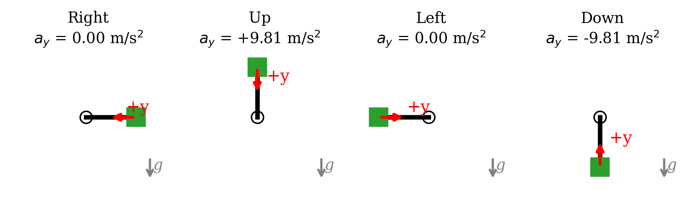{#fig-orientations width="100%"}

The sensor output voltage is linear in acceleration, so as in Lab 02 a linear calibration

$$a_y = a_1 V + a_0$$ {#eq-accel-cal}

is appropriate, now mapping volts to $m/s^2$ instead of degrees. These four points spanning ±1 g are enough to pin down the fit line, and the fit-quality statistics are computed exactly as in Lab 02 (norm of residuals, $s_{yx}$, 95% CI, $S_{a_1}$), just with different units.

### From GUI to Code: the dwfpy Device Model

`dwfpy` exposes every WaveForms instrument as a Python object (see the quick-reference table above). Setting a sample rate in code, `sample_rate=1000`, does exactly what typing 1000 Hz into WaveForms did before — same instruments, same hardware, different interface. The main difference now is that rather than driving the ADS instruments via the GUI by hand, you now will work the same "knobs", programmatically. One important caveat: **only one program/script can talk to the ADS device at a time**, so WaveForms must be closed before a dwfpy script runss.



## Part-1: Build the Two-Sensor Circuit {#sec-part-1}

Build your potentiometer and acclerometer pendulum setup. Use the following annotated figures (@fig-accel-board, @fig-accel-pend and @fig-circuit-build) as guides.

1.  Re-wire the potentiometer exactly as in Lab 02 and confirm with your DMM that the wiper voltage varies smoothly over the swing range.
2.  Add the accelerometer connections. The accelerometer board has X, Y, and Z outputs; **only the Y axis is used**.
3.  Enable the 5 V supply (This time use the 5V switch on the ADS rather than the WaveForms Supplies instrument). Verify with your DMM: supply at the accelerometer VIN pin, and a Y-OUT voltage that *changes* as you rotate the pendulum.

::: callout-note
## Two types of accelerometers

Depending on your station, you will have either a model [MMA7361LC](https://www.pololu.com/product/1251/resources), or a newer [ADXL335](https://www.adafruit.com/product/163). They work nearly identically, but have slightly different pinouts
:::

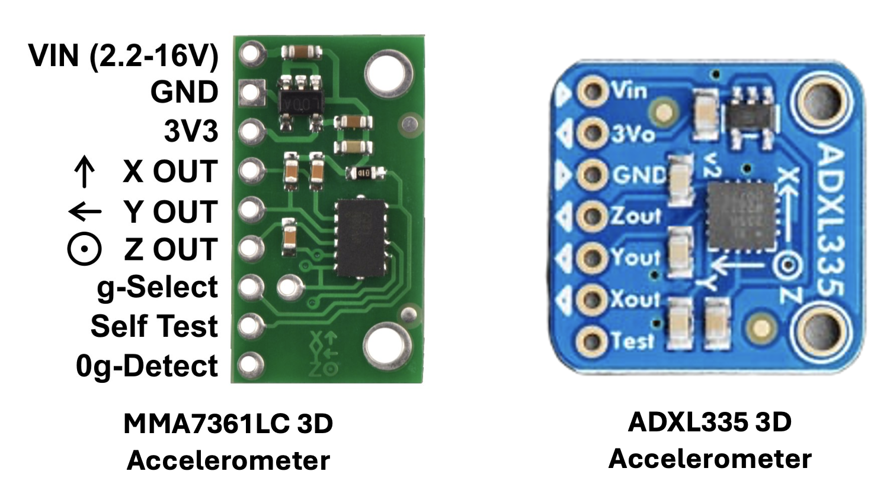{#fig-accel-board width="100%"}

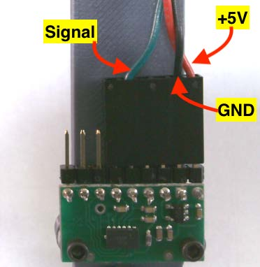{#fig-accel-pend fig-alt="A photo close view of the connections for signal, +5 volts and ground on the accelerometer chip attached to the pendulum."}

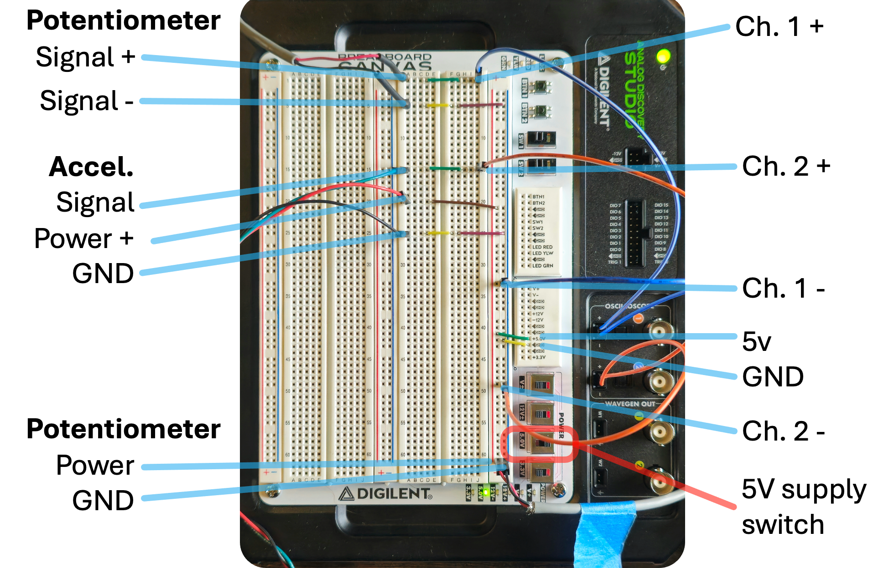{#fig-circuit-build width="100%"}

| Connection             | ADS pin  | Purpose                         |
|------------------------|----------|---------------------------------|
| Pot V+ end terminal    | 5 V (V+) | Divider supply                  |
| Pot GND end / Signal − | GND      | Divider ground                  |
| Pot wiper              | **1+**   | Angle signal                    |
| GND rail               | **1−**   | Ch. 1 reference                 |
| Accel VIN (red)        | 5 V rail | Sensor supply (shared with pot) |
| Accel GND (black)      | GND rail | Sensor ground                   |
| Accel Y-OUT (signal)   | **2+**   | Acceleration signal             |
| GND rail               | **2−**   | Ch. 2 reference                 |

::: {.callout-important title="Logbook Questions"}
**Q.** Measure and record: the Y-OUT voltage with the pendulum hanging straight down, and pointing straight up. What acceleration does each correspond to?

**Q.** Measure the distance $r$ from the pivot axis to the center of the accelerometer package with the tape measure. Record it in meters — you will need it in Part 6.
:::



## Part-2: Verify the Circuit with the Scope {#sec-part-2}

You checked the *wiring* with the DMM in Part 1; now check the *signals*. Before handing any circuit to automation, watch it live in the GUI first: a two-minute Scope check can help you catch wiring mistakes, dead sensors, and incorrect supply settings while they are still easy to find. Debugging through a script means guessing which layer failed — circuit, settings, or code. Checking in the live GUI clears the first two layers before you write a line of code. This should be habit from here forward.

1.  Open **WaveForms** and the **Scope**; enable **both channels** (Ch1 pot, Ch2 accel), range ±5 V, and start a live acquisition.
2.  Rotate the pendulum slowly through its swing range: the Channel 1 and 2 traces should ride smoothly up and down with the motion — no jumps or dropouts.
3.  Hold the pendulum at a few of the @fig-orientations positions: the Channel 2 level should settle at a distinctly different level for each hold.
4.  Compare against @fig-scope-check. When both channels behave, close WaveForms (fully — check the system tray) so the next part can claim the device.

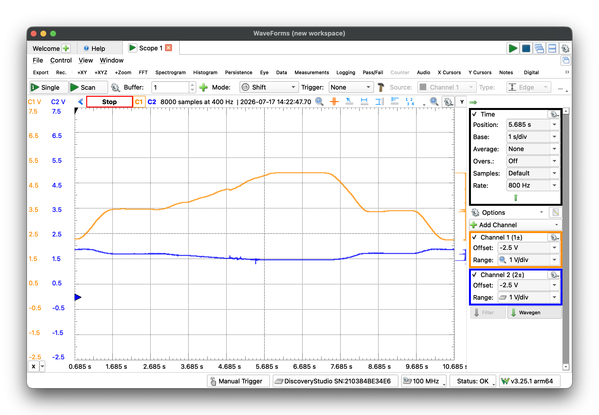{#fig-scope-check width="100%"}

::: {.callout-important title="Logbook Questions"}
**Q.** With the pendulum hanging still, read the DC level of each channel off the Scope. Does Channel 2 agree with your DMM reading? Does Channel 1 sit where your Lab 02 calibration predicts for 0°?
:::

::: callout-tip
## The Scope is a debugging instrument

The DMM and Scope answer "is it wired right?" and "does the signal behave right *over time*?" You should always test circuits using a DMM and Scope before automating.
:::



## Part-3: First Contact with dwfpy {#sec-part-3}

Open your notebook `FirstName_LastName_Lab03.ipynb` (kernel: your `.venv`). A starter notebook is on Canvas as usual.

::: {.callout-warning title="Close WaveForms first!"}
The ADS accepts only one controlling program at a time. If WaveForms is open, every dwfpy call will fail with a device-busy error. Close WaveForms before running dwfpy cells..
:::

### Connection Test

``` python
import dwfpy as dwf
import numpy as np

with dwf.Device() as device:
    print("Connected to:", device.name)
```

The `with ... as ...:` block is a pattern frequently used in Python to create a **context manager** which essentially opens a resource and guarantees it gets closed at the end of a process, even if your code errors out partway through. This is actually the same mechanism pandas relies on internally whenever it reads a file — pd.read_csv() opens the file handle, reads it, and closes it before handing you a DataFrame, success or failure. Here, the "resource" being managed is the ADS device itself, and the auto-close matters for a concrete reason: without it, if a script crashes while holding the device open, the device stays locked and you would need to unplug it to regain access.

Run your connection test cell. If it prints a device name, you are connected (see @fig-dwfpy-test). If it errors, check that WaveForms is closed and the USB cable is seated, then ask your TA.

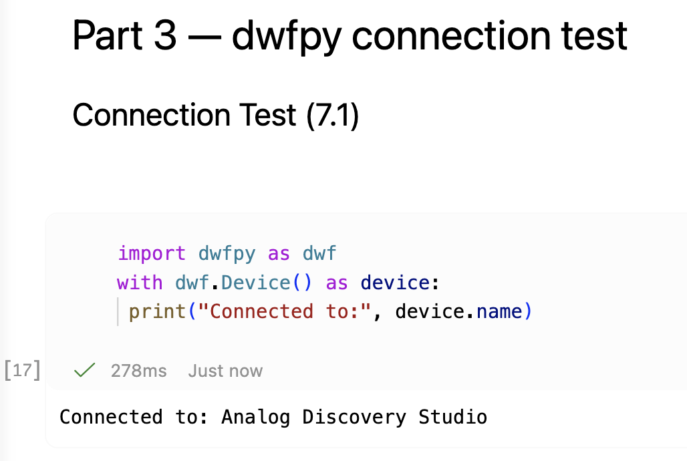{#fig-dwfpy-test fig-alt="Code snip showing a successful connection to the ADS using dwfpy." width="50%"}

### A Single-Channel Read

Now read real voltage. With your circuit powered, this cell records 2 seconds of the potentiometer channel and prints statistics:

``` python
fs       = 1000                 # sample rate (Hz)
duration = 2.0                  # seconds
n        = int(fs * duration)   # number of samples

with dwf.Device() as device:
    scope = device.analog_input          # the Scope/Logger instrument

    scope['ch1'].setup(range=5.0)        # enable Ch. 1, +/-5 V input range

    # Acquire one buffer: set the rate and size, configure, start, and wait
    scope.single(sample_rate=fs, buffer_size=n, configure=True, start=True)

    volts = scope['ch1'].get_data()      # the samples, as a NumPy array
    print(f"mean = {volts.mean():.4f} V, std = {volts.std(ddof=1):.4f} V")
```

Two things here deserve a closer look:

- **The blocking `single(...)` call.** Data acquisition takes time — 2 seconds, here — and the script must *wait* for the hardware to finish. With `start=True`, `scope.single(...)` starts the acquisition and does not return until the buffer is full; under the hood it repeatedly polls the device's status flag until the hardware reports *Done*. Most instrument-control libraries do some version of this wait-until-ready dance. That is why the cell visibly *pauses* for about 2 seconds before printing.
- **Channel names.** dwfpy lets you address channels by the same labels the GUI uses: `scope['ch1']` is GUI Channel 1, `scope['ch2']` is Channel 2. (Integer indexing also works but counts from zero — `scope[0]` is Channel 1.

::: {.callout-important title="Logbook Questions"}
**Q.** Rotate the pendulum to a few angles and re-run the cell. Does the mean track your Lab 02 calibration's predictions?
:::



## Part-4: Automated Accelerometer Calibration {#sec-part-4}

Here is the payoff of scripting. The calibration needs four held-orientation recordings (@fig-orientations). Instead of four manual record–export–load cycles, one script will prompt you through all four and computes the means directly.

### Acquire the Four Calibration Points

``` python
positions   = ['right', 'up', 'left', 'down']
known_accel = [0.0, 9.81, 0.0, -9.81]     # m/s^2, from Fig. 4
mean_voltages = []                         # empty list, filled in the loop

fs, duration = 20, 10.0                    # 20 Hz for 10 s per hold
n = int(fs * duration)

with dwf.Device() as device:
    scope = device.analog_input
    scope['ch2'].setup(range=5.0)          # accelerometer is on Channel 2

    for pos, accel in zip(positions, known_accel):
        input(f"Hold pendulum '{pos}' ({accel:+.2f} m/s^2), then press Enter...")

        scope.single(sample_rate=fs, buffer_size=n, configure=True, start=True)

        volts = scope['ch2'].get_data()
        mean_voltages.append(volts.mean())
        print(f"  {pos}: {mean_voltages[-1]:.4f} V")

mean_voltages = np.array(mean_voltages)

# Save the raw calibration table for your records
np.savetxt('../Data/accel_calibration_data.csv',
           np.column_stack([known_accel, mean_voltages]),
           header='accel_m_per_s2,voltage_V', delimiter=',')
```

New syntax, in the order it appears:

- **`mean_voltages = []` and `.append(...)`** — a *list* you grow one element at a time. In Lab 02 you pre-allocated a NumPy array with `np.zeros` and filled slots by index; a list plus `append` is the more natural choice when results simply arrive one after another. The `np.array(...)` at the end converts it for math.
- **`zip(positions, known_accel)`** — loops over two lists *in parallel*, handing you one matched pair (`pos`, `accel`) per pass. Compare with `enumerate`, which pairs each element with its *index*; `zip` pairs elements with *each other*.
- **`input(...)`** — prints a prompt and **pauses the script** until you press Enter. That pause is what turns this from a program into a *procedure*: the script does the recording and bookkeeping; you do the physical positioning. (In VS Code notebooks the prompt appears in a box at the top of the window.)
  - **`np.column_stack([...])`** — glues equal-length arrays side-by-side into columns, ready for `np.savetxt`. This lets you save multi-column results in one csv.

    | Pendulum Orientation | Schematic | y-axis acceleration $(m/s^2)$ | Average output voltage $(V)$ |
    |----------------|----------------|---------------------|-------------------|
    | Right | 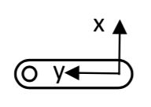{width="1in"} | 0.00 |  |
    | Up | 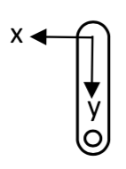{width="0.75in"} | 9.81 |  |
    | Left | 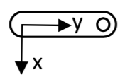{width="1in"} | 0.00 |  |
    | Down | 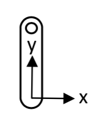{width="0.75in"} | -9.81 |  |

    : Sample Calibration data for acellerometer

::: {.callout-important title="Logbook Questions"}
**Q.** Copy the four mean voltages into a table in your logbook alongside the known accelerations like the illustrated table above. Are 'right' and 'left' nearly equal? Should they be?

**Q.** In one sentence: what did the script automate, and what did it leave to you? Is this a sensible division of labor?
:::

### Fit and Plot the Calibration

Nothing new here — this is Lab 01 and 02's calibration analysis with acceleration units. Fit @eq-accel-cal with `np.polyfit` (voltage in, acceleration out), compute the norm of residuals, $s_{yx}$, the 95% CI (with $\nu = N - 2 = 2$ — note how few degrees of freedom four points leave!), and $S_{a_1}$, then build the calibration plot to match @fig-example-cal. Annotate the equation and fit statistics with units, save **.pdf** and **.png** at 600 DPI, and save your coefficients:

``` python
np.savetxt('../Data/accel_calibration_coeffs.csv', coeffs_acc,
           header='a1 ((m/s^2)/V), a0 (m/s^2)', delimiter=',')
```

::: {.callout-important title="Logbook Questions"}
**Q.** Record your accelerometer calibration equation with units. With $\nu = 2$, the Student's t-value is large ($t_{2,95\%} = 4.303$). What does that say about the confidence you can claim from a four-point calibration, and what would adding intermediate orientations buy you?
:::

### Example Result

{#fig-example-cal width="6.5in"}



## Part-5: Record the Swing (Scope Record Mode) {#sec-part-5}

New you will record a free swing with your calibrated instruments. This swing capture is a *one-off* task, so here the GUI inteface is the right tool. But this will also be a more demanding capture — two channels for \~15 seconds at 1000 Hz — which exceeds what the Logger (built for slow trend logging) or a single Scope buffer can hold. WaveForms' **Record mode** streams samples to the computer for exactly this situation.

Why do we want to use 1000 Hz now, when 100 Hz resolved the swing fine in Lab 02? Because this week you will **differentiate** the angle signal. Differentiation is sensitive to how well the samples trace the true curve; a densely-sampled signal gives the difference quotient a fighting chance. (It also multiplies file size ×10 — engineering is trade-offs.)

1.  Your notebook's `with` blocks release the ADS automatically when each cell finishes, so no cleanup is needed — just open **WaveForms**. (If WaveForms still reports the device busy, a cell is mid-run: interrupt or restart the kernel.)
2.  Open **Scope**, enable **both channels** (Ch1 pot, Ch2 accel), range ±5 V.
3.  Switch the acquisition **Mode** to **Record**, set **Rate** to 1 kHz and the sample count for \~15 s; match @fig-record-setup.
4.  One partner holds the pendulum at **+90°**; start the recording; release smoothly after a second or two; let it occilate and settle.
5.  Once collection is complete, **File → Export** the record as CSV to `ME3300/Lab_03/Data/FirstName_LastName_Lab03_Swing.csv`. Open it in VS Code: confirm three columns (time, Ch1, Ch2) and count the `#` header lines for `skiprows`.

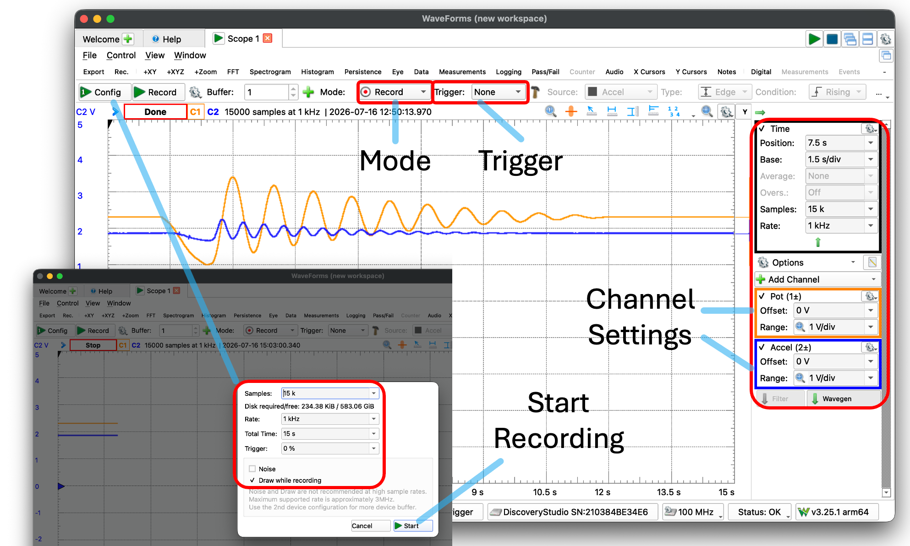{#fig-record-setup width="100%"}

::: {.callout-important title="Logbook Questions"}
**Q.** Approximately how many samples does this capture produce, and how large (in bytes / KB?) is the CSV file? Compare with your Lab 02 swing file.
:::



## Part-6: Post-Process — Two Roads to Normal Acceleration {#sec-part-6}

### Load Both Calibrations and the Swing

You calibrated the potentiometer *last week*. This week you will load and reuse that calibration:

``` python
# Saved calibrations: '#' header lines are skipped via comments='#'
pot_coeffs = np.loadtxt('../../Lab_02/Data/calibration_coeffs.csv',
                        delimiter=',', comments='#')   # [deg/V, deg]
acc_coeffs = np.loadtxt('../Data/accel_calibration_coeffs.csv',
                        delimiter=',', comments='#')   # [(m/s^2)/V, m/s^2]

import pandas as pd
swing = pd.read_csv('../Data/FirstName_LastName_Lab03_Swing.csv', skiprows=6)
t_raw = swing.iloc[:, 0].values
v_pot = swing.iloc[:, 1].values
v_acc = swing.iloc[:, 2].values

angle_deg = np.polyval(pot_coeffs, v_pot)   # volts -> degrees
accel_ms2 = np.polyval(acc_coeffs, v_acc)   # volts -> m/s^2
```

`np.loadtxt(..., comments='#')` is the counterpart to the `header='...'` you passed `np.savetxt`: lines starting with `#` are treated as comments and skipped automatically. (As always: `skiprows` for the swing file must match *your* export — open it and count.)

::: {.callout-important title="Logbook Questions"}
**Q.** Why is loading last week's calibration legitimate here — and what changes to the setup *would* force you to re-calibrate? Name two.
:::

### Trimming your data

To prepare useful figures we are usually concerned with making a chart that shows the reader exactly what they need to see. That means trimming away distracting portions of data that don't convey useful information: the time before the event of interest (here, the pendulum release) and after the period of interest (here, when the pendulum comes to rest).

There are lots of ways to approach trimming, but one of our favorites is the one you used in Lab 02: plot the data and use an interactive **plotly** figure to identify exactly where to cut it to size. Explore with plotly, publish with matplotlib — each tool where it excels. The workflow:

1.  Plot both calibrated signals with plotly, with the sample index in the hover tooltip.
2.  Use the interactive plot to find two key indices — the sample where the pendulum was released, and the earliest sample where it has stopped moving.
3.  Slice with those indices and re-zero the time vector, producing clean arrays for the analysis and a nicely detailed matplotlib chart for your post-lab submission.

``` python
import plotly.graph_objects as go

fig = go.Figure()
fig.add_trace(go.Scatter(
    x=t_raw, y=angle_deg, mode='lines',
    name='Calibrated Pot Angle (deg)', line=dict(color='red'), opacity=0.8,
    customdata=list(range(len(t_raw))),
    hovertemplate='idx=%{customdata}<br>t=%{x:.4f} s<br>angle=%{y:.2f} deg<extra></extra>'
))
fig.add_trace(go.Scatter(
    x=t_raw, y=accel_ms2, mode='lines',
    name='Calibrated Accel (m/s^2)', line=dict(color='blue'), opacity=0.8,
    customdata=list(range(len(t_raw))),
    hovertemplate='idx=%{customdata}<br>t=%{x:.4f} s<br>accel=%{y:.3f} m/s^2<extra></extra>'
))
fig.update_layout(
    title='Interactive Swing Trim Plot',
    xaxis_title='Time (s)', yaxis_title='Angle (deg) / Accel (m/s^2)',
    xaxis=dict(rangeslider=dict(visible=True)),
    template='plotly_white'
)
fig.show()
```

At 1000 Hz this recording has 10× the samples of Lab 02's — this is where the hover-for-index workflow really earns its keep, since eyeballing sample numbers from a static plot is hopeless at this density. Zoom with the range slider, hover the release and the at-rest points, note their indices, and slice:

``` python
idx1 = 1200      # <- YOUR release index, read from the plotly figure
idx2 = 14500     # <- YOUR at-rest / end-of-interest index

t      = t_raw[idx1:idx2] - t_raw[idx1]     # re-zero the clock at release
theta  = np.radians(angle_deg[idx1:idx2])   # radians from here on
a_meas = accel_ms2[idx1:idx2]
```

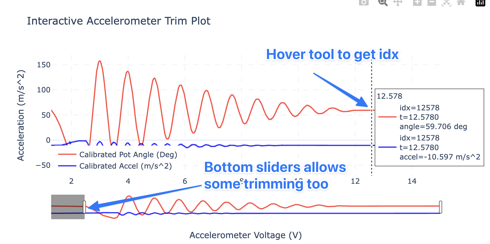{#fig-plotly-trim width="6.5in"}

### Trimming with a Detector (optional postlab exploration)

If you are clever, there are usually ways to make the trimming process automatic. There is a tradeoff here: how long do you spend building a detector versus just doing it manually? For one-off report figures the manual approach is usually faster — but if an analysis must process many recordings, automating the detection pays for itself quickly. This section is optional: try it if you're curious, and know that from here on, *how* you trim is up to you.

In the prelab walkthrough you found an event with `np.diff` and `np.argmax`: adjacent-sample differences are tiny while a signal holds still, then jump at the event, so thresholding `np.diff` finds the release. That worked at the walkthrough's sample rate — but **at 1000 Hz the same method breaks**: with 10× more samples per second, the *change per sample* shrinks by 10× while the noise per sample stays the same, so the release-induced steps hide below the noise floor. Instead of detecting *change between samples*, detect *departure from the held position*:

``` python
hold_mean = angle_deg[:500].mean()       # average angle during the hold
moved = np.abs(angle_deg - hold_mean) > 2.0    # more than 2 degrees away
idx0  = np.argmax(moved)                 # first True = release

t     = t_raw[idx0:] - t_raw[idx0]
theta = np.radians(angle_deg[idx0:])     # radians from here on
a_meas = accel_ms2[idx0:]
```

Same `np.argmax`-on-a-boolean-array trick as the walkthrough — only the *condition* is smarter. (`argmax` returns the index of the first `True`, since `True` counts as 1.) A 2° threshold is far above the angle noise but far below the swing amplitude, so it cannot misfire. This is a general lesson: **detection thresholds must be designed against the noise level**, and a detector that worked at one sample rate can fail at another. As a check, compare `idx0` against the release index you found interactively. Expect the detector to fire slightly *late*: it can only trigger once the angle has already moved 2°, which at 1000 Hz is a few tens of samples after the release you see by eye. Neither answer is wrong — they are two definitions of "the release."

### Compute Both Normal Accelerations

``` python
r  = 0.216            # m — YOUR measured pivot-to-accelerometer distance (Q2)
g  = 9.81
dt = 0.001

# Road 1: from the differentiated angle (Eq. 1)
theta_dot = np.gradient(theta, dt)       # angular velocity (rad/s)
a_calc    = -(theta_dot**2) * r

# Road 2: from the accelerometer, gravity removed (Eq. 2 rearranged)
a_meas_n  = a_meas + g * np.cos(theta)
```

- **`np.gradient(theta, dt)`** computes the derivative using *central* differences — each point's slope uses its neighbors on both sides — and returns an array the **same length** as the input (unlike `np.diff`, which is one short and half a sample shifted). That makes it the right tool whenever the derivative must line up sample-for-sample with other signals, as here.
- The gravity removal is @eq-accel-reading solved for the normal term: $-\dot\theta^2 r = a_y + g\cos\theta$. Note it uses $\theta$ from the *potentiometer* — the two sensors literally cooperate in this correction.

### Plot the Comparison

Build the comparison figure to match @fig-example-comp. **Plot the noisier signal first** so the cleaner accelerometer trace stays visible on top. This is an important trick to make your plots readable. Annotate, format per the Post-Lab requirements, and save **.pdf**/**.png** at 600 DPI.

::: {.callout-important title="Logbook Questions"}
**Q.** Which signal is noisier, and *why*? Connect your answer to the differentiation step and the sample rate.

**Q.** At what pendulum angle and time is the normal acceleration largest in magnitude? Does that match your physical intuition for where the pendulum moves fastest?

**Q.** The two signals will not agree perfectly. List at least two physical (not noise) reasons — think about sensors, models,  errors, and the assumptions behind @eq-normal-accel.
:::

### Example Result

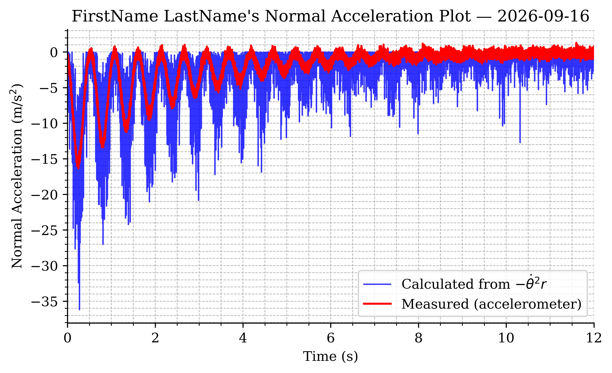{#fig-example-comp width="6.5in"}



## Post-Lab Assignment

Upload your submissions to Canvas. [**Post-labs are due Mondays at 10:00 pm.**]{.underline}

### Submission Items

- Your final **.ipynb** notebook (`FirstName_LastName_Lab03.ipynb`), restarted and run top-to-bottom (acquisition cells may show their saved outputs)
- Accelerometer calibration plot, **.pdf**
- Normal acceleration comparison plot, **.pdf**
- Answers to the post-lab questions on Canvas

### Calibration Plot Requirements

- Figure size: 6.5" wide × 4.0" tall; white background; Times font, 10–12 pt
- Major and minor grids on; top and right spines removed
- Calibration data: red circle markers, size 75
- Linear fit: solid blue, 2 pt; 95% CI: dashed black, 1 pt
- Axis labels with units; title "FirstName LastName's Accelerometer Calibration Plot" with the date
- `ax.text` annotation (4 decimals, units): calibration equation, norm of residuals, $s_{yx}$, $S_{a_1}$

### Comparison Plot Requirements

- Figure size: 6.5" wide × 4.0" tall; white background; Times font, 10–12 pt
- Major and minor grids on; top and right spines removed
- Calculated signal ($-\dot\theta^2 r$): blue line, 1 pt, drawn **first**
- Measured signal (gravity-removed accelerometer): red line, 1.5 pt, drawn on top
- Time axis starts at release ($t=0$); legend placed clear of the data
- Axis labels with units; title "FirstName LastName's Normal Acceleration Plot" with the date

### Post-Lab Questions

1.  Report your accelerometer calibration equation with units, and its norm of residuals and $s_{yx}$.
2.  What dwfpy argument sets the sample rate, and what is its GUI equivalent?
3.  Why does the gravity-subtraction step matter? Describe what your comparison plot would look like without it.
4.  Why is the calculated normal acceleration noisier than the measured one? Would recording at 100 Hz have made it better or worse? Explain.
5.  Which of the two methods do you trust more, and why?

## Before You Leave

- Show your comparison plot to a TA before tearing down — it is much easier to re-record now than next week.
- Remove all jumper wires and return them to the wire bin, sorted by color; discard damaged wires.
- Disconnect both sensor leads and return the apparatus, DMM, and tools to their stations.
- Confirm your data files have synced to OneDrive (check on a second device) and that **both** partners have everything.
- Clean the station, collect your belongings, and log off.