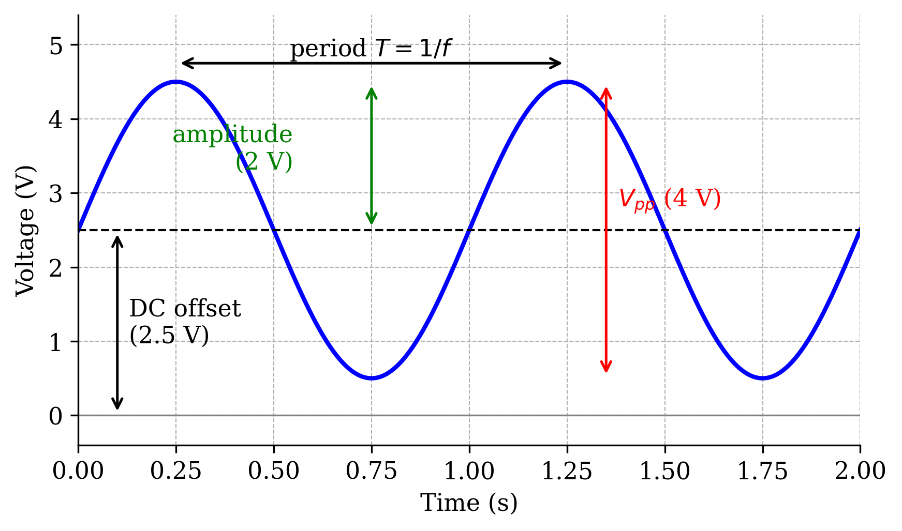
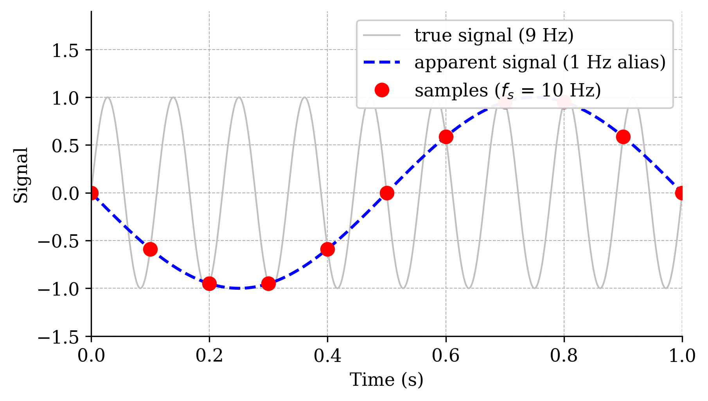
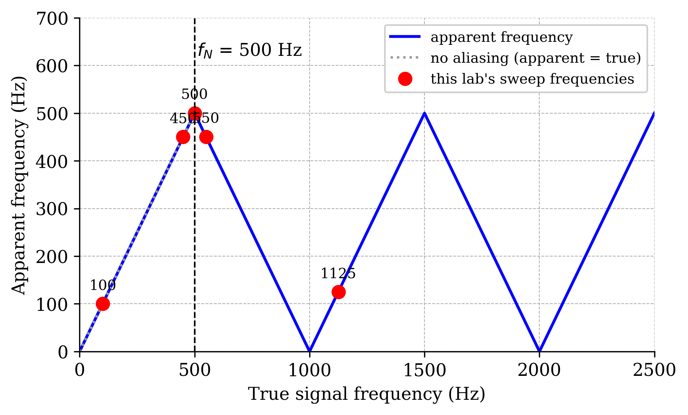
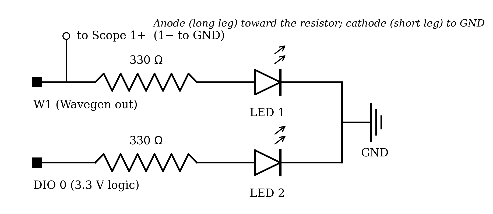
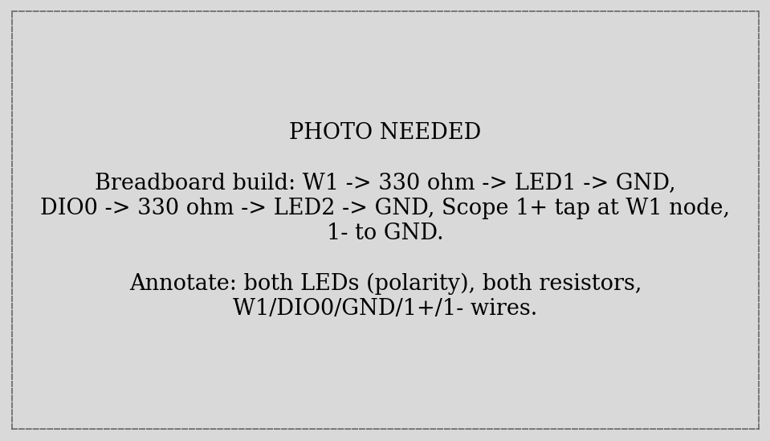
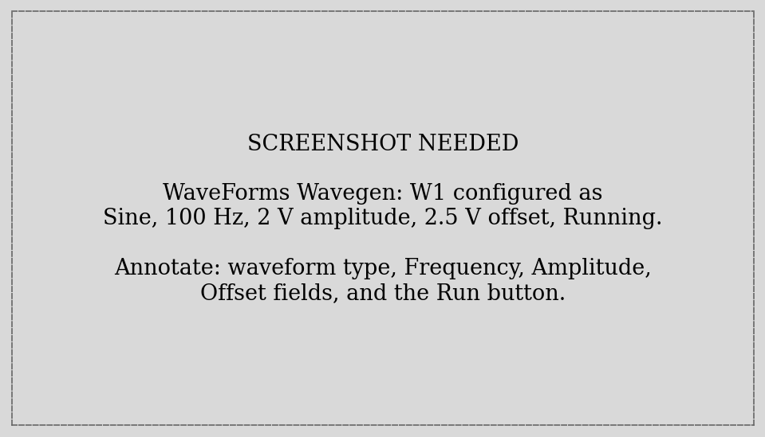
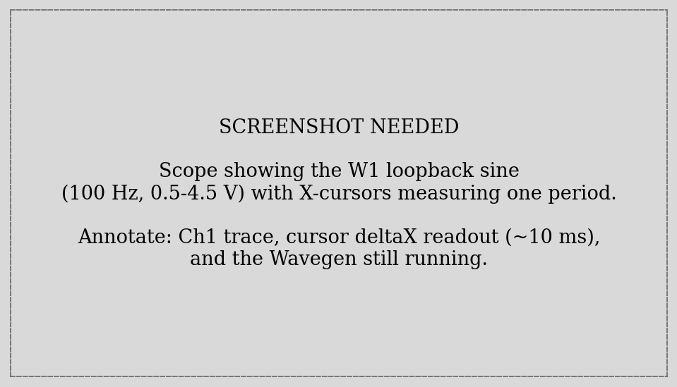
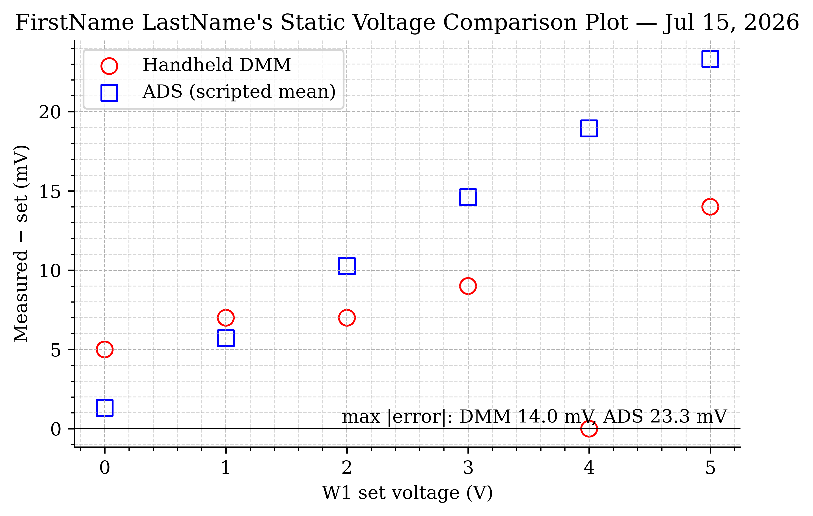
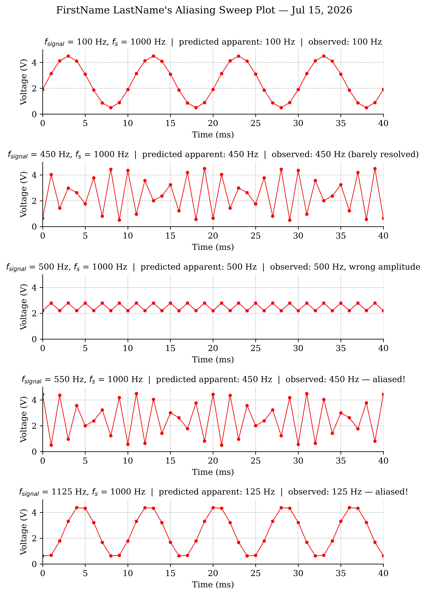
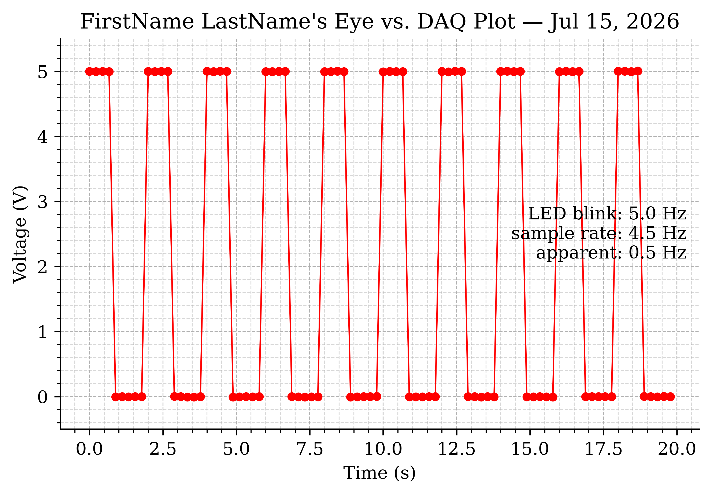



## Learning Objective

### Objectives

Your objectives for this laboratory session are to:

- **Generate signals** with the ADS Wavegen — first by hand in the GUI, then scripted from Python with `dwfpy`
- **Compare two instruments** measuring the same DC voltage (handheld DMM vs. a scripted ADS acquisition) and reason about accuracy, precision, and resolution
- Understand **sampling**: sample rate, the Nyquist frequency, and the folding formula that predicts what an undersampled signal *looks like*
- **Demonstrate aliasing deliberately** with a five-frequency sweep — and predict every apparent frequency *before* you capture it
- Drive a **digital output** (an LED) from Python and understand the difference between software timing and hardware timing
- Measure the bandwidth of a sensor you own: your own eyes, via the **flicker-fusion threshold**

### Check Your Understanding

By the end of this lab, you should be able to answer all of these questions.

#### Hardware & Instruments

- What do the Wavegen's *frequency*, *amplitude*, and *offset* settings each do to the output signal?
- Why does the LED need a series resistor? What happens without one?
- Why does this lab loop W1 back into Scope Channel 1 with a wire, when both live inside the same ADS?
- What voltage does a DIO pin supply when HIGH, and how is that different from W1?
- Why is neither the DMM nor the ADS the "true" value in the static comparison?

#### Programming

- Which `dwfpy` object is the Wavegen? How do you make W1 output a 100 Hz sine from Python?
- What does `float(input(...))` return, and why is the `float(...)` needed?
- What does `time.sleep(0.25)` do — and why is a `time.sleep` loop *not* a precision timer?
- What does a `while True:` loop do, and how does `break` get you out of it?
- How do you build a five-panel figure with `plt.subplots`, and how do you loop over its axes?

#### Data Analysis

- What is the Nyquist frequency for a 1000 Hz sample rate? For 48 kHz?
- A 550 Hz sine is sampled at 1000 Hz. What frequency appears in the data?
- Why can two *different* input signals produce *identical* sampled data? What does that imply about fixing aliasing after the fact?
- Your data shows a clean 0.5 Hz square wave, but your eyes saw the LED blinking fast. Which one is lying, and why?



## Pre-Lab Setup

You should come to lab having completed all tasks in this section.

### Extend Your Folder Structure

Add a Lab_04 folder set to your `ME3300` folder:

``` text
ME3300/
├── Lab_01/
├── Lab_02/
├── Lab_03/
├── Lab_04/
│   ├── Code/
│   │   ├── Lab04_Prelab_Walkthrough.ipynb
│   │   └── FirstName_LastName_Lab04.ipynb
│   ├── Data/
│   └── Figures/
```

No new packages are needed this week — `dwfpy` (added in Lab 03) covers everything.

### Read the Background Section

Read the [Background](#sec-background) section before lab. It defines the anatomy of an AC signal, derives the Nyquist frequency and the folding formula you will use to *predict* every result in this lab, and explains the LED circuit you will build.

### Complete the Prelab Walkthrough Notebook {#sec-prelab-walkthrough}

Download `Lab04_Prelab_Walkthrough.ipynb` from Canvas into `ME3300/Lab_04/Code/` and work through it before lab. It introduces this lab's *new* Python skills using simulated signals:

- generating and *sampling* sine waves in NumPy — seeing aliasing before you touch hardware
- the folding formula and Python's `round()`
- reading numbers from the keyboard with `float(input(...))`
- `while True:` loops and `break`
- pausing with `time.sleep`
- multi-panel figures with `plt.subplots(5, 1)` and looping over the axes

As always, working through the prelab will allow you to answer the **checkpoint** questions in the **Prelab quiz on Canvas** before your lab session.

### Python Quick Reference: New This Lab

| Task | Python command |
|------------------------------------|------------------------------------|
| Open the Wavegen from Python | `wavegen = device.analog_output` |
| Output a DC level on W1 | `wavegen['ch1'].setup('dc', offset=3.0, start=True)` |
| Output a sine on W1 | `wavegen['ch1'].setup('sine', frequency=100, amplitude=2.0, offset=2.5, start=True)` |
| Output a square wave on W1 | `wavegen['ch1'].setup('square', ...)` |
| Claim DIO 0 as an output | `led = device.digital_io[0]` then `led.setup(enabled=True, configure=True)` |
| Set the pin high / low | `led.output_state = True` / `False` |
| Pause the script | `time.sleep(0.25)` (needs `import time`) |
| Ask the user for a number | `v = float(input('Reading (V): '))` |
| Nearest whole number | `round(1.125)` |
| Loop until you `break` | `while True:` ... `break` |
| Sample-time array | `t = np.arange(n) / fs` |
| Five stacked plots | `fig, axes = plt.subplots(5, 1, figsize=(6.5, 10.0))` |

: New Python syntax and functions introduced in Lab 04 {#tbl-quickref}

Recall the dwfpy device model from Lab 03: every WaveForms GUI instrument is an object in code. This week adds the second row to your working set — `wavegen['ch1']` is the GUI's **W1**.

| WaveForms GUI instrument       | dwfpy object           |
|--------------------------------|------------------------|
| Scope / Logger (analog inputs) | `device.analog_input`  |
| **Wavegen (signal generator)** | **`device.analog_output`** |
| Supplies (power)               | `device.analog_io`     |
| **Static I/O (digital pins)**  | **`device.digital_io`**    |

: The dwfpy device model; this lab's new instruments in bold {#tbl-device-model}



## Laboratory Introduction

In Labs 02 and 03 you measured signals the world handed you — a pendulum swung, and you recorded what its sensors did. This week you take control of the *source* side of the measurement chain: you will **generate** signals with known frequency, amplitude, and offset, and then study how faithfully a sampled measurement reproduces them. Every calibration you ever perform, and every test rig you ever build, rests on this ability to produce a known input on demand.

The scientific payload of the lab is **sampling theory**. A DAQ cannot watch a signal continuously — it takes snapshots at the sample rate $f_s$. You have chosen sample rates twice already this course (100 Hz in Lab 02, 1000 Hz in Lab 03) mostly by trusting the manual. This week you learn the rule that governs that choice, and — more memorably — you will watch what happens when the rule is broken: a fast signal masquerading, in your data, as a slow one that *is not there*. This impostor phenomenon is called **aliasing**, and it has caused real engineering failures: vibration monitors that missed dangerous machine resonances, and audio systems haunted by phantom tones. By the end of the session you will have seen an LED blinking rapidly in front of your eyes while your own data insists — cleanly, plausibly, and wrongly — that it blinked once every two seconds.

Along the way you will also:

- run a **two-instrument showdown** (handheld DMM vs. scripted ADS acquisition) on known DC levels, sharpening the accuracy/precision/resolution vocabulary from Lab 01;
- write Python that drives a **digital output pin**, the simplest form of computer control of the physical world, and discover why software loops make poor clocks;
- measure your own **flicker-fusion threshold** — the frequency at which your eyes stop resolving blinking light — because your visual system is also a measurement system, with a bandwidth you can characterize like any other sensor's.

## Background {#sec-background}

### The Anatomy of an AC Signal

This lab's working signal is a sine wave riding on a DC level:

$$y(t) = V_{offset} + A \sin(2\pi f t)$$ {#eq-test-signal}

where $A$ is the **amplitude**, $f$ the **frequency** in Hz, and $V_{offset}$ the **DC offset**. Two derived quantities appear constantly on instrument panels: the **peak-to-peak voltage** $V_{pp} = 2A$ and the **period** $T = 1/f$. @fig-signal-anatomy labels all of them on this lab's standard test signal ($V_{offset} = 2.5$ V, $A = 2$ V), which conveniently spans 0.5–4.5 V — safely inside the ADS's range, and always positive so it can light an LED.

{#fig-signal-anatomy width="90%"}

### Sampling and the Nyquist Frequency

A DAQ samples a continuous signal at discrete instants $t_k = k/f_s$, producing snapshots $y(t_k)$ and discarding everything in between. How fast is fast enough? The celebrated answer is the **Nyquist criterion**: a sampled signal can only faithfully represent frequencies below the **Nyquist frequency**,

$$f_N = \frac{f_s}{2}$$ {#eq-nyquist}

i.e., you need *more than two samples per cycle* of the fastest content in your signal. At $f_s = 1000$ Hz — this lab's fixed sample rate — the Nyquist frequency is 500 Hz.

### Aliasing and the Folding Formula

What happens to a signal component *above* $f_N$? It does not disappear, and it does not raise an error. Something worse happens: the samples it leaves behind are **exactly consistent with a lower frequency**, and that impostor frequency is what you see in your data. @fig-alias-illustration shows the mechanism: a 9 Hz sine sampled at only 10 Hz leaves samples that trace out a perfect 1 Hz wave.

{#fig-alias-illustration width="90%"}

The apparent (alias) frequency is predicted by the **folding formula**:

$$f_{apparent} = \left| \, f_{signal} - \operatorname{round}\!\left(\frac{f_{signal}}{f_s}\right) \cdot f_s \, \right|$$ {#eq-folding}

where $\operatorname{round}(\cdot)$ is rounding to the nearest whole number. Below $f_N$ the formula returns $f_{signal}$ unchanged (no aliasing); above $f_N$ the apparent frequency "folds" back down, as @fig-folding shows. The five red dots are the frequencies you will generate in Part-4 — take a moment now to read their predicted apparent frequencies off the vertical axis.

{#fig-folding width="90%"}

One consequence deserves emphasis, because it is the deepest lesson of this lab: **aliasing is irreversible**. Once a 550 Hz signal has been sampled at 1000 Hz, the data is *identical* to that of a 450 Hz signal — not similar, identical. No later processing can tell them apart. Real DAQ systems therefore remove high-frequency content with analog **anti-aliasing filters** *before* the sampler, because afterward is too late. (You will build exactly such a filter in a later lab.)

### The LED Circuit

An LED (light-emitting diode) passes current — and emits light — in one direction only, once the voltage across it exceeds its **forward voltage** $V_f$ (about 1.8–2.2 V for ordinary red/green LEDs). An LED does not limit its own current: connected directly across a supply it will happily destroy itself. The series resistor sets the current:

$$I = \frac{V_{supply} - V_f}{R}$$ {#eq-led-current}

With this lab's 330 Ω resistor and a 5 V drive, $I \approx (5 - 2)/330 \approx 9$ mA — bright, and comfortably inside a standard LED's ~20 mA limit. @fig-led-schematic shows the two circuits you will build: one LED driven by the Wavegen (W1) and one by digital pin DIO 0. Note the polarity: LEDs only work one way around.

{#fig-led-schematic width="95%"}

### Your Eye Is Also a Sensor

A blinking LED looks *steady* if it blinks fast enough. The changeover frequency — the **flicker-fusion threshold** — is typically 50–90 Hz, varying with brightness, contrast, where the image lands on your retina (peripheral vision is more flicker-sensitive), and from person to person. Above the threshold your visual system fuses the flicker into steady light, but the flicker is still physically there — and "invisible" flicker from cheap LED lighting and displays is a documented cause of eyestrain and headaches, which is why lighting standards (e.g., IEEE 1789) regulate it. In Part-6 you will measure your own threshold, using the Wavegen as a precision flicker source. Your eye is not literally a discrete sampler like the ADS, but it *is* a measurement system with finite bandwidth — and this lab is, at heart, about knowing the bandwidth of every instrument you use, including the two built into your head.



## Part-1: Build the LED Circuits {#sec-part-1}

Your guides are @fig-led-schematic and the annotated photo in @fig-circuit-build. This is the simplest circuit of the course — two LEDs, two resistors, four signal wires.

{#fig-circuit-build width="100%"}

| Connection | ADS pin | Purpose |
|------------------------|------------|---------------------------------|
| LED 1 branch input | **W1** | Wavegen drive signal |
| LED 2 branch input | **DIO 0** | Digital (on/off) drive |
| Both LED cathodes (via breadboard rail) | GND | Return path |
| W1 node (before the resistor) | **1+** | Scope records the drive signal |
| GND rail | **1−** | Ch. 1 reference |

1. Wire both branches per the table: pin → 330 Ω resistor → LED anode (**long leg**) → LED cathode (short leg) → GND rail. Add the Channel 1 tap at the W1 node.
2. Check each LED with your DMM in **diode-test mode**: probes matching the LED's polarity should light it faintly and read $V_f$; reversed, it should read over-limit. This is the DMM habit from Labs 01–03 applied to a new component.
3. Nothing should be lit yet — W1 and DIO 0 both idle at 0 V.

::: {.callout-important title="Logbook Questions"}
**Q1.** Record the forward voltage $V_f$ your DMM's diode test reports for each LED. Using @eq-led-current, what current will flow in the W1 branch when W1 outputs 5 V? When DIO 0 outputs its 3.3 V HIGH?

**Q2.** In one sentence: what would happen to the LED if you omitted the 330 Ω resistor, and *why* doesn't the LED protect itself?
:::



## Part-2: Meet the Wavegen (GUI First) {#sec-part-2}

New instrument, same course rule as Lab 03: **explore it live in the GUI before you automate it**. The Wavegen is the ADS's built-in signal generator — the source you will trust for every frequency in this lab — and five minutes of knob-turning now will make the scripted version obvious later.

1. Open **WaveForms**, then the **Wavegen** and **Scope** instruments side by side.
2. Configure **W1** (Channel 1 output): **Sine**, Frequency **1 Hz**, Amplitude **2 V**, Offset **2.5 V** — the standard test signal of @eq-test-signal and @fig-signal-anatomy. Match @fig-wavegen-setup. Click **Run**.
3. Watch the LED: it should pulse smoothly, brightening and dimming once per second. You are watching @eq-test-signal in hardware.
4. In the Scope, enable Channel 1 (range ±5 V) and start acquiring. The trace should show the 0.5–4.5 V sine feeding the LED branch. Use the Scope's **X cursors** to measure the time between two successive peaks and compare with $T = 1/f$; match @fig-scope-loopback.
5. Now raise the frequency: 10 Hz, then 50 Hz, then **100 Hz**. Watch the LED at each step and note what your eyes report.
6. Switch the waveform to **Square** and back. When you are done exploring, **close WaveForms fully** (check the system tray) so your scripts can claim the device.

{#fig-wavegen-setup width="100%"}

{#fig-scope-loopback width="100%"}

::: {.callout-important title="Logbook Questions"}
**Q3.** Record the cursor-measured period at 1 Hz. Does it match $1/f$? What is the *expected* period at 100 Hz?

**Q4.** Describe what the LED looked like at 1, 10, 50, and 100 Hz. At what frequency (roughly) did it stop looking like a blinking light? Keep this note — Part-6 measures it properly.
:::

::: callout-note
## Why the loopback wire?

W1 and the Scope live in the same box, but the ADS does not internally connect them — and that is a feature. The Scope measures whatever its probe touches, exactly as it would on an external circuit. Here it monitors the actual voltage arriving at your LED branch, which is the honest quantity to record.
:::



## Part-3: Two Instruments, One Voltage {#sec-part-3}

Which do you trust: the handheld DMM or the ADS? In this part a script sets W1 to known DC levels — 0 through 5 V — and at each level you record the voltage two ways: reading the DMM yourself, and letting the script average a 2-second ADS capture. This is Lab 03's automation philosophy again: the script handles the repetitive setting/capturing/bookkeeping, and pauses for the one thing only you can do (read the DMM).

Open your notebook `FirstName_LastName_Lab04.ipynb` (kernel: your `.venv`; starter notebook on Canvas as usual). Clip your DMM across the LED — probes on the W1 node and GND.

::: {.callout-warning title="Close WaveForms first!"}
Same rule as Lab 03: the ADS accepts one controlling program at a time. Close WaveForms fully before running dwfpy cells.
:::

``` python
import dwfpy as dwf
import numpy as np

set_points   = np.arange(0.0, 5.5, 1.0)   # 0, 1, 2, 3, 4, 5 V
dmm_readings = []                          # typed in from the handheld DMM
ads_means    = []                          # computed from the ADS capture

fs, duration = 1000, 2.0
n = int(fs * duration)

with dwf.Device() as device:
    wavegen = device.analog_output         # the Wavegen instrument
    scope   = device.analog_input
    scope['ch1'].setup(range=5.0)

    for v_set in set_points:
        wavegen['ch1'].setup('dc', offset=v_set, start=True)   # W1 = v_set

        reading = float(input(f"W1 = {v_set:.1f} V. Type the DMM reading (V): "))
        dmm_readings.append(reading)

        scope.single(sample_rate=fs, buffer_size=n, configure=True, start=True)
        volts = scope['ch1'].get_data()
        ads_means.append(volts.mean())
        print(f"  DMM {reading:.3f} V | ADS mean {ads_means[-1]:.6f} V")

np.savetxt('../Data/Static_Comparison.csv',
           np.column_stack([set_points, dmm_readings, ads_means]),
           header='set_V,dmm_V,ads_V', delimiter=',')
```

New syntax, in the order it appears:

- **`wavegen['ch1'].setup('dc', offset=v_set, start=True)`** — the Wavegen as code. `'dc'` is a waveform *function* just like `'sine'`; a DC "waveform" ignores frequency and amplitude and simply holds the `offset` voltage. `start=True` makes the output live immediately — the exact equivalent of clicking **Run** in the GUI. Note that `wavegen['ch1']` is the GUI's **W1**, the same labels-not-indices convention as `scope['ch1']`.
- **`float(input(...))`** — `input()` (Lab 03) always returns *text*, even if you type `3.302`. Wrapping it in `float(...)` converts that text to a number you can do math with. Type only the number — no units.
- Notice the pattern: one `with` block, *two* instruments (`wavegen` and `scope`) working together. This source-plus-measurement pairing is the skeleton of every automated test you will ever script.

As you go, watch the LED: it steps up in brightness with each setpoint — a free sanity check that W1 is really changing.

Then load the results and compute each instrument's error:

``` python
data = np.loadtxt('../Data/Static_Comparison.csv', delimiter=',', comments='#')
v_set, v_dmm, v_ads = data[:, 0], data[:, 1], data[:, 2]

err_dmm = (v_dmm - v_set) * 1000        # error in mV
err_ads = (v_ads - v_set) * 1000
```

Build the error plot to match @fig-example-static — both instruments on one axes, errors in mV vs. the set voltage, formatted per the Post-Lab requirements. Save **.pdf** and **.png** at 600 DPI.

::: {.callout-important title="Logbook Questions"}
**Q5.** Copy your six-row comparison table into your logbook. Which instrument's errors are larger? Which instrument's errors follow a *pattern* (a trend with voltage), and which look random? What does a trend suggest about the *type* of error?

**Q6.** What is the resolution (smallest displayed step) of your DMM? Estimate the ADS's effective resolution from the digits that change between repeated captures. Resolution, precision, accuracy: which of the three does averaging 2000 samples improve, and which can it never improve?

**Q7.** The "error" here is measured against the W1 *setpoint* — but W1 is itself an instrument with its own tolerance. What third piece of equipment would you need to decide which of the three (W1, DMM, ADS) is closest to the truth?
:::

### Example Result

{#fig-example-static width="6.5in"}



## Part-4: The Aliasing Sweep {#sec-part-4}

Here is the heart of the lab. You will generate five sine frequencies — chosen relative to the fixed Nyquist frequency $f_N = 500$ Hz — capture each at $f_s = 1000$ Hz, and compare what you *generated* against what the data *shows*.

### Predict First

Real experimentalists commit to predictions before looking at data. Compute the apparent frequency @eq-folding predicts for every sweep frequency:

``` python
fs  = 1000               # sample rate (Hz), fixed for the whole sweep
f_N = fs / 2             # Nyquist frequency (Hz)
f_signals = [100, 450, 500, 550, 1125]   # 0.2, 0.9, 1.0, 1.1, 2.25 x f_N

for f_sig in f_signals:
    f_app = abs(f_sig - round(f_sig / fs) * fs)     # folding formula
    print(f"f_signal = {f_sig:5d} Hz -> predicted apparent frequency = {f_app:.0f} Hz")
```

**`round()`** is a Python built-in: `round(1.125)` → 1, so for $f_{signal} = 1125$ Hz the formula computes $|1125 - 1 \times 1000| = 125$ Hz. Note this whole cell is pure arithmetic — no hardware — which is exactly why you can run it *before* capturing anything.

::: {.callout-important title="Logbook Questions"}
**Q8.** Write the five predictions as a table in your logbook **before running the sweep**: $f_{signal}$, predicted $f_{apparent}$, and one short phrase of what you expect the plot to look like. Check each against @fig-folding.
:::

### Run the Sweep

One script plays signal generator *and* DAQ:

``` python
import time

duration = 1.0
n = int(fs * duration)

with dwf.Device() as device:
    wavegen = device.analog_output
    scope   = device.analog_input
    scope['ch1'].setup(range=5.0)

    for f_sig in f_signals:
        wavegen['ch1'].setup('sine', frequency=f_sig, amplitude=2.0,
                             offset=2.5, start=True)
        time.sleep(0.2)                      # let the new output settle

        scope.single(sample_rate=fs, buffer_size=n, configure=True, start=True)
        volts  = scope['ch1'].get_data()
        time_s = np.arange(n) / fs           # sample times: 0, 1/fs, 2/fs, ...

        np.savetxt(f'../Data/Alias_{f_sig}Hz.csv',
                   np.column_stack([time_s, volts]),
                   header='Time (s),Channel 1 (V)', delimiter=',')
        print(f"saved Alias_{f_sig}Hz.csv")
```

- **`time.sleep(0.2)`** pauses the script for 0.2 seconds — here, giving the Wavegen a beat to settle on its new frequency before the capture starts. `sleep` is the workhorse for "wait a moment" in instrument scripts.
- **`np.arange(n) / fs`** builds the sample-time array $t_k = k/f_s$: the integers 0…n−1, divided by the sample rate. Compare with `np.linspace` (Lab 01), which needs the *endpoint*; `arange`-over-rate is the natural idiom when you know the count and the rate.
- The five captures land as five CSV files with `#`-header lines — load them with `np.loadtxt(..., comments='#')` exactly as in Lab 03.

While it runs, glance at the LED: at these frequencies it looks steadily lit (Q4 explains why) even as the *data* is about to tell five very different stories.

### Plot All Five Panels

A shared figure with stacked panels is the standard way to compare captures, and it introduces one new tool:

``` python
observed = ['?', '?', '?', '?', '?']     # fill in after inspecting each panel

x_max_ms = [40, 40, 40, 40, 40]          # time window per panel (ms)

fig, axes = plt.subplots(5, 1, figsize=(6.5, 10.0))
fig.patch.set_facecolor('white')

for ax, f_sig, obs, x_max in zip(axes, f_signals, observed, x_max_ms):
    data = np.loadtxt(f'../Data/Alias_{f_sig}Hz.csv', delimiter=',', comments='#')
    t, v = data[:, 0], data[:, 1]

    f_app = abs(f_sig - round(f_sig / fs) * fs)

    ax.plot(t * 1000, v, 'o-', color='red', markersize=3, linewidth=0.8)
    ax.set_xlim(0, x_max)
    ax.set_ylim(0, 5)
    ax.set_xlabel('Time (ms)')
    ax.set_ylabel('Voltage (V)')
    ax.set_title(f'$f_{{signal}}$ = {f_sig} Hz, $f_s$ = {fs} Hz  |  '
                 f'predicted apparent: {f_app:.0f} Hz  |  observed: {obs}',
                 fontsize=10)
    ax.grid(which='major', linestyle='--', linewidth=0.5)
    ax.spines['top'].set_visible(False)
    ax.spines['right'].set_visible(False)

fig.suptitle("FirstName LastName's Aliasing Sweep Plot — Date", y=0.995)
fig.tight_layout(rect=(0, 0, 1, 0.99))
```

- **`plt.subplots(5, 1, figsize=(6.5, 10.0))`** creates one figure holding a 5-row, 1-column grid of axes; `axes` is an array you can loop over. Everything you know about formatting a single `ax` applies unchanged to each panel — that is the point of the axes-object style you have used since Lab 01.
- **`zip(axes, f_signals, observed, x_max_ms)`** — Lab 03's `zip`, now pairing *four* lists at once. One loop pass = one fully-labeled panel.
- Run it once with the `'?'` placeholders, then **measure the observed frequency in each panel** — read the time between successive peaks off the axis and invert it — and re-run with `observed` filled in (e.g., `'450 Hz — aliased!'`). The observed values are *your measurement*; the title's predicted value is the theory it must face.

Format per the Post-Lab requirements and save **.pdf**/**.png** at 600 DPI. Compare with @fig-example-alias.

::: {.callout-important title="Logbook Questions"}
**Q9.** For each panel: did the observed frequency match your Q8 prediction? Record the observed values in your Q8 table.

**Q10.** Compare panels 2 (450 Hz) and 4 (550 Hz) closely. Could you tell, from the sampled data alone, which input produced which panel? Explain why this means an anti-aliasing filter must act *before* the sampler — no software fix can work afterward.

**Q11.** In panel 3 (exactly $f_N$), what amplitude does the sampled signal show? Re-run the sweep and watch whether it changes. What does the sampled amplitude at exactly $f_N$ depend on?

**Q12.** In Labs 02 and 03 you sampled a swinging pendulum at 100 Hz and 1000 Hz. Estimate the highest frequency present in those signals, and argue from @eq-nyquist whether aliasing could have corrupted your measurements.
:::

### Example Result

{#fig-example-alias width="6.5in"}



## Part-5: Digital Output — and Fooling the DAQ in Person {#sec-part-5}

### Blink an LED from Python

The Wavegen produces continuous waveforms; a **digital I/O pin** produces exactly two values — HIGH (3.3 V on the ADS) and LOW (0 V) — under direct program control. It is the simplest way a computer touches the physical world, and the foundation of every actuator, relay, and indicator you will ever script.

``` python
import time

with dwf.Device() as device:
    led = device.digital_io[0]             # DIO 0 — same number as the GUI
    led.setup(enabled=True, configure=True)

    for k in range(20):                    # 20 toggles = 10 full blinks
        led.output_state = not led.output_state
        time.sleep(0.25)                   # 0.25 s per toggle -> 2 Hz blink

    led.output_state = False               # leave the pin off
```

- **`device.digital_io[0]`** is pin **DIO 0** — here the integer *is* the GUI's label, so indexing is safe. `setup(enabled=True, ...)` makes it an output.
- **`led.output_state = not led.output_state`** — `not` flips a `True`/`False` value, so each pass through the loop toggles the pin. Two toggles make one full on/off blink, hence 0.25 s per toggle → 2 Hz blinking.
- The blink *rate* here comes from `time.sleep` — software timing. Your operating system juggles dozens of programs and gets around to your script when it can, so each "0.25 s" is really "0.25 s, give or take". Fine at 2 Hz; hopeless as a precision signal source. That is why Part-4 and Part-6 use the Wavegen — its timing runs on dedicated hardware inside the ADS, indifferent to what Windows is doing.

::: {.callout-important title="Logbook Questions"}
**Q13.** LED 2 runs at 3.3 V, LED 1 at up to 5 V. Which is brighter, and does the difference match the current ratio predicted by @eq-led-current using your Q1 values?

**Q14.** Name one lab task where software timing (a `sleep` loop) is perfectly fine, and one where it would ruin the measurement. What is the rough timescale that separates them?
:::

### Eye vs. DAQ

Now the demonstration this lab has been building toward. You will make LED 1 blink at 5 Hz — plainly visible flicker — and record it with a sample rate of **4.5 Hz**, a rate that plausibly seems "about right" for a 5 Hz signal but is catastrophically below the Nyquist requirement of *more than* 10 Hz. Predict the apparent frequency with @eq-folding before you run it.

``` python
f_led    = 5.0      # LED blink frequency (Hz) — clearly visible flicker
fs_slow  = 4.5      # deliberately BAD sample rate (Hz)
duration = 20.0
n = int(fs_slow * duration)

with dwf.Device() as device:
    wavegen = device.analog_output
    scope   = device.analog_input
    scope['ch1'].setup(range=5.0)

    wavegen['ch1'].setup('square', frequency=f_led, amplitude=2.5,
                         offset=2.5, start=True)
    print("Watch the LED — it is blinking at 5 Hz. Capturing for 20 s...")

    scope.single(sample_rate=fs_slow, buffer_size=n, configure=True, start=True)
    volts = scope['ch1'].get_data()

t_slow = np.arange(n) / fs_slow
np.savetxt('../Data/EyeVsDAQ_Capture.csv',
           np.column_stack([t_slow, volts]),
           header='Time (s),Channel 1 (V)', delimiter=',')
```

The cell takes a full 20 seconds — the `single(...)` call is blocking, as in Lab 03. **Spend those 20 seconds watching the LED.** Your eyes and your DAQ are observing the same physical object at the same time; only one of them will get it right.

Plot the capture (time in seconds, voltage in volts, markers *and* line) to match @fig-example-eyevsdaq, annotate the three frequencies (blink, sample, apparent), and save **.pdf**/**.png** at 600 DPI.

::: {.callout-important title="Logbook Questions"}
**Q15.** What frequency does your captured data show? What did your eyes see during those same 20 seconds? Reconcile the two using @eq-folding.

**Q16.** A colleague argues: "the data is clean and periodic — clearly the LED blinked every ~2 seconds." Nothing in the file itself contradicts them. What *outside knowledge* is required to catch the error, and what does that imply about trusting logged data from a system whose sample rate you didn't choose?
:::

### Example Result

{#fig-example-eyevsdaq width="6.5in"}



## Part-6: The Flicker-Fusion Threshold {#sec-part-6}

Finally, turn the instruments on yourselves. The Wavegen drives LED 1 with a square wave whose frequency climbs in steps; you report, honestly, whether you still see flicker. The frequency where flicker melts into steady light is your flicker-fusion threshold.

::: {.callout-warning title="Photosensitivity"}
Flickering light in roughly the 3–30 Hz range can trigger seizures in people with photosensitive epilepsy. This experiment uses one small, dim LED — far milder than a strobe light or full-screen flash — but if you have any history of photosensitivity, do not stare at the LED: let your partner run the test on themselves, and record their data instead. Anyone can opt out of this part without penalty; tell your TA.
:::

``` python
freqs_tested = []
responses    = []       # 1 = flicker visible, 0 = looks steady

with dwf.Device() as device:
    wavegen = device.analog_output

    f = 20.0                                 # start well below fusion
    while True:
        wavegen['ch1'].setup('square', frequency=f, amplitude=2.5,
                             offset=2.5, start=True)
        answer = input(f"{f:.0f} Hz — do you see flicker? (y/n): ")

        freqs_tested.append(f)
        responses.append(1 if answer == 'y' else 0)

        if answer != 'y':
            break                            # fusion reached — stop
        f = f + 5                            # step up and ask again

print(f"Flicker-fusion threshold: between {freqs_tested[-2]:.0f} "
      f"and {freqs_tested[-1]:.0f} Hz")

np.savetxt('../Data/Flicker_Staircase_PartnerA.csv',   # rename per partner
           np.column_stack([freqs_tested, responses]),
           header='frequency_Hz,flicker_visible(1=yes 0=no)',
           delimiter=',', fmt='%d')
```

- **`while True:` + `break`** — a loop with no built-in end condition; it runs until the `break` line executes. Use it when the stopping rule ("the user said no") emerges from *inside* the loop, unlike `for`, which knows its itinerary in advance. Every `while True:` you ever write must contain a reachable `break` — check for it before running, or the loop runs forever (if that happens: the Interrupt button, as in Lab 03).
- **`1 if answer == 'y' else 0`** — Lab 02's conditional expression, converting a text answer into a number worth saving.

Procedure notes: look *directly* at the LED from your normal seated distance, answer honestly (there is no right answer — thresholds legitimately differ), and run the staircase **once per partner**, changing the filename before the second run.

::: {.callout-important title="Logbook Questions"}
**Q17.** Record both partners' threshold brackets. Are they the same? Typical values run 50–90 Hz — where do you two fall?

**Q18.** Re-run a frequency just *above* your threshold, but this time look slightly *away* from the LED, watching it with your peripheral vision. Does the flicker come back? (For most people it does.) What does that tell you about treating "the eye" as one single sensor?

**Q19.** LED room lights are typically dimmed by switching on/off rapidly (PWM). Using your measured threshold plus the safety callout above, propose a minimum PWM frequency for comfortable, safe lighting, and justify it in two sentences.
:::



## Post-Lab Assignment

Upload your submissions to Canvas. [**Post-labs are due Mondays at 10:00 pm.**]{.underline} A full example solution notebook is posted after all sections have met; check your approach against it, but submit your own work.

### Submission Items

- Your final **.ipynb** notebook (`FirstName_LastName_Lab04.ipynb`), restarted and run top-to-bottom (acquisition cells may show their saved outputs)
- Static comparison plot, **.pdf**
- Aliasing sweep plot (five panels), **.pdf**
- Eye-vs-DAQ plot, **.pdf**
- Answers to the post-lab questions on Canvas

### Static Comparison Plot Requirements

- Figure size: 6.5" wide × 4.0" tall; white background; Times font, 10–12 pt
- Major and minor grids on; top and right spines removed
- DMM errors: red open circles, size 75; ADS errors: blue open squares, size 75
- A horizontal line at zero error; y-axis in mV; legend placed clear of the data
- Axis labels with units; title "FirstName LastName's Static Voltage Comparison Plot" with the date
- `ax.text` annotation: the maximum absolute error for each instrument, in mV

### Aliasing Sweep Plot Requirements

- Five stacked panels; figure size 6.5" wide × 10.0" tall; white background; Times font, 10 pt
- Samples as red circle markers (size 3) *connected by* a thin (0.8 pt) red line — the connecting line is what reveals the apparent frequency
- Each panel: 0–40 ms window, 0–5 V limits, major grid, top/right spines removed
- Each panel title: $f_{signal}$, $f_s$, the *predicted* apparent frequency, and your *observed* apparent frequency
- Overall suptitle "FirstName LastName's Aliasing Sweep Plot" with the date

### Eye-vs-DAQ Plot Requirements

- Figure size: 6.5" wide × 4.0" tall; white background; Times font, 10–12 pt
- Samples as red circle markers (size 4) connected by a thin red line; full 20 s window
- Major and minor grids on; top and right spines removed
- Axis labels with units; title "FirstName LastName's Eye vs. DAQ Plot" with the date
- `ax.text` annotation: LED blink frequency, sample rate, and apparent frequency, each in Hz

### Post-Lab Questions

1.  A DAQ samples at 8000 Hz. What is its Nyquist frequency, and what is the highest signal frequency it can capture without aliasing?
2.  Use @eq-folding to predict the apparent frequency when a 725 Hz sine is sampled at 600 Hz. Show your arithmetic.
3.  Your aliasing plot's panels 2 and 4 are (nearly) identical. Explain, in your own words, why no amount of post-processing can determine which input signal produced such a record — and what hardware solves this problem in real DAQ systems.
4.  In the eye-vs-DAQ experiment, suppose you had sampled at 5.5 Hz instead of 4.5 Hz. Predict the apparent frequency. Would the data look meaningfully more honest?
5.  Your flicker-fusion threshold is a property of *you* as a measurement system. Give one engineering situation where a human observer's temporal bandwidth matters, and one where an electronic sensor's Nyquist limit matters, and state the analogous "sample rate" in each.

## Before You Leave

- Show your aliasing sweep plot to a TA before tearing down — re-capturing takes two minutes now and a week later.
- Remove all jumper wires and return them to the wire bin, sorted by color; return LEDs and resistors to their labeled containers.
- Return the DMM and tools to their stations.
- Confirm your data files have synced to OneDrive (check on a second device) and that **both** partners have everything.
- Clean the station, collect your belongings, and log off.
