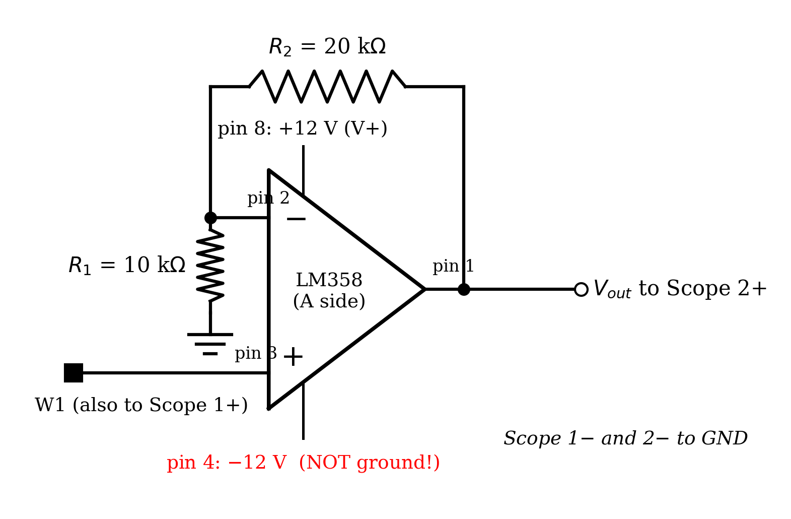
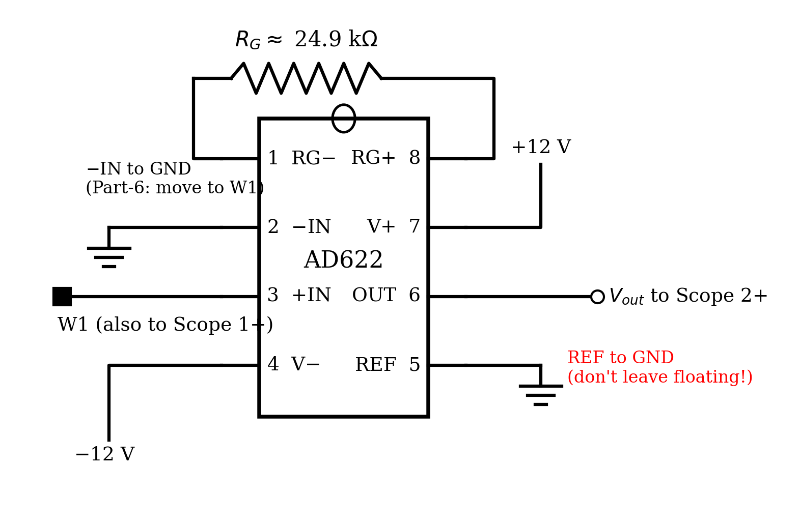
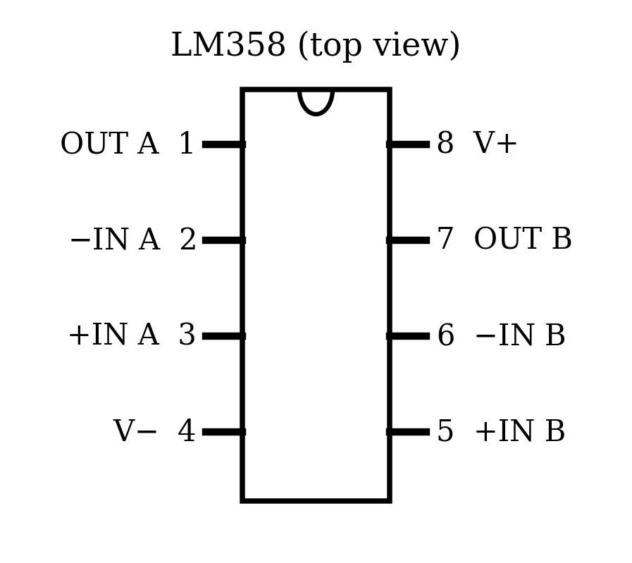
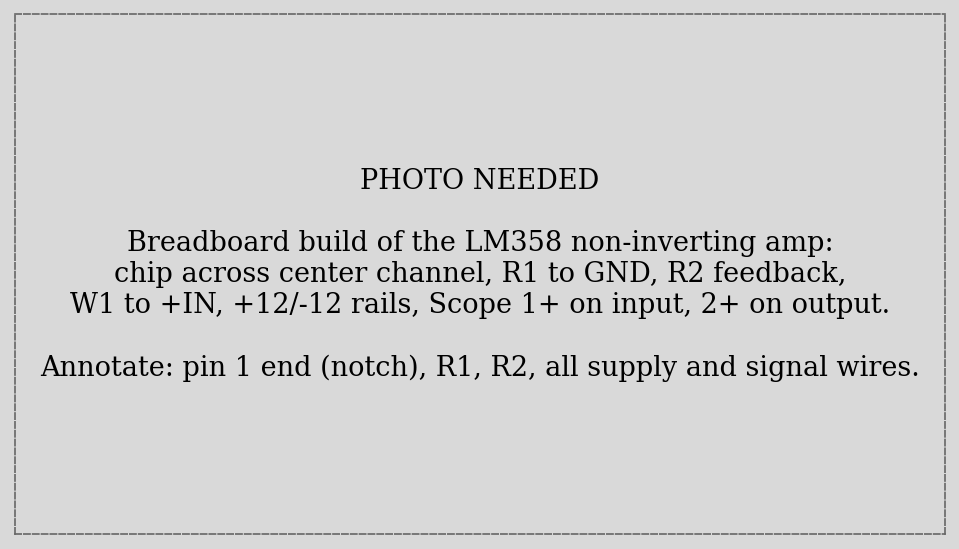
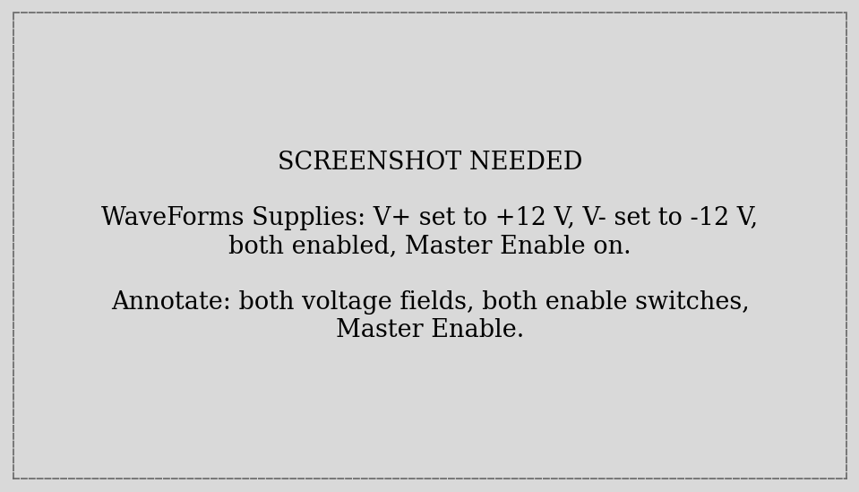
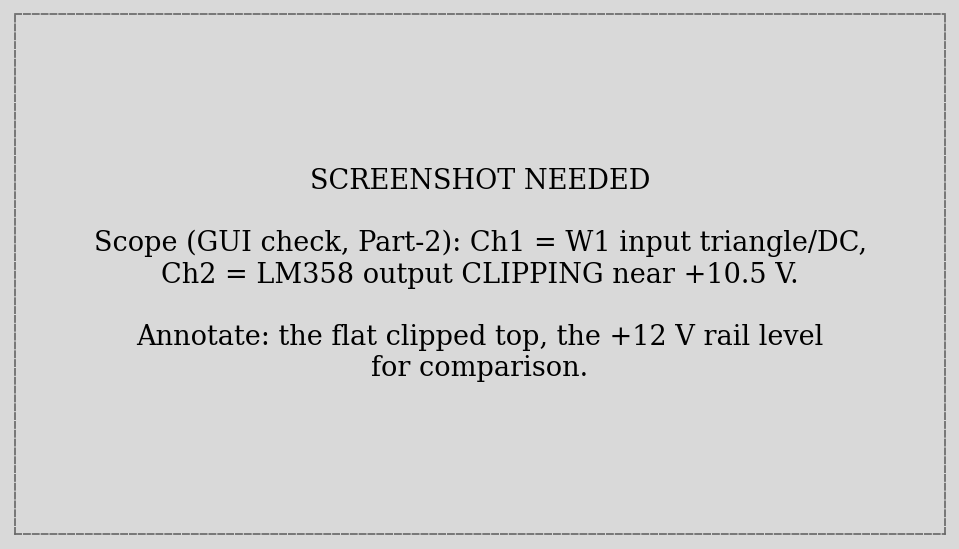
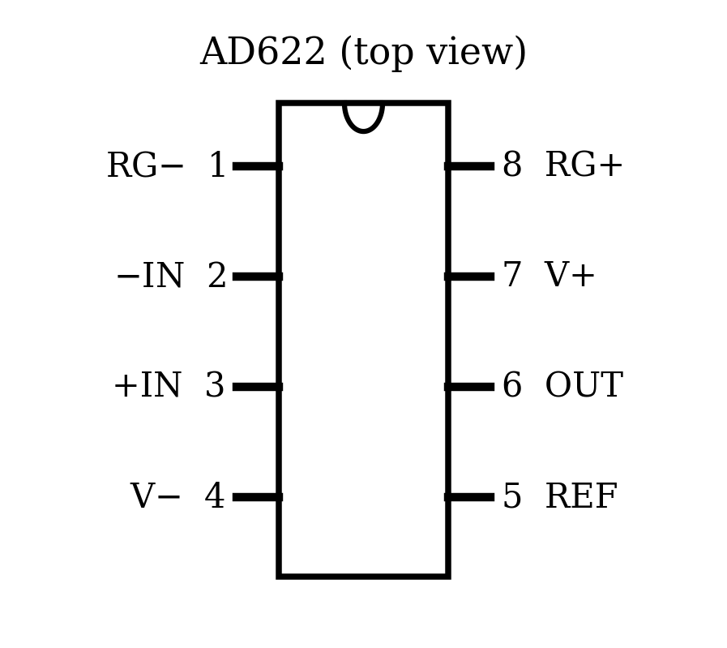
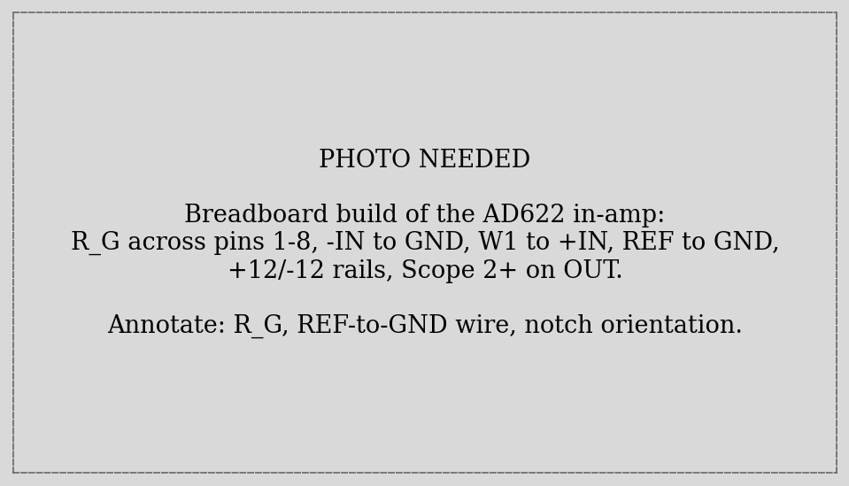
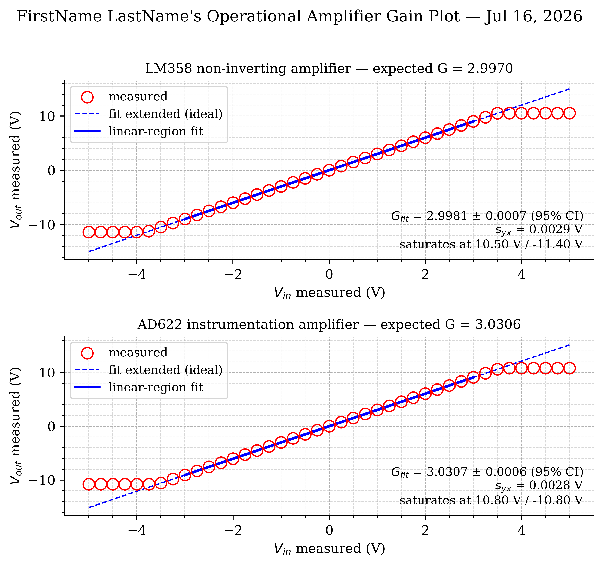
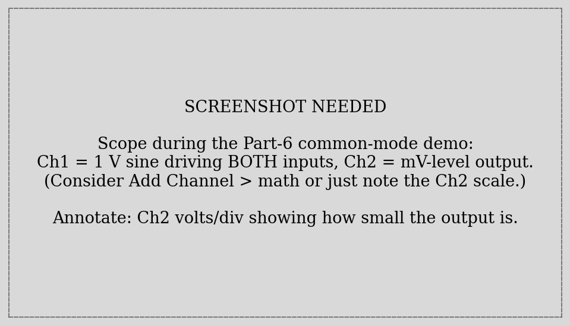



## Learning Objective

### Objectives

Your objectives for this laboratory session are to:

- Understand the **ideal op-amp** model and use its two golden rules to derive amplifier gain
- **Design, build, and test** a non-inverting amplifier (LM358) and an instrumentation amplifier (AD622), each with a target gain of $G = 3$
- Drive your circuits from the ADS **±12 V programmable supplies** — your first dual-rail circuit — from the GUI and from Python
- Run an **automated gain sweep**: one script that sets the input, measures input *and* output, and maps the full transfer curve including **saturation**
- Extract gain by **fitting the linear region** of the transfer curve — a boolean mask plus the Lab 02 regression machinery
- See what makes an instrumentation amplifier special: a **common-mode demo** where the amplifier ignores volts of shared signal while amplifying millivolts of difference

### Check Your Understanding

By the end of this lab, you should be able to answer all of these questions.

#### Hardware & Instruments

- What are the two golden rules of an ideal op-amp with negative feedback?
- Why does an op-amp need both +12 V *and* −12 V? What happens to a signal that tries to swing below ground on a single supply?
- Pin 4 of the LM358 connects to −12 V. Why is connecting it to ground instead the classic way to kill the chip's output range?
- What sets the gain of the non-inverting amplifier? Of the AD622?
- What physically limits the output voltage, and roughly where does the LM358 clip on ±12 V rails?

#### Programming

- How do you set and enable the ±12 V supplies from `dwfpy`? Why must your script do this itself rather than relying on the GUI?
- How do you capture *two* scope channels in one acquisition?
- What does a boolean mask like `np.abs(v_out) < 9.5` produce, and what does `v_in[mask]` return?
- Why is fitting $V_{out}$ vs. $V_{in}$ the right way to measure gain, rather than averaging pointwise $V_{out}/V_{in}$ ratios?

#### Data Analysis

- The slope of your fitted line is the gain. What is the *intercept*, physically?
- What happens to the fitted gain if saturated points are left in the regression?
- Your amplifier saturated near +10.5 V, not +12 V. Why?
- Two signals arrive at an in-amp: 2.5 V on both inputs, plus 3 mV *between* them. What does the output look like for $G = 3$?



## Pre-Lab Setup

You should come to lab having completed all tasks in this section.

### Extend Your Folder Structure

Add a Lab_05 folder set to your `ME3300` folder:

``` text
ME3300/
├── Lab_01/ ... Lab_04/
├── Lab_05/
│   ├── Code/
│   │   ├── Lab05_Prelab_Walkthrough.ipynb
│   │   └── FirstName_LastName_Lab05.ipynb
│   ├── Data/
│   └── Figures/
```

No new packages are needed this week.

### Read the Background Section

Read the [Background](#sec-background) section before lab. It introduces the op-amp golden rules, derives both gain equations you will design against, and explains saturation — which you will deliberately measure.

### Complete the Prelab Walkthrough Notebook {#sec-prelab-walkthrough}

Download `Lab05_Prelab_Walkthrough.ipynb` from Canvas into `ME3300/Lab_05/Code/` and work through it before lab. It introduces this lab's *new* Python skills using a simulated amplifier:

- **boolean masks** — selecting the linear region of a dataset with a condition, and indexing arrays with it
- why fitting a *saturated* dataset without a mask silently corrupts the slope
- writing a function that **returns several values** at once (tuple unpacking)
- the full fit-statistics recipe (Lab 02) applied to a masked subset

As always, working through the prelab will allow you to answer the **checkpoint** questions in the **Prelab quiz on Canvas** before your lab session.

### Python Quick Reference: New This Lab

| Task | Python command |
|------------------------------------|------------------------------------|
| Open the Supplies from Python | `supplies = device.analog_io` |
| Set a rail voltage | `supplies['V+']['Voltage'].value = 12.0` |
| Enable a rail | `supplies['V+']['Enable'].value = True` |
| Master power switch | `supplies.master_enable = True` |
| Capture two channels at once | set up `scope['ch1']` **and** `scope['ch2']`, then one `scope.single(...)` |
| Boolean mask (linear region) | `linear = np.abs(v_out) < 9.5` |
| Keep only masked points | `v_in[linear]`, `v_out[linear]` |
| Count masked points | `np.count_nonzero(linear)` |
| Return several values | `return v_in, v_out, coeffs` then `a, b, c = f(...)` |

: New Python syntax and functions introduced in Lab 05 {#tbl-quickref}

| WaveForms GUI instrument       | dwfpy object           |
|--------------------------------|------------------------|
| Scope / Logger (analog inputs) | `device.analog_input`  |
| Wavegen (signal generator)     | `device.analog_output` |
| **Supplies (power)**           | **`device.analog_io`** |
| Static I/O (digital pins)      | `device.digital_io`    |

: The dwfpy device model; this lab completes the set {#tbl-device-model}



## Laboratory Introduction

Every sensor you have used so far was polite enough to output volts. Most real sensors are not: thermocouples produce *millivolts*, strain-gauge bridges *fractions* of millivolts. Between such a sensor and your DAQ sits an **amplifier**, and this week you build two of them.

The workhorse is the **operational amplifier** — arguably the most successful analog building block ever made. You will build a *non-inverting amplifier* from a bare LM358 op-amp, where two resistors you choose set the gain, and then an *instrumentation amplifier* from an AD622, a chip that packages three op-amps and precision resistors into a sensor-grade differential amplifier. Both circuits target the same modest gain of 3 so you can compare them fairly.

This is also a lab about **characterizing a component you built**. The measurement chain mantra — build, verify, calibrate, measure — applies to circuits exactly as it did to sensors: you will verify each amplifier live in the GUI, then run an automated sweep that maps its full input–output transfer curve. That curve is a calibration in the Lab 02 sense (the slope *is* the gain, fitted with the same regression statistics) — but with a twist you must handle deliberately: at large inputs the output **saturates** against the supply rails, and those points must be excluded from the fit with a boolean mask. Knowing where an amplifier stops being linear is as much a part of its specification as its gain.

Finally, you will see *why* instrumentation amplifiers exist. In the common-mode demo, your AD622 will stare at a full volt of signal applied equally to both inputs and output almost nothing — then amplify a small *difference* faithfully. That trick, rejecting what the inputs share while amplifying what differs, is precisely what next week's strain-gauge bridge requires, where a few millivolts of strain signal ride on a large shared voltage.

## Background {#sec-background}

### The Ideal Op-Amp and Its Golden Rules

An op-amp is a differential amplifier with enormous internal gain (~100,000×). Used raw, that gain is useless — any input imbalance slams the output into a rail. The trick that unlocked analog electronics is **negative feedback**: route part of the output back to the inverting (−) input, and the op-amp continuously adjusts its output to keep its inputs matched. For an ideal op-amp under negative feedback, two **golden rules** hold:

1. The op-amp drives its output to make **the two input voltages equal**: $V_- = V_+$.
2. **No current flows into either input.**

These two statements turn amplifier design into simple circuit algebra, as you are about to see.

### The Non-Inverting Amplifier

In @fig-noninv-schematic, the input signal drives the + input, and a voltage divider ($R_1$, $R_2$) feeds a fraction of the output back to the − input. Apply the golden rules: rule 1 says $V_- = V_+ = V_{in}$; rule 2 says the divider is unloaded, so $V_- = V_{out} \frac{R_1}{R_1 + R_2}$. Setting these equal and solving:

$$V_{out} = \left(1 + \frac{R_2}{R_1}\right) V_{in} \quad\Rightarrow\quad G = 1 + \frac{R_2}{R_1}$$ {#eq-noninv-gain}

The gain depends *only* on your two resistors — not on the op-amp's wild internal gain. With $R_1 = 10$ kΩ and $R_2 = 20$ kΩ, $G = 3$. You will compute your expected gain from *DMM-measured* resistor values, not the printed nominals — resistors have tolerances, and your fit will be accurate enough to see the difference.

{#fig-noninv-schematic width="90%"}

### Dual Rails and Saturation

Your input sweeps from −5 V to +5 V, so the output must swing to roughly ±15 V — *negative* voltages included. A chip powered between +5 V and ground physically cannot produce a negative output; hence the **dual-rail supply**: +12 V and −12 V, with signal ground in the middle. The ADS provides both as programmable supplies.

No amplifier can output beyond its rails — and most cannot even reach them. When the ideal output would exceed what the chip can deliver, the real output **saturates**: it clips at a ceiling and sits there, and the golden rules break (the inputs are no longer equal). For the LM358 on ±12 V rails, expect clipping around $+10.5$ V on top — about 1.5 V shy of the rail — and noticeably *closer* to the rail on the bottom (the LM358's output stage is asymmetric; your data will show it). With $G = 3$, a ±5 V input sweep commands ±15 V of output, so your sweep drives the amplifier well into saturation on both ends **on purpose**: mapping where linearity ends is the point.

### The Instrumentation Amplifier

A sensor like a strain-gauge bridge produces a small *differential* signal (millivolts between two wires) superimposed on a large *common-mode* voltage (both wires sitting volts above ground). Amplifying that with the circuit above would amplify the common voltage right along with the signal. The **instrumentation amplifier** solves this: it amplifies only the *difference* between its two inputs,

$$V_{out} = G \,(V_{+IN} - V_{-IN}) + V_{REF}$$ {#eq-inamp-transfer}

while *rejecting* what the inputs share (its **common-mode rejection ratio**, CMRR, is 100+ dB on the datasheet — a factor of 100,000). The AD622 packages the whole three-op-amp circuit with laser-trimmed internal resistors; you set the gain with a single external resistor $R_G$:

$$G = 1 + \frac{50.5\ \text{k}\Omega}{R_G} \quad\Longleftrightarrow\quad R_G = \frac{50.5\ \text{k}\Omega}{G - 1}$$ {#eq-inamp-gain}

For $G = 3$: $R_G = 25.25$ kΩ — grab the closest value in the resistor kit (24.9 kΩ is typical) and, as always, compute your expected gain from the DMM-measured value. Note from @eq-inamp-transfer that the **REF pin** sets the output's zero point; it must be wired to ground, not left floating (a floating REF is the classic AD622 mistake — the output wanders uselessly).

{#fig-inamp-schematic width="90%"}

### Gain Is a Calibration Slope

A gain measurement is a calibration in the Lab 02 sense: sweep a known input, record the output, fit a line. The slope *is* the gain, the intercept is the amplifier's **output offset** (a few mV of imperfection), and the fit statistics ($s_{yx}$, 95% CI on the slope) quantify how well you know it. One new wrinkle: the saturated points at the sweep's ends are *not* failures of the line — they are a different physical regime, and they must be excluded from the fit. That is what boolean masks are for, and the prelab walkthrough shows what silently happens to your slope if you forget.



## Part-1: Build the Non-Inverting Amplifier {#sec-part-1}

Build with the **supplies off and WaveForms closed**. Your guides: the schematic (@fig-noninv-schematic), the pinout (@fig-lm358-pinout), and the annotated photo (@fig-lm358-build).

{#fig-lm358-pinout width="55%"}

{#fig-lm358-build width="100%"}

1. Find a 10 kΩ and a 20 kΩ resistor. Verify each with the color bands, then **measure both with your DMM** and record the values — they go into your expected-gain calculation.
2. Seat the LM358 across the breadboard's center channel, notch matching @fig-lm358-pinout. Press it fully down.
3. Wire per the table below. Use the long rails for +12 V, −12 V, and GND, and keep the layout tidy — op-amp debugging is 90% wiring inspection.

| Connection | From → To | Purpose |
|-----------------------|------------------------|-------------------------|
| Input signal | **W1** → pin 3 (+IN) | The voltage to amplify |
| Feedback divider | pin 2 (−IN) → $R_1$ → GND rail | Sets gain with $R_2$ |
| Feedback resistor | pin 2 (−IN) → $R_2$ → pin 1 (OUT) | Sets gain with $R_1$ |
| Positive rail | **V+** supply → pin 8 | +12 V power |
| Negative rail | **V−** supply → pin 4 | −12 V power (**not GND!**) |
| Input monitor | W1 node → **1+** (1− → GND) | Scope records $V_{in}$ |
| Output monitor | pin 1 → **2+** (2− → GND) | Scope records $V_{out}$ |

::: {.callout-warning title="Pin 4 is V−, not ground"}
On single-supply chips, pin 4 is often labeled GND — but in this dual-rail circuit it must connect to **−12 V**. Grounding it removes the entire negative half of the output range, and reversing the supply pins destroys the chip. This is the most common op-amp wiring error; check it twice.
:::

::: callout-note
## Show a TA before power-up

Have a TA check your wiring before Part-2. Improper wiring can damage the op-amp — and a damaged op-amp produces plausible-looking garbage that wastes an hour.
:::

::: {.callout-important title="Logbook Questions"}
**Q1.** Record your measured $R_1$ and $R_2$ and compute your expected gain from @eq-noninv-gain (4 decimals). How far is it from the nominal 3.000?

**Q2.** Using the golden rules, explain in two sentences why the op-amp's *internal* gain (~100,000) does not appear in @eq-noninv-gain.
:::



## Part-2: Power Up and Verify in the GUI {#sec-part-2}

New circuit, standing rule: **watch it live before you automate it.**

1. Open **WaveForms** → **Supplies**. Set **V+** to **+12 V** and **V−** to **−12 V**, enable both, then Master Enable; match @fig-supplies-setup.
2. Verify with your DMM: +12 V rail, −12 V rail, each measured to GND at the chip's pins (8 and 4) — not just at the supply.
3. Open **Wavegen**, set W1 to **DC, 1.0 V**, and Run. Measure the output (pin 1) with your DMM: it should read close to $3\times$ your input. Try 2 V, then −1 V. The amplifier should track $G \cdot V_{in}$ faithfully — in both polarities.
4. Now find saturation by hand: raise W1 in 0.5 V steps toward 5 V while watching the output on the DMM or Scope. Somewhere past 3.3 V of input, the output stops following. Compare what you see with @fig-saturation-check.
5. When you are satisfied, **close WaveForms fully** (system tray). Note what the Supplies do when WaveForms closes — Q4 asks.

{#fig-supplies-setup width="100%"}

{#fig-saturation-check width="100%"}

::: {.callout-important title="Logbook Questions"}
**Q3.** Record $V_{out}$ at $V_{in}$ = 1.0 V (DMM). Compute $V_{out}/V_{in}$ — is it within a few percent of your Q1 expected gain?

**Q4.** At (roughly) what input voltage did the output stop following, and at what output voltage did it clamp? Also: when WaveForms closed, what happened to the ±12 V rails, and what does that mean your Part-3 script must do?
:::



## Part-3: The Automated Gain Sweep {#sec-part-3}

Open `FirstName_LastName_Lab05.ipynb` (starter on Canvas). The sweep script below is Lab 04's DC-setpoint loop grown up: it now powers the rails, drives the input, and records **two channels** — the actual input *and* the output — at every setpoint. Measuring the input rather than trusting the setpoint is a habit worth keeping: your fit will be only as honest as its x-axis.

``` python
import dwfpy as dwf
import numpy as np
import time

set_points = np.linspace(-5.0, 5.0, 41)    # W1 setpoints (V)
v_in_meas  = []
v_out_meas = []

fs, duration = 1000, 0.5
n = int(fs * duration)

with dwf.Device() as device:
    supplies = device.analog_io                 # the Supplies instrument
    supplies['V+']['Voltage'].value = 12.0
    supplies['V+']['Enable'].value  = True
    supplies['V-']['Voltage'].value = -12.0
    supplies['V-']['Enable'].value  = True
    supplies.master_enable = True
    time.sleep(0.5)                             # let the rails come up

    wavegen = device.analog_output
    scope   = device.analog_input
    scope['ch1'].setup(range=5.0)               # amplifier input
    scope['ch2'].setup(range=25.0)              # output can reach ±11 V!

    for v_set in set_points:
        wavegen['ch1'].setup('dc', offset=v_set, start=True)
        time.sleep(0.1)                         # settle

        scope.single(sample_rate=fs, buffer_size=n, configure=True, start=True)
        v_in_meas.append(scope['ch1'].get_data().mean())
        v_out_meas.append(scope['ch2'].get_data().mean())
        print(f"W1 {v_set:+.2f} V -> in {v_in_meas[-1]:+.4f} V, "
              f"out {v_out_meas[-1]:+.4f} V")

    supplies.master_enable = False              # rails off before rewiring

np.savetxt('../Data/LM358_Sweep.csv',           # AD622_Sweep.csv on run 2
           np.column_stack([set_points, v_in_meas, v_out_meas]),
           header='set_V,vin_V,vout_V', delimiter=',')
```

New syntax, in the order it appears:

- **`device.analog_io`** is the Supplies instrument — the last GUI instrument to get a Python name (@tbl-device-model is now complete). Its channels are addressed by the same labels the GUI shows (`'V+'`, `'V-'`), and each channel has named settings (`'Voltage'`, `'Enable'`) you write through `.value`. The `master_enable` line is the GUI's Master Enable switch. Your Q4 observation explains why the script must do all this: closing WaveForms took the rails down, so every dwfpy run has to rebuild its own power state.
- **Two channels, one acquisition.** Setting up `ch1` *and* `ch2` before a single `scope.single(...)` captures both simultaneously — then each channel's `get_data()` returns its own buffer. Note the ranges differ: the input never leaves ±5 V, but the output reaches ±11 V, so Ch2 needs the wider **25 V range**. (Leave it at 5 V and your *measurement* saturates before the amplifier does — a trap worth one minute of thought now.)
- One `with` block now runs *three* instruments — supplies, wavegen, scope. This is a complete automated test stand in 30 lines.

Watch the printout as it runs: in the middle of the sweep, out ≈ 3 × in; at the ends, the output pins near ±11 V no matter what the input does. Then run the sweep — this same script, new filename — again in Part-4 for the AD622.

::: {.callout-important title="Logbook Questions"}
**Q5.** From the printout: at what measured input voltages did the output stop tracking $3 V_{in}$ on each end? Do they agree with your Q4 by-hand values?

**Q6.** Copy one mid-sweep printout line and one saturated line into your logbook. If Ch2's range had been left at 5 V, what would the saturated lines have read, and how could that mislead you about your amplifier?
:::



## Part-4: Build and Sweep the Instrumentation Amplifier {#sec-part-4}

**Supplies off** (your script already did this), then rebuild for the AD622 using @fig-inamp-schematic, the pinout (@fig-ad622-pinout), and the photo (@fig-ad622-build).

{#fig-ad622-pinout width="55%"}

{#fig-ad622-build width="100%"}

1. From @eq-inamp-gain, $G = 3$ wants $R_G = 25.25$ kΩ. Find the closest resistor in the kit (24.9 kΩ typical), **measure it with the DMM**, and record it.
2. Seat the AD622 across the center channel (notch = pin-1 end) and wire per the schematic: $R_G$ between pins 1 and 8; W1 → pin 3 (+IN); pin 2 (−IN) → GND; +12 V → pin 7; −12 V → pin 4; **pin 5 (REF) → GND**; pin 6 (OUT) → Scope 2+. Keep the W1 → Scope 1+ input monitor.
3. With −IN grounded, the differential input $(V_{+IN} - V_{-IN})$ is simply your W1 voltage, so this sweep measures gain exactly as before. (Part-6 uses the second input properly.)
4. TA check, then re-run the Part-3 sweep cell with the filename changed to `AD622_Sweep.csv`.

::: {.callout-warning title="REF must be grounded"}
@eq-inamp-transfer adds $V_{REF}$ to the output. Leave pin 5 floating and the output rides on an undefined, drifting reference — the amplifier will seem broken while being wired 90% right.
:::

::: {.callout-important title="Logbook Questions"}
**Q7.** Record your measured $R_G$ and expected gain from @eq-inamp-gain (4 decimals).

**Q8.** The LM358 circuit needed two external resistors *you* chose and wired; the AD622 needs only $R_G$. Where did the rest of the resistors go, and why does putting them *inside* the package improve gain accuracy? (One sentence.)
:::



## Part-5: Fit the Gains {#sec-part-5}

Two sweeps, one analysis. First put your logbook resistor measurements (Q1, Q7) to work as expected gains:

``` python
# Measured with the DMM — use YOUR values
R1  = 9960.0     # ohms (nominal 10 k)
R2  = 19890.0    # ohms (nominal 20 k)
R_G = 24870.0    # ohms (nominal 24.9 k)

G_expected_lm = 1 + R2 / R1            # Eq. 1
G_expected_ad = 1 + 50500.0 / R_G      # Eq. 3
```

Since you will analyze both sweeps identically, write the analysis once as a function — and meet the tool that handles saturation: the **boolean mask**.

``` python
from scipy import stats
import matplotlib.pyplot as plt

def fit_gain(fname):
    """Load a sweep CSV, fit its linear region, return everything needed."""
    data = np.loadtxt(fname, delimiter=',', comments='#')
    v_in, v_out = data[:, 1], data[:, 2]

    linear = np.abs(v_out) < 9.5           # True where NOT saturated
    coeffs = np.polyfit(v_in[linear], v_out[linear], 1)
    G_fit, offset = coeffs

    N      = np.count_nonzero(linear)      # points in the linear region
    nu     = N - 2
    resid  = v_out[linear] - np.polyval(coeffs, v_in[linear])
    norm_r = np.sqrt(np.sum(resid**2))
    s_yx   = norm_r / np.sqrt(nu)
    S_G    = s_yx / np.sqrt(np.sum((v_in[linear] - v_in[linear].mean())**2))
    CI_G   = stats.t.ppf(0.975, df=nu) * S_G

    return v_in, v_out, linear, coeffs, G_fit, CI_G, s_yx


v_in_lm, v_out_lm, lin_lm, c_lm, G_lm, CI_lm, syx_lm = fit_gain('../Data/LM358_Sweep.csv')
v_in_ad, v_out_ad, lin_ad, c_ad, G_ad, CI_ad, syx_ad = fit_gain('../Data/AD622_Sweep.csv')

print(f"LM358: G = {G_lm:.4f} ± {CI_lm:.4f} (expected {G_expected_lm:.4f})")
print(f"AD622: G = {G_ad:.4f} ± {CI_ad:.4f} (expected {G_expected_ad:.4f})")
```

- **`linear = np.abs(v_out) < 9.5`** builds a boolean array — one `True`/`False` per data point — marking everything comfortably away from the ~±10.5 V rails. **`v_in[linear]`** then returns *only* the `True` points: this mask-indexing idiom is how NumPy selects data by condition, and you will use it constantly from here on. `np.count_nonzero(linear)` counts the survivors — that count, not 41, is the $N$ in your fit statistics.
- The fit itself is Lab 02 verbatim: `polyfit` slope and intercept, $s_{yx}$, and a 95% CI on the slope. The slope is your measured gain; the intercept is the amplifier's **output offset voltage** — record it, it's a real spec.
- **`return`-ing seven values** works because Python packs them into a tuple; the seven names on the left unpack it. Ugly for seven items? A little — but perfect for getting a lab analysis done. (The prelab walkthrough practices this.)

Now build the two-panel deliverable figure to match @fig-example-ampgain: both sweeps, all points shown (saturation included — it is part of the story), the fit line solid across the linear region and dashed where the ideal amplifier *would* have gone, and the fit results annotated. Format per Post-Lab; save **.pdf**/**.png** at 600 DPI.

::: {.callout-important title="Logbook Questions"}
**Q9.** Record both fitted gains with their 95% CIs. Does each expected gain (from resistors) fall inside its CI? If not — whose "error" is it, the fit's or the resistor measurement's?

**Q10.** Read the saturation ceilings off your data for both amplifiers (top and bottom). Which chip clips more symmetrically? How far from the ±12 V rails does each clip?

**Q11.** Report each fit's intercept. What does a nonzero intercept mean physically, and would it matter when amplifying a 3 mV sensor signal?

**Q12.** Re-run `fit_gain` once with the mask condition changed to `< 99` (keeping every point). What happens to the fitted gain and to $s_{yx}$? One sentence on why.
:::

### Example Result

{#fig-example-ampgain width="6.5in"}



## Part-6: The Common-Mode Demo {#sec-part-6}

Ten minutes, no code — and it is the reason instrumentation amplifiers exist. So far the AD622's −IN sat at ground. Now you will feed both inputs the *same* signal and watch the amplifier ignore it.

1. Reopen **WaveForms** (Supplies back to ±12 V, Master Enable). Set W1: **sine, 100 Hz, 1 V amplitude, 0 V offset**, Run.
2. **Common-mode test:** move the −IN wire (pin 2) from GND to the **W1 node**, so *both* inputs receive the identical 2 V-pp sine. In the Scope, watch Ch1 (the input) and Ch2 (the output). The input is a healthy sine; the output is nearly flat — millivolts of residue. Use the Scope's measurements (or cursors) to read the output's peak-to-peak value; compare @fig-commonmode.
3. **Differential test:** move −IN (pin 2) back to **GND**. Now the same 2 V-pp is a *differential* input, and the output jumps to $G \times 2 \approx 6$ V-pp.
4. Record both peak-to-peak readings, then shut down: Master Enable off, WaveForms closed.

{#fig-commonmode width="100%"}

::: {.callout-important title="Logbook Questions"}
**Q13.** Record $V_{pp,out}$ for the common-mode and differential tests, and compute the ratio (differential ÷ common-mode). Your breadboard will not reach the datasheet's 100 dB CMRR — a ratio in the hundreds-to-thousands is typical. What limits it here? (Hint: are your two input wires identical?)

**Q14.** Next week a strain-gauge bridge hands you ~3 mV of differential signal sitting on ~2.5 V of common-mode voltage. Using your Q13 numbers, explain in two sentences why the AD622 — and not the LM358 circuit — is the right amplifier for that job.
:::



## Post-Lab Assignment

Upload your submissions to Canvas. [**Post-labs are due Mondays at 10:00 pm.**]{.underline} A full example solution notebook is posted after all sections have met; check your approach against it, but submit your own work.

### Submission Items

- Your final **.ipynb** notebook (`FirstName_LastName_Lab05.ipynb`), restarted and run top-to-bottom (acquisition cells may show their saved outputs)
- Amplifier gain figure (two panels), **.pdf**
- Answers to the post-lab questions on Canvas

### Amplifier Gain Figure Requirements

- Two stacked panels (LM358 top, AD622 bottom); figure size 6.5" wide × 6.0" tall; white background; Times font, 10 pt
- All 41 points per panel as red open circles, size 75 — saturated points included
- Linear-region fit: solid blue, 2 pt; its extension through the saturated region: dashed blue, 1 pt
- Major and minor grids on; top and right spines removed; legend clear of the data
- Axis labels with units; panel titles naming the amplifier and its expected gain; suptitle "FirstName LastName's Operational Amplifier Gain Plot" with the date
- `ax.text` annotation per panel (4 decimals where sensible): $G_{fit}$ ± 95% CI, $s_{yx}$, and the measured saturation ceilings

### Post-Lab Questions

1.  Report both fitted gains ± CI alongside the expected gains from your measured resistors. Quantify each disagreement in percent.
2.  Your amplifiers clipped near +10.5 V, not +12 V. Explain where the missing volts went, and why the LM358's clipping is asymmetric while the AD622's is nearly symmetric.
3.  A classmate fitted their full sweep — no mask — and got $G = 2.71$ with enormous $s_{yx}$. Explain exactly what pulled their slope down.
4.  You need $G = 100$ from the AD622. What $R_G$ does @eq-inamp-gain require, and what does the *output* saturation ceiling then limit your maximum input to?
5.  A load cell outputs 5 mV differentially on a 2.5 V common-mode level, and you need a gain of 500. Which of this week's two circuits do you choose, and — using your Q13 measurement — what would go wrong with the other one?

## Before You Leave

- **Master Enable off** before touching any wire — never rewire a powered op-amp circuit.
- Show your gain figure (or both sweep printouts) to a TA before tearing down.
- Return both chips gently to their labeled containers — bent DIP pins are next section's mystery bug. Wires to the bin, sorted by color; resistors to the kit.
- Confirm your data files have synced to OneDrive (check on a second device) and that **both** partners have everything.
- Clean the station, collect your belongings, and log off.
