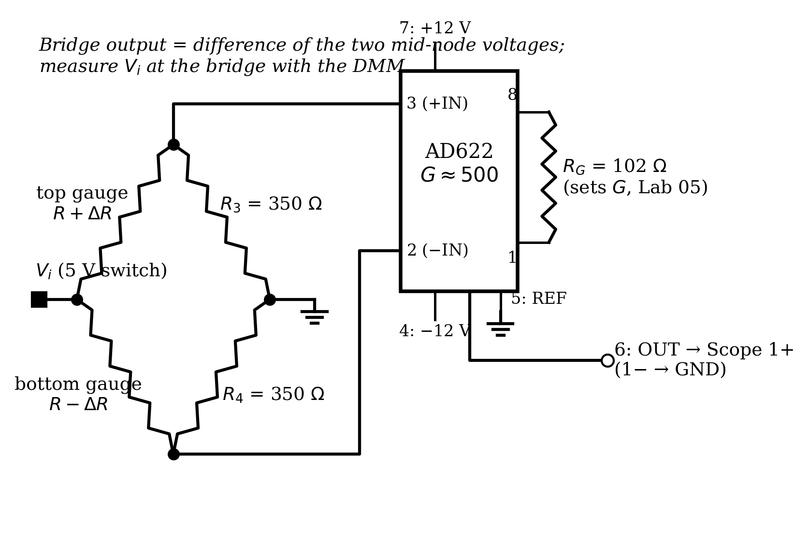
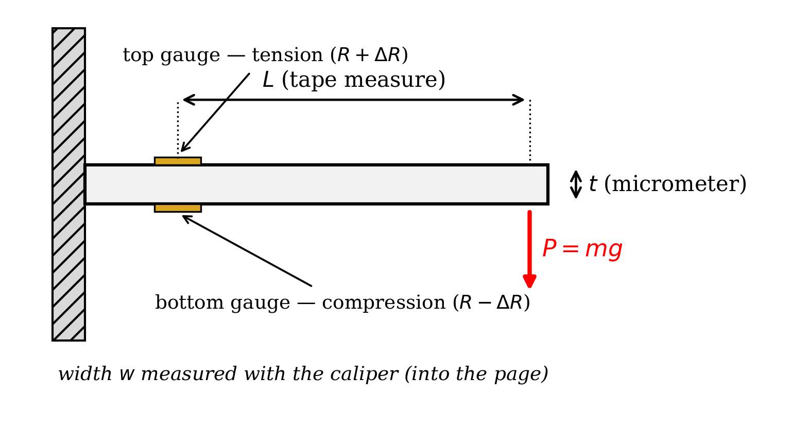
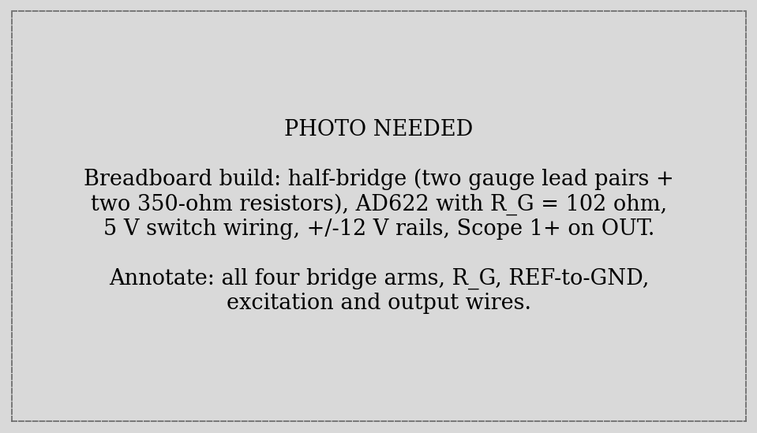
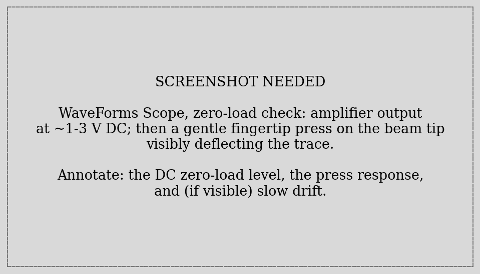
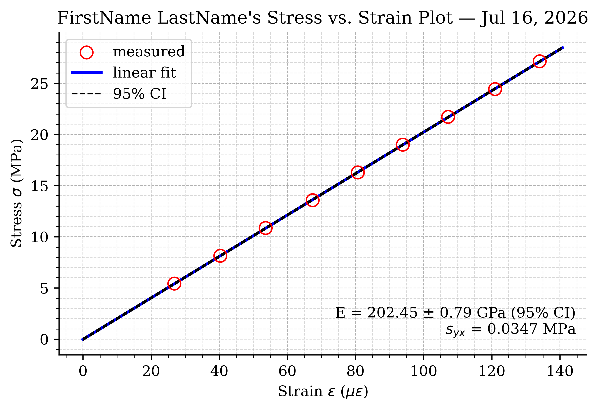
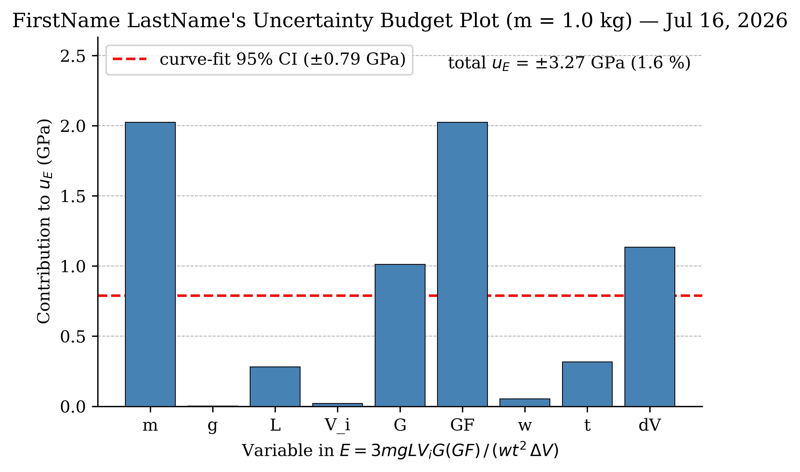



::: {.callout-important title="This is a TWO-WEEK lab"}
**Week 1:** Parts 1–4 — measure the beam, build the bridge + amplifier, acquire the load data, and fit Young's modulus.
**Week 2:** Parts 5–6 — uncertainty budget and the propagation-vs-fit comparison. Resume at the banner in @sec-week2.
:::

## Learning Objective

### Objectives

Your objectives for this laboratory session are to:

- Understand how a **strain gauge** converts deformation into a resistance change, and why a **Wheatstone bridge** is needed to read it
- Build a **half-bridge** (two active gauges) on a cantilevered beam and amplify its output with your Lab 05 instrumentation amplifier at $G \approx 500$
- Use a **bracketing procedure** (unload–load–unload) to cancel the slow drift that plagues high-gain bridge measurements
- Measure **Young's modulus** of the beam from a stress–strain regression, and compare against published values
- Construct a full **uncertainty budget** for $E$ by propagation of error, and learn the power rule that makes it fast
- Compare **propagated uncertainty** against the **curve-fit confidence interval** — and understand why they answer different questions

### Check Your Understanding

By the end of this lab, you should be able to answer all of these questions.

#### Hardware & Instruments

- A strain gauge's resistance changes by milliohms. Why can't you just measure that with your DMM?
- In the half-bridge, why do the two gauges sit on *opposite faces* of the beam? What common disturbance does that arrangement cancel?
- Why does this measurement need the AD622 at $G \approx 500$ — and why the *instrumentation* amplifier specifically (recall Lab 05 Part-6)?
- What does the zero-load amplifier output look like, and why isn't it zero?
- Why must nobody touch the wiring during data collection?

#### Programming

- What do `v[:-1]` and `v[1:]` return, and how do they pair each loaded reading with its bracketing unloaded readings?
- How does a list of `(name, value, uncertainty, exponent)` tuples plus one loop become a complete uncertainty budget?
- How do you draw a bar chart with `ax.bar`?

#### Data Analysis

- Why does averaging the *before* and *after* deltas cancel a linear drift?
- In $E = 3mgLV_iG(GF)/(wt^2\Delta V)$, why does $t$'s uncertainty count double?
- Your propagated $u_E$ is larger than the curve-fit CI. Which sources of error does the fit CI *not* see, and why not?
- If the gauge factor were wrong by 5%, by how much would your $E$ be wrong?



## Pre-Lab Setup

You should come to lab having completed all tasks in this section **before Week 1**.

### Extend Your Folder Structure

Add a Lab_06 folder set to your `ME3300` folder:

``` text
ME3300/
├── Lab_01/ ... Lab_05/
├── Lab_06/
│   ├── Code/
│   │   ├── Lab06_Prelab_Walkthrough.ipynb
│   │   └── FirstName_LastName_Lab06.ipynb
│   ├── Data/
│   └── Figures/
```

No new packages are needed this week.

### Read the Background Section

Read the [Background](#sec-background) section before lab. It derives every equation this lab runs on: the gauge relation, the half-bridge output, the beam-bending stress, and the uncertainty-propagation power rule.

### Complete the Prelab Walkthrough Notebook {#sec-prelab-walkthrough}

Download `Lab06_Prelab_Walkthrough.ipynb` from Canvas into `ME3300/Lab_06/Code/` and work through it before lab. It introduces this lab's *new* skills on a toy problem (the density of a measured cylinder):

- the **power rule** for propagating uncertainty through products, quotients, and powers
- building an **uncertainty budget** with a list of `(name, value, u, exponent)` tuples and one loop
- drawing the budget as a **bar chart** (`ax.bar`)
- pairing neighboring readings with **`v[:-1]` and `v[1:]`** slices — the bracketing trick

As always, working through the prelab will allow you to answer the **checkpoint** questions in the **Prelab quiz on Canvas** before your lab session.

### Python Quick Reference: New This Lab

| Task | Python command |
|------------------------------------|------------------------------------|
| All but the last element | `v[:-1]` |
| All but the first element | `v[1:]` |
| Pair neighbors (before/after) | `dv1 = v_load - v_unl[:-1]`, `dv2 = v_load - v_unl[1:]` |
| A table as data | `vars = [('m', 1.0, 0.01, +1), ...]` (list of tuples) |
| Unpack tuples in a loop | `for name, x, u, p in vars:` |
| Relative uncertainty term | `p * u / x` |
| Bar chart | `ax.bar(names, values)` |
| Nearest index lookup | `i = np.argmin(np.abs(masses - 1.0))` |

: New Python syntax and functions introduced in Lab 06 {#tbl-quickref}



## Laboratory Introduction

Strain measurement is one of the workhorse techniques of mechanical engineering: load cells, pressure transducers, torque sensors, and flight-test instrumentation are all, underneath, strain gauges on cleverly shaped metal. This two-week lab builds that entire measurement chain from parts you now understand individually — and then does something most courses skip: it asks, rigorously, *how well* you know your answer.

**Week 1** is construction and measurement. Two strain gauges are bonded to a cantilevered steel beam; you will wire them into a Wheatstone half-bridge, amplify the bridge's sub-millivolt output with your Lab 05 AD622 at a gain near 500, and record the output as you hang calibrated masses from the beam's end. Beam theory converts each mass into a bending **stress**; the bridge converts each voltage into a **strain**; the slope of stress vs. strain is **Young's modulus** — a fundamental material property, measured by you, with equipment you built. This is also the payoff of Lab 05's common-mode demo: the bridge's tiny differential signal rides on volts of common-mode voltage, exactly the situation the in-amp exists for.

A gain of 500 comes with a price: *everything* is amplified — including slow thermal drift in the bridge. You will defeat drift the way practicing engineers do, with procedure rather than better hardware: every loaded reading is **bracketed** by zero-load readings taken immediately before and after, and the two difference estimates are averaged.

**Week 2** is about honesty. Your $E$ depends on nine measured quantities — masses, gravity, three lengths, two gain-like factors, an excitation voltage, and a voltage change — each with its own uncertainty. You will propagate all nine into a single **uncertainty budget** for $E$, see at a glance which ones actually matter (the answer will surprise whoever lovingly measured the beam with a micrometer), and compare the propagated total against the curve-fit confidence interval from Week 1. Those two numbers disagree, and understanding *why* they disagree — scatter versus systematic error — is among the most transferable lessons this course offers.

## Background {#sec-background}

### The Strain Gauge

A metallic strain gauge is a thin zig-zag foil grid on a flexible backing, bonded to the surface it measures. Stretch the surface and the foil stretches with it: longer, thinner conductors mean higher resistance. For small strains the relationship is linear:

$$\frac{\Delta R}{R} = GF \cdot \varepsilon$$ {#eq-gf}

where $\varepsilon$ is the surface strain (m/m — dimensionless) and $GF$ is the **gauge factor**, about 2 for metallic foil gauges ($GF = 2.012$ for this apparatus). The catch is scale: engineering strains here are on the order of $100\ \mu\varepsilon$ ($100 \times 10^{-6}$), so a 350 Ω gauge changes by $\Delta R \approx 350 \times 2 \times 10^{-4} = 0.07$ Ω. Your DMM cannot resolve that reliably, and lead-wire resistance alone would swamp it. Reading strain gauges requires a circuit built for the job.

### The Wheatstone Half-Bridge

The Wheatstone bridge (@fig-bridge-schematic) converts a small *resistance* change into a small *voltage* — which amplifiers handle superbly. Two resistor pairs form two voltage dividers across the excitation $V_i$; the output is the *difference* between the divider midpoints. With all four resistances equal, that difference is exactly zero — the bridge is *balanced* — and any small unbalance appears directly as output voltage.

This lab's beam carries **two** gauges at the same axial station, one on top and one underneath (@fig-beam). Under an end load the top surface stretches ($R + \Delta R$) while the bottom compresses ($R - \Delta R$). Wiring them as the left-side dividers of the bridge — the **half-bridge** configuration — doubles the signal, and for equal-and-opposite arm changes the output is exactly linear in $\Delta R$. Two precision 350 Ω resistors complete the right side. The output is:

$$V_{bridge} = V_i \, \frac{\Delta R}{2R} = V_i \, \frac{GF \cdot \varepsilon}{2}$$ {#eq-halfbridge}

The half-bridge buys one more thing, and it is the reason the two gauges share one beam location: **temperature compensation**. A temperature change alters both gauges' resistance *identically* — both arms of the left divider move together, its midpoint stays put, and the output doesn't budge. Strain moves the arms *oppositely* and passes straight through. The bridge is a hardware implementation of "reject what is common, keep what differs" — the same idea as the in-amp's common-mode rejection, one level further upstream.

{#fig-bridge-schematic width="100%"}

### Amplification, and What You Actually Measure

Plug numbers into @eq-halfbridge: $V_i = 5$ V, $GF = 2$, $\varepsilon = 100\ \mu\varepsilon$ gives $V_{bridge} = 0.5$ mV. Hence the AD622 at $G \approx 500$ ($R_G = 102$ Ω, sized with Lab 05's gain equation), lifting the signal to comfortable few-hundred-millivolt scale. What your DAQ records is the amplified change from the unloaded state, $\Delta V = G \cdot \delta V_{bridge}$; inverting the chain gives strain:

$$\varepsilon = \frac{2\, \Delta V}{V_i \, G \cdot GF}$$ {#eq-strain}

Why the *instrumentation* amplifier and not a humble non-inverting stage? Both bridge output nodes sit near $V_i/2 = 2.5$ V. The signal is the millivolt-scale *difference* between them — Lab 05 Part-6, no longer a demo.

### Stress in an End-Loaded Cantilever

From beam theory, bending stress at the surface is $\sigma = Mc/I$ with bending moment $M = P L$ at the gauge station ($L$ = gauge-to-load distance, $P = mg$), surface distance $c = t/2$, and rectangular second moment $I = w t^3/12$:

$$\sigma = \frac{M c}{I} = \frac{(mgL)(t/2)}{w t^3/12} = \frac{6\,m g L}{w t^2}$$ {#eq-stress}

(Watch the algebra: one $t$ cancels, leaving $t^2$ in the denominator — a famous typo trap.) Hooke's law links the two sides of your measurement, $\sigma = E\,\varepsilon$, so plotting @eq-stress against @eq-strain for a range of masses gives a line whose slope is **Young's modulus** — fitted, with confidence intervals, by the Lab 02 machinery. For the uncertainty work in Week 2, the whole chain collapses into one formula by substituting @eq-strain into $E = \sigma/\varepsilon$:

$$E = \frac{3\,m g L\, V_i\, G \cdot GF}{w\, t^2\, \Delta V}$$ {#eq-E-single}

{#fig-beam width="100%"}

### Drift, and the Bracketing Procedure

At $G = 500$, a 20 µV wander at the bridge — thermal effects in gauges, resistors, and connections — is a 10 mV wander at your DAQ, comparable to the signal from 100 g. You will see it: the zero-load output creeps over the session. The countermeasure is procedural. For each mass, take an unloaded reading, a loaded reading, and another unloaded reading, and form two estimates of the change: $\Delta V_1 = V_{loaded} - V_{unl,before}$ and $\Delta V_2 = V_{loaded} - V_{unl,after}$. Drift pushes one estimate up and the other down by nearly the same amount, so their **average cancels linear drift** — and their *disagreement* hands you a free, honest estimate of the uncertainty in $\Delta V$ (you will use exactly that in Week 2).

### Propagation of Uncertainty and the Power Rule

Every measured input carries uncertainty; the question is how much each one matters to the result. For a result $R = f(x_1, x_2, \ldots)$ with independent uncertainties $u_{x_i}$, the standard (RSS) propagation is:

$$u_R = \sqrt{\sum_i \left( \frac{\partial R}{\partial x_i}\, u_{x_i} \right)^2}$$ {#eq-rss}

Equation @eq-E-single is a pure product of powers, $E = C \prod x_i^{\,p_i}$, and for that form the partial derivatives collapse into something wonderfully simple — the **power rule**:

$$\frac{u_E}{E} = \sqrt{ \sum_i \left( p_i \, \frac{u_{x_i}}{x_i} \right)^2 }$$ {#eq-power-rule}

In words: convert every uncertainty to a *relative* (percent) uncertainty, multiply each by its exponent's magnitude, and combine by root-sum-square. The exponents in @eq-E-single are $+1$ for $m, g, L, V_i, G, GF$; $-1$ for $w$ and $\Delta V$; and $-2$ for $t$ — thickness uncertainty counts double. The prelab walkthrough derives and practices this rule; in lab it turns a nine-variable propagation into ten lines of Python.



## Part-1: Measure the Beam (Week 1) {#sec-part-1}

Three lengths, three instruments — chosen so each dimension gets appropriate resolution.

1. With the **tape measure**: the distance $L$ from the *center of the gauges* to the load point (the hanger groove). Note the tape's resolution.
2. With the **caliper**: the beam width $w$. Note its resolution.
3. With the **micrometer**: the beam thickness $t$. Note its resolution. Measure all three dimensions **three times each** and record every reading — the spreads feed Week 2.
4. Determine local gravity from the [local gravity calculator](https://www.sensorsone.com/local-gravity-calculator/) using latitude 46.7324 and elevation 2579 ft. (It differs from 9.81 in the third decimal — and you will find out in Week 2 whether that matters.)

::: {.callout-important title="Logbook Questions"}
**Q1.** Record all measurements (three per dimension), their means, each instrument's resolution, and local $g$.

**Q2.** Why does $t$ get the micrometer while $L$ makes do with a tape measure? Answer with the exponents of @eq-E-single in hand — which dimension can least afford error?
:::

## Part-2: Build the Bridge and Amplifier (Week 1) {#sec-part-2}

Build with **supplies off and WaveForms closed**. Your guides: @fig-bridge-schematic and the photo in @fig-bridge-build.

{#fig-bridge-build width="100%"}

1. Identify the two gauge lead pairs at the beam (note which is the top gauge). **Measure each gauge's resistance with the DMM** — expect ≈350 Ω. Handle the leads gently; the bonded foil does not forgive tugging.
2. Wire the half-bridge per @fig-bridge-schematic: gauges as the left arms, the two precision 350 Ω resistors as the right arms. Excitation from the ADS **5 V switch**; bridge ground to the GND rail.
3. Rebuild your Lab 05 AD622 with $R_G = 102$ Ω (**measure it**; compute $G$ from Lab 05's gain equation). Bridge midpoints → pins 3 and 2; ±12 V rails; **REF (pin 5) → GND**; OUT → Scope 1+ (1− → GND).
4. TA check. Then power up (5 V switch on; ±12 V via Supplies), and **measure the actual excitation $V_i$ at the bridge with the DMM** — @eq-strain uses this number, not the nominal 5.
5. Open the WaveForms **Scope** and look at the output live (GUI first, as always): a steady DC level — the *zero-load output* — most likely not zero, and possibly a volt or more. Watch it for a minute: it will wander slightly. Now press *gently* on the beam tip with a fingertip and watch the trace respond; compare @fig-zeroload. Close WaveForms when done.

{#fig-zeroload width="100%"}

::: {.callout-important title="Logbook Questions"}
**Q3.** Record both gauge resistances, $R_G$, your computed $G$, and the measured $V_i$. The gauges read ≈350 Ω on the DMM — why is the DMM nonetheless hopeless for measuring the *strain-induced change* in that resistance?

**Q4.** The zero-load output is not zero. Give two physical reasons. Why is that acceptable — what does your measurement procedure do about it?

**Q5.** What *extraneous effect* does the half-bridge configuration compensate for, and how does having the two gauges at the *same location on opposite faces* accomplish it?
:::



## Part-3: Acquire the Load Data (Week 1) {#sec-part-3}

Open `FirstName_LastName_Lab06.ipynb` (starter on Canvas). One script walks you through the whole bracketed loading sequence: for each mass, it takes an unloaded reading, prompts you to load, takes the loaded reading, prompts you to unload, and reads zero again. Each reading averages 10 seconds at 50 Hz.

::: {.callout-warning title="Hands off the wires"}
At $G = 500$, shifting a jumper wire or leaning on the bench moves your readings by more than the smallest mass does. Once acquisition starts: only the loader's hands near the apparatus, only on the weights, and gently — no bouncing the beam.
:::

``` python
import dwfpy as dwf
import numpy as np
import time

masses = np.arange(0.4, 2.01, 0.2)     # kg
v_unloaded = []                         # 10 readings (one per bracket)
v_loaded   = []                         # 9 readings

fs, duration = 50, 10.0
n = int(fs * duration)

with dwf.Device() as device:
    supplies = device.analog_io          # ±12 V for the AD622
    supplies['V+']['Voltage'].value = 12.0
    supplies['V+']['Enable'].value  = True
    supplies['V-']['Voltage'].value = -12.0
    supplies['V-']['Enable'].value  = True
    supplies.master_enable = True        # (bridge runs off the 5 V switch)
    time.sleep(0.5)

    scope = device.analog_input
    scope['ch1'].setup(range=5.0)

    def read_mean():
        """One 10-second averaged reading of the amplifier output."""
        scope.single(sample_rate=fs, buffer_size=n, configure=True, start=True)
        return scope['ch1'].get_data().mean()

    input("Beam UNLOADED and still. Hands off the bench, then Enter...")
    v_unloaded.append(read_mean())
    print(f"  unloaded: {v_unloaded[-1]:.5f} V")

    for m in masses:
        input(f"GENTLY hang {m:.1f} kg, let it settle, then Enter...")
        v_loaded.append(read_mean())
        print(f"  {m:.1f} kg loaded: {v_loaded[-1]:.5f} V")

        input("GENTLY remove the mass, then Enter...")
        v_unloaded.append(read_mean())
        print(f"  unloaded: {v_unloaded[-1]:.5f} V")

    supplies.master_enable = False

v_unloaded = np.array(v_unloaded)
v_loaded   = np.array(v_loaded)

np.savetxt('../Data/StrainBridge_Loads.csv',
           np.column_stack([masses, v_loaded,
                            v_unloaded[:-1], v_unloaded[1:]]),
           header='mass_kg,v_loaded_V,v_unl_before_V,v_unl_after_V',
           delimiter=',')
```

The structure is all Lab 04–05 material (a prompted `input()` loop, a helper `def`, `scope.single` averaging); the one new idiom is at the very bottom:

- **`v_unloaded[:-1]` and `v_unloaded[1:]`** — slices meaning *all but the last* and *all but the first*. The ten unloaded readings interleave the nine loaded ones, so `[:-1]` lines each loaded reading up with the zero *before* it, and `[1:]` with the zero *after* it. Two shifted views of one array — no loop required. (Practiced in the prelab.)
- Note each unloaded reading does double duty: it closes one mass's bracket and opens the next. Nineteen readings, nine fully bracketed load points.

::: {.callout-important title="Logbook Questions"}
**Q6.** Watch the printed unloaded values as the run proceeds and record the first and last. How much did the zero drift over the session, and what would that drift have done to your data if you had used only one zero reading at the start?

**Q7.** What is *hysteresis*? Where in this experiment could it appear, and what parts of the procedure (gentle loading, settling time, bracketing) help mitigate it?
:::

## Part-4: Fit Young's Modulus (Week 1) {#sec-part-4}

Analysis time — deltas, stress, strain, slope. First enter your measured parameters:

``` python
# Beam geometry (Part-1, measured)
L  = 0.3595      # m — gauge center to load point (tape measure, res 1 mm)
w  = 0.03805     # m — beam width (caliper, res 0.02 mm)
t  = 0.00640     # m — beam thickness (micrometer, res 0.01 mm)

# Local gravity (Part-1, sensorsone.com: lat 46.7324, elev 2579 ft)
g  = 9.8051      # m/s^2

# Bridge and amplifier (Part-2, measured)
GF   = 2.012     # gauge factor (apparatus datasheet)
R_G  = 101.7     # ohms — measured gain resistor
G    = 1 + 50500.0 / R_G          # AD622 gain (Lab 05, Eq. 3)
V_i  = 4.987     # V — excitation, measured at the bridge with the DMM

print(f"amplifier gain G = {G:.1f}")
```

Then the deltas and the fit — @eq-strain and @eq-stress in code, and the slope machinery of Lab 02:

``` python
from scipy import stats

data = np.loadtxt('../Data/StrainBridge_Loads.csv', delimiter=',', comments='#')
masses   = data[:, 0]
v_load   = data[:, 1]
v_before = data[:, 2]
v_after  = data[:, 3]

# Two delta estimates per mass; their average cancels linear drift (Eq. 6)
dv1 = v_load - v_before
dv2 = v_load - v_after
dV  = (dv1 + dv2) / 2                  # amplified output change (V)

print("mass (kg) |  dv1 (mV) |  dv2 (mV) | dV_avg (mV)")
for m, a, b, c in zip(masses, dv1, dv2, dV):
    print(f"   {m:4.1f}   |  {a*1000:7.1f}  |  {b*1000:7.1f}  |  {c*1000:7.1f}")

# Strain from the half-bridge relation (Eq. 5), stress from bending (Eq. 3)
strain = 2 * dV / (V_i * G * GF)                 # m/m
stress = 6 * masses * g * L / (w * t**2)         # Pa

# Young's modulus = slope of stress vs strain (Lab 02 machinery)
coeffs = np.polyfit(strain, stress, 1)
E_fit  = coeffs[0]

N      = len(strain)
nu     = N - 2
resid  = stress - np.polyval(coeffs, strain)
norm_r = np.sqrt(np.sum(resid**2))
s_yx   = norm_r / np.sqrt(nu)
S_E    = s_yx / np.sqrt(np.sum((strain - strain.mean())**2))
CI_E   = stats.t.ppf(0.975, df=nu) * S_E

print(f"\nE = {E_fit/1e9:.2f} ± {CI_E/1e9:.2f} GPa (95% CI from the fit)")
print("published: steel 190–210 GPa, aluminum ~69 GPa, brass ~100 GPa")
```

Copy the printed delta table into your logbook (it *is* the classic strain-lab data table, computed rather than hand-filled), then build the stress–strain figure to match @fig-example-stressstrain — strain in $\mu\varepsilon$, stress in MPa, fit line, 95% CI band, and $E$ annotated. Format per Post-Lab; save **.pdf**/**.png** at 600 DPI.

::: {.callout-important title="Logbook Questions"}
**Q8.** Record $E \pm$ CI. Which material is your beam, judging from published moduli? How far (in %) is your $E$ from the published mid-range value?

**Q9.** Compare `dv1` and `dv2` in your table: how big is their typical disagreement, and what physical effect from @sec-background does it measure? Keep this number — Week 2 uses it.
:::

### Example Result

{#fig-example-stressstrain width="6.5in"}

**End of Week 1.** Show your stress–strain plot to a TA, then tear down *gently* (supplies off first; never pull gauge leads), and see Before You Leave. Your notebook and data files carry over to Week 2.



## WEEK 2 RESUMES HERE {#sec-week2}

::: {.callout-important title="Week 2 checklist before you start"}
You need from Week 1: your notebook run through Part-4 (with `E_fit`, `CI_E`, `dv1`, `dv2`, `dV` defined), your `StrainBridge_Loads.csv`, and your logbook geometry/instrument records (Q1, Q3). **No hardware is needed in Week 2** — this is an analysis session. If your Week 1 data is unusable, see your TA for the recovery dataset.
:::

## Part-5: The Uncertainty Budget {#sec-part-5}

Week 1 produced $E$ with a confidence interval from the *fit*. But the fit only knows about scatter between your nine points — it is blissfully ignorant that your gauge factor, gain, and excitation could each be a little wrong *in the same direction for every point*. Propagation of error accounts for all of it.

Assemble the uncertainties, one per variable of @eq-E-single. Most come from your logbook; two deserve comment. The gain's uncertainty comes from the resistor that sets it ($u_G/G \approx u_{R_G}/R_G$, since $G - 1 \propto 1/R_G$ and $G \gg 1$). And $\Delta V$'s uncertainty is the one your bracketing procedure measured for free (Q9): half the typical disagreement between your two delta estimates.

``` python
u_dV = np.abs(dv1 - dv2).mean() / 2        # V — empirical, from bracketing
print(f"empirical u_dV = {u_dV*1000:.2f} mV")

def budget(m_eval, dV_eval):
    """Uncertainty budget for E at one mass. Returns (names, contribs, total)."""
    # (name, value, uncertainty, exponent in E)
    variables = [
        ('m',   m_eval,  0.01 * m_eval,      +1),   # 1% (weight set)
        ('g',   g,       1e-5 * g,           +1),   # 0.001%
        ('L',   L,       0.0005,             +1),   # tape: half of 1 mm
        ('V_i', V_i,     0.0005,             +1),   # DMM: half of 1 mV
        ('G',   G,       0.005 * G,          +1),   # R_G tolerance -> gain
        ('GF',  GF,      0.01 * GF,          +1),   # 1% (datasheet)
        ('w',   w,       0.00001,            -1),   # caliper: half of 0.02 mm
        ('t',   t,       0.000005,           -2),   # micrometer: half of 0.01 mm
        ('dV',  dV_eval, u_dV,               -1),   # empirical (above)
    ]
    names    = [v[0] for v in variables]
    rel      = np.array([p * u / x for _, x, u, p in variables])
    contribs = np.abs(rel) * E_fit           # per-variable, in Pa
    total    = np.sqrt(np.sum(contribs**2))
    return names, contribs, total


for m_eval in [0.4, 1.0, 1.4]:
    i = np.argmin(np.abs(masses - m_eval))
    names, contribs, total = budget(masses[i], dV[i])
    print(f"\n--- m = {masses[i]:.1f} kg ---")
    for name, cont in zip(names, contribs):
        print(f"  {name:>3}: ±{cont/1e9:6.3f} GPa")
    print(f"  TOTAL: ±{total/1e9:.3f} GPa  ({total/E_fit*100:.2f} %)")

print(f"\ncurve-fit 95% CI, for comparison: ±{CI_E/1e9:.3f} GPa")
```

- The **list of tuples** is the whole budget as data: each row is one variable of @eq-E-single with its value, uncertainty, and exponent. The loop `for name, x, u, p in variables:` unpacks a row per pass (Lab 05's tuple unpacking, now in a loop), and `p * u / x` is one term of @eq-power-rule. Ten lines replace nine hand-propagated partial derivatives — *because* the equation is a pure power law; for anything messier you'd be back to @eq-rss.
- **`np.argmin(np.abs(masses - m_eval))`** finds the index of the mass closest to a requested value — a tidy idiom for "look up this row".
- **`0.01 * m_eval`**, etc.: uncertainties assigned per the apparatus — 1% on masses, 1% on $GF$ (datasheet), 0.001% on $g$, half a resolution step on each length and on $V_i$, $R_G$'s tolerance on $G$, and your empirical `u_dV`. Substitute *your* logbook values where they differ.

Now do it **by hand once**: pick $m = 0.4$ kg and fill in the hand-calculation table in your logbook (variable, value, uncertainty, exponent, contribution in GPa, RSS total), confirming your Python line by line. Then build the bar-chart figure to match @fig-example-budget (contributions at $m = 1.0$ kg, with the curve-fit CI drawn as a reference line):

``` python
i = np.argmin(np.abs(masses - 1.0))            # budget at m = 1.0 kg
names, contribs, total = budget(masses[i], dV[i])

fig, ax = plt.subplots(figsize=(6.5, 4.0))
fig.patch.set_facecolor('white')

bars = ax.bar(names, contribs / 1e9, color='steelblue', edgecolor='black',
              linewidth=0.5, zorder=3)
ax.axhline(CI_E / 1e9, color='red', linestyle='--', linewidth=1.5,
           label=f'curve-fit 95% CI (±{CI_E/1e9:.2f} GPa)')
```

**`ax.bar(names, values)`** is the whole trick for a bar chart — categories on x, heights on y; everything else you know (grids, spines, labels, `ax.text`) applies unchanged. Finish per the Post-Lab requirements; save **.pdf**/**.png** at 600 DPI.

::: {.callout-important title="Logbook Questions"}
**Q10.** Complete the hand-calculation table for $m = 0.4$ kg (all nine variables). Does your hand total match Python's?

**Q11.** Which two or three variables dominate the budget? For each, say concretely what you would change (equipment, procedure, or design) to shrink it. Was the micrometer precision on $t$ worth it?

**Q12.** Compare the totals at 0.4, 1.0, and 1.4 kg. Which contribution shrinks as mass grows, and why do the others stay constant in *percent* terms?
:::

### Example Result

{#fig-example-budget width="6.5in"}

## Part-6: Two Answers, One Question (Week 2) {#sec-part-6}

You now hold two uncertainty statements about the same $E$:

- the **curve-fit 95% CI** (Part-4) — computed from how much your nine points scatter about the line;
- the **propagated uncertainty** (Part-5) — computed from what you know about every instrument in the chain.

They are not estimates of the same thing, and yours almost certainly disagree. The fit CI sees only *random, point-to-point* effects: drift residue, reading noise, loading variations. It is completely blind to *systematic* effects — if your $GF$ is 1% high, **every** point's strain is 1% low, the points still fall on a beautiful line, the fit is serenely confident, and $E$ is 1% wrong. Propagation counts those shared errors; scatter cannot reveal them.

::: {.callout-important title="Logbook Questions"}
**Q13.** Report both numbers side by side. Which is larger, by what factor, and which *sources* in your Part-5 budget does the fit CI not see?

**Q14.** Suppose the manufacturer's $GF$ were wrong by 5%. What happens to your stress–strain plot's *appearance*, and what happens to your reported $E$? What is the only way to catch such an error?
:::



## Post-Lab Assignment

Upload your submissions to Canvas. [**Post-labs are due Mondays at 10:00 pm.**]{.underline} A full example solution notebook is posted after all sections have met; check your approach against it, but submit your own work.

### Week 1 Submission Items

- Your **.ipynb** notebook through Part-4, restarted and run top-to-bottom
- Stress–strain plot, **.pdf**
- Week 1 post-lab questions on Canvas

### Week 2 Submission Items

- Your final **.ipynb** notebook (`FirstName_LastName_Lab06.ipynb`) including the budget
- Uncertainty budget bar chart, **.pdf**
- A photo/scan of your **hand-calculation table** (Q10)
- Week 2 post-lab questions on Canvas

### Stress–Strain Plot Requirements

- Figure size: 6.5" wide × 4.0" tall; white background; Times font, 10–12 pt
- Data: red open circles, size 75; fit: solid blue, 2 pt; 95% CI: dashed black, 1 pt
- Strain axis in $\mu\varepsilon$; stress axis in MPa; major and minor grids; top/right spines removed
- Axis labels with units; title "FirstName LastName's Stress vs. Strain Plot" with the date
- `ax.text` annotation: $E \pm$ CI in GPa (2 decimals) and $s_{yx}$ with units

### Uncertainty Budget Plot Requirements

- Figure size: 6.5" wide × 4.0" tall; white background; Times font, 10–12 pt
- One bar per variable of @eq-E-single (all nine), heights in GPa, steel-blue with black edges
- The curve-fit 95% CI drawn as a dashed red horizontal reference line, in the legend
- y-axis major grid; top/right spines removed; axis labels; title "FirstName LastName's Uncertainty Budget Plot (m = 1.0 kg)" with the date
- `ax.text` annotation: the RSS total $u_E$ in GPa and in percent

### Post-Lab Questions

1.  Report $E \pm$ CI (fit) and $E \pm u_E$ (propagated). What material is the beam?
2.  Derive the power-rule exponent for $t$: starting from @eq-stress and $c$, $I$, show why thickness enters $E$ as $t^{-2}$ and therefore counts double in @eq-power-rule.
3.  Rank your top three uncertainty contributors and propose one concrete improvement for each. Which proposed improvement buys the most for the least effort?
4.  Why is the propagated $u_E$ larger than the fit CI? Name two error sources included in the former and invisible to the latter, and explain *why* the fit cannot see them.
5.  A colleague suggests using a *quarter*-bridge (one active gauge, three fixed resistors) to save a gauge. Name two things you would lose, referring to @eq-halfbridge and the temperature-compensation argument.

## Before You Leave (both weeks)

- **Supplies off** (Master Enable and the 5 V switch) before touching any wire.
- Week 1: leave the gauges wired to the beam exactly as found; remove only *your* breadboard wiring. Never pull on gauge leads.
- Return weights to their rack in order; chips to their containers; wires to the bin, sorted by color.
- Confirm your data files have synced to OneDrive (check on a second device) and that **both** partners have everything.
- Clean the station, collect your belongings, and log off.
