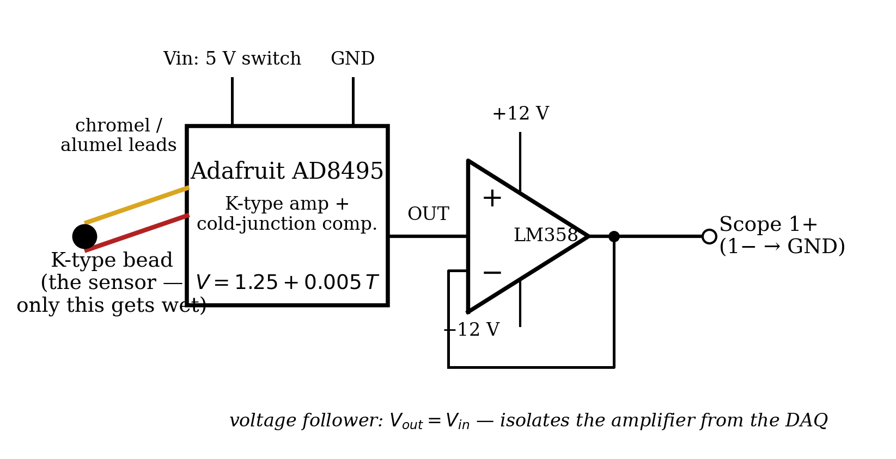
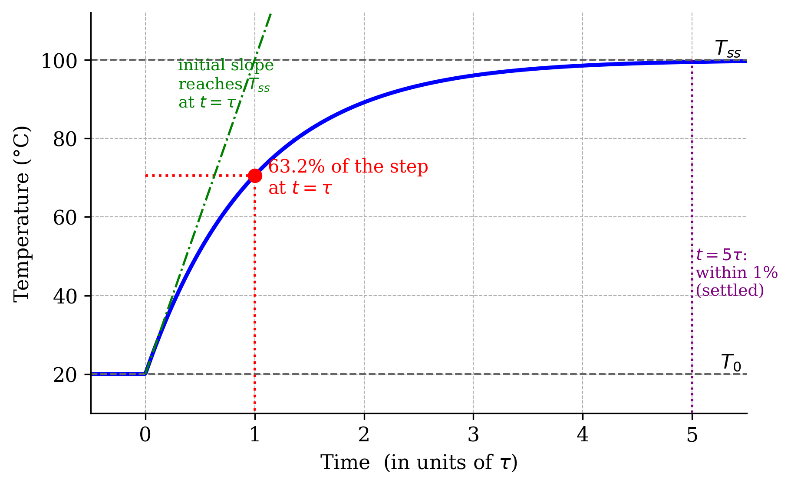
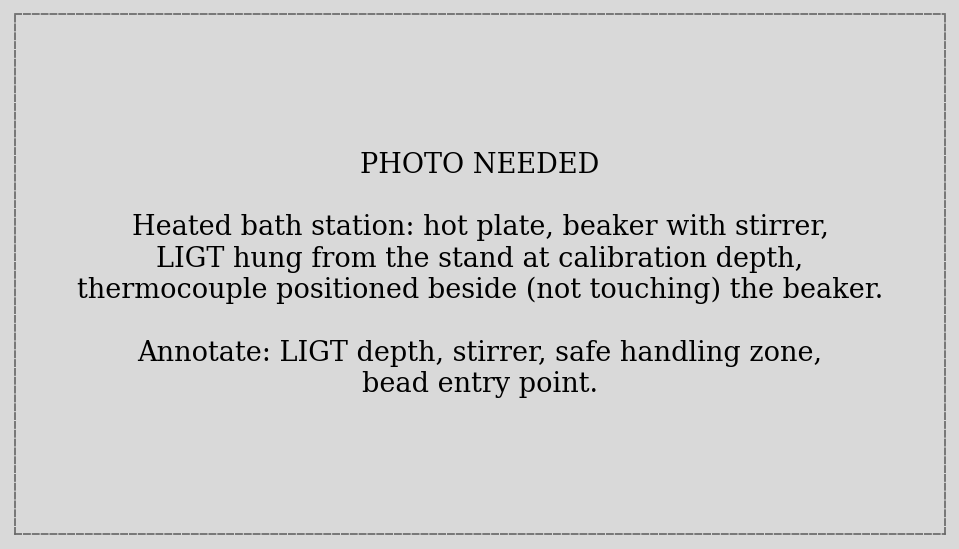
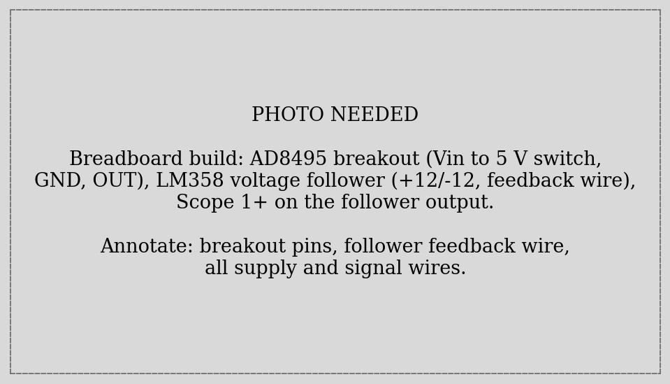
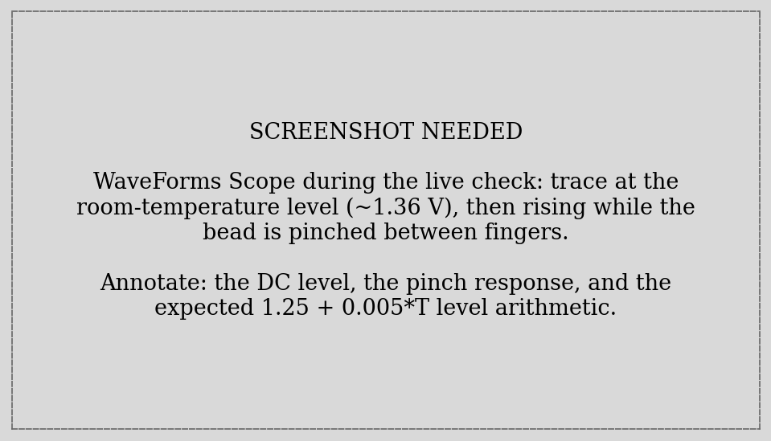
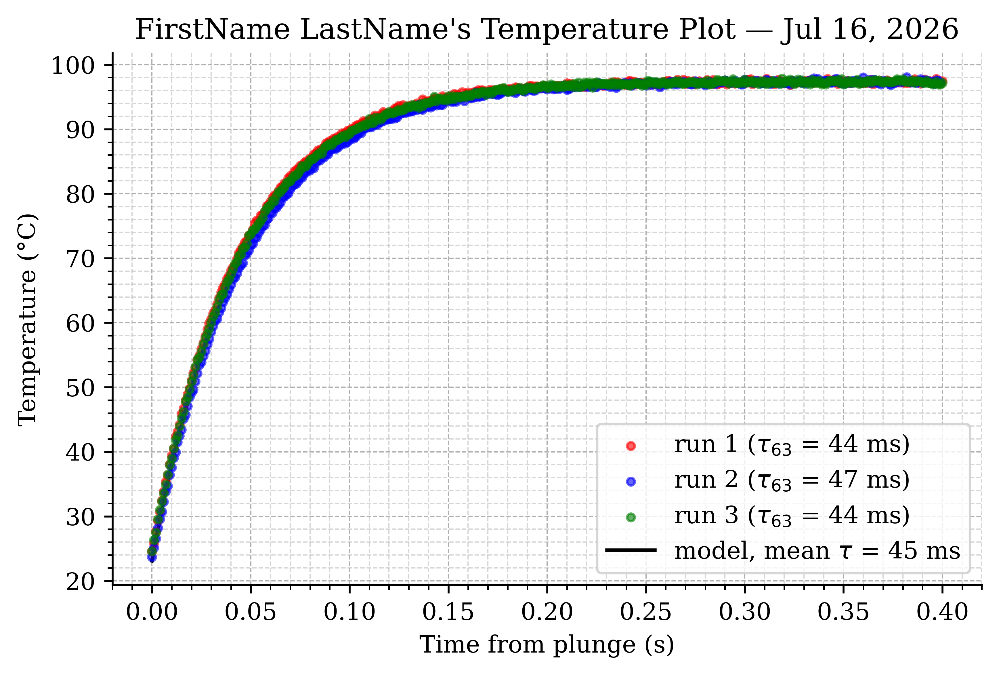
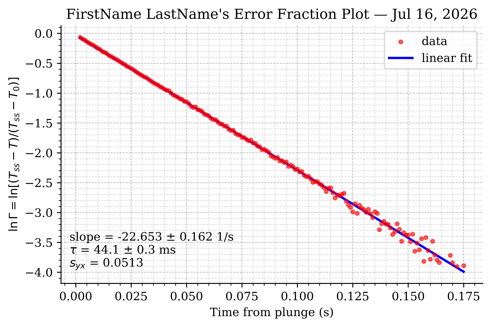



## Learning Objective

### Objectives

Your objectives for this laboratory session are to:

- Measure temperature with a **K-type thermocouple** and understand the signal chain that makes its microvolt output usable (Seebeck effect → cold-junction compensation → amplification → buffering)
- Perform a **two-point calibration** of the complete measurement chain against a liquid-in-glass thermometer, and compare it with the amplifier datasheet
- Capture the thermocouple's **step response** by plunging it into a near-boiling bath — three repeated runs at 1000 Hz
- Extract the **time constant** $\tau$ two independent ways: the **63.2% method** and the **error-fraction (log-linear) method**, and reconcile them
- Use **log-transform linearization** to turn an exponential into a `polyfit` problem — one of the oldest and best tricks in data analysis
- Judge, from your own $\tau$, what sample rate a dynamic measurement *needs* — Lab 04's lesson, now with a sensor you characterized yourself

### Check Your Understanding

By the end of this lab, you should be able to answer all of these questions.

#### Hardware & Instruments

- What physical effect makes a thermocouple produce voltage, and why is *cold-junction compensation* required?
- What does the AD8495 output at 25 °C? (Datasheet: $V = 1.25 + 0.005\,T$.)
- What does the voltage follower do, and — with the ADS's 1 MΩ input — was it strictly necessary here?
- Why must only the bead enter the water?
- Why do we calibrate the *whole chain* against the LIGT instead of trusting the datasheet?

#### Programming

- Why does `T[10:] - T[:-10] > 5.0` detect the plunge while single-sample `np.diff` thresholds misfire on noise?
- How does the cool-down gate (`while True` + a quick capture + `break`) know when the bead is ready for the next run?
- What does `np.log` of the error fraction accomplish, and what shape should the result have?

#### Data Analysis

- A first-order sensor reaches what fraction of a step at $t = \tau$? At $t = 5\tau$?
- Why should $T_{ss}$ in the error-fraction method come from the LIGT rather than the tail of your data?
- Why does the $\ln\Gamma$ scatter grow at late times?
- Your $\tau$ is ~50 ms. Defend a sample-rate choice for measuring this sensor's transient.



## Pre-Lab Setup

You should come to lab having completed all tasks in this section.

### Extend Your Folder Structure

Add a Lab_08 folder set to your `ME3300` folder:

``` text
ME3300/
├── Lab_01/ ... Lab_06/
├── Lab_08/
│   ├── Code/
│   │   ├── Lab08_Prelab_Walkthrough.ipynb
│   │   └── FirstName_LastName_Lab08.ipynb
│   ├── Data/
│   └── Figures/
```

No new packages are needed this week.

### Read the Background Section

Read the [Background](#sec-background) section before lab. It covers the thermocouple signal chain, derives the first-order step response, and sets up both time-constant methods.

### Complete the Prelab Walkthrough Notebook {#sec-prelab-walkthrough}

Download `Lab08_Prelab_Walkthrough.ipynb` from Canvas into `ME3300/Lab_08/Code/` and work through it before lab. It introduces this lab's *new* skills on simulated first-order data:

- generating and recognizing **exponential step responses** (`np.exp`)
- the **63.2% method** on noisy data
- **log-transform linearization**: `np.log` of the error fraction, fit with `polyfit`
- how the choice of **fit range** (the $\Gamma$ mask) moves the answer
- **gap differencing** (`T[10:] - T[:-10]`) for robust step detection

As always, working through the prelab will allow you to answer the **checkpoint** questions in the **Prelab quiz on Canvas** before your lab session.

### Python Quick Reference: New This Lab

| Task | Python command |
|------------------------------------|------------------------------------|
| Exponential | `np.exp(-t / tau)` |
| Natural log (elementwise) | `np.log(Gamma)` |
| Rise across a 10-sample gap | `rise10 = T[10:] - T[:-10]` |
| First index passing a test | `np.argmax(rise10 > 5.0)` (Lab 03) |
| Error fraction | `Gamma = (Tss - T) / (Tss - T0)` |
| Keep only the exponential range | `valid = (Gamma > 0.02) & (Gamma < 0.95)` (Lab 05 masks) |
| Wait for a condition (cool-down) | `while True:` + quick capture + `break` (Lab 04) |

: New Python syntax and functions introduced in Lab 08 {#tbl-quickref}



## Laboratory Introduction

Until now, every quantity you measured held still while you measured it. This week's quantity *moves*: you will plunge a thermocouple from room-temperature air into near-boiling water and record the fastest event this course has asked you to capture — a temperature step that is 95% finished in a quarter of a second.

The scientific payload is **dynamic response**. No sensor reports a change instantly; the thermocouple bead must physically *warm up*, and the physics of that warming (a heat balance on the bead) makes it a **first-order system** — the simplest and most common dynamic model in measurement engineering. First-order behavior is characterized by a single number, the **time constant** $\tau$, and this lab measures it twice, by two methods with very different personalities: a quick graphical read-off (the 63.2% method), and a full-data regression built on a log transform (the error-fraction method). The second method smuggles in a technique you will reuse for the rest of your career: **linearizing** a nonlinear model so that ordinary least squares — your trusty `polyfit` — can fit it.

The lab also completes a running theme. The signal chain here is the whole course in one circuit: a sensor producing *microvolts* (the thermocouple), a specialized amplifier fixing its famous reference-junction problem (the AD8495), a **voltage follower** you build from Lab 05's op-amp golden rules, a **two-point calibration** of the entire chain against a trusted reference (the liquid-in-glass thermometer — hereafter LIGT), and a **sample-rate decision** that your own Lab 04 aliasing experiment now equips you to defend. When your measured $\tau$ turns out to be tens of milliseconds, ask yourself what the draft plan of "log at 10 Hz" would have captured.

**Safety first:** this lab involves boiling water and electronics on one bench. Read the Part-1 safety notes before touching anything, and start the hot plate the moment you arrive — physics won't hurry, and the water needs to be simmering before Part-3.

## Background {#sec-background}

### The Thermocouple and Its Signal Chain

Join two dissimilar metal wires and the junction develops a small voltage that depends on temperature — the **Seebeck effect**. A K-type thermocouple (chromel–alumel) produces about 41 µV/°C: robust, fast, cheap, usable over a huge range, and *far* too small to read directly. Worse, the connection between the thermocouple wires and your copper circuit forms a *second* junction that generates its own opposing voltage — historically fixed by holding that "cold junction" in ice water. The **AD8495** solves both problems on one chip: it amplifies the K-type signal and adds an electronic **cold-junction compensation** measured at the chip itself. Its output (per the Adafruit breakout's datasheet) is:

$$V = 1.25 + 0.005 \, T \qquad \Longleftrightarrow \qquad T = 200\,V - 250$$ {#eq-ad8495}

with $T$ in °C: 5 mV/°C riding on a 1.25 V offset (so temperatures below 0 °C stay above ground on a single 5 V supply).

Between the AD8495 and your DAQ sits a **voltage follower** (@fig-signal-chain) — Lab 05's op-amp with its output wired straight to its inverting input. The golden rules make short work of it: $V_- = V_+$ and $V_- = V_{out}$, so $V_{out} = V_{in}$, gain of exactly 1. Its job is not gain but **isolation**: the follower's input draws essentially no current from the amplifier, while its output happily drives whatever is downstream. Honest note: the ADS scope input is 1 MΩ and the AD8495 could drive it directly — the follower here is a *lesson* more than a necessity (Q2 asks you to weigh in). It does add a few millivolts of offset (every op-amp does), and Part-3 shows why that doesn't matter.

{#fig-signal-chain width="100%"}

### Why Calibrate a Pre-Calibrated Chip?

@eq-ad8495 is the *chip's* calibration. Your measurement chain is the chip **plus** the follower's offset **plus** any supply and wiring imperfections. A **two-point calibration** against the LIGT — one reading in room air, one in the near-boiling bath — pins down the chain's actual line $T = a_1 V + a_0$. Expect $a_1$ within a few percent of the datasheet's 200 °C/V, and $a_0$ a degree or so off $-250$ — that offset *is* the voltage follower, measured. (Two points determine the line exactly, so there are no residuals and no fit statistics — recall Lab 03's four-point calibration left only 2 degrees of freedom; two points leave zero. Q5 asks what a third point would buy.) One subtlety: water here does not boil at 100 °C — at this elevation it boils near **97 °C**, and the LIGT, not an assumption, is your reference.

### First-Order Dynamic Response

Dunk the bead (mass $m$, specific heat $c_p$, surface area $A$) into water at $T_{ss}$. Newton's law of cooling gives the heat balance:

$$m c_p \frac{dT}{dt} = h A \,(T_{ss} - T)$$ {#eq-ode}

— a first-order ODE (one energy-storage element, hence *first-order system*). Its step response is the exponential approach:

$$T(t) = T_{ss} + (T_0 - T_{ss})\, e^{-t/\tau}, \qquad \tau = \frac{m c_p}{h A}$$ {#eq-step}

@fig-anatomy shows the anatomy. At $t = \tau$ the response has covered $1 - e^{-1} = 63.2\%$ of the step; by $5\tau$ it is within 1% (settled). And @eq-step's $\tau$ formula predicts the physics you should expect: a smaller bead (less $m$, relatively more $A$) responds faster, and a medium with better heat transfer (stirred water ≫ still air) shrinks $\tau$ dramatically.

{#fig-anatomy width="90%"}

### Two Ways to Measure $\tau$

**Method 1 — the 63.2% read-off.** Compute the crossing level directly from @eq-step:

$$T(\tau) = T_0 + 0.632\,(T_{ss} - T_0)$$ {#eq-t63}

and find the time at which the data first crosses it. Fast and intuitive — but it uses exactly *one* point of your 5000, and inherits that point's noise.

**Method 2 — the error fraction.** Normalize the remaining "distance to go":

$$\Gamma(t) = \frac{T_{ss} - T(t)}{T_{ss} - T_0} = e^{-t/\tau} \quad\Longrightarrow\quad \ln \Gamma = -\frac{t}{\tau}$$ {#eq-gamma}

Taking the log turns the exponential into a **straight line through the origin with slope $-1/\tau$** — which `polyfit` fits using *every* point, with the full Lab 02 statistics attached. The transform also hands you a diagnostic for free: if $\ln\Gamma$ vs. $t$ is straight, the sensor really is first-order; curvature is the model complaining. Two cautions built into the method: use the LIGT value for $T_{ss}$ (the data's tail is noisy and slightly biased), and fit only the range where $\Gamma$ is meaningfully between 0 and 1 — near the end, $T_{ss} - T(t)$ is noise divided by noise, and its log scatters wildly (you will see this on your plot; it is normal and instructive).



## Part-1: Bath and Circuit Setup {#sec-part-1}

::: {.callout-warning title="Hot water + electronics"}
Boiling water, glass, and a hot plate share your bench today. Do not move the hot plate or beaker — ask a TA. Keep all wiring, the ADS, and your laptop on the dry side of the station. Only the thermocouple **bead** enters the water; leads, breadboard, and hands stay out. If anything spills, step back and call a TA before touching the electronics.
:::

1. **Immediately**: set up the bath per @fig-bath — beaker on the hot plate, stirrer in, LIGT hung from the stand at its calibration depth — and turn the heat on full. While it heats, build the circuit.
2. Once boiling, reduce to a **stable simmer** with the stirrer on low. (Vigorous boiling splashes and steams; you want steady, stirred, near-boiling water.)
3. Build the signal chain per @fig-signal-chain and the photo in @fig-tc-build: AD8495 breakout — **Vin → the ADS 5 V switch**, GND → GND, **OUT → LM358 pin 3 (+IN)**; follower feedback — **pin 1 (OUT) wired to pin 2 (−IN)**; LM358 powered from ±12 V (pins 8 and 4 — pin 4 is **V−**, Lab 05's warning stands); follower output → **Scope 1+** (1− → GND).
4. Power up (5 V switch; ±12 V via Supplies) and verify with the DMM: the AD8495 OUT should read near $1.25 + 0.005\,T_{room}$ (about 1.36 V in a 21 °C room), and the follower output should match its input to within a few millivolts.

{#fig-bath width="90%"}

{#fig-tc-build width="100%"}

::: {.callout-important title="Logbook Questions"}
**Q1.** Record the DMM reading at the AD8495 output and the LIGT room temperature. Does the reading match @eq-ad8495? How many °C does any discrepancy correspond to?

**Q2.** Measure the follower's input and output with the DMM and record the difference. Given the ADS scope's 1 MΩ input, is the follower *strictly necessary* in this chain? Name one downstream device (from earlier labs or elsewhere) for which it *would* be.
:::

## Part-2: Watch It Live (GUI First) {#sec-part-2}

1. Open **WaveForms** → **Scope**, Channel 1, range ±5 V. The trace should sit at the room-temperature level.
2. Pinch the bead between two fingers and watch the trace climb toward body temperature; compare @fig-pinch. Release and watch it fall.
3. Now the preview of the main event: **briefly dip just the bead** into the bath and pull it out. Watch how *violently fast* the trace moves compared to the finger pinch.
4. Close WaveForms fully.

{#fig-pinch width="100%"}

::: {.callout-important title="Logbook Questions"}
**Q3.** Estimate, from the live trace, roughly how long the dip response took — tenths of a second? seconds? Now defend the manual's choice of a **1000 Hz** sample rate for Part-4 using Lab 04's vocabulary. What would a 10 Hz log of this event look like?
:::

## Part-3: Calibrate the Chain (Two Points) {#sec-part-3}

Open `FirstName_LastName_Lab08.ipynb` (starter on Canvas). Two averaged captures, each paired with a LIGT reading you take at the same moment:

``` python
import dwfpy as dwf
import numpy as np
import time

fs, duration = 50, 10.0
n = int(fs * duration)

with dwf.Device() as device:
    supplies = device.analog_io              # ±12 V for the follower
    supplies['V+']['Voltage'].value = 12.0
    supplies['V+']['Enable'].value  = True
    supplies['V-']['Voltage'].value = -12.0
    supplies['V-']['Enable'].value  = True
    supplies.master_enable = True            # (AD8495 runs off the 5 V switch)
    time.sleep(0.5)

    scope = device.analog_input
    scope['ch1'].setup(range=5.0)

    for name in ['Cal_RoomAir', 'Cal_Boiling']:
        input(f"{name}: bead in position, LIGT read and logged? Enter...")
        scope.single(sample_rate=fs, buffer_size=n, configure=True, start=True)
        volts  = scope['ch1'].get_data()
        time_s = np.arange(n) / fs
        np.savetxt(f'../Data/{name}.csv',
                   np.column_stack([time_s, volts]),
                   header='Time (s),Channel 1 (V)', delimiter=',')
        print(f"  {name}: mean = {volts.mean():.4f} V")
```

For the `Cal_RoomAir` capture, hold the bead in still air beside the LIGT (away from the hot plate). For `Cal_Boiling`, submerge the bead near the LIGT bulb in the stirred bath — steady hands for ten seconds. Then the calibration itself is two-point algebra:

``` python
# LIGT readings (typed from the logbook)
T_air  = 21.4      # C — room air
T_boil = 97.4      # C — near-boiling bath (elevation-corrected!)

v_air  = np.loadtxt('../Data/Cal_RoomAir.csv', delimiter=',', comments='#')[:, 1].mean()
v_boil = np.loadtxt('../Data/Cal_Boiling.csv', delimiter=',', comments='#')[:, 1].mean()

# Two points define the line exactly: T = a1*V + a0
a1 = (T_boil - T_air) / (v_boil - v_air)     # sensitivity (C/V)
a0 = T_air - a1 * v_air                      # offset (C)

print(f"v_air = {v_air:.4f} V, v_boil = {v_boil:.4f} V")
print(f"calibration: T = {a1:.2f} * V + ({a0:.2f})")
print(f"datasheet ideal: T = 200.00 * V + (-250.00)   [T = (V - 1.25)/0.005]")
```

::: {.callout-important title="Logbook Questions"}
**Q4.** Record both LIGT temperatures, both mean voltages, and your $a_1$, $a_0$. Compare with the datasheet line: how far off is the sensitivity (%)? The offset (°C)? Which circuit component explains the offset discrepancy — and why doesn't it matter now that you've calibrated?

**Q5.** Two points leave zero degrees of freedom — the line fits perfectly *by construction*, so the calibration carries no self-check. What specifically would a third point (say, an ice bath at 0 °C) let you test?
:::

## Part-4: Three Plunges {#sec-part-4}

The main event. Each run: the script confirms the bead has cooled, you position the bead in air beside the bath, press Enter, and **immediately plunge the bead into the stirred bath** — the capture runs 5 s at 1000 Hz.

``` python
fs, duration = 1000, 5.0        # fast! tau is only ~50 ms
n = int(fs * duration)

with dwf.Device() as device:
    supplies = device.analog_io
    supplies['V+']['Voltage'].value = 12.0
    supplies['V+']['Enable'].value  = True
    supplies['V-']['Voltage'].value = -12.0
    supplies['V-']['Enable'].value  = True
    supplies.master_enable = True
    time.sleep(0.5)

    scope = device.analog_input
    scope['ch1'].setup(range=5.0)

    for run in [1, 2, 3]:
        # cool-down gate: wait until the bead is back near room temp
        while True:
            scope.single(sample_rate=100, buffer_size=100,
                         configure=True, start=True)
            T_now = a1 * scope['ch1'].get_data().mean() + a0
            if T_now < T_air + 3.0:
                break
            print(f"  bead still at {T_now:.1f} C — keep cooling...")
            time.sleep(5)

        input(f"Run {run}: bead in air beside the bath. Press Enter, "
              "then IMMEDIATELY plunge (capture runs 5 s)...")
        scope.single(sample_rate=fs, buffer_size=n, configure=True, start=True)
        volts  = scope['ch1'].get_data()
        time_s = np.arange(n) / fs

        np.savetxt(f'../Data/Plunge_{run:02d}.csv',
                   np.column_stack([time_s, volts]),
                   header='Time (s),Channel 1 (V)', delimiter=',')
        print(f"  saved Plunge_{run:02d}.csv "
              f"(end T = {a1*volts[-500:].mean()+a0:.1f} C)")
```

The **cool-down gate** is Lab 04's `while True` + `break` doing real work: a quick 1-second capture reads the current bead temperature *through your own calibration*, and the loop refuses to proceed until the bead is within 3 °C of room temperature — automating the old "wait, is it cool yet?" guesswork. Record the LIGT bath temperature at each run.

::: {.callout-note title="Common mistakes (read before your first plunge)"}
Judge each run by its plot immediately (a quick `plt.plot` cell after each capture is smart):

- **A hump before the main rise** — the bead crossed the *steam* on its way in. Small humps are tolerable (your detector will ignore them; keep the entry quick and from the side). A large slow ramp before the step means too much steam: ask a TA to top up the water.
- **A ragged, stepped rise** — the bead wasn't fully submerged, or touched the beaker wall. Keep the bead a couple of centimeters deep, mid-water, not touching glass.
- **A run that starts warm** (initial level well above room) — the bead didn't finish cooling; the gate prevents this if you let it.

Repeat any run that fails — three *clean* runs is the goal, not three attempts.
:::

::: {.callout-important title="Logbook Questions"}
**Q6.** Record the LIGT bath temperature at each run and note anything unusual you saw in each capture (humps, ragged sections). Which runs are keepers?

**Q7.** Each capture is 5000 samples for an event that's over in ~0.25 s. Why record 5 s at all — what do the long pre-step and post-step stretches provide for the analysis in Parts 5–6?
:::

## Part-5: Time-Shift and the 63.2% Method {#sec-part-5}

Each run's plunge happened at a different (human-timed) moment, so first find it, precisely, in each record:

``` python
def analyze_run(fname):
    """Load a plunge capture; return shifted (t, T), T0, Tss, tau63."""
    d = np.loadtxt(fname, delimiter=',', comments='#')
    T_full = a1 * d[:, 1] + a0               # volts -> C via YOUR calibration
    t_full = d[:, 0]

    T0 = T_full[:1000].mean()                # early window: pre-plunge, pre-steam

    # Detect the plunge: a >5 C rise across 10 samples (10 ms) can only be
    # the step — noise (~0.2 C) and steam preheat (~1.5 C, slow) can't do it.
    rise10 = T_full[10:] - T_full[:-10]
    idx = np.argmax(rise10 > 5.0)
    idx += np.argmax(T_full[idx:idx + 10] > T0 + 1.0)   # refine: the takeoff

    t = t_full[idx:] - t_full[idx]           # t = 0 at the plunge
    T = T_full[idx:]

    Tss = T[-1000:].mean()                   # settled end of record
    T63 = T0 + 0.632 * (Tss - T0)            # Eq. 4
    tau63 = t[np.argmax(T >= T63)]

    return t, T, T0, Tss, tau63


runs = [analyze_run(f'../Data/Plunge_{i:02d}.csv') for i in [1, 2, 3]]

taus = np.array([r[4] for r in runs])
print("run | T0 (C) | Tss (C) | tau63 (ms)")
for i, (t, T, T0, Tss, tau63) in enumerate(runs, start=1):
    print(f"  {i} | {T0:6.1f} | {Tss:6.1f}  |  {tau63*1000:6.1f}")
print(f"\nmean tau63 = {taus.mean()*1000:.1f} ms")
```

The detector deserves a close look, because it is a *designed* detector in the Lab 03 tradition:

- **`T_full[10:] - T_full[:-10]`** — Lab 06's shifted-slices trick, now as **gap differencing**: the rise across a 10-sample (10 ms) window. During the step the bead climbs ~15 °C in 10 ms; sensor noise (~0.2 °C) and the slow steam preheat (~1.5 °C over 300 ms) cannot come close to the 5 °C threshold. Compare a naive single-sample `np.diff(T) > 0.5`: with 0.2 °C of noise on *each* sample, that threshold false-fires somewhere in 5000 samples nearly every run. Widening the window grows the signal while the noise stays put — the same design-against-noise lesson as Lab 03's release detector, one tool stronger.
- The **refine** line then locates the takeoff *within* the detected window (first sample 1 °C above $T_0$), so $t = 0$ lands within about a millisecond of the true plunge.
- The **list comprehension** `[analyze_run(...) for i in [1, 2, 3]]` runs the whole analysis on all three files in one line — `def` once, loop the calls (Lab 05's pattern, compacted).

Build the three-run figure to match @fig-example-step — all runs time-shifted to $t = 0$, focused on the transient, each run's $\tau_{63}$ in the legend, and the first-order model at the mean $\tau$ overlaid. Format per Post-Lab; save **.pdf**/**.png** at 600 DPI.

::: {.callout-important title="Logbook Questions"}
**Q8.** Copy the printed $\tau$ table. How repeatable are your three time constants (spread as % of the mean)? What differs physically between runs — plunge speed, depth, path through the steam?

**Q9.** Run 2's capture (if you caught steam) shows a small hump before the step. Explain, with numbers, why the gap-difference detector didn't fire on it.
:::

### Example Result

{#fig-example-step width="6.5in"}

## Part-6: The Error-Fraction Method {#sec-part-6}

Pick your cleanest run. The error fraction (@eq-gamma) uses **every** sample of the transient, and the log transform makes the fit linear:

``` python
from scipy import stats

t, T, T0, Tss_data, tau63 = runs[0]          # best run

Tss = T_boil                                  # LIGT value — the reference

Gamma = (Tss - T) / (Tss - T0)                # error fraction (Eq. 5)
valid = (Gamma > 0.02) & (Gamma < 0.95)       # the exponential range only
t_v      = t[valid]
ln_Gamma = np.log(Gamma[valid])

coeffs = np.polyfit(t_v, ln_Gamma, 1)         # ln(Gamma) = -t/tau
slope  = coeffs[0]
tau_ef = -1.0 / slope

N      = np.count_nonzero(valid)
nu     = N - 2
resid  = ln_Gamma - np.polyval(coeffs, t_v)
s_yx   = np.sqrt(np.sum(resid**2)) / np.sqrt(nu)
S_m    = s_yx / np.sqrt(np.sum((t_v - t_v.mean())**2))
CI_m   = stats.t.ppf(0.975, df=nu) * S_m

# propagate slope CI into tau (tau = -1/slope -> u_tau/tau = u_slope/|slope|)
CI_tau = tau_ef * CI_m / abs(slope)

print(f"slope = {slope:.3f} ± {CI_m:.3f} 1/s (95% CI), N = {N}")
print(f"tau (error fraction) = {tau_ef*1000:.1f} ± {CI_tau*1000:.1f} ms")
print(f"tau (63.2%, same run) = {tau63*1000:.1f} ms")
```

- **`np.log`** is the whole linearization: after it, the exponential model is a line and everything you know about line fitting — including all the Lab 02 statistics — applies verbatim. This transform-then-fit move works whenever a model can be algebraically straightened (exponentials, power laws via `np.log10` of both axes, Arrhenius plots...); keep it in your pocket.
- **The mask matters.** `Gamma > 0.02` cuts the region where $T_{ss} - T$ is smaller than the noise (its log is garbage — you'll see the scatter fan out on your plot right at the cut); `Gamma < 0.95` trims the entry transient. Q11 has you move these limits and watch the fitted $\tau$ respond — the same fit-what-the-model-describes discipline as Lab 05's saturation mask.
- **The last two lines are Lab 06 in action**: the slope's CI propagates into $\tau$'s CI by the derivative rule for $\tau = -1/\text{slope}$ (relative uncertainties are equal for a $x^{-1}$ relationship — a one-variable power rule).

Build the error-fraction figure to match @fig-example-gamma. Format per Post-Lab; save **.pdf**/**.png** at 600 DPI.

::: {.callout-important title="Logbook Questions"}
**Q10.** Report $\tau_{ef} \pm$ CI and $\tau_{63}$ for the same run. Do they agree? Which estimate do you trust more, and on what grounds (how many data points back each one)?

**Q11.** Re-run the fit with the mask changed to `(Gamma > 0.001) & (Gamma < 0.99)`. What happens to the fitted $\tau$ and to $s_{yx}$? Explain using what $\ln\Gamma$ looks like near the end of the record.

**Q12.** Is your $\ln\Gamma$ plot straight over the fitted range? What does its straightness (or curvature) say about modeling the bead as a first-order system?
:::

### Example Result

{#fig-example-gamma width="6.5in"}



## Post-Lab Assignment

Upload your submissions to Canvas. [**Post-labs are due Mondays at 10:00 pm.**]{.underline} A full example solution notebook is posted after all sections have met; check your approach against it, but submit your own work.

### Submission Items

- Your final **.ipynb** notebook (`FirstName_LastName_Lab08.ipynb`), restarted and run top-to-bottom (acquisition cells may show their saved outputs)
- Step response plot (three runs), **.pdf**
- Error fraction plot (best run), **.pdf**
- Answers to the post-lab questions on Canvas

### Step Response Plot Requirements

- Figure size: 6.5" wide × 4.0" tall; white background; Times font, 10–12 pt
- All three runs, time-shifted so each plunge is at $t = 0$; scatter markers size 10, one color per run, in the legend with each run's $\tau_{63}$
- The first-order model (@eq-step) at the mean $\tau$ overlaid as a black line, in the legend
- x-limits focused on the transient (a little pre-step, through clear settling); major and minor grids; top/right spines removed
- Axis labels with units; title "FirstName LastName's Temperature Plot" with the date

### Error Fraction Plot Requirements

- Figure size: 6.5" wide × 4.0" tall; white background; Times font, 10–12 pt
- $\ln\Gamma$ vs. time: red scatter markers size 10; the linear fit as a solid blue 2 pt line
- Major and minor grids; top/right spines removed; legend clear of the data
- Axis labels (the y-label should state the definition of $\Gamma$); title "FirstName LastName's Error Fraction Plot" with the date
- `ax.text` annotation: slope ± CI, $\tau \pm$ CI (ms), and $s_{yx}$

### Post-Lab Questions

1.  Report all four numbers: $\tau_{63}$ for each run, and $\tau_{ef} \pm$ CI for your best run. Are they consistent?
2.  Your sensor settles (within 1%) in $5\tau$. A control system reads this thermocouple after a sudden process change — how long must it wait before trusting the reading? Show the arithmetic from your measured $\tau$.
3.  Using $\tau = mc_p/(hA)$: qualitatively, how would $\tau$ change for (a) a bead twice the diameter, and (b) the same bead in still *air* instead of stirred water? Which factor changes in each case?
4.  Lab 04 taught you to choose sample rates against the signal's content. An exponential with $\tau = 45$ ms has significant frequency content out to roughly $f \approx 1/(2\pi\tau)$ and beyond. Evaluate: was 1000 Hz overkill, adequate, or marginal? Would 50 Hz have been defensible?
5.  In Part-6 you used the LIGT for $T_{ss}$ rather than the tail of your data. Suppose you had used the data tail and it sat 0.5 °C below the true bath temperature. Sketch (in words) what happens to $\ln\Gamma$ at late times, and which direction the fitted $\tau$ moves.

## Before You Leave

- **Hot plate off first**; let the water cool before anyone moves the beaker (TA handles it).
- Master Enable and the 5 V switch off before rewiring; the AD8495 breakout and LM358 back to their containers, pins unbent; thermocouple dried gently and returned.
- Show your step-response plot to a TA before teardown — a failed run costs two minutes now and a week later.
- Confirm your data files have synced to OneDrive (check on a second device) and that **both** partners have everything.
- Clean the station (wipe any water spots), collect your belongings, and log off.
