

## Learning Objective

This is the first half of the course's two-lab capstone. Everything you have practiced all semester — building a signal chain, calibrating it, scripting the instrument, quantifying confidence — now serves an actual *design decision*: choosing a propeller and operating point for a small quadcopter.

### Objectives

Your objectives for this laboratory session are to:

- **Command a brushless motor from Python**: generate the hobby-servo PWM signal an ESC (electronic speed controller) expects, using the ADS pattern generator via `pydwf`
- **Calibrate a complete force-measurement chain** (load cell → instrumentation amplifier → ADS) with dead weights, exactly as commercial thrust stands are calibrated
- **Script a fully automated experiment**: a throttle sweep that measures thrust *and* current at 13 setpoints with no manual recording
- Quantify run-to-run repeatability with **95% confidence intervals** from repeated sweeps
- **Compare two propellers** on thrust, current draw, and efficiency (grams per watt) — the trade-off at the heart of drone design
- Test your data against **propeller momentum theory** and extract a figure of merit
- **Choose an operating point from your measured curve** to meet a hover design spec, with quantified margin
- Build a **3-D design map**: flight time as a surface over vehicle mass and battery capacity, computed entirely from your measured curves (`np.meshgrid` + `plot_surface`)

### Check Your Understanding

By the end of this lab, you should be able to answer all of these questions.

#### Hardware & Instruments

- What three wires does an ESC signal connection use, and what pulse widths mean 0% and 100% throttle?
- Why does the load cell need an instrumentation amplifier before the ADS can read it usefully?
- Why must the propeller be removed during the dead-weight calibration?
- What does the hall-effect current sensor output at zero current, and why is that a feature rather than a flaw?
- Why is there a hardware kill switch in the motor power path when the software can already command zero throttle?

#### Programming

- Which `pydwf` object generates digital patterns, and how do a divider and a counter turn a 100 MHz clock into a 1520 µs pulse every 20 ms?
- How does a dictionary (`data['PropA']`) differ from a list, and why is it the right container here?
- What does `np.stack` do to a list of three equal-size arrays, and what does `axis=0` mean in `arr.mean(axis=0)`?
- What does `np.interp(y_target, y, x)` return?
- What two arrays does `np.meshgrid(x, y)` produce, and why does evaluating a function over a *design space* need them?

#### Data Analysis

- Why is thrust *tare-corrected* (motor-off reading subtracted), and what physical loads make up the tare?
- With $n = 3$ runs, why is the 95% confidence interval multiplier so large ($t_{2,95\%} = 4.303$)?
- Momentum theory predicts $P \propto T^{3/2}$. What plot makes that prediction testable with a *linear* fit?
- Your quadcopter needs 60 g of thrust per motor. Your curve says that needs 38% throttle ± 1%. What does that "± 1%" actually promise, and what does it *not* promise?



## Pre-Lab Setup

You should come to lab having completed all tasks in this section.

::: {.callout-warning title="Safety First: This Lab Has a Spinning Propeller"}
This is the first lab with a fast-spinning part. The rules are not optional:

- **The propeller guard stays on** whenever the motor's power switch is on. No exceptions, including "just a quick test".
- **Safety glasses on** while any station in the room has a powered motor.
- The **kill switch** (the red switch in the 12 V line) is OFF except when a test is actively running. Flipping it is the *first* response to anything unexpected — not `Ctrl-C`.
- **Prop OFF for calibration.** The dead-weight calibration is done with the propeller removed.
- Tie back long hair, remove lanyards and dangling sleeves, and keep the bench clear of loose paper — a 3-inch prop at 25,000 RPM will find anything that can reach it.
:::

### Extend Your Folder Structure

Add a Lab_09 folder set to your `ME3300` folder:

``` text
ME3300/
├── Lab_01/ ... Lab_08/
├── Lab_09/
│   ├── Code/
│   │   ├── Lab09_Prelab_Walkthrough.ipynb
│   │   └── FirstName_LastName_Lab09.ipynb
│   ├── Data/
│   └── Figures/
```

No new packages are needed — `pydwf` (Lab 03) and the usual scientific stack cover everything.

### Read the Background Section

Read the [Background](#sec-background) section before lab. It explains how an ESC is commanded, how the force and current signal chains work, and derives the momentum-theory relation you will test.

### Complete the Prelab Walkthrough Notebook {#sec-prelab-walkthrough}

Download `Lab09_Prelab_Walkthrough.ipynb` from Canvas into `ME3300/Lab_09/Code/` and work through it before lab. It introduces this lab's *new* Python skills using simulated data:

- **dictionaries** — organizing datasets by name (`data['PropA']`)
- **`np.stack` and `axis` reductions** — turning repeated runs into one array and getting per-setpoint statistics in one line
- **`np.interp`** — reading a value off a measured curve (your design tool this week)
- **`np.meshgrid` and 3-D surface plots** — evaluating a design over every combination of two variables at once
- the **servo-PWM arithmetic** used to command the ESC (divider and counter values, computed by hand and checked in code)

As always, report the **checkpoint** values in the **Prelab 09 quiz on Canvas** before your lab session.

### Python Quick Reference: New This Lab

| Task | Python command |
|--------------------------------------|--------------------------------------|
| Store datasets by name | `data = {}` then `data['PropA'] = ...` |
| Stack run arrays for statistics | `arr = np.stack([run1, run2, run3])` |
| Statistics across runs | `arr.mean(axis=0)`, `arr.std(axis=0, ddof=1)` |
| Read a value off a curve | `np.interp(F_target, F_curve, throttle)` |
| Grid of every (x, y) combination | `M, C = np.meshgrid(x, y)` |
| 3-D axes | `ax = fig.add_subplot(projection='3d')` |
| Surface plot | `ax.plot_surface(M, C, Z, cmap='viridis')` |
| Pattern-generator instrument | `dout = device.digitalOut` |
| Set channel tick rate | `dout.dividerSet(0, ticks)` |
| Set pulse low/high counts | `dout.counterSet(0, low, high)` |
| Start the pattern | `dout.configure(True)` |

: New Python syntax and functions introduced in Lab 09



## Laboratory Introduction

Small multirotor drones are designed around one question: **how much thrust does a motor-propeller combination produce, and at what electrical cost?** Manufacturers publish thrust tables, but serious builders measure their own — on a thrust stand exactly like the one at your station. The commercial versions (RCbenchmark, Tyto Robotics) automate a step-throttle test and log force and current; this week you will build and run precisely that test, and next week ([Lab 10](#sec-lab10-preview)) you will characterize the same system *dynamically*.

The lab runs the full measurement chain you have practiced all semester, end to end:

- **Build & verify** — wire the load-cell amplifier, current sensor, and ESC signal line; confirm each stage with the DMM and a live scope view before trusting anything.
- **Calibrate** — dead weights on the platform give a traceable volts-to-newtons calibration, with the same fit statistics you have used since Lab 01.
- **Measure** — an automated Python sweep steps the throttle and records thrust and current. You will run it three times per propeller. *Why three?* Because a curve without a confidence interval is an anecdote, and your design decision needs better than an anecdote.
- **Model** — momentum theory says electrical power should grow like thrust to the 3/2 power. Your data gets to vote.
- **Decide** — a design brief (a 240 g quadcopter that must hover) turns your calibrated, confidence-bounded curve into an engineering choice: which prop, what throttle, how much margin.

## Background {#sec-background}

### Commanding a BLDC Motor: the ESC and Servo PWM

A brushless DC motor cannot simply be connected to a power supply — its three phase windings must be energized in a precisely timed sequence. That is the ESC's job: it converts DC bus power into the three-phase drive, and it takes its orders as a **hobby-servo PWM signal**: one pulse every 20 ms (50 Hz), whose *width* encodes the command — 1000 µs means 0% throttle, 2000 µs means 100% (@fig-servo-pwm). The ESC also enforces an **arming rule**: it will not start until it has first seen a 0% command, so a script that crashes and restarts cannot surprise you with a spinning prop.

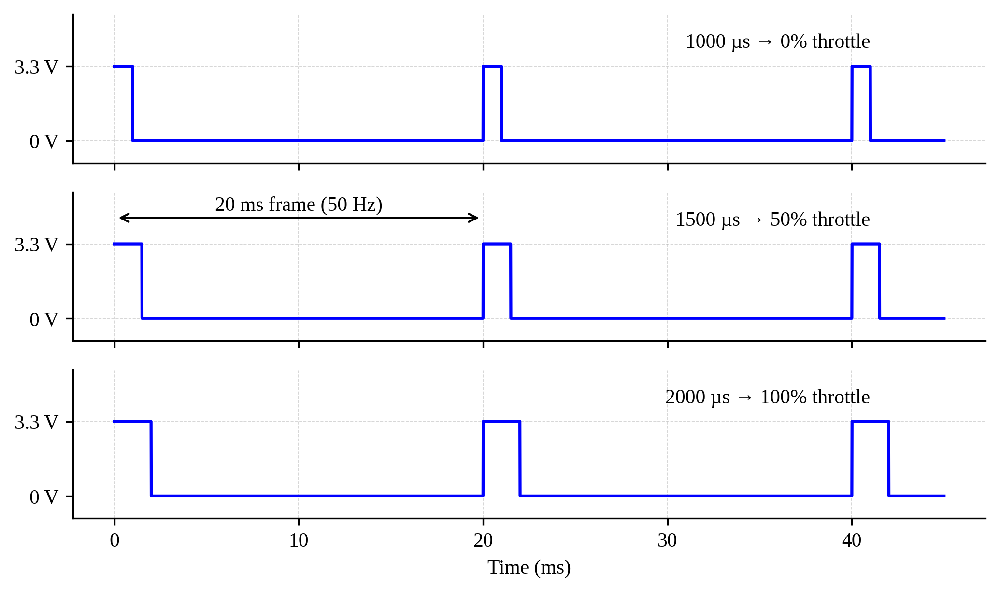{#fig-servo-pwm width="85%"}

The ADS **pattern generator** (`device.digitalOut`) makes this signal trivially. Its channels run from a 100 MHz internal clock: a **divider** slows the clock to a chosen tick rate, and a **counter** holds the output low for `low` ticks then high for `high` ticks, repeating. With the divider set for 1 µs ticks, a 38% throttle command is simply `low = 20000 − 1380`, `high = 1380`. Same knobs as the WaveForms *Patterns* instrument — turned from Python, as in Lab 03.

$$u = 1000\,\mu\text{s} + 10\,\mu\text{s} \times (\text{throttle \%})$$ {#eq-throttle-us}

### The Force Signal Chain: Load Cell → In-Amp → ADS {#sec-force-chain}

The thrust sensor is a **1 kg bar load cell**: an aluminum beam with a full strain-gauge bridge bonded to it, the same Wheatstone-bridge physics you used in the strain-gauge lab. Its sensitivity is tiny — about 1 mV of bridge output per volt of excitation at full load, so roughly **5 mV at 9.81 N** with 5 V excitation. The ADS cannot resolve your experiment in that range, so an **AD620 instrumentation amplifier** boosts the differential bridge signal by a gain near 200 before it reaches Scope channel 1 (@fig-signal-chain).

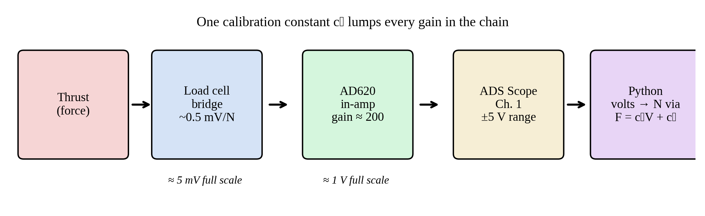{#fig-signal-chain width="100%"}

You could compute the chain gain stage by stage — but every stage has tolerance, the amp's gain resistor is imperfect, and the motor mount preloads the cell. This is why engineers calibrate the *chain*, not the parts. Dead weights of known mass load the cell exactly like thrust does (the rig points the thrust axis vertically for precisely this reason), and a linear fit

$$F = c_1 V + c_0$$ {#eq-cell-cal}

absorbs every gain, offset, and preload in one stroke. The fit-quality statistics are the Lab 02 set (norm of residuals, $s_{yx}$, 95% CI, $S_{c_1}$) with force units.

One subtlety: the motor and mount sit on the cell permanently, so even "zero thrust" reads a nonzero voltage — the **tare**. Thrust is therefore always a *difference*:

$$T = F(V_{\text{running}}) - F(V_{\text{motor off}})$$ {#eq-tare}

### The Current Signal Chain: Hall-Effect Sensing

Motor current is measured by an **ACS712-20A hall-effect sensor** in the 12 V supply line. Current through its internal conductor creates a magnetic field; the hall element converts that field to voltage. The datasheet transfer function is

$$I = \frac{V_{\text{out}} - 2.5\,\text{V}}{0.100\,\text{V/A}}$$ {#eq-acs712}

The 2.5 V zero-current offset is deliberate: it lets one supply rail report current in *both* directions. Because the sensing is magnetic, the measurement circuit is electrically **isolated** from the noisy motor power path — a real advantage you get for three dollars. Note what we did *not* do: put a shunt resistor in the motor line and measure its voltage drop directly. A shunt works, but it wastes power, heats up (changing its own resistance), and ties your scope ground into the motor current path.

### Momentum Theory: What Physics Expects of Your Curve {#sec-momentum}

Model the propeller as an **actuator disk** of area $A$ that accelerates air from rest to a jet velocity $v_j$ (@fig-momentum). Thrust is the momentum flux through the disk, and the *ideal* power is the kinetic energy given to that air per second. Momentum theory (derived in the prelab reading, summarized here) gives:

$$T = 2 \rho A v_i^2 \qquad P_{\text{ideal}} = T v_i = \frac{T^{3/2}}{\sqrt{2\rho A}}$$ {#eq-momentum}

where $v_i$ is the induced velocity at the disk and $\rho$ is air density. The prediction to test: **electrical power should grow like thrust to the 3/2 power.** Plot $P$ against $T^{3/2}$ and the physics says you should see a line. Its slope, compared with the ideal slope $1/\sqrt{2\rho A}$, defines a system **figure of merit**

$$FM = \frac{P_{\text{ideal}}}{P_{\text{elec}}} = \frac{1/\sqrt{2\rho A}}{\text{measured slope}}$$ {#eq-fm}

which bundles propeller aerodynamic efficiency with motor and ESC losses. Small hobby systems typically land between 0.3 and 0.5 — you will measure where yours sits, and *which propeller wastes less*.

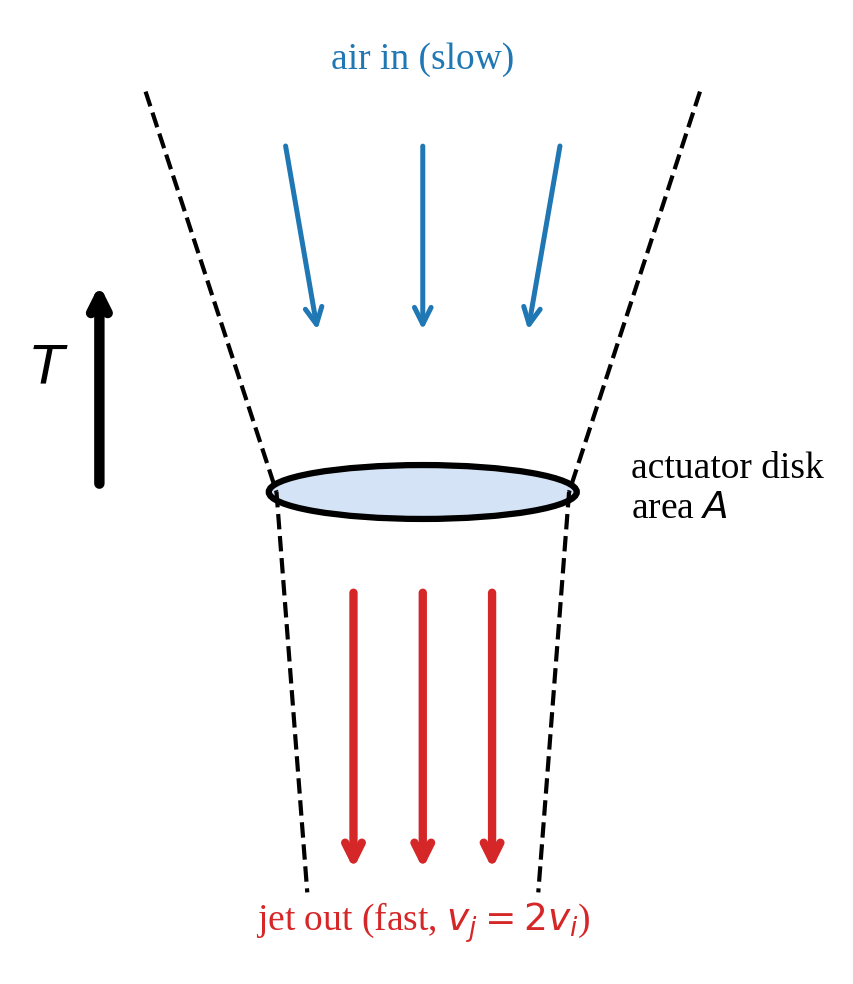{#fig-momentum width="60%"}

### Why Three Runs?

A single sweep gives you numbers; it cannot tell you how much those numbers wobble. Motor temperature, ESC timing, air currents, and tare drift all move between runs. Three repeated sweeps let you compute, at every setpoint, a mean and a 95% confidence interval on that mean — with $\nu = n - 1 = 2$ degrees of freedom, so $t_{2,95\%} = 4.303$ (compare $t_{9,95\%} = 2.262$ from your Lab 02 calibration: small samples pay a steep premium). That interval is what turns "my motor makes about 60 g at 38%" into a claim your design can stand on.



## Part-1: Wire and Verify the Station {#sec-part-1}

Your station has the thrust rig pre-assembled (load cell, motor, guard); you make the electrical connections. Your guides are @fig-station and @fig-wiring.

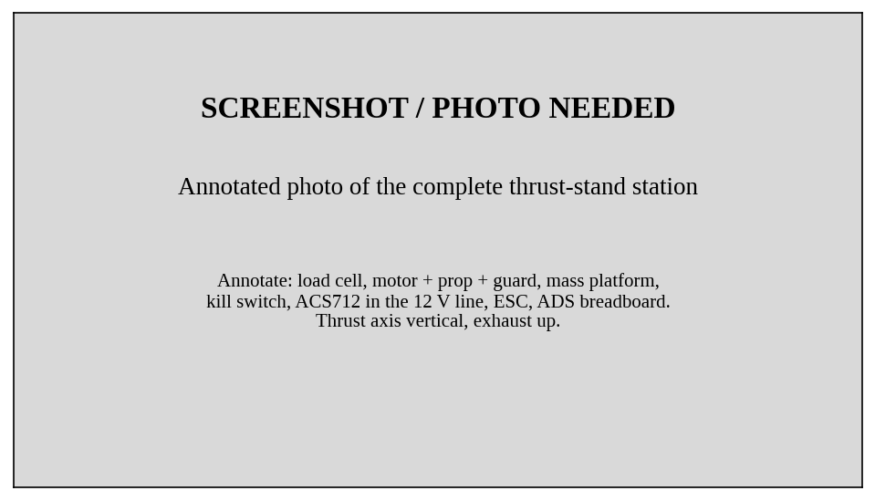{#fig-station width="100%"}

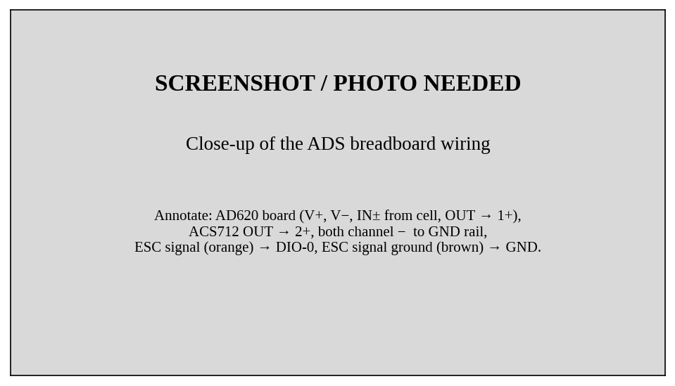{#fig-wiring width="100%"}

| Connection | ADS pin | Purpose |
|---------------------------|------------|--------------------------------|
| AD620 board V+ / V− | V+ (5 V) / V− (−5 V) | Amplifier supply |
| Load cell E+ (red) / E− (black) | V+ (5 V) / GND | Bridge excitation |
| Load cell S+ (green) / S− (white) | AD620 IN+ / IN− | Bridge signal to amp |
| AD620 OUT | **1+** | Force signal |
| GND rail | **1−** | Ch. 1 reference |
| ACS712 VCC / GND | V+ (5 V) / GND rail | Current sensor supply |
| ACS712 OUT | **2+** | Current signal |
| GND rail | **2−** | Ch. 2 reference |
| ESC signal (thin lead, orange) | **DIO-0** | Throttle command |
| ESC signal ground (thin lead, brown) | GND rail | Command reference |

The 12 V power path (supply → kill switch → ACS712 → ESC) is pre-wired at the rig — **do not modify it**. The ESC's three motor wires are likewise pre-connected.

1.  Make the table's connections with the kill switch OFF.
2.  Enable the ADS Supplies: V+ = 5 V, V− = −5 V (as in Lab 03).
3.  Verify with your DMM: 5.0 V at the load cell E+ pin; ~2.5 V at the ACS712 OUT pin (zero current); a small, stable voltage (the tare) at AD620 OUT. Gently press down on the motor platform and watch the AD620 output rise — that is your force channel working.

::: {.callout-important title="Logbook Questions"}
**Q1.** Record the AD620 output voltage at rest (the tare) and while you press lightly on the platform. Which direction does pressing move it? What force direction does that correspond to?

**Q2.** Record the ACS712 output with the kill switch OFF. How far from the ideal 2.500 V is it, and how many amps of *apparent* current is that offset error (@eq-acs712)?

**Q3.** Trace the 12 V power path from the supply barrel jack to the motor and list every element in order. Where in that chain does the current sensor sit, and what current does it therefore *not* see?
:::



## Part-2: Arm the ESC and First Spin {#sec-part-2}

Open your notebook `FirstName_LastName_Lab09.ipynb` (kernel: your `.venv`; starter on Canvas). Close WaveForms — pydwf needs the device (Lab 03 rule).

The throttle-command function is the heart of the lab. Read it line by line — the divider/counter arithmetic is @eq-throttle-us implemented in hardware ticks:

``` python
from pydwf import DwfLibrary, DwfState
from pydwf.utilities import openDwfDevice
import numpy as np
import time

dwf = DwfLibrary()

def set_throttle(dout, pct):
    """Command the ESC: 0-100 % throttle -> 1000-2000 us pulse at 50 Hz."""
    us = int(1000 + 10 * pct)                    # Eq. 1
    ticks_per_us = int(dout.internalClockInfo() / 1_000_000)
    dout.dividerSet(0, ticks_per_us)             # 1 counter tick = 1 us
    dout.counterSet(0, 20_000 - us, us)          # low ticks, high ticks
    dout.enableSet(0, True)
    dout.configure(True)                         # start the pattern
```

- **`dout.internalClockInfo()`** returns the pattern generator's base clock (100 MHz). Dividing by 1,000,000 gives the divider that makes each counter tick exactly 1 µs — we *compute* the divider rather than hard-coding 100, so the code survives a different device.
- **`dout.counterSet(0, low, high)`** — channel DIO-0 repeats: low for `20000 − us` ticks, high for `us` ticks. Total 20,000 µs = 20 ms = 50 Hz, with the high time carrying the throttle command.
- **`dout.configure(True)`** starts (or restarts) the pattern — the GUI *Run* button, in code.

Now arm and spin, gently:

``` python
with openDwfDevice(dwf) as device:
    dout = device.digitalOut

    set_throttle(dout, 0)                        # ESC must see 0% first
    input("Guard on? Glasses on? Flip kill switch ON, wait for the "
          "arming beeps, then press Enter...")

    set_throttle(dout, 15)                       # a gentle first spin
    time.sleep(3.0)
    set_throttle(dout, 0)                        # ALWAYS end at zero
    input("Flip kill switch OFF, then press Enter to release the device...")
```

The motor should spin smoothly for three seconds. **If anything unexpected happens, flip the kill switch** — that is what it is for.

::: {.callout-note title="Troubleshooting: no arming beeps?"}
No beeps when the kill switch goes on usually means the ESC is not seeing a valid 0% signal: check DIO-0 and the signal-ground wire (the ESC's brown lead must share ground with the ADS), and confirm the `set_throttle(dout, 0)` cell ran *before* power-on.
:::

::: {.callout-important title="Logbook Questions"}
**Q4.** Find the ESC's deadband: raise the throttle 1% at a time from zero. At what percent does the motor actually start turning? Why do ESCs deliberately not respond to the first few percent?

**Q5.** While the motor spins at 15%, watch the AD620 output with your DMM. Which way did it move relative to the tare, and is that consistent with your Q1 press test? What is the propeller blowing air *toward*, and why did we build the rig that way?
:::



## Part-3: Dead-Weight Calibration {#sec-part-3}

**Remove the propeller** (motor power off, kill switch off — the two-wrench technique is demonstrated at the front bench). Calibration loads must be the *only* thing changing.

The script is the Lab 03 pattern — `input()` pauses while you change the physical setup, the code does the recording:

``` python
masses_g = [0, 50, 100, 200, 500]
mean_voltages = []

fs, duration = 1000, 2.0
n = int(fs * duration)

with openDwfDevice(dwf) as device:
    ai = device.analogIn
    ai.channelEnableSet(0, True)
    ai.channelRangeSet(0, 5.0)
    ai.frequencySet(fs)
    ai.bufferSizeSet(n)

    for m in masses_g:
        input(f"Place {m} g on the platform, hands clear, then Enter...")
        ai.configure(False, True)
        while ai.status(True) != DwfState.Done:
            time.sleep(0.05)
        volts = np.array(ai.statusData(0, n))
        mean_voltages.append(volts.mean())
        print(f"  {m:4d} g: {mean_voltages[-1]:.4f} V")

np.savetxt('../Data/loadcell_calibration_data.csv',
           np.column_stack([masses_g, mean_voltages]),
           header='mass_g,voltage_V', delimiter=',')
```

Nothing here is new syntax — this is your Lab 03 calibration loop with masses instead of pendulum positions.

Fit the calibration (@eq-cell-cal). Convert masses to newtons first — the fit maps volts to *force*:

``` python
cal = np.loadtxt('../Data/loadcell_calibration_data.csv',
                 delimiter=',', comments='#')
masses_g = cal[:, 0]
volts    = cal[:, 1]
force_N  = masses_g / 1000 * 9.81          # grams -> kg -> newtons

coeffs = np.polyfit(volts, force_N, 1)     # F = c1*V + c0
print(f"c1 = {coeffs[0]:.4f} N/V, c0 = {coeffs[1]:.4f} N")
```

Compute the fit statistics exactly as in Lab 02 (norm of residuals, $s_{yx}$, 95% CI with $\nu = N - 2 = 3$, and $S_{c_1}$), build the calibration plot to match @fig-example-cal per the Post-Lab requirements, and save the coefficients — **Lab 10 reuses this calibration**:

``` python
np.savetxt('../Data/loadcell_calibration_coeffs.csv', coeffs,
           header='c1 (N/V), c0 (N)', delimiter=',')
```

::: {.callout-important title="Logbook Questions"}
**Q6.** Record your calibration equation with units on both coefficients. Your $c_0$ is *negative* even though every voltage you measured was positive — what two physical offsets is it absorbing?

**Q7.** Using $S_{c_1}$ and $t_{3,95\%}$, what is the 95% uncertainty in your chain gain $c_1$, as a percentage? Is the calibration or the run-to-run repeatability (you'll know after Part-5) the bigger uncertainty in this experiment?
:::

### Example Result

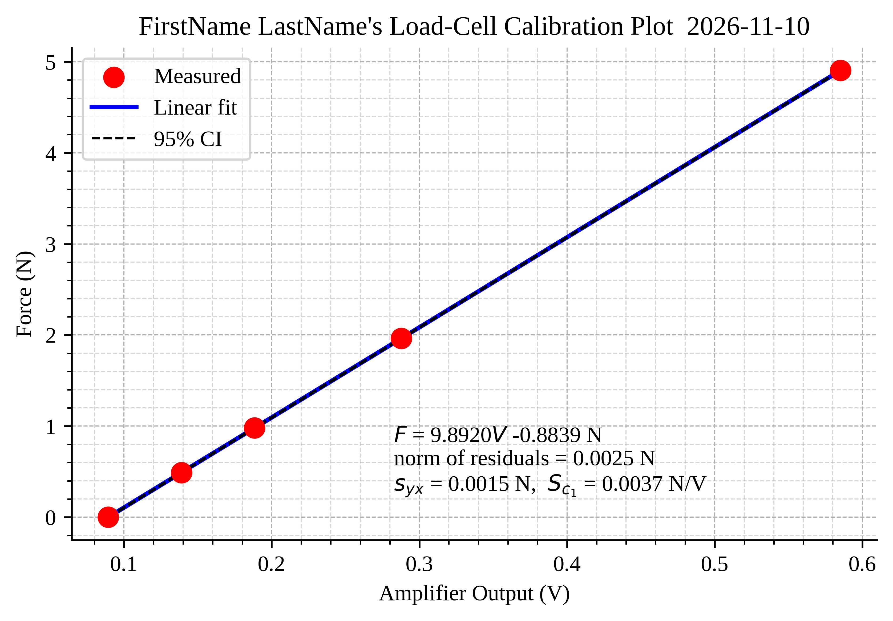{#fig-example-cal width="6.5in"}

**Reinstall the propeller** (snug, not gorilla-tight) and have a TA check it before you re-power.



## Part-4: Automated Thrust and Current Sweeps {#sec-part-4}

Here is the capstone version of the course's automation philosophy: the entire experiment is one script. It steps through 13 throttle setpoints, lets the motor settle at each, records two seconds of both channels, and saves a tidy table.

First, a helper that reads both channels and returns their means — a function *returning two values*, which you have seen `step`-by-step since Lab 02's `def`:

``` python
def read_means(ai, fs=1000, duration=2.0):
    """Record both channels and return (mean_cell_V, mean_current_V)."""
    n = int(fs * duration)
    for ch in (0, 1):
        ai.channelEnableSet(ch, True)
        ai.channelRangeSet(ch, 5.0)
    ai.frequencySet(fs)
    ai.bufferSizeSet(n)
    ai.configure(False, True)
    while ai.status(True) != DwfState.Done:
        time.sleep(0.05)
    return (np.array(ai.statusData(0, n)).mean(),
            np.array(ai.statusData(1, n)).mean())
```

Before any powered run, record the **tare** (kill switch ON so the ESC electronics are live, throttle 0%, prop still):

``` python
with openDwfDevice(dwf) as device:
    dout, ai = device.digitalOut, device.analogIn
    set_throttle(dout, 0)
    input("Kill switch ON, wait for arming beeps, then Enter...")

    fs, duration = 1000, 5.0
    n = int(fs * duration)
    for ch in (0, 1):
        ai.channelEnableSet(ch, True)
        ai.channelRangeSet(ch, 5.0)
    ai.frequencySet(fs)
    ai.bufferSizeSet(n)
    ai.configure(False, True)
    while ai.status(True) != DwfState.Done:
        time.sleep(0.05)
    t = np.arange(n) / fs
    v_cell = np.array(ai.statusData(0, n))
    v_curr = np.array(ai.statusData(1, n))

np.savetxt('../Data/TareRecording.csv',
           np.column_stack([t, v_cell, v_curr]),
           header='time_s,loadcell_V,current_V', delimiter=',')
```

Now the sweep itself. Edit the two variables at the top before *every* run:

``` python
prop_name = 'PropA'      # EDIT: 'PropA' (2-blade) or 'PropB' (3-blade)
run = 1                  # EDIT: 1, 2, or 3

throttle_pct = np.arange(10, 71, 5)          # 10% to 70% in 5% steps

with openDwfDevice(dwf) as device:
    dout, ai = device.digitalOut, device.analogIn
    set_throttle(dout, 0)                    # arming state
    input("Guard on? Kill switch ON, wait for beeps, then Enter...")

    rows = []
    for pct in throttle_pct:
        set_throttle(dout, pct)
        time.sleep(1.0)                      # settle before measuring
        v_cell, v_curr = read_means(ai)      # 2-s average of both channels
        rows.append((pct, v_cell, v_curr))
        print(f"  {pct:3d}%   cell {v_cell:.4f} V   current {v_curr:.4f} V")

    set_throttle(dout, 0)                    # ALWAYS end at zero throttle

np.savetxt(f'../Data/ThrustSweep_{prop_name}_Run{run}.csv',
           np.array(rows),
           header='throttle_pct,loadcell_V,current_V', delimiter=',')
```

Each sweep takes about 40 seconds (@fig-sweep-output shows a run in progress). Your test matrix: **3 runs with Prop A, then swap to Prop B (kill switch OFF for the swap, TA checks the prop nut), then 3 runs with Prop B.** Let the motor rest a minute between runs — you are holding temperature roughly constant, which is part of what "repeatability" means.

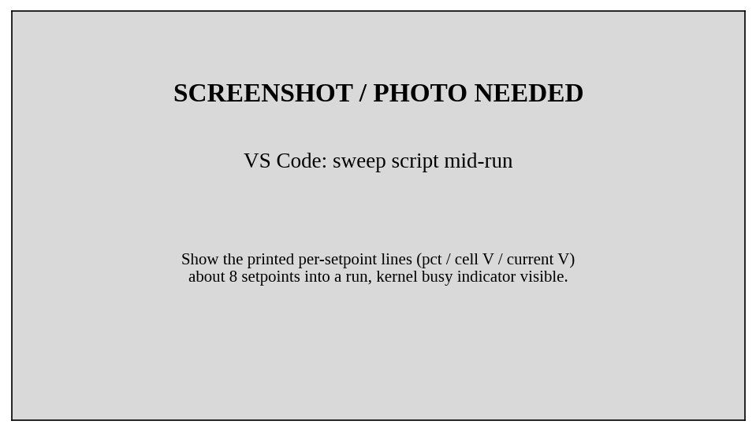{#fig-sweep-output width="100%"}

::: {.callout-warning title="Cap is 70% for a reason"}
Do not edit the sweep above 70%. The 3-blade prop draws over 9 A near full throttle — past the supply's comfortable limit, and the thrust data up to 70% is everything the design task needs.
:::

::: {.callout-important title="Logbook Questions"}
**Q8.** During a Prop A sweep, record the printed cell voltage at 30% and 60% from two different runs. How repeatable are they, in millivolts? Convert that to grams using your calibration.

**Q9.** The script sleeps 1.0 s *then* averages for 2.0 s. What error would sneak in if the sleep were removed entirely? (You will measure exactly this settling behavior in Lab 10.)

**Q10.** Why must the throttle return to zero *inside* the `with` block, before the device closes? What state would DIO-0 be left in otherwise, and what would the ESC do?
:::



## Part-5: Curves, Confidence, and the Propeller Trade-Off {#sec-part-5}

The analysis needs no hardware. Load the tare and all six sweeps. A **dictionary** keyed by propeller name keeps the two datasets organized, and `np.stack` turns each propeller's three runs into a single 3-D array so statistics across runs become one-line `axis=0` reductions:

``` python
tare = np.loadtxt('../Data/TareRecording.csv', delimiter=',', comments='#')
v_tare = tare[:, 1].mean()                 # motor-off cell voltage
print(f"tare voltage = {v_tare:.4f} V")

props = ['PropA', 'PropB']
data = {}                                  # dictionary: one entry per prop

for prop in props:
    runs = [np.loadtxt(f'../Data/ThrustSweep_{prop}_Run{r}.csv',
                       delimiter=',', comments='#') for r in (1, 2, 3)]
    arr = np.stack(runs)                   # shape (3 runs, 13 setpoints, 3 cols)

    throttle = arr[0, :, 0]                # same setpoints every run
    thrust_N = (np.polyval(coeffs, arr[:, :, 1])
                - np.polyval(coeffs, v_tare))       # Eq. 3: tare-corrected
    current_A = (arr[:, :, 2] - 2.5) / 0.100        # Eq. 4: ACS712 datasheet

    data[prop] = {'throttle': throttle, 'T': thrust_N, 'I': current_A}
    print(prop, 'thrust array shape:', thrust_N.shape)
```

New syntax, in order of appearance:

- **`data = {}` and `data[prop] = ...`** — a *dictionary* stores values under names instead of positions. `data['PropA']['T']` reads like what it is; `results[0][1]` does not. Dictionaries are how real analysis code stays readable as datasets multiply.
- **The list comprehension** `[np.loadtxt(...) for r in (1, 2, 3)]` — a `for` loop that builds a list in one line; the loop variable `r` fills in each filename via the f-string.
- **`np.stack(runs)`** — glues three (13 × 3) arrays into one (3 × 13 × 3) array. Axis 0 is *which run*, axis 1 is *which setpoint*, axis 2 is *which column*.
- **`arr[:, :, 1]`** — all runs, all setpoints, column 1: the entire experiment's cell voltages as one (3 × 13) array. `np.polyval` happily converts all 39 numbers at once — no loop required.

Statistics across the three runs, at every setpoint simultaneously:

``` python
from scipy import stats

t2 = stats.t.ppf(0.975, df=2)              # two-sided 95%, n-1 = 2
for prop in props:
    d = data[prop]
    d['T_mean'] = d['T'].mean(axis=0)
    d['T_CI']   = t2 * d['T'].std(axis=0, ddof=1) / np.sqrt(3)
    d['I_mean'] = d['I'].mean(axis=0)
    d['I_CI']   = t2 * d['I'].std(axis=0, ddof=1) / np.sqrt(3)
    print(f"{prop}: max thrust {d['T_mean'][-1]/9.81*1000:.0f} g, "
          f"CI at 70% = ±{d['T_CI'][-1]/9.81*1000:.1f} g")
```

- **`axis=0`** tells the reduction which direction to collapse: `mean(axis=0)` averages *across runs*, leaving one value per setpoint. This one argument replaces the nested loops you would have written in Lab 02.
- The CI is the standard error of the mean, scaled by $t_{2,95\%} = 4.303$ — the small-sample premium from the Background.

Build the **thrust-curve plot** (@fig-example-thrust): both propellers in grams vs. throttle, mean lines with markers, and the CI as dashed black lines hugging each curve. Then the **current-and-efficiency figure** (@fig-example-eff): a two-panel plot — current draw on top, grams-per-watt below, with $P = 12.0\,\text{V} \times I$:

``` python
P = 12.0 * d['I_mean']                     # electrical watts
eff = (d['T_mean'] / 9.81 * 1000) / P      # grams per watt
```

Finally the **momentum-theory test** (@fig-example-momentum). All 39 points per prop (every run, every setpoint — no averaging needed for a fit), power against thrust^1.5^, `np.polyfit` line, and the figure of merit from @eq-fm:

``` python
rho = 1.204                    # kg/m^3, sea level 20 C
A = np.pi * (0.0381)**2        # 3-inch prop disk area, m^2
slope_ideal = 1 / np.sqrt(2 * rho * A)

for prop in props:
    d = data[prop]
    T15 = d['T'].flatten() ** 1.5          # all runs, all setpoints
    P   = 12.0 * d['I'].flatten()
    pc  = np.polyfit(T15, P, 1)
    d['FM'] = slope_ideal / pc[0]
    print(f"{prop}: slope = {pc[0]:.2f} W/N^1.5, FM = {d['FM']:.3f}")
```

- **`.flatten()`** unrolls the (3 × 13) array into one 39-element vector — the fit does not care which run a point came from.

::: {.callout-important title="Logbook Questions"}
**Q11.** At 40% throttle, which prop makes more thrust? Which makes more thrust *per watt*? Write one sentence a drone customer would understand about this trade-off.

**Q12.** Is your $P$ vs. $T^{3/2}$ plot actually straight? Where does it deviate most, and offer a physical suspect (ESC behavior at low throttle? motor efficiency falling at high current?).

**Q13.** Your momentum fit has a nonzero intercept. What real electrical loads exist at zero thrust?
:::

### Example Results

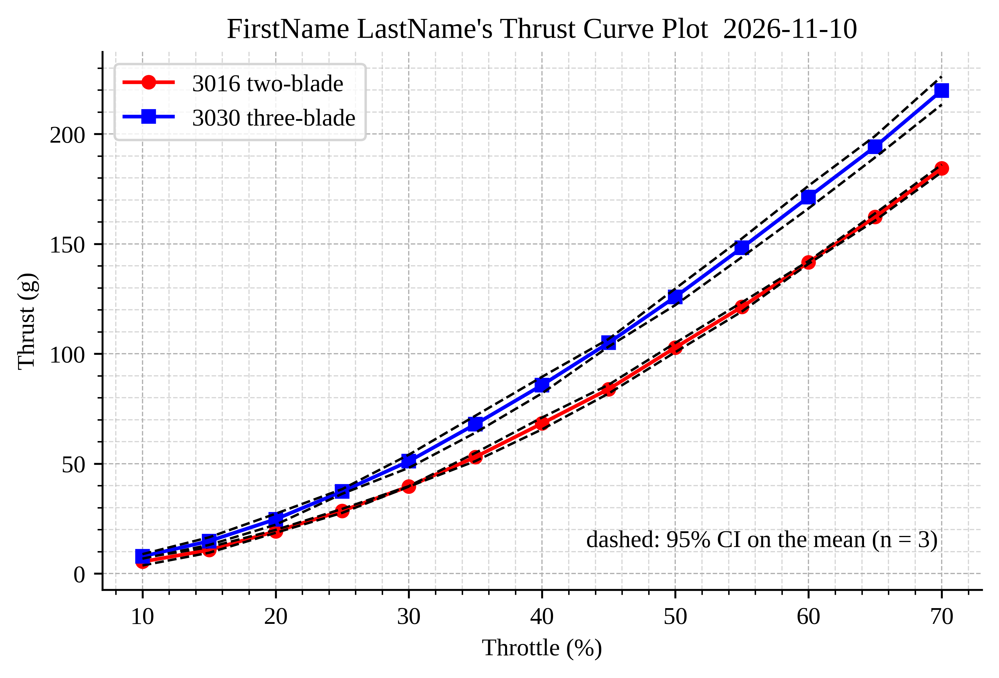{#fig-example-thrust width="6.5in"}

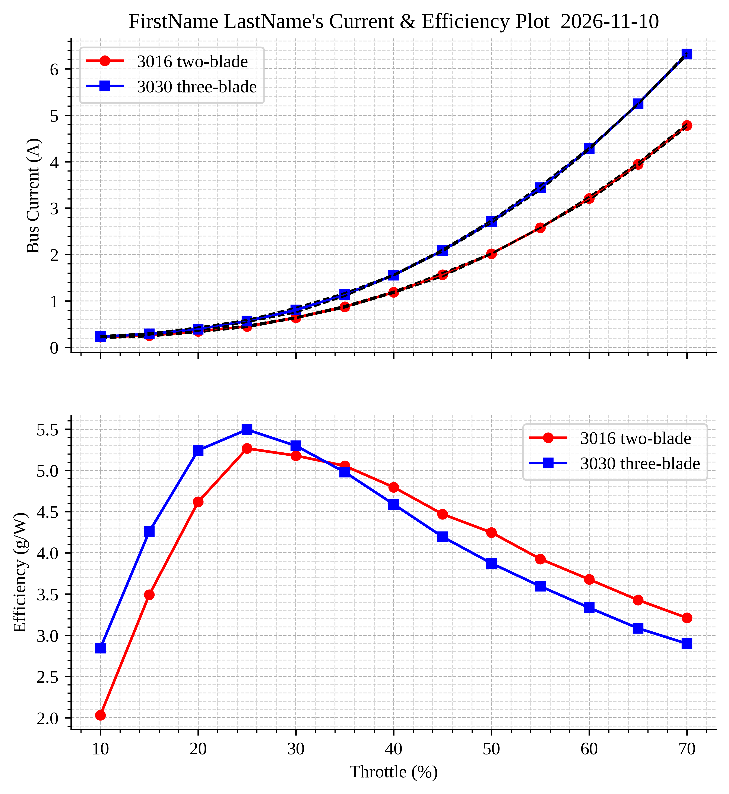{#fig-example-eff width="6.5in"}

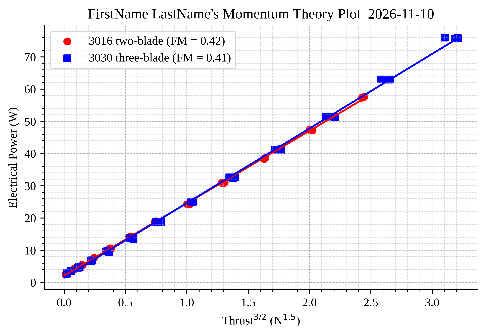{#fig-example-momentum width="6.5in"}



## Part-6: The Hover Design Point {#sec-part-6}

**Design brief.** Your team is designing a 240 g quadcopter (all-up weight, four motors — so 60 g of thrust per motor at hover) using this motor and *a propeller you will choose*. Deliver: the chosen prop, the hover throttle setting, the hover current per motor, the thrust margin, and an estimated flight time on an 850 mAh battery.

`np.interp` reads your measured curve backwards — given the required thrust, what throttle produces it:

``` python
m_quad = 0.240                          # kg, all-up weight
F_hover = m_quad * 9.81 / 4             # N per motor

for prop in props:
    d = data[prop]
    thr, Tm, TCI = d['throttle'], d['T_mean'], d['T_CI']

    delta_h = np.interp(F_hover, Tm, thr)     # throttle at hover thrust

    # thrust CI at that throttle -> throttle uncertainty via local slope
    ci_h    = np.interp(delta_h, thr, TCI)
    slope_h = np.gradient(Tm, thr)[np.argmin(np.abs(thr - delta_h))]
    dthr    = ci_h / slope_h

    I_h  = np.interp(delta_h, thr, d['I_mean'])
    marg = d['T_mean'][-1] / F_hover
    t_fly = 0.850 / (4 * I_h) * 60      # 850 mAh, 4 motors, minutes

    print(f"{prop}: hover at {delta_h:.1f} ± {dthr:.1f} %throttle, "
          f"I = {I_h:.2f} A/motor, thrust margin {marg:.2f}x, "
          f"ideal flight time {t_fly:.1f} min")
```

- **`np.interp(F_hover, Tm, thr)`** — linear interpolation with the axes swapped on purpose: we know the *y* value (required thrust) and want the *x* (throttle). It requires `Tm` to be increasing, which a thrust curve is.
- The throttle uncertainty converts the thrust CI through the curve's local slope — the same first-order error propagation you used in the Monte Carlo lab, done with the measured gradient.

Record your decision in your logbook *as a decision*: which prop, and why — in numbers.

::: {.callout-important title="Logbook Questions"}
**Q14.** State your chosen propeller and hover throttle with its ± uncertainty. Round the throttle **up** to the next whole percent (why up? — thrust margin is safer than thrust deficit) and write down that commanded value. You will fly this exact setpoint in Lab 10.

**Q15.** Multirotor designers demand at least a 2:1 max-thrust-to-hover ratio for controllability. Does your choice meet it? What is the margin number?

**Q16.** Your flight-time estimate assumed the battery voltage stays at 12 V and hover current stays constant. Name two reasons the real number is smaller, and whether each is a *systematic* or *random* effect on your estimate.
:::

### The Endurance Design Map — a Surface, Not a Point

One hover point answers one design question. But mass and battery capacity are both *choices*, and your measured curves can score **every** combination at once — that is a design *space*, and it is two-dimensional, so its natural picture is a 3-D surface.

`np.meshgrid` builds the grid: given a mass axis and a capacity axis, it returns two 2-D arrays holding, respectively, the mass and the capacity of every combination. Every line of the scalar design calculation then works unchanged — `np.interp` and the arithmetic simply operate elementwise over the whole grid:

``` python
d = data['PropA']                        # your chosen prop from above
thr, Tm, Im = d['throttle'], d['T_mean'], d['I_mean']

mass_g  = np.linspace(150, 900, 60)      # all-up mass candidates
cap_mAh = np.linspace(500, 1500, 60)     # battery candidates
M, C = np.meshgrid(mass_g, cap_mAh)      # 2-D grids: every combination

F_req   = M / 1000 * 9.81 / 4            # hover thrust per motor (N)
thr_req = np.interp(F_req, Tm, thr)      # throttle to hover, elementwise
I_req   = np.interp(thr_req, thr, Im)    # current at that throttle
t_fly   = C / 1000 / (4 * I_req) * 60    # ideal flight time (min)

t_fly[F_req > Tm.max()] = np.nan         # cannot hover: off the map
```

- **`np.meshgrid(mass_g, cap_mAh)`** — `M[i, j]` and `C[i, j]` are the mass and capacity of combination (i, j). Same trick as `np.stack` giving you all-runs-at-once math in Part-5, now in two design dimensions.
- **The NaN line is the physics honesty clause.** Where required thrust exceeds your *measured* maximum, `np.interp` would silently clamp to the 70% value and invent flyable vehicles. Setting those cells to `np.nan` cuts the surface off at the cliff where hovering becomes impossible — the map shows the *boundary of the feasible design space*, which is often the most valuable thing on it.

Plot it as a surface, and mark your Part-6 design point on the map:

``` python
fig = plt.figure(figsize=(6.5, 5.0), facecolor='white')
ax = fig.add_subplot(projection='3d')
surf = ax.plot_surface(M, C, t_fly, cmap='viridis', edgecolor='none')

# mark the Part-6 design point: 240 g, 850 mAh
t_pt = 0.850 / (4 * np.interp(np.interp(0.240*9.81/4, Tm, thr), thr, Im)) * 60
ax.scatter(240, 850, t_pt, s=60, c='red', depthshade=False,
           label='240 g / 850 mAh design')

ax.set_xlabel('All-up mass (g)')
ax.set_ylabel('Battery capacity (mAh)')
ax.set_zlabel('Ideal flight time (min)')
ax.set_title(f"FirstName LastName's Endurance Design Map  {date_str}")
ax.view_init(elev=25, azim=-135)
fig.colorbar(surf, shrink=0.6, pad=0.10, label='minutes')
ax.legend(loc='upper left')
```

- **`fig.add_subplot(projection='3d')`** turns the axes three-dimensional; `plot_surface` drapes `t_fly` over the (M, C) grid, and `cmap='viridis'` colors by height so the map reads even in print.
- **`ax.view_init(elev, azim)`** sets the camera. Rotate until the cliff and the design point are both visible — a 3-D plot whose interesting feature is hidden behind the surface has failed at its one job.

::: {.callout-important title="Logbook Questions"}
**Q17.** Where is your design point on the map — comfortably on the plateau, on the steep slope, or near the cliff? What does its *local slope* along the mass axis tell you about how much payload you could add before flight time suffers badly?

**Q18.** The map's best corner (light vehicle, huge battery) is fiction. What physical coupling between the two axes does this map ignore, and which direction does the true optimum move because of it?
:::

### Example Result

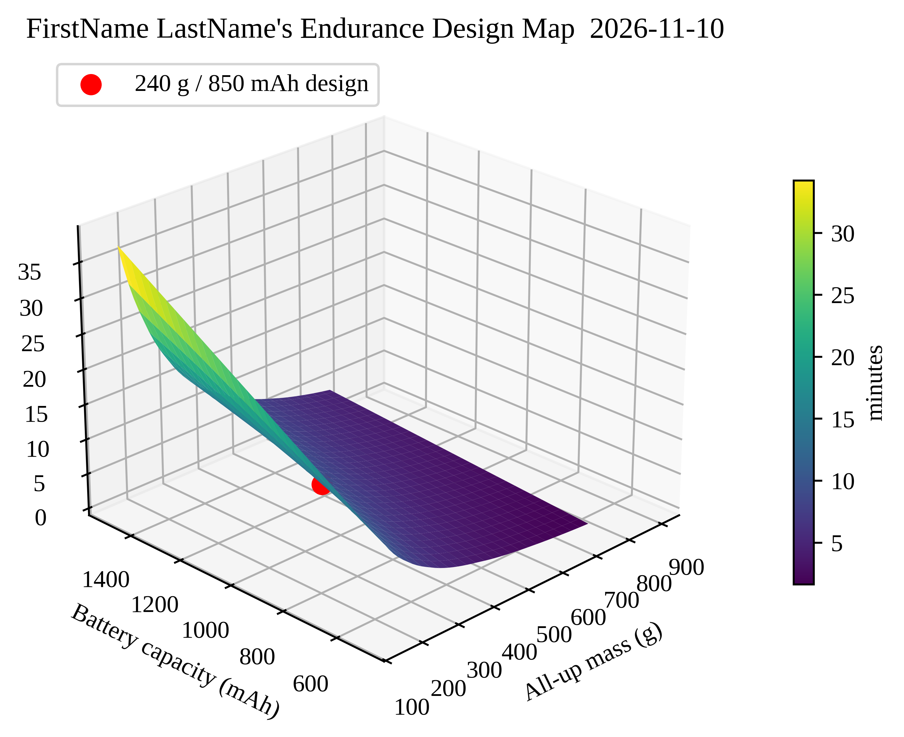{#fig-example-map width="6.5in"}



## Post-Lab Assignment

Upload your submissions to Canvas. [**Post-labs are due Mondays at 10:00 pm.**]{.underline} A full example solution notebook is posted after all sections have met; check your approach against it, but submit your own work.

### Submission Items

- Your final **.ipynb** notebook (`FirstName_LastName_Lab09.ipynb`), restarted and run top-to-bottom (acquisition cells may show their saved outputs)
- Load-cell calibration plot, **.pdf**
- Thrust-curve plot with CIs, **.pdf**
- Current & efficiency figure, **.pdf**
- Momentum-theory fit plot, **.pdf**
- Endurance design map (3-D surface), **.pdf**
- Answers to the post-lab questions on Canvas

### Calibration Plot Requirements

- Figure size: 6.5" wide × 4.0" tall; white background; Times font, 10–12 pt
- Major and minor grids on; top and right spines removed
- Calibration data: red circle markers, size 75
- Linear fit: solid blue, 2 pt; 95% CI: dashed black, 1 pt
- Axis labels with units; title "FirstName LastName's Load-Cell Calibration Plot" with the date
- `ax.text` annotation (4 decimals, units): calibration equation, norm of residuals, $s_{yx}$, $S_{c_1}$

### Thrust-Curve Plot Requirements

- Figure size: 6.5" wide × 4.0" tall; same grid/spine/font standards
- Prop A: red line with circle markers; Prop B: blue line with square markers; 1.5 pt lines, marker size 5
- 95% CI: dashed black, 1 pt, tracking each curve
- Thrust axis in **grams**; legend naming both props; note identifying the CI
- Title "FirstName LastName's Thrust Curve Plot" with the date

### Current & Efficiency Figure Requirements

- Two stacked panels, 6.5" wide × 7.0" tall total, shared throttle axis
- Top: bus current (A) with CIs; bottom: efficiency (g/W); same per-prop colors/markers as the thrust plot
- Title on the top panel only, "FirstName LastName's Current & Efficiency Plot" with the date

### Momentum Fit Plot Requirements

- Figure size: 6.5" wide × 4.0" tall; same standards
- All 39 points per prop as markers (per-prop colors/markers); fits as solid lines
- Legend reporting each prop's figure of merit at 2 decimals
- Axis labels: Thrust^3/2^ (N^1.5^), Electrical Power (W)
- Title "FirstName LastName's Momentum Theory Plot" with the date

### Endurance Map Requirements

- Figure size: 6.5" wide × 5.0" tall; white background; Times font, 10–12 pt
- `plot_surface` with the viridis colormap, colorbar labeled "minutes"
- Infeasible region removed via NaN (the cliff must be visible), design point marked as a red dot with a legend entry
- Axis labels with units on all three axes; camera angle chosen so both the cliff and the design point are visible
- Title "FirstName LastName's Endurance Design Map" with the date

### Post-Lab Questions

1.  Report your calibration equation with units, its $s_{yx}$, and the 95% uncertainty on $c_1$ in percent.
2.  Your 95% CIs came from three runs. Estimate (using the $t$-table) how much narrower the CI would be with five runs, assuming the standard deviation stayed the same. Is the improvement worth 15 more minutes of lab time? For what kind of engineering decision would it be?
3.  Explain the tare correction (@eq-tare) to an imaginary teammate who claims "we can skip the motor-off recording, $c_0$ already handles the offset." Where exactly does their reasoning break?
4.  From your data: which propeller would you choose for *maximum payload*, and which for *maximum flight time*? Cite the specific numbers that decide each.
5.  The ACS712 datasheet allows the zero-current output to be anywhere in 2.5 V ± 0.075 V. Propagate that tolerance: how many amps of systematic error is possible, and at your hover point, how many minutes of flight-time estimate error does it cause?
6.  Real batteries weigh roughly 20 g per 250 mAh at this scale. Add that coupling to your endurance map's arithmetic (mass = airframe mass + battery mass) and report how the flight time at a 220 g *airframe* now varies with capacity choice: does bigger always win? Where is the optimum, approximately?

## Before You Leave

- Show your thrust-curve plot to a TA before tearing down — re-running a sweep now takes 40 seconds; next week it takes a lab period.
- Kill switch OFF, ADS supplies off, propeller removed and returned to its labeled bag (leave the motor mounted).
- Return masses to their case, jumper wires to the bin, sorted by color.
- Confirm your data files (calibration, tare, six sweeps, coefficients) synced to OneDrive and that **both** partners have everything — **Lab 10 loads this week's calibration file.**
- Clean the station, collect your belongings, and log off.

## Looking Ahead {#sec-lab10-preview}

You measured what this motor-prop system does in *steady state*. Lab 10 asks the dynamic questions: how *fast* can it change thrust (step response, time constant), what are the rig's own dynamics (tap test, natural frequency, damping ratio — your second-order systems toolkit), and does the hover design point you committed to in Q14 survive contact with reality?
