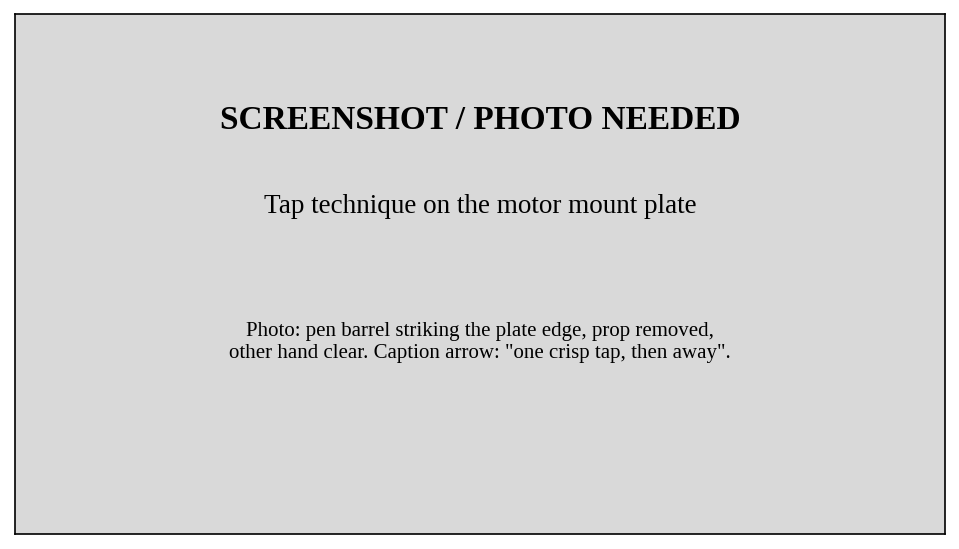
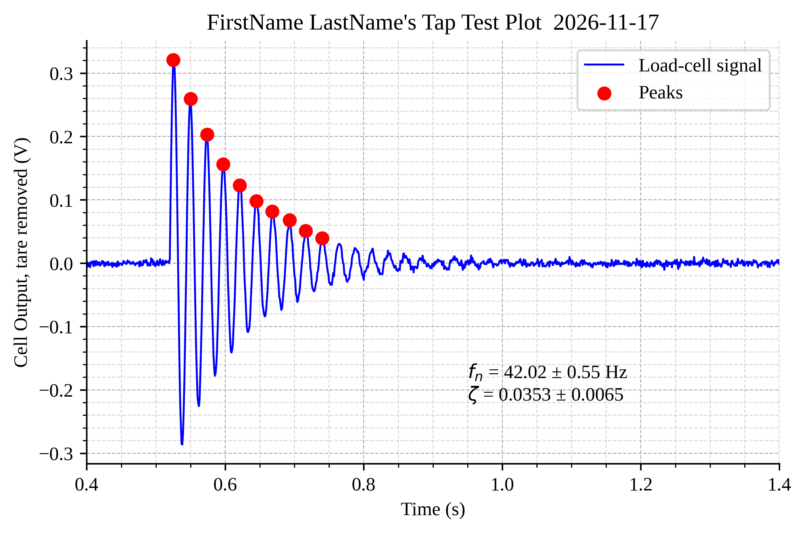
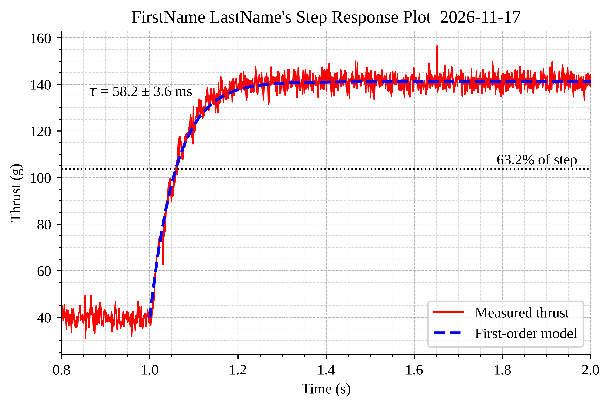
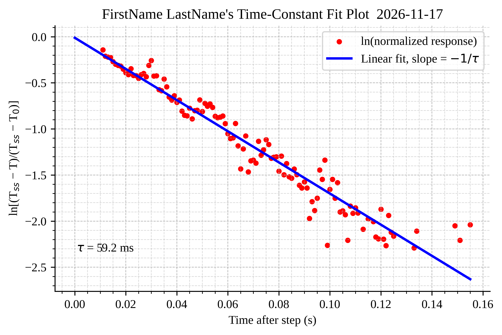
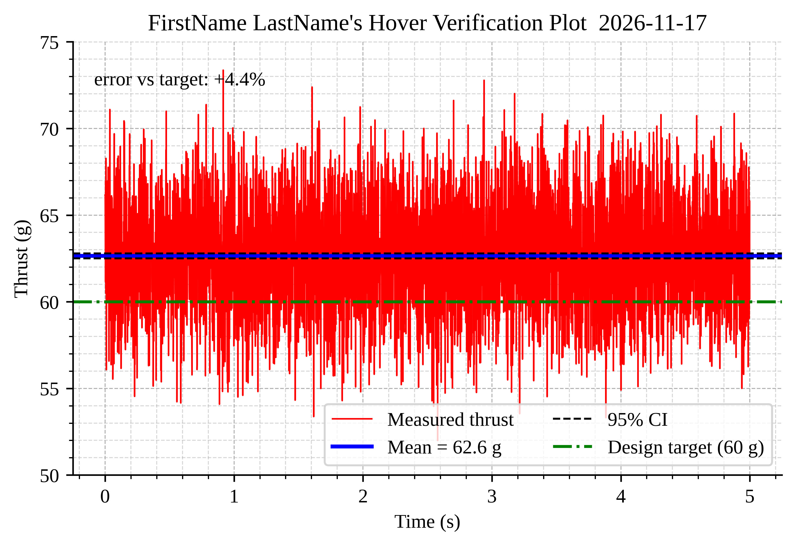



## Learning Objective

Lab 09 measured what your motor-propeller system does in steady state. This closing lab asks the *dynamic* questions — how fast can thrust change, what are the test rig's own dynamics, and can you trust a force measurement made through a structure that has dynamics of its own? It ends where the capstone must: executing the hover design point you committed to last week, and judging it with confidence intervals.

### Objectives

Your objectives for this laboratory session are to:

- **Identify a second-order system from its ringdown**: tap-test the rig and extract natural frequency and damping ratio via the **log decrement** method
- Use **`scipy.signal.find_peaks`** to locate oscillation peaks programmatically
- **Measure a first-order step response**: command a throttle step and extract the thrust **time constant** by linearizing the exponential — with a fit, not a stopwatch
- Quantify the *asymmetry* between spin-up and spin-down, and explain it physically
- Reason about **bandwidth separation**: why the rig's resonance does *not* corrupt the step measurement, and when it would
- Put an honest confidence interval on a **time-series mean** using block averaging
- **Execute and verify your hover design point** — the semester's measurement chain, closed end to end

### Check Your Understanding

By the end of this lab, you should be able to answer all of these questions.

#### Hardware & Instruments

- Why is the tap test done with the propeller off and the motor unpowered?
- The commanded throttle step is (electrically) nearly instantaneous. Why isn't the thrust step?
- What physically sets the rig's natural frequency? If we bolted a heavier motor to the same load cell, which way would $f_n$ move?
- Why does the step script start the recording *before* commanding the step?

#### Programming

- What do `find_peaks`'s `height` and `distance` arguments do, and how do you choose them against noise and expected period?
- How does taking `np.log` of a decaying exponential turn time-constant extraction into `np.polyfit`?
- Why does the fit window exclude data after $t_0 + 0.3$ s even though the record is longer?
- What does `reshape(n_blk, 1000)` do to a 1-D array?

#### Data Analysis

- From peak amplitudes 0.32, 0.26, 0.21 V, estimate the log decrement and damping ratio.
- Why would `std/sqrt(5000)` be a dishonestly narrow CI for the mean of a 5-second, 1 kHz thrust recording?
- Your measured hover thrust CI does not contain the 60 g design target. List, in order of size, the error sources that could explain the gap before you blame the rig.
- What ratio between rig natural frequency and motor bandwidth makes the thrust measurement trustworthy, and what would you do if it were 1.5 instead?



## Pre-Lab Setup

You should come to lab having completed all tasks in this section.

::: {.callout-warning title="Same Prop, Same Rules"}
All Lab 09 safety rules apply unchanged: guard on whenever power is on, glasses on, kill switch is the first response, prop off for the tap test, TA checks the prop nut after reinstalling.
:::

### Extend Your Folder Structure

Add a Lab_10 folder set to your `ME3300` folder:

``` text
ME3300/
├── Lab_01/ ... Lab_09/
├── Lab_10/
│   ├── Code/
│   │   ├── Lab10_Prelab_Walkthrough.ipynb
│   │   └── FirstName_LastName_Lab10.ipynb
│   ├── Data/
│   └── Figures/
```

**Bring your Lab 09 data.** The analysis loads `../../Lab_09/Data/loadcell_calibration_coeffs.csv` — confirm it exists and synced. If your partner has it and you don't, fix that *before* lab.

### Read the Background Section

Read the [Background](#sec-background) section before lab. It derives the log-decrement equations and the linearized step-response fit — the two workhorses of this lab.

### Complete the Prelab Walkthrough Notebook {#sec-prelab-walkthrough}

Download `Lab10_Prelab_Walkthrough.ipynb` from Canvas into `ME3300/Lab_10/Code/` and work through it before lab. It introduces this lab's *new* Python skills on simulated signals:

- **`scipy.signal.find_peaks`** — and how to defeat noise with `height` and `distance`
- **log-decrement arithmetic** — from peak amplitudes to $\zeta$ and $\omega_n$
- **linearizing an exponential** — `np.log` + `np.polyfit` as a time-constant extractor
- **block averaging with `reshape`** — honest CIs for correlated time-series data

As always, report the **checkpoint** values in the **Prelab 10 quiz on Canvas** before your lab session.

### Python Quick Reference: New This Lab

| Task | Python command |
|--------------------------------------|--------------------------------------|
| Find oscillation peaks | `find_peaks(y, height=0.02, distance=15)` |
| Natural log (element-wise) | `np.log(y)` |
| Reshape 1-D array into blocks | `y[:n*1000].reshape(n, 1000)` |
| Unpack, ignoring some values | `*_, tau = step_analysis(fname)` |

: New Python syntax and functions introduced in Lab 10



## Laboratory Introduction

A quadcopter hovers by *constantly adjusting* motor thrust — tens of corrections per second. Whether that control loop works depends not on the thrust curve you measured last week, but on how *quickly* the real motor follows a command: its **time constant**. Every actuator you will ever specify — valves, heaters, servos, pumps — has one, and "how fast is it, really?" is answered exactly the way you will answer it today: command a step, record the response, fit the model.

But there is a subtlety worth the price of admission. Your force sensor is bolted to a structure, and structures have dynamics too. Hit the rig sharply and it *rings* — a damped oscillation at its natural frequency, straight out of your second-order systems coursework. So today has a beautiful arc:

- **Part 2** — characterize the *rig* as a second-order system (tap test → $f_n$, $\zeta$ via log decrement).
- **Part 3** — characterize the *motor* as a first-order system (throttle step → $\tau$ via linearized fit).
- **Part 4** — put them together: the measurement is trustworthy precisely *because* these two dynamics live an order of magnitude apart. You will compute that separation, not assume it.
- **Part 5** — the capstone moment: command the hover throttle you committed to in Lab 09 Q14 and check whether your 60 g design target survives, with confidence intervals doing the judging. To be clear about what this is: **nothing flies.** The rig stays bolted down, and "hover" means the *hover condition* — thrust equal to weight — verified on the bench, the way engine test cells verify flight hardware without leaving the ground. (Why not a real drone? See @sec-real-drone — including the class demo where the answer is *shown*, not told.)

## Background {#sec-background}

### The Rig as a Second-Order System {#sec-second-order}

The motor and mount (mass $m$) sit on the load cell (stiffness $k$, light damping $c$) — a classic spring-mass-damper. Free vibration after an impulse:

$$m\ddot{x} + c\dot{x} + kx = 0 \quad\Rightarrow\quad x(t) = A e^{-\zeta\omega_n t}\sin(\omega_d t)$$ {#eq-ringdown}

with natural frequency $\omega_n = \sqrt{k/m}$, damping ratio $\zeta = c/(2\sqrt{km})$, and damped frequency

$$\omega_d = \omega_n\sqrt{1 - \zeta^2}$$ {#eq-omega-d}

A pen-tap is a fine approximation of an impulse, and the load cell itself reports the ringdown — the sensor measures its own structure's vibration.

**Log decrement** turns the decay envelope into a damping measurement. Successive peaks (one damped period $T_d$ apart) shrink by a fixed ratio, so with peak amplitudes $A_i$:

$$\delta = \ln\frac{A_i}{A_{i+1}} \qquad \zeta = \frac{\delta}{\sqrt{4\pi^2 + \delta^2}}$$ {#eq-log-dec}

Averaging $\ln(A_i/A_{i+1})$ over many peak pairs beats noise; the mean peak spacing gives $T_d$, hence $\omega_d = 2\pi/T_d$, and @eq-omega-d recovers $\omega_n$.

### The Motor as a First-Order System {#sec-first-order}

Why doesn't thrust step instantly when the command does? Because the rotor and propeller store rotational kinetic energy: speed obeys $J\dot{\omega} = \tau_{motor} - \tau_{drag}$, and near an operating point that linearizes to a first-order response

$$T(t) = T_{ss} - (T_{ss} - T_0)\,e^{-t/\tau}$$ {#eq-first-order}

exactly the form you met with thermocouples and RC circuits. The time constant $\tau$ bundles the rotor inertia $J$ against two "stiffnesses" that fight speed changes: aerodynamic drag ($\propto \omega^2$) and the motor's back-EMF (which reduces current as speed rises). One asymmetry to look for: on a *down*-step the ESC cannot push current backwards — spin-down coasts on prop drag alone, while spin-up gets active motor torque. Physics says down should be *slower*. Your data will say by how much.

**Extracting $\tau$ honestly.** Reading "63.2% of the step" off the plot works but uses one point. Rearranging @eq-first-order:

$$\ln\left[\frac{T_{ss} - T(t)}{T_{ss} - T_0}\right] = -\frac{t}{\tau}$$ {#eq-tau-lin}

The left side is a straight line in $t$ with slope $-1/\tau$: a `np.polyfit` job, using *every* sample on the clean part of the rise — and the straightness of that line is itself the evidence that first-order is the right model. Window design matters: we fit where the normalized response is between 10% and 90% (the ends are noise-dominated), and cap the window in *time*, because long after settling the noise occasionally wanders back above the 10% line and would poison the fit.

### Bandwidth Separation: When Can You Trust a Force Measurement? {#sec-bandwidth}

The load cell reports thrust *through* the rig's dynamics. If thrust changed as fast as the rig rings, the cell would report structural oscillation, not thrust. The saving grace is separation of time scales: the motor's bandwidth is $f_{bw} = 1/(2\pi\tau)$ — a few hertz — while the rig rings at tens of hertz. To the rig, every thrust change the motor can actually produce is *quasi-static*. You will verify the ratio is comfortably large ($\gtrsim 10\times$), which is exactly the check a test engineer runs before believing any dynamic force data. It is also why the tap test rings but the throttle step does not: the tap is faster than the rig; the motor is slower than it.

### Honest CIs for Time-Series Means {#sec-block-avg}

A 5-second hover recording has 5000 samples, but not 5000 *independent* ones — consecutive samples share slow wander (drift, air recirculation, supply ripple). Dividing by $\sqrt{5000}$ claims information you don't have. The standard fix is **block averaging**: cut the record into 1-second blocks, average each, and treat the block means as the independent sample. Fewer, honest degrees of freedom beat many fake ones.



## Part-1: Station Checkout and Tare {#sec-part-1}

Wire the station exactly as in Lab 09 Part-1 (same table, same pins). Verify with the DMM: 5 V excitation, ~2.5 V at the current sensor, stable tare at the AD620 output.

Record the tare — motor **unpowered** (kill switch OFF this time; we want the mechanical zero), prop mounted:

``` python
from pydwf import DwfLibrary, DwfState
from pydwf.utilities import openDwfDevice
import numpy as np
import time

dwf = DwfLibrary()

fs = 1000

def record(ai, duration, fs=fs):
    """Record both channels for `duration` seconds; return t, ch1, ch2."""
    n = int(fs * duration)
    for ch in (0, 1):
        ai.channelEnableSet(ch, True)
        ai.channelRangeSet(ch, 5.0)
    ai.frequencySet(fs)
    ai.bufferSizeSet(n)
    ai.configure(False, True)
    while ai.status(True) != DwfState.Done:
        time.sleep(0.05)
    return (np.arange(n) / fs,
            np.array(ai.statusData(0, n)),
            np.array(ai.statusData(1, n)))

with openDwfDevice(dwf) as device:
    t, v_cell, v_curr = record(device.analogIn, 2.0)

np.savetxt('../Data/MotorOffTare.csv',
           np.column_stack([t, v_cell, v_curr]),
           header='time_s,loadcell_V,current_V', delimiter=',')
```

`record()` is Lab 09's `read_means()` returning the *full arrays* instead of means — this week the time history is the whole point.

::: {.callout-important title="Logbook Questions"}
**Q1.** Compare today's tare voltage to Lab 09's. If they differ, list what could have legitimately changed and whether your analysis is robust to it (hint: look where the tare enters Lab 09's tare correction, $T = F(V_{\text{running}}) - F(V_{\text{motor off}})$).
:::



## Part-2: Tap Test — the Rig's Second-Order Signature {#sec-part-2}

**Remove the propeller** (kill switch off). The rig's ringdown should be a *structural* measurement, uncontaminated by aerodynamics — and an accidental motor start with a bare shaft is harmless.

Procedure (see @fig-tap-photo): one partner runs the cell below, the other gives the motor mount plate one crisp downward tap with a pen barrel just after the recording starts. Record 3 seconds; repeat for **three taps** total, saving `TapTest_Run1.csv` through `Run3`:

``` python
run = 1                                  # EDIT: 1, 2, 3

with openDwfDevice(dwf) as device:
    input(f"Tap run {run}: press Enter, then tap the plate once...")
    t, v_cell, _ = record(device.analogIn, 3.0)

np.savetxt(f'../Data/TapTest_Run{run}.csv',
           np.column_stack([t, v_cell]),
           header='time_s,loadcell_V', delimiter=',')
```

{#fig-tap-photo width="70%"}

Now the identification. `find_peaks` does the tedious part; the log decrement does the physics:

``` python
from scipy import stats
from scipy.signal import find_peaks

n_peaks = 10                      # use the first 10 clean peaks
fn_runs, zeta_runs = [], []

for run in (1, 2, 3):
    d = np.loadtxt(f'../Data/TapTest_Run{run}.csv',
                   delimiter=',', comments='#')
    t, v = d[:, 0], d[:, 1]

    baseline = v[:400].mean()             # cell voltage before the tap
    y = v - baseline

    idx0 = np.argmax(np.abs(y) > 0.05)    # first sample after the tap
    peaks, _ = find_peaks(y[idx0:], height=0.02, distance=15)
    peaks = peaks[:n_peaks] + idx0        # back to full-record indexing

    tp, Ap = t[peaks], y[peaks]

    # damped frequency from mean peak spacing
    Td = np.diff(tp).mean()
    omega_d = 2 * np.pi / Td              # Eq. 2

    # log decrement -> damping ratio -> natural frequency
    delta = np.mean(np.log(Ap[:-1] / Ap[1:]))          # Eq. 3
    zeta = delta / np.sqrt(4 * np.pi**2 + delta**2)    # Eq. 3
    omega_n = omega_d / np.sqrt(1 - zeta**2)           # Eq. 2

    fn_runs.append(omega_n / (2 * np.pi))
    zeta_runs.append(zeta)
    print(f"run {run}: fn = {fn_runs[-1]:.2f} Hz, zeta = {zeta:.4f}")

fn_runs, zeta_runs = np.array(fn_runs), np.array(zeta_runs)
t2 = stats.t.ppf(0.975, df=2)
fn_CI = t2 * fn_runs.std(ddof=1) / np.sqrt(3)
zeta_CI = t2 * zeta_runs.std(ddof=1) / np.sqrt(3)
print(f"fn = {fn_runs.mean():.2f} ± {fn_CI:.2f} Hz, "
      f"zeta = {zeta_runs.mean():.4f} ± {zeta_CI:.4f}  (95% CI, n = 3)")
```

New tools, in order of appearance:

- **`find_peaks(y, height=0.02, distance=15)`** returns the indices of local maxima. The two keyword arguments are your noise armor, and both are *designed*, not guessed: `height=0.02` demands peaks clear ~7× the cell's noise floor (σ ≈ 3 mV), so noise wiggles don't qualify; `distance=15` refuses peaks closer than 15 samples, comfortably below the ~24-sample damped period, so one physical peak can't be counted twice. The `, _` discards the second return value (a properties dictionary we don't need).
- **`np.log(Ap[:-1] / Ap[1:])`** — the slicing trick pairs each peak with its successor: elements 0..n-1 divided by elements 1..n gives every $A_i/A_{i+1}$ ratio at once; averaging their logs is the multi-peak log decrement.
- Note the fingerprint of good practice: *every* threshold (`0.05` tap detector, `0.02` peak height) is justified against a known noise level. That habit came from Lab 03's release detector; it never stops paying.

Build the ringdown figure to match @fig-example-tap: signal, detected peaks marked, $f_n$ and $\zeta$ annotated with their CIs.

::: {.callout-important title="Logbook Questions"}
**Q2.** Report $f_n$ and $\zeta$ with CIs. Is the rig underdamped, critically damped, or overdamped — and how many oscillations does it take for the amplitude to fall by half? (Show the calculation from $\zeta$.)

**Q3.** Estimate the effective vibrating mass from $f_n$ and the load cell's approximate stiffness ($k \approx 2\times10^4$ N/m, from its rated deflection). Is your answer plausible for a motor + mount?

**Q4.** Your three $\zeta$ values scatter more (relatively) than your three $f_n$ values. Why should damping be intrinsically harder to measure than frequency? (Think about what each is computed *from*.)
:::

### Example Result

{#fig-example-tap width="6.5in"}

**Reinstall the propeller**; TA checks it before you re-power.



## Part-3: Throttle Step Response {#sec-part-3}

The script commands 30% throttle, starts a 3.5-second recording, and *steps to 60% mid-recording* — capturing steady state, transient, and new steady state in one record. The `set_throttle` function is Lab 09's, unchanged (copy it into your notebook).

``` python
run = 1                                  # EDIT: 1, 2, 3
d_start, d_end = 30, 60                  # swap for the down-steps

with openDwfDevice(dwf) as device:
    dout, ai = device.digitalOut, device.analogIn
    set_throttle(dout, 0)
    input("Guard on? Kill switch ON, wait for beeps, then Enter...")

    set_throttle(dout, d_start)
    time.sleep(2.0)                      # settle at the starting point

    # arm the recording, THEN step: the transient lands mid-buffer
    n = int(fs * 3.5)
    for ch in (0, 1):
        ai.channelEnableSet(ch, True)
        ai.channelRangeSet(ch, 5.0)
    ai.frequencySet(fs)
    ai.bufferSizeSet(n)
    ai.configure(False, True)            # recording starts now
    time.sleep(1.0)
    set_throttle(dout, d_end)            # the step, 1 s into the record
    while ai.status(True) != DwfState.Done:
        time.sleep(0.05)
    t = np.arange(n) / fs
    v_cell = np.array(ai.statusData(0, n))
    v_curr = np.array(ai.statusData(1, n))

    set_throttle(dout, 0)

name = 'StepUp' if d_end > d_start else 'StepDown'
np.savetxt(f'../Data/{name}_Run{run}.csv',
           np.column_stack([t, v_cell, v_curr]),
           header='time_s,loadcell_V,current_V', delimiter=',')
```

Collect **three up-steps (30→60%) and three down-steps (60→30%)** — six records, about five minutes.

The analysis packages naturally as a function (one record in, one $\tau$ out). Load the Lab 09 calibration first — good calibrations are assets:

``` python
coeffs = np.loadtxt('../../Lab_09/Data/loadcell_calibration_coeffs.csv',
                    delimiter=',', comments='#')     # [c1 N/V, c0 N]

tare = np.loadtxt('../Data/MotorOffTare.csv', delimiter=',', comments='#')
v_tare = tare[:, 1].mean()

def step_analysis(fname):
    """Return t, thrust (N), step time, T0, Tss, tau for one record."""
    d = np.loadtxt(fname, delimiter=',', comments='#')
    t, v_c, v_i = d[:, 0], d[:, 1], d[:, 2]

    F = np.polyval(coeffs, v_c) - np.polyval(coeffs, v_tare)
    I = (v_i - 2.5) / 0.100

    # the commanded step shows up instantly in current: detect it there
    jump = np.abs(np.diff(I))
    i_step = np.argmax(jump > 1.5)  + 1         # designed >> 5-sigma noise
    t0 = t[i_step]

    T0  = F[t < t0 - 0.05].mean()               # pre-step steady state
    Tss = F[t > t0 + 0.60].mean()               # post-step steady state

    # linearize: y = (Tss-F)/(Tss-T0) = exp(-(t-t0)/tau) -> ln y is a line.
    # Window design: y in (0.10, 0.90) keeps the clean part of the decay,
    # and t < t0 + 0.3 s keeps settled-noise samples (which sometimes
    # wander above 0.10 by chance) from poisoning the fit.
    y = (Tss - F) / (Tss - T0)
    mask = (t > t0) & (t < t0 + 0.30) & (y > 0.10) & (y < 0.90)
    pc = np.polyfit(t[mask] - t0, np.log(y[mask]), 1)   # Eq. 6
    tau = -1 / pc[0]
    return t, F, t0, T0, Tss, tau


taus_up, taus_dn = [], []
for run in (1, 2, 3):
    *_, tau_u = step_analysis(f'../Data/StepUp_Run{run}.csv')
    *_, tau_d = step_analysis(f'../Data/StepDown_Run{run}.csv')
    taus_up.append(tau_u)
    taus_dn.append(tau_d)
    print(f"run {run}: tau_up = {tau_u*1000:.1f} ms, "
          f"tau_down = {tau_d*1000:.1f} ms")

taus_up, taus_dn = np.array(taus_up), np.array(taus_dn)
tau_CI = t2 * taus_up.std(ddof=1) / np.sqrt(3)
print(f"tau_up = {taus_up.mean()*1000:.1f} ± {tau_CI*1000:.1f} ms (95% CI)")
```

- **Why detect the step in the *current* channel?** The ESC changes its drive within one PWM frame — the current jump is essentially instantaneous and huge compared to its noise (a designed threshold again: 1.5 A against a diff-noise floor of ~0.2 A). Thrust, the *output*, is exactly the thing whose lag we're measuring — detecting the step there would be circular.
- **`*_, tau_u = step_analysis(...)`** — the starred underscore soaks up the return values we don't need here, keeping just the last. (We use the full six-value return when plotting below.)
- The normalization $y = (T_{ss}-F)/(T_{ss}-T_0)$ works untouched for down-steps too — check the algebra and convince yourself.

Build the step-response figure (@fig-example-step): measured thrust in grams, the fitted first-order model (@eq-first-order) overlaid dashed, the 63.2% line marked, $\tau$ ± CI annotated. Then the fit-evidence figure (@fig-example-taufit): $\ln y$ against $t - t_0$ with the fitted line — **the straightness of this plot is your proof that first-order was the right model.**

::: {.callout-important title="Logbook Questions"}
**Q5.** Report $\tau_{up}$ and $\tau_{down}$ with CIs. By what factor is spin-down slower? Explain the asymmetry using the ESC's one-way current limitation (@sec-first-order).

**Q6.** Where does your log-linear plot bend away from the fitted line, if anywhere? Early-time curvature and late-time scatter have *different* explanations — give one for each.

**Q7.** A drone flight controller updates motor commands at 400 Hz. Given your $\tau$, roughly how many control updates happen within one motor time constant? What does that imply about who is the bottleneck — the controller or the actuator?
:::

### Example Results

{#fig-example-step width="6.5in"}

{#fig-example-taufit width="6.5in"}



## Part-4: Bandwidth Separation — Closing the Trust Argument {#sec-part-4}

Two numbers from today, one ratio, and the measurement's credibility rests on it:

``` python
f_bw = 1 / (2 * np.pi * taus_up.mean())
sep = fn_runs.mean() / f_bw
print(f"motor bandwidth       = {f_bw:.2f} Hz")
print(f"rig natural frequency = {fn_runs.mean():.1f} Hz")
print(f"separation ratio      = {sep:.1f}x")
```

::: {.callout-important title="Logbook Questions"}
**Q8.** Report your separation ratio. Explain in two sentences, to a skeptical customer, why the thrust step data can be trusted even though the rig visibly rings when tapped.

**Q9.** Your step records show *no* visible 42-ish-Hz ringing. Reconcile: the tap excites the resonance violently, the step barely at all. What property of the two inputs differs?

**Q10.** Suppose a redesigned rig came out at $f_n = 8$ Hz. Which parts of today's data would survive, which would be corrupted, and name one design change (mass or stiffness, and which direction) to fix it.
:::



## Part-5: Verify the Hover Design Point on the Bench {#sec-part-5}

Lab 09 Q14 committed you to a hover throttle (rounded **up** to a whole percent). Now you execute that design decision — on the bench, where instrumentation can judge it.

**What this test is.** The rig stays fixed; the motor cannot go anywhere. You command your hover throttle, hold it five seconds, and measure whether the system delivers the thrust your design requires. This is a *static hover-condition verification*: at hover, thrust exactly balances weight, so a motor that produces 60.0 g of measured thrust at your commanded setpoint *is* meeting the hover requirement — whether or not anything leaves the ground. This is precisely how flight hardware is qualified in industry: engines prove their thrust ratings bolted to test cells, not by flying prototypes and hoping.

**The success criteria** — decide them *before* you look at the data, like an engineer, not after, like a lawyer:

1. **Accuracy:** measured mean thrust within **±5%** of the 60 g target.
2. **Honesty:** measured mean reported with its 95% CI (block-averaged, @sec-block-avg) — and if the target falls *outside* the CI, the gap is decomposed and explained (Q12), not ignored.
3. **Viability:** hover current implies ≥ 8 minutes of ideal flight time on the 850 mAh design battery, and the Lab 09 thrust margin (Q15) still holds at ≥ 2:1.

Meet all three and your design is *verified*; miss one and the deliverable is a diagnosis and a recommendation (Q13) — which is not failure, it is engineering.

Command exactly your committed number, hold five seconds, and let the data judge:

``` python
hover_pct = 38                          # EDIT: YOUR Lab 09 Q14 value

with openDwfDevice(dwf) as device:
    dout, ai = device.digitalOut, device.analogIn
    set_throttle(dout, 0)
    input("Guard on? Kill switch ON, beeps done, then Enter...")

    set_throttle(dout, hover_pct)
    time.sleep(2.0)                      # spin up and settle
    t, v_cell, v_curr = record(ai, 5.0)

    set_throttle(dout, 0)

np.savetxt('../Data/HoverTest.csv',
           np.column_stack([t, v_cell, v_curr]),
           header='time_s,loadcell_V,current_V', delimiter=',')
```

Analysis — with the honest CI from @sec-block-avg:

``` python
d = np.loadtxt('../Data/HoverTest.csv', delimiter=',', comments='#')
t, v_c, v_i = d[:, 0], d[:, 1], d[:, 2]
F = np.polyval(coeffs, v_c) - np.polyval(coeffs, v_tare)
g_thrust = F / 9.81 * 1000

# consecutive samples are correlated, so a plain std/sqrt(N) CI would be
# dishonestly narrow. Average 1-second blocks and treat the BLOCKS as the
# independent samples.
g_trim = g_thrust[t >= 1.0]
n_blk = len(g_trim) // 1000                 # whole 1-second blocks
blocks = g_trim[:n_blk * 1000].reshape(n_blk, 1000).mean(axis=1)
g_mean = blocks.mean()
g_CI = (stats.t.ppf(0.975, df=n_blk - 1)
        * blocks.std(ddof=1) / np.sqrt(n_blk))

target = 60.0
err = (g_mean - target) / target * 100
print(f"measured hover thrust = {g_mean:.1f} ± {g_CI:.1f} g (95% CI)")
print(f"design target = {target:.1f} g -> {err:+.1f}% error")
I_h = ((v_i - 2.5) / 0.100)[t >= 1.0].mean()
print(f"hover current = {I_h:.2f} A -> flight time ~ "
      f"{0.850/(4*I_h)*60:.1f} min on an 850 mAh pack")
```

- **`reshape(n_blk, 1000)`** folds the 1-D record into an (n × 1000) array — one row per second — so `.mean(axis=1)` produces the block means in one line. Computing `n_blk` from the data length (instead of hard-coding 4) makes the cell robust to a slightly different record length.

Build the verification figure (@fig-example-hover): the thrust record, its mean and CI lines, and the 60 g design target — one plot that summarizes the whole semester's argument.

::: {.callout-important title="Logbook Questions"}
**Q11.** Report measured hover thrust ± CI, and the percent error against 60 g. Does the target fall inside your CI?

**Q12.** For most teams it will *not* — and that is the intended lesson. Your CI captures this measurement's *precision*; the gap to the target comes from *other* links in the chain. Quantify the two biggest: (a) the thrust cost of rounding your Q14 throttle up to a whole percent (use your Lab 09 curve's local slope), and (b) your Lab 09 curve's own CI at the hover point. Do these account for the gap?

**Q13.** The design verdict, against the three success criteria: does the 240 g quadcopter hover with acceptable accuracy, honesty, and viability? Give a one-paragraph engineering recommendation — commit, redesign, or retest — citing your numbers against each criterion.
:::

### Example Result

{#fig-example-hover width="6.5in"}

## Why Not a Real Drone? {#sec-real-drone}

A fair question, and worth answering carefully because the answer is *not* "because it wouldn't work."

Your bench verification is the **stronger** test of the design claim. A drone that visibly hovers tells you thrust ≈ weight to within the controller's authority — maybe ±10%, absorbed silently by the control loop working harder. Your instrumented rig resolves the same question to a fraction of a gram, with a confidence interval, and tells you *which link in the chain* owns any discrepancy. Flight is a demonstration; measurement is evidence. The rig also isolates the one motor you characterized — a flying quad mixes four motors, battery sag, frame aerodynamics, and controller gains into one confounded result.

What flight *would* add is everything you measured feeding a control loop: your thrust curve becomes the controller's feedforward map, your time constant $\tau$ sets how hard the loop can be pushed before it oscillates, and your thrust margin is its control authority. That is a *controls* problem — ME 3130's sequel, not this course's material — and it is exactly where this equipment grows next: a guided hover rig where your calibration files are loaded into a live altitude controller is the planned extension of this lab, and a strong senior-design seed if it interests you.

**Watch the front bench** at the end of the session: a small quadcopter (flying inside a net, because your instructors also believe in guarded test articles) holding altitude — running the same physics you spent two weeks quantifying. When it holds height, that is thrust = weight, your Part-5 criterion. When it recovers from a push, that recovery speed is bounded by its motors' $\tau$, your Part-3 measurement. The demo is the connection; your data is the understanding.



## Post-Lab Assignment

Upload your submissions to Canvas. [**Post-labs are due Mondays at 10:00 pm.**]{.underline} A full example solution notebook is posted after all sections have met; check your approach against it, but submit your own work.

### Submission Items

- Your final **.ipynb** notebook (`FirstName_LastName_Lab10.ipynb`), restarted and run top-to-bottom (acquisition cells may show their saved outputs)
- Tap-test ringdown plot, **.pdf**
- Step-response plot with model overlay, **.pdf**
- Time-constant fit (log-linear) plot, **.pdf**
- Hover verification plot, **.pdf**
- Answers to the post-lab questions on Canvas

### Tap-Test Plot Requirements

- Figure size: 6.5" wide × 4.0" tall; white background; Times font, 10–12 pt
- Major and minor grids on; top and right spines removed
- Signal: blue line, 1 pt; detected peaks: red circle markers, size 40
- Time axis windowed to show the ringdown clearly (≈ 1 s around the tap)
- `ax.text` annotation: $f_n$ and $\zeta$, each with its 95% CI
- Title "FirstName LastName's Tap Test Plot" with the date

### Step-Response Plot Requirements

- Figure size: 6.5" wide × 4.0" tall; same standards
- Measured thrust in grams: red line, 1 pt; first-order model: dashed blue, 2 pt
- 63.2% level marked (dotted black) and labeled; time axis windowed from just before the step to ~1 s after
- `ax.text` annotation: $\tau$ ± CI in ms
- Title "FirstName LastName's Step Response Plot" with the date

### Time-Constant Fit Plot Requirements

- Figure size: 6.5" wide × 4.0" tall; same standards
- $\ln y$ data: red markers, size 12; fit: solid blue, 2 pt; $\tau$ annotated
- Axis labels exactly: "Time after step (s)", "ln[(T~ss~ − T)/(T~ss~ − T~0~)]"
- Title "FirstName LastName's Time-Constant Fit Plot" with the date

### Hover Verification Plot Requirements

- Figure size: 6.5" wide × 4.0" tall; same standards
- Thrust record: red line, 0.8 pt; mean: solid blue 2 pt; 95% CI: dashed black 1 pt; design target: green dash-dot 1.5 pt — all four in the legend
- Thrust axis in grams, windowed to make the CI visible (do not autoscale to the noise)
- `ax.text` annotation: percent error vs. target
- Title "FirstName LastName's Hover Verification Plot" with the date

### Post-Lab Questions

1.  Report $f_n$, $\zeta$, $\tau_{up}$, $\tau_{down}$, and your separation ratio, each with its CI where you have one.
2.  Derive @eq-tau-lin from @eq-first-order in three lines. State one advantage the fit has over the 63.2% single-point method *besides* using more data (hint: what does the residual pattern tell you that a single crossing cannot?).
3.  Your $\tau$ was measured at the 30→60% operating range. Would you expect it to be identical at 10→20%? Reason from what sets the "stiffness" in @sec-first-order.
4.  A teammate proposes stiffening the rig with a thicker load cell so $f_n$ triples, "to make the data even more trustworthy." What does this cost in force resolution, and is the trade worth it here? (The cell's output is proportional to its strain.)
5.  Write the abstract (≤ 150 words) of a test report covering both labs: objective, method, key results with uncertainties, and the design verdict. This is the summary a capstone sponsor would actually read.

## Before You Leave

- Show your hover verification plot to a TA before tearing down.
- Kill switch OFF, ADS supplies off, propeller off and bagged, masses in their case, wires sorted to the bin.
- Confirm all Lab 10 data synced to OneDrive; **both** partners have everything.
- This station now goes back to Lab-09 configuration for the next section — check the reset list card at the station.
- Clean the station, collect your belongings, and log off.

## The Capstone Arc, Closed

Look at what the two labs did, because it is the whole course in miniature: you built a signal chain and *verified* it, calibrated it against a traceable standard, automated the experiment, quantified confidence, tested the data against physical theory, made a design decision with stated margins — then characterized the system's dynamics, proved the instrument itself trustworthy with a bandwidth argument, and closed the loop by *executing the design point and judging it honestly against criteria you set in advance*. That sequence — not any one formula — is what engineering measurement is.
